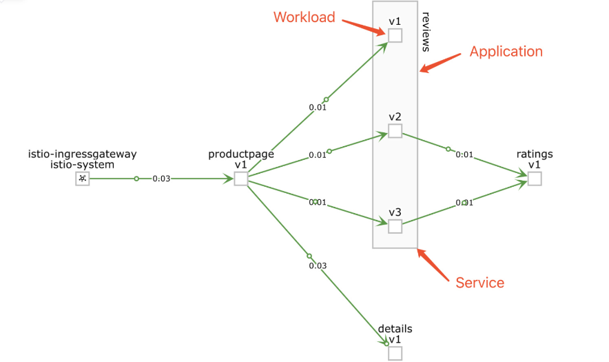
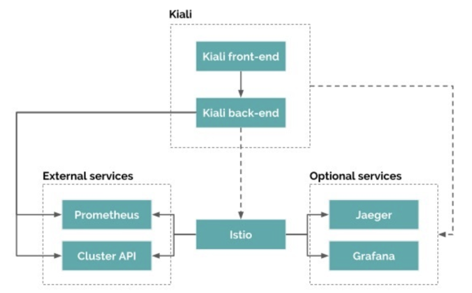
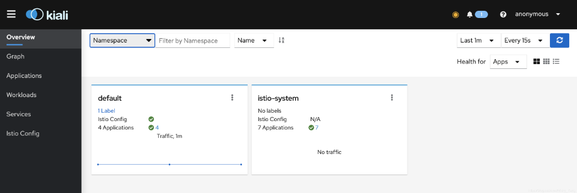
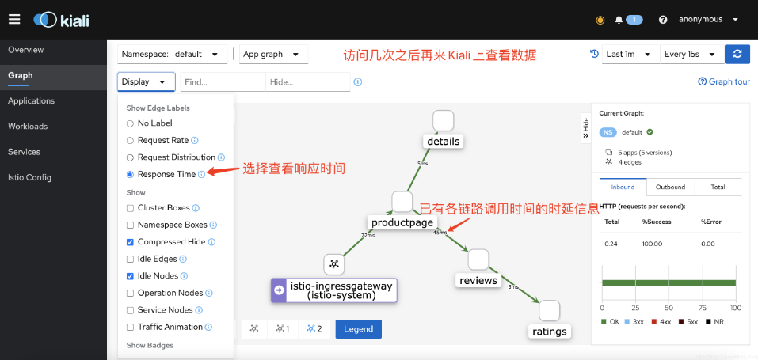
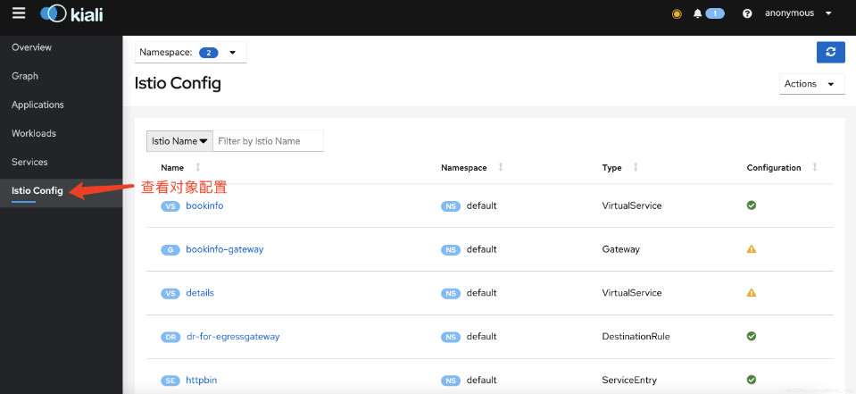
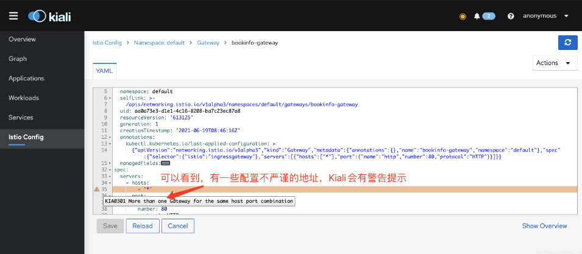

# Istio_可视化组件Kiali

----

# 认识Kiali

单体应用使用微服务架构拆分成了许多微服务的组合。服务的数量显著增加，就需要了解服务之间的通信模式，例如容错（通过超时、重试、断路等等）以及分布式跟踪，以便能够看到服务调用的去向。服务网格可在平台级别提供这些服务，并使应用程序编写者从以上繁重的通信模式中解放出来。路由决策在网格级别完成。Kiali与Istio合作，可视化服务网格拓扑、断路器和请求率等功能。Kiali还包括Jaeger Tracing，可以提供开箱即用的分布式跟踪功能。

+	Kiali提供以下功能：
	*	服务拓扑图
	*	分布式跟踪
	*	指标度量收集和图标
	*	配置校验
	*	健康检查和显示
	*	服务发现
+	Kiali中的基本概念：
	*	Application：使用允许的工作负载，必须使用Istio的将Label标记为app才算，如果一个应用有多个版本，只要app标签的值相同就是属于同一个应用。
	*	Deployment：即Kubernetes中的Deployment。
	*	Label：这个值对应Istio很重要，因为Istio要用它来标记metrics。每个Application要求包括app和version两个Label。
	*	Namespace：通常用于区分项目和用户。
	*	Service：即Kubernetes中的Service对象，不过要求必须有app label。
	*	Workload：Kubernetes中的所有常用资源类型如Deployemnt、StatefulSet、Job等都可以检测到的，无论这些负载是否加入到Istio Service Mesh中。
　
　
Application、Workload与Service的关系如下图所示：



# Kiali的架构

Kiali 部署完成后只启动了一个 Pod，前后端都集成在这一个 Pod 中。Kiali 也有一些依赖的组件，例如如果要在 Kiali 的页面中获取到监控 metric 需要使用在 istio-system 中部署 Prometheus。分布式卓总直接下图是 Kiali 的架构，来自 Kiali 官网。



+	Kiali 使用传统的前后端分离架构：
	*	后端使用 Go [编写](https://github.com/kiali/kiali)，为前端提供 API，所有消息使用 JSON 编码，使用 ConfigMap 和 Secret 来存储配置。直接与 Kubernetes 和 Istio 通信来获取数据。
	*	前端使用 Typescript [编写](https://github.com/kiali/kiali-ui)，无状态，除了一些证书保存在浏览器中。于查询后端 API，可以跳转访问 Jaeger 分布式追踪和 Grafana 监控页面。

Jaeger 和 Grafana 都是可选组件，使用的都是外部服务，不是由 Kiali 部署的，需要在 kiali-configmap.yaml 中配置 URL。

注意该 URL 必须是从你本地浏览器中可以直接访问到的地址。如果服务之间没有任何请求就不会在 Prometheus 中保存数据也就无法显示服务拓扑图，所以大家在部署完 Bookinfo 服务之后向 productpage 服务发送一些请求用于生成服务拓扑图。

# 部署Kiali可视化组件

```bash
$ kubectl apply -f istio-1.10.1/samples/addons
serviceaccount/grafana created
configmap/grafana created
service/grafana created
deployment.apps/grafana created
configmap/istio-grafana-dashboards created
configmap/istio-services-grafana-dashboards created
deployment.apps/jaeger created
service/tracing created
service/zipkin created
service/jaeger-collector created
customresourcedefinition.apiextensions.k8s.io/monitoringdashboards.monitoring.kiali.io created
serviceaccount/kiali created
configmap/kiali created
clusterrole.rbac.authorization.k8s.io/kiali-viewer created
clusterrole.rbac.authorization.k8s.io/kiali created
clusterrolebinding.rbac.authorization.k8s.io/kiali created
role.rbac.authorization.k8s.io/kiali-controlplane created
rolebinding.rbac.authorization.k8s.io/kiali-controlplane created
service/kiali created
deployment.apps/kiali created
serviceaccount/prometheus created
configmap/prometheus created
clusterrole.rbac.authorization.k8s.io/prometheus created
clusterrolebinding.rbac.authorization.k8s.io/prometheus created
service/prometheus created
deployment.apps/prometheus created

$ kubectl get pod -n istio-system  -o wide                     
NAME                                    READY   STATUS    RESTARTS   AGE     IP          NODE             NOMINATED NODE   READINESS GATES
grafana-f766d6c97-g4spm                 1/1     Running   0          5m16s   10.1.8.91   docker-desktop   <none>           <none>
istio-egressgateway-5796fb8ccf-jjtjl    1/1     Running   0          37m     10.1.8.83   docker-desktop   <none>           <none>
istio-ingressgateway-7d84b9c577-q9tsw   1/1     Running   0          37m     10.1.8.82   docker-desktop   <none>           <none>
istiod-69bf6bb7d7-2fthz                 1/1     Running   0          39m     10.1.8.81   docker-desktop   <none>           <none>
jaeger-7f78b6fb65-92wmp                 1/1     Running   0          5m16s   10.1.8.90   docker-desktop   <none>           <none>
kiali-85c8cdd5b5-jlmfq                  1/1     Running   0          5m15s   10.1.8.92   docker-desktop   <none>           <none>
prometheus-69f7f4d689-p2t75             2/2     Running   0          5m15s   10.1.8.93   docker-desktop   <none>           <none>
```

启动Kiali

```bash
$ istioctl dashboard kiali
http://localhost:20001/kiali
```



查看链路信息



查看配置





