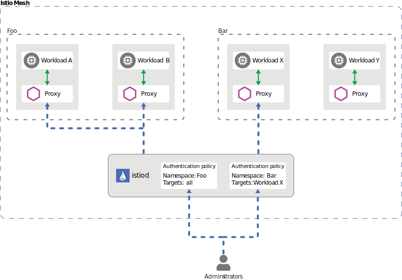
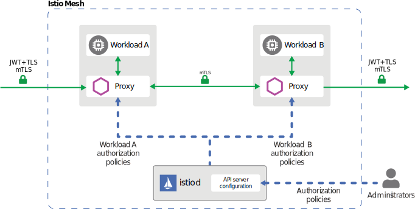

# Istio_安全

----

## Istio安全架构


## 认证

+	认证方式
+	策略存储
+	支持兼容模式



## 认证方式

+	对等认证( Peer authentication )
	*	用于 服务间身份认证
	*	MutualTLS (mTLS)
+	请求认证( Request authentication)
	*	用于终端用户 身份认证
	*	JSON Web Token (JWT)

## 认证策略

+	配置方式
+	配置生效范围
	*	网格
	*	命名空间
	*	工作负载(服务)
+	策略的更新

```yaml
apiVersion: "security.istio.io/v1beta1"
kind: "PeerAuthentication"
metadata:
  name: "example-peer-policy"
  namespace: "foo"
spec:
  selector:
    matchLabels:
      app: reviews
  mtls:
    mode: STRICT
```


## 授权

+	授权级别
+	策略分发
+	授权引擎
+	无需显式启用




## 授权策略

+	通过创建AuthorizationPolicy实现
+	组成部分
	*	选择器( Selector)
	*	行为( Action)
	*	规则列表( Rules )
		-	来源(from)
		-	操作(to)
		-	匹配条件(when)


```yaml
apiVersion: security.istio.io/v1beta1
kind: AuthorizationPolicy		#!!!
metadata:
 name: httpbin
 namespace: foo
spec:
 selector:
   matchLabels:
     app: httpbin
     version: v1
 action: ALLOW
 rules:
 - from:
   - source:
       principals: ["cluster.local/ns/default/sa/sleep"]
   - source:
       namespaces: ["dev"]
   to:
   - operation:
       methods: ["GET"]
   when:
   - key: request.auth.claims[iss]
     values: ["https://accounts.google.com"]
```

授权策略设置

+	范围(目标)设置: metadata/ namespace, selector
+	值匹配:精确、模糊、前缀、后缀
+	全部容许和拒绝
+	自定义条件


