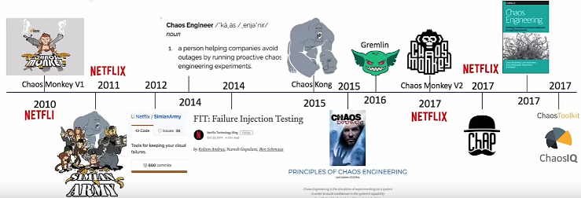
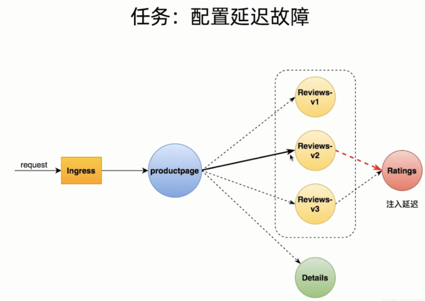
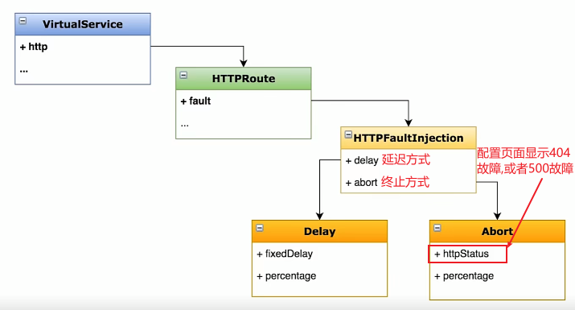

# Istio_故障注入

----

Netflix的Chaos Monkey
混沌工程(Chaos engineering)




# 任务:配置延迟故障




```yaml
apiVersion: networking.istio.io/v1beta1
kind: VirtualService
spec:
  hosts:
  - ratings
  http:
  - fault: 					# 故障注入
      delay:
        fixedDelay: 7s 		# 固定延迟7s
        percentage:
          value: 100 		# 要进行delay的流量的比例,这里配置100,说明所有流量都要延迟7s
    match:
    - headers:
        end-user:
          exact: jason
    route:
    - destination:
        host: ratings
        subset: v1
  - route:
    - destination:
        host: ratings
        subset: v1
```



# 参考

[故障注入](https://istio.io/latest/zh/docs/tasks/traffic-management/fault-injection/)


