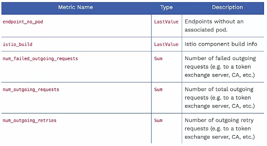
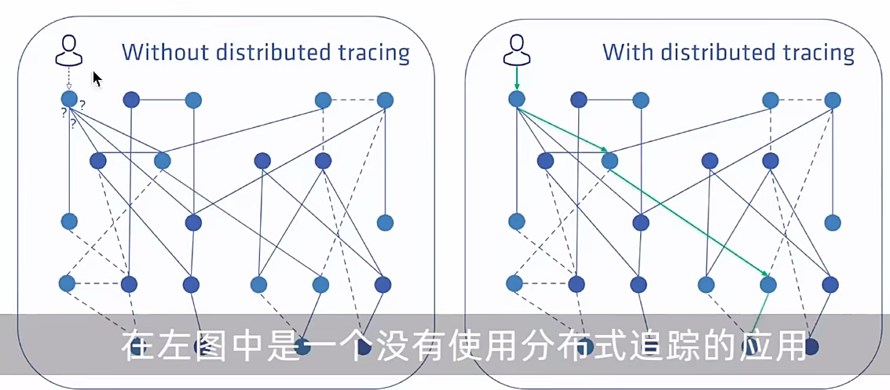
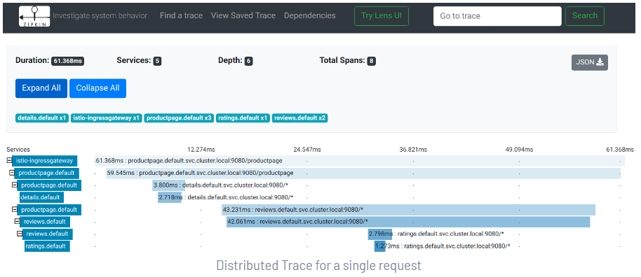

# Istio_服务的可观察性

----

# 什么是可观察性

+	可观察性≠监控.
+	从开发者的角度探究系统的状态
+	组成:指标、日志、追踪

# 指标(Metrics)

+	以聚合的方式监控和理解系统行为
+	Istio 中的指标分类:
	*	代理级别的指标( Proxy-level)
	*	服务级别的指标( Service-level)
	*	控制平面指标( Control plane)
	
## 代理级别的指标

+	收集目标: Sidecar 代理
+	资源粒度上的网格监控
+	容许指定收集的代理(针对性的调试)

```
# 当前集群中来自上有服务的总的请求数
envoy_cluster_internal_upstream_rq{response_code_class="2xx",cluster_name="xds-grpc"} 7163

# 上游服务的完成的请求数量
envoy_cluster_upstream_rq_completed{cluster_name="xds-grpc"} 7164

# SSL连接出错的数量
envoy_cluster_ssl_connection_error{cluster_name="xds-grpc"} 0
```

## 服务级别的指标

+	用于监控服务通信
+	四个基本的服务监控需求:延迟、流量、错误、饱和
+	默认指标导出到Prometheus ( 可自定义和更改)
+	可根据需求开启或关闭

```
istio_requests_total{
  connection_security_policy="mutual_tls",
  destination_app="details",
  destination_canonical_service="details",
  destination_canonical_revision="v1",
  destination_principal="cluster.local/ns/default/sa/default",
  destination_service="details.default.svc.cluster.local",
  destination_service_name="details",
  destination_service_namespace="default",
  destination_version="v1",
  destination_workload="details-v1",
  destination_workload_namespace="default",
  reporter="destination",
  request_protocol="http",
  response_code="200",
  response_flags="-",
  source_app="productpage",
  source_canonical_service="productpage",
  source_canonical_revision="v1",
  source_principal="cluster.local/ns/default/sa/default",
  source_version="v1",
  source_workload="productpage-v1",
  source_workload_namespace="default"
} 214
```

## 控制平面指标

+	对自身组件行为的监控
+	用于了解网格的健康情况



# 访问日志(Access logs)

+	通过应用产生的事件来了解系统
+	包括了完整的元数据信息(目标、源)
+	生成位置可选(本地、远端，如filebeat)
+	日志内容
	*	应用日志
	*	Envoy日志 `kubectl logs -l app=demo -C istio-proxy`

## 分布式追踪

+	通过追踪请求，了 解服务的调用关系
+	常用于调用链的问题排查、性能分析等
+	支持多种追踪系统(Jeager、 Zipkin、Datadog)




分布式追踪示例



# 参考

[可观察性](https://istio.io/latest/zh/docs/concepts/observability/)


