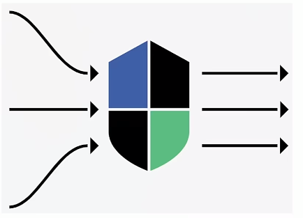
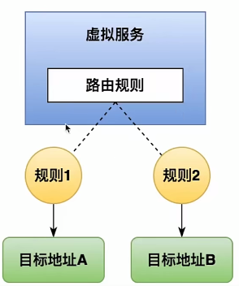
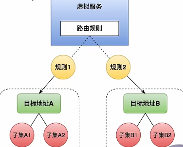
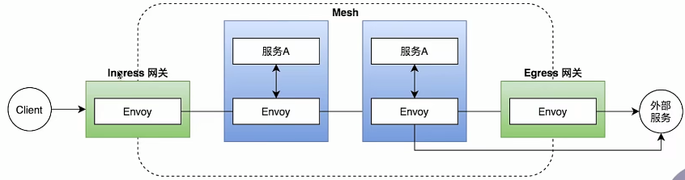
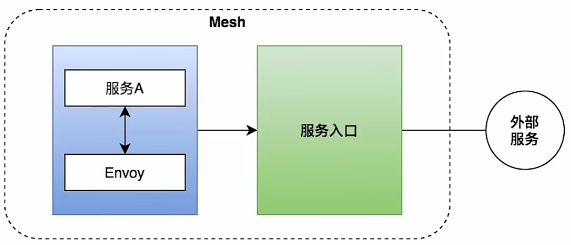
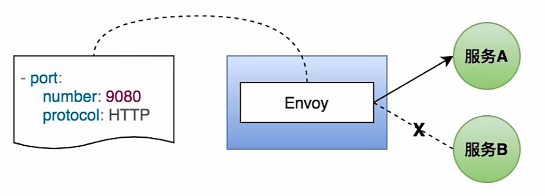

# Istio_核心功能_流量控制

----

## Istio的流量控制能力

+	主要能力
	*	路由、流量转移
	*	流量进出
	*	网络弹性能力
	*	测试相关
+	核心资源(CRD)
	*	虚拟服务( Virtual Service)
	*	目标规则(Destination Rule )
	*	网关(Gateway)
	*	服务入口(Service Entry)
	*	Sidecar

## 管理网格内部流量

### 虚拟服务(Virtual Service)

+	是实现路由功能的重要组件,主要的功能是把请求的流量路由到指定的目标地址
+	可以做到,把请求的地址和真是的工作负载进行解耦
+	本质上来讲,它实际就是一组路由规则

+	将流量路由到给定目标地址
+	请求地址与真实的工作负载解耦
+	包含一组路由规则
+	通常和目标规则(Destination Rule)成对出现，
+	丰富的路由匹配规则

虚拟服务通常下述的目标规则成对出现

### 目标规则(Destination Rule)

+	定义了虚拟服务里面配置的具体的目标地址
+	在它的配置中是以子集这个概念存在的,也就是每一个子集里会配置一个对应的目标地址

+	定义虚拟服务路由目标地址的真实地址,即子集(subset)
+	设置负载均衡的方式
	*	随机
	*	权重
	*	最少请求数

## 管理网格以外的流量

### 网关(Gateway)

+	管理进出网格的流量
+	处在网格边界

注:Egress不是必须的,可以直接访问外部

## 服务入口(Service Entry)

+	把外部服务注册到网格中
+	功能:
	*	为外部目标转发请求
	*	添加超时重试等策略
	*	扩展网格
+	场景
	*	假设你的服务部署在不同的集群中,那么可以通过定义服务入口的方式把这几个不同的集群集中起来,共同用同一个网格进行管理
	

## SideCar

+	调整Envoy代理接管的端口和协议
+	限制Envoy代理可访问的服务

## 网络弹性和测试

+	弹性能力
	*	超时
	*	重试
	*	熔断
+	测试能力
	*	故障注入
		-	主要两种
		-	增加延迟
		-	返回500之类的错误
	*	流量镜像
		-	由于本地和生产流量的不同,有时本地测试没问题,线上就是有问题
		-	对于上述问题,istio可以将生产的流量镜像一部分(模拟线上流量),然后发送到镜像服务中

# 参考

[流量管理](https://istio.io/latest/zh/docs/concepts/traffic-management/)