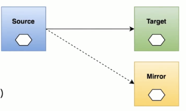

# Istio_流量镜像

----

# 理解流量镜像
　　流量镜像（Mirroring/traffic-shadow），也叫作影子流量，是指通过一定的配置将线上的真实流量复制一份到镜像服务中去，我们通过流量镜像转发以达到在不影响线上服务的情况下对流量或请求内容做具体分析的目的，它的设计思想是只做转发而不接收响应（fire and forget）。这个功能在传统的微服务架构里是很难做到的，一方面，传统服务之间的通讯是由SDK支持的，那么对流量镜像就代表着在业务服务逻辑中有着镜像逻辑相关代码的侵入，这会影响业务服务的代码的整洁性。另一方面，流量镜像的功能是需要非常灵活的，多维度，可动态管控的一个组件。如果将这样的一个组件集成到SDK中去完成它的使命后却无法及时清除，这样的设计势必是臃肿而繁琐的。所幸的是，随着微服务架构的发展，Service Mesh登上了历史舞台，成为新一代的服务架构引领者。而Istio作为Service Mesh优秀的落地架构，利用它本身使用Envoy代理转发流量的特性，轻松的支持了流量镜像的功能，再加上它的实现不需要任何代码的侵入，只需要在配置文件中简单加上几个配置即可完成。


+	实时复制请求到镜像服务
	*	应用场景
	*	线上问题排查(troubleshooting )
	*	观察生产环境的请求处理能力( 压力测试
	*	复制请求信息用于分析




```yaml
apiVersion: networking.istio.io/v1alpha3
kind: VirtualService
metadata:
  name: httpbin
spec:
  hosts:
    - httpbin
  http:
  - route:
    - destination:
        host: httpbin
        subset: v1
      weight: 100
    mirror: 			# 将流量镜像到 v2
      host: httpbin
      subset: v2
    mirrorPercent: 100
```