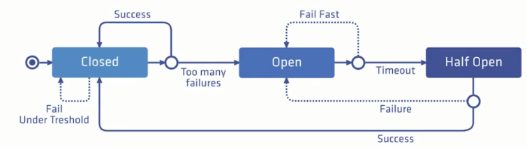
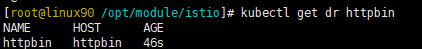
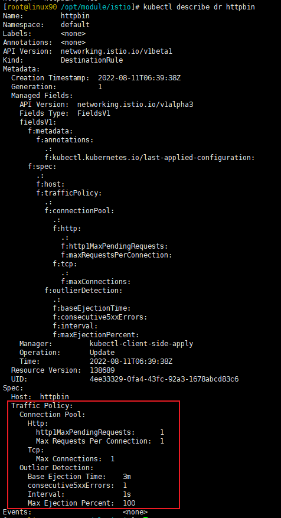
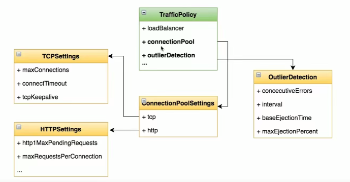

# Istio_熔断

----

# 理解熔断

熔断（Circuit Breaker），原是指当电流超过规定值时断开电路，进行短路保护或严重过载时的一种保护机制。后来熔断也广泛应用于金融领域，指当股指波幅达到规定的熔断点时，交易所为控制风险采取的暂停交易措施。而在软件领域，熔断则是指当服务达到系统负载阈值时，为避免整个软件系统不可用，而采取的一种主动保护措施。对于微服务系统而言，熔断尤为重要，它可以使系统在遭遇某些模块故障时，通过服务降级等方式来提高系统核心功能的可用性，得以应对来自故障、潜在峰值或其他未知网络因素的影响。

+	一种过载保护的手段
+	目的:避免服务的级联失败
+	关键点:三个状态;失败计数器(阈值) ;超时时钟



# 任务:配置熔断器

+	任务说明
	*	为httpbin服务添加熔断配置
	*	通过负载测试工具触发熔断
+	任务目标
	*	学会在DestinationRule中添加熔断的配置项
	
## 配置熔断器
1. 如果您启用了 Sidecar 自动注入，通过以下命令部署 httpbin 服务：

```
$ kubectl apply -f samples/httpbin/httpbin.yaml
```

2. 创建一个目标规则，在调用 httpbin 服务时应用熔断设置：

```yaml
apiVersion: networking.istio.io/v1alpha3
kind: DestinationRule
metadata:
  name: httpbin
spec:
  host: httpbin
  trafficPolicy:
    connectionPool: 					# 配置连接池
      tcp:
        maxConnections: 1 				# 连接池的最大连接数为1
      http:
        http1MaxPendingRequests: 1 		# pending(待办的),也就是最大被挂起的请求数
        maxRequestsPerConnection: 1 	# 每个连接的最大请求数为1
    outlierDetection: 					# 配置失败探测(异常值检测)
      consecutive5xxErrors: 1 			# 失败的次数(失败的计数器)
      interval: 1s 						# 熔断的间隔时间
      baseEjectionTime: 3m 				# 最小驱逐时间,默认是30s,驱逐时间会根据它乘上一个熔断出发的次数,可以实现一个指数级的退避策略,即当你服务的异常越来越多,它熔断间隔的时间会越来越长
      maxEjectionPercent: 100 			# 最大可以驱逐的比例,即可以被熔断的服务的比例
```

验证目标规则是否已正确创建





```yaml
kubectl get destinationrule httpbin -o yaml
```

## 增加一个客户端

创建客户端程序以发送流量到 httpbin 服务。这是一个名为 Fortio 的负载测试客户端，它可以控制连接数、并发数及发送 HTTP 请求的延迟。通过 Fortio 能够有效的触发前面在 DestinationRule 中设置的熔断策略。

向客户端注入 Istio Sidecar 代理，以便 Istio 对其网络交互进行管理：

如果你启用了自动注入 Sidecar，可以直接部署 fortio 应用：

```yaml
$ kubectl apply -f samples/httpbin/sample-client/fortio-deploy.yaml
```

登入客户端 Pod 并使用 Fortio 工具调用 httpbin 服务。-curl 参数表明发送一次调用：

```bash
$ export FORTIO_POD=$(kubectl get pods -l app=fortio -o 'jsonpath={.items[0].metadata.name}')
$ kubectl exec "$FORTIO_POD" -c fortio -- /usr/bin/fortio curl -quiet http://httpbin:8000/get
HTTP/1.1 200 OK
server: envoy
date: Tue, 25 Feb 2020 20:25:52 GMT
content-type: application/json
content-length: 586
access-control-allow-origin: *
access-control-allow-credentials: true
x-envoy-upstream-service-time: 36

{
  "args": {},
  "headers": {
    "Content-Length": "0",
    "Host": "httpbin:8000",
    "User-Agent": "fortio.org/fortio-1.3.1",
    "X-B3-Parentspanid": "8fc453fb1dec2c22",
    "X-B3-Sampled": "1",
    "X-B3-Spanid": "071d7f06bc94943c",
    "X-B3-Traceid": "86a929a0e76cda378fc453fb1dec2c22",
    "X-Forwarded-Client-Cert": "By=spiffe://cluster.local/ns/default/sa/httpbin;Hash=68bbaedefe01ef4cb99e17358ff63e92d04a4ce831a35ab9a31d3c8e06adb038;Subject=\"\";URI=spiffe://cluster.local/ns/default/sa/default"
  },
  "origin": "127.0.0.1",
  "url": "http://httpbin:8000/get"
}
```

可以看到调用后端服务的请求已经成功！接下来，可以测试熔断。

## 触发熔断器

在 DestinationRule 配置中，您定义了 maxConnections: 1 和 http1MaxPendingRequests: 1。这些规则意味着，如果并发的连接和请求数超过一个，在 istio-proxy 进行进一步的请求和连接时，后续请求或连接将被阻止。

发送并发数为 2 的连接（-c 2），请求 20 次（-n 20）：

```bash
$ kubectl exec "$FORTIO_POD" -c fortio -- /usr/bin/fortio load -c 2 -qps 0 -n 20 -loglevel Warning http://httpbin:8000/get
20:33:46 I logger.go:97> Log level is now 3 Warning (was 2 Info)
Fortio 1.3.1 running at 0 queries per second, 6->6 procs, for 20 calls: http://httpbin:8000/get
Starting at max qps with 2 thread(s) [gomax 6] for exactly 20 calls (10 per thread + 0)
20:33:46 W http_client.go:679> Parsed non ok code 503 (HTTP/1.1 503)
20:33:47 W http_client.go:679> Parsed non ok code 503 (HTTP/1.1 503)
20:33:47 W http_client.go:679> Parsed non ok code 503 (HTTP/1.1 503)
Ended after 59.8524ms : 20 calls. qps=334.16
Aggregated Function Time : count 20 avg 0.0056869 +/- 0.003869 min 0.000499 max 0.0144329 sum 0.113738
# range, mid point, percentile, count
>= 0.000499 <= 0.001 , 0.0007495 , 10.00, 2
> 0.001 <= 0.002 , 0.0015 , 15.00, 1
> 0.003 <= 0.004 , 0.0035 , 45.00, 6
> 0.004 <= 0.005 , 0.0045 , 55.00, 2
> 0.005 <= 0.006 , 0.0055 , 60.00, 1
> 0.006 <= 0.007 , 0.0065 , 70.00, 2
> 0.007 <= 0.008 , 0.0075 , 80.00, 2
> 0.008 <= 0.009 , 0.0085 , 85.00, 1
> 0.011 <= 0.012 , 0.0115 , 90.00, 1
> 0.012 <= 0.014 , 0.013 , 95.00, 1
> 0.014 <= 0.0144329 , 0.0142165 , 100.00, 1
# target 50% 0.0045
# target 75% 0.0075
# target 90% 0.012
# target 99% 0.0143463
# target 99.9% 0.0144242
Sockets used: 4 (for perfect keepalive, would be 2)
Code 200 : 17 (85.0 %)
Code 503 : 3 (15.0 %)
Response Header Sizes : count 20 avg 195.65 +/- 82.19 min 0 max 231 sum 3913
Response Body/Total Sizes : count 20 avg 729.9 +/- 205.4 min 241 max 817 sum 14598
All done 20 calls (plus 0 warmup) 5.687 ms avg, 334.2 qps

有趣的是，几乎所有的请求都完成了！istio-proxy 确实允许存在一些误差。

Code 200 : 17 (85.0 %)
Code 503 : 3 (15.0 %)
```

将并发连接数提高到 3 个：

```bash
$ kubectl exec "$FORTIO_POD" -c fortio -- /usr/bin/fortio load -c 3 -qps 0 -n 30 -loglevel Warning http://httpbin:8000/get
20:32:30 I logger.go:97> Log level is now 3 Warning (was 2 Info)
Fortio 1.3.1 running at 0 queries per second, 6->6 procs, for 30 calls: http://httpbin:8000/get
Starting at max qps with 3 thread(s) [gomax 6] for exactly 30 calls (10 per thread + 0)
20:32:30 W http_client.go:679> Parsed non ok code 503 (HTTP/1.1 503)
20:32:30 W http_client.go:679> Parsed non ok code 503 (HTTP/1.1 503)
20:32:30 W http_client.go:679> Parsed non ok code 503 (HTTP/1.1 503)
20:32:30 W http_client.go:679> Parsed non ok code 503 (HTTP/1.1 503)
20:32:30 W http_client.go:679> Parsed non ok code 503 (HTTP/1.1 503)
20:32:30 W http_client.go:679> Parsed non ok code 503 (HTTP/1.1 503)
20:32:30 W http_client.go:679> Parsed non ok code 503 (HTTP/1.1 503)
20:32:30 W http_client.go:679> Parsed non ok code 503 (HTTP/1.1 503)
20:32:30 W http_client.go:679> Parsed non ok code 503 (HTTP/1.1 503)
20:32:30 W http_client.go:679> Parsed non ok code 503 (HTTP/1.1 503)
20:32:30 W http_client.go:679> Parsed non ok code 503 (HTTP/1.1 503)
20:32:30 W http_client.go:679> Parsed non ok code 503 (HTTP/1.1 503)
20:32:30 W http_client.go:679> Parsed non ok code 503 (HTTP/1.1 503)
20:32:30 W http_client.go:679> Parsed non ok code 503 (HTTP/1.1 503)
20:32:30 W http_client.go:679> Parsed non ok code 503 (HTTP/1.1 503)
20:32:30 W http_client.go:679> Parsed non ok code 503 (HTTP/1.1 503)
20:32:30 W http_client.go:679> Parsed non ok code 503 (HTTP/1.1 503)
20:32:30 W http_client.go:679> Parsed non ok code 503 (HTTP/1.1 503)
20:32:30 W http_client.go:679> Parsed non ok code 503 (HTTP/1.1 503)
Ended after 51.9946ms : 30 calls. qps=576.98
Aggregated Function Time : count 30 avg 0.0040001633 +/- 0.003447 min 0.0004298 max 0.015943 sum 0.1200049
# range, mid point, percentile, count
>= 0.0004298 <= 0.001 , 0.0007149 , 16.67, 5
> 0.001 <= 0.002 , 0.0015 , 36.67, 6
> 0.002 <= 0.003 , 0.0025 , 50.00, 4
> 0.003 <= 0.004 , 0.0035 , 60.00, 3
> 0.004 <= 0.005 , 0.0045 , 66.67, 2
> 0.005 <= 0.006 , 0.0055 , 76.67, 3
> 0.006 <= 0.007 , 0.0065 , 83.33, 2
> 0.007 <= 0.008 , 0.0075 , 86.67, 1
> 0.008 <= 0.009 , 0.0085 , 90.00, 1
> 0.009 <= 0.01 , 0.0095 , 96.67, 2
> 0.014 <= 0.015943 , 0.0149715 , 100.00, 1
# target 50% 0.003
# target 75% 0.00583333
# target 90% 0.009
# target 99% 0.0153601
# target 99.9% 0.0158847
Sockets used: 20 (for perfect keepalive, would be 3)
Code 200 : 11 (36.7 %)
Code 503 : 19 (63.3 %)
Response Header Sizes : count 30 avg 84.366667 +/- 110.9 min 0 max 231 sum 2531
Response Body/Total Sizes : count 30 avg 451.86667 +/- 277.1 min 241 max 817 sum 13556
All done 30 calls (plus 0 warmup) 4.000 ms avg, 577.0 qps
```

现在，您将开始看到预期的熔断行为，只有 36.7% 的请求成功，其余的均被熔断器拦截：

+ Code 200 : 11 (36.7 %)
+ Code 503 : 19 (63.3 %)

查询 istio-proxy 状态以了解更多熔断详情:

```bash
$ kubectl exec "$FORTIO_POD" -c istio-proxy -- pilot-agent request GET stats | grep httpbin | grep pending
cluster.outbound|8000||httpbin.default.svc.cluster.local.circuit_breakers.default.remaining_pending: 1
cluster.outbound|8000||httpbin.default.svc.cluster.local.circuit_breakers.default.rq_pending_open: 0
cluster.outbound|8000||httpbin.default.svc.cluster.local.circuit_breakers.high.rq_pending_open: 0
cluster.outbound|8000||httpbin.default.svc.cluster.local.upstream_rq_pending_active: 0
cluster.outbound|8000||httpbin.default.svc.cluster.local.upstream_rq_pending_failure_eject: 0
cluster.outbound|8000||httpbin.default.svc.cluster.local.upstream_rq_pending_overflow: 21
cluster.outbound|8000||httpbin.default.svc.cluster.local.upstream_rq_pending_total: 29
```

可以看到 upstream_rq_pending_overflow 值 21，这意味着，目前为止已有 21 个调用被标记为熔断。

# 配置项



# 参考

[熔断](https://istio.io/latest/zh/docs/tasks/traffic-management/circuit-breaking/)