# Istio_监控组件Prometheus

----

# 认识Prometheus

Prometheus是一款开源的、自带时序数据库的监控告警系统。目前，Prometheus已经成为Kubernetes集群中监控告警系统的标配。Prometheus的架构如下图所示

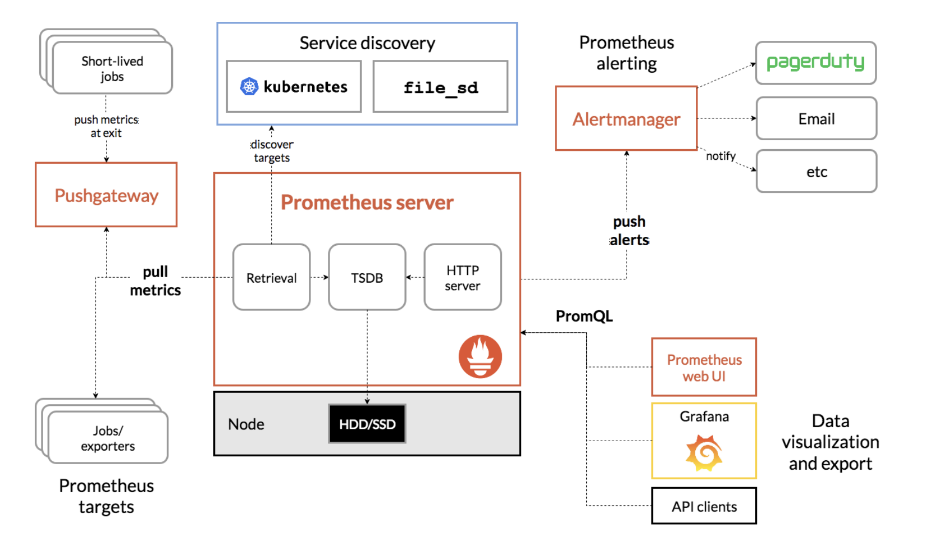

Prometheus通过规则对Kubernetes集群中的数据源做服务发现（Service Dicovery），再从数据源中抓取数据，保存在它的时序数据库TSDB中，再根据配置的告警规则，将数据推送给AlterManager服务，做告警信息的推送。同时，Prometheus中也暴露了HTTP指标查询接口，通过PromQL（一种特定的查询语法）可以将收集的数据查询并展示出来。
　　从上图中可以看出，Prometheus主要从两种数据源抓取指标：PushGateway和Exporters。PushGateway指的是服务将指标数据主动推给PushGateway服务，Prometheus再异步从PushGateway服务中抓取。而Exports则主动暴露了HTTP服务接口，Prometheus定时从接口中抓取指标。
　　在Istio中，各个组件是通过暴露HTTP接口的方式让Prometheus定时抓取的（采用了Exporters的方式）。在Kubernetes集群中，Istio安装完成后，会在istio-system的命名空间中部署Prometheus，并将Istio组件的各相关指标的数据源默认配置在Prometheus中。

## 启动Prometheus

通过istioctl启动Prometheus

```bash
$ istioctl dashboard prometheus                  
http://localhost:9090
```

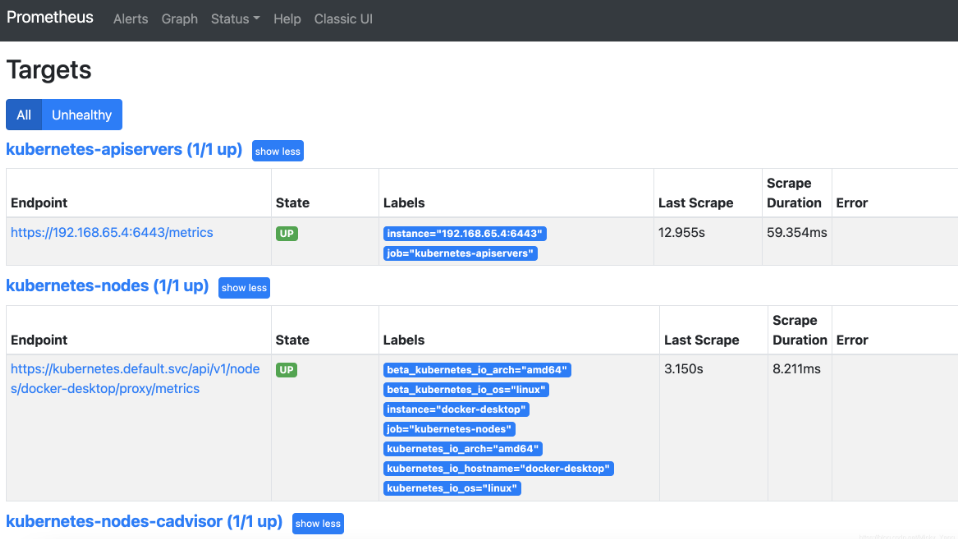

+	Endpoint：抓取指标的地址
+	State：该指标接口能否正常提供数据（UP代表正常，DOWN代表指标服务异常）
+	Labels：该指标所带的标签，用于标识指标
+	Last Scrape：Prometheus最后一次从数据源中抓取指标的时间到当前的时间间隔
+	Scrape Duration：Prometheus调该接口抓取指标的耗时
+	Error：获取数据源信息失败的原因

## 查看Istio相关指标

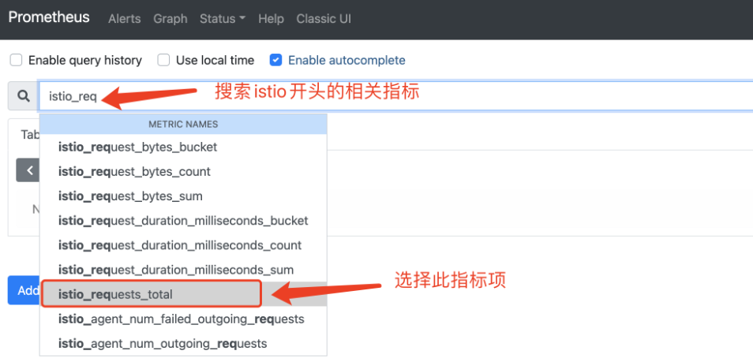

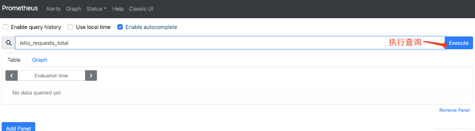

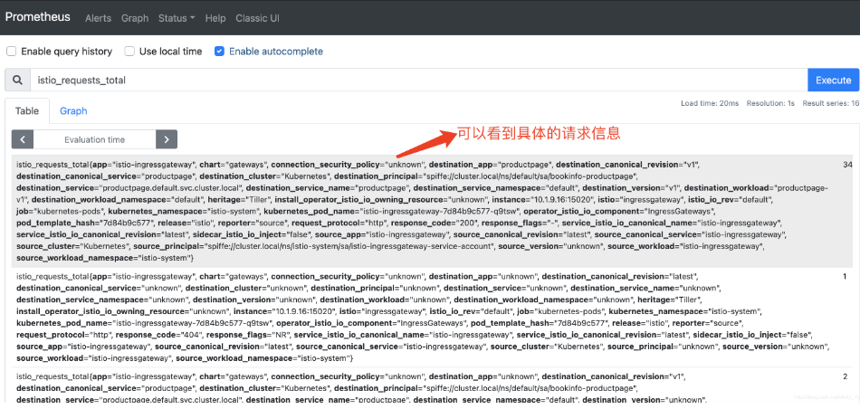

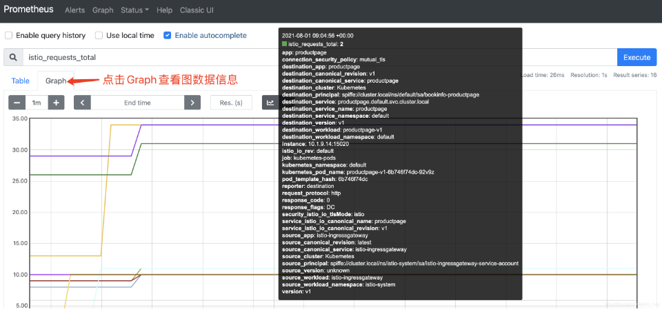

# 认识Grafana

Grafana是一款开源的指标数据可视化工具，有着功能齐全的度量仪表盘、图表等等时序数据展示面板，支持Zabbix、InfluentDB、Prometheus、Elasticsearch、MySQL等数据源的指标展示。

在Istio中，也引入了Grafana这样一款提供了将时间序列数据库（TSDB）数据转换为精美的图形和可视化面板的工具。Grafana让用户能够更直观地观测到集群中各项数据指标的变化趋势（网络流量变化、组件资源使用情况等），是Istio实现可观测行最重要的组件之一。在Istio安装时，可以通过配置将Grafana服务默认安装在Istio-system命名空间下，Istio安装完成后，默认配置了Istio中的Prometheus作为数据源，定时地从Prometheus中采集Istio各组件的指标数据，进行可视化展示。

## 启动Grafana

```yaml
$ istioctl dashboard grafana
http://localhost:3000
```

## 查看控制平面数据

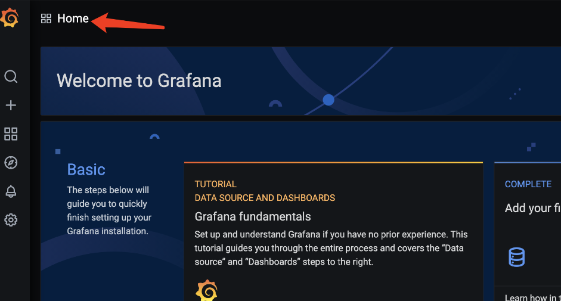

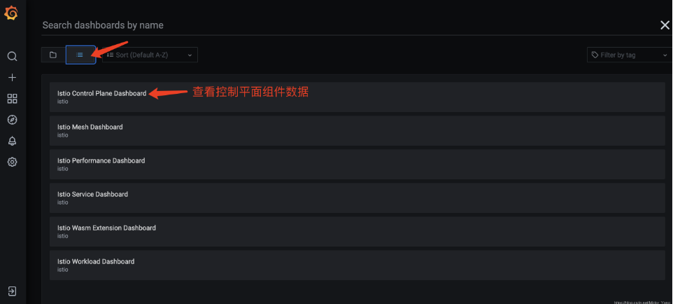

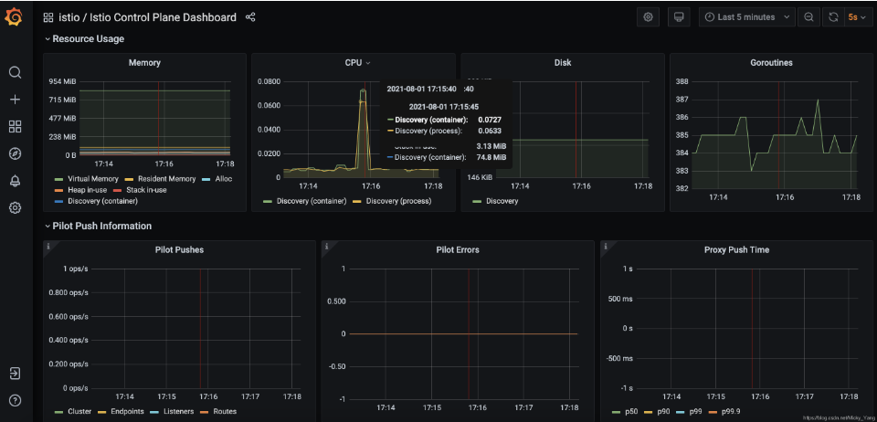

## 查看流量相关数据

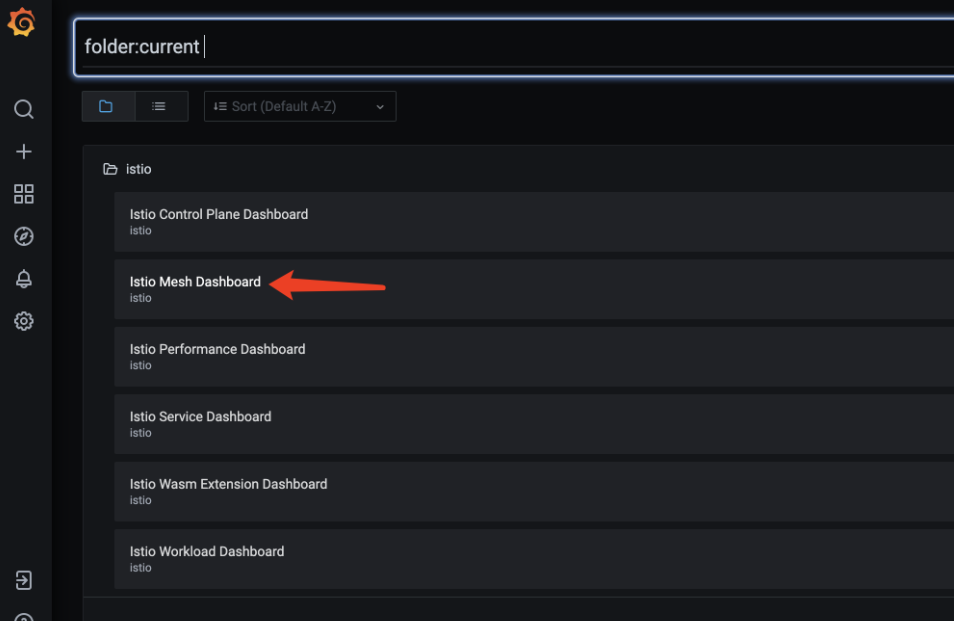

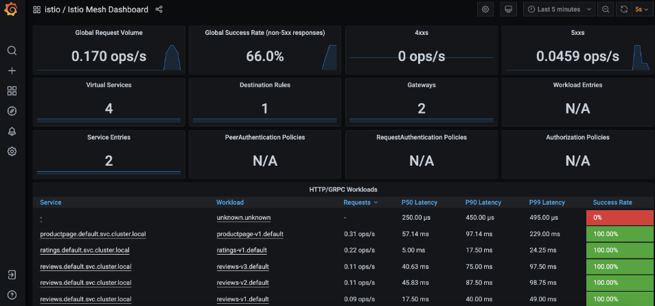

## 查看Service相关数据

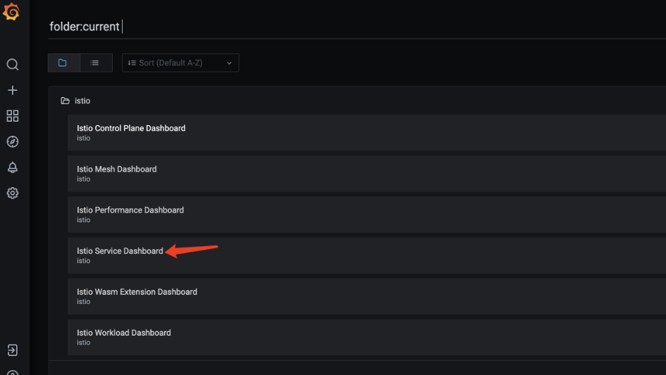

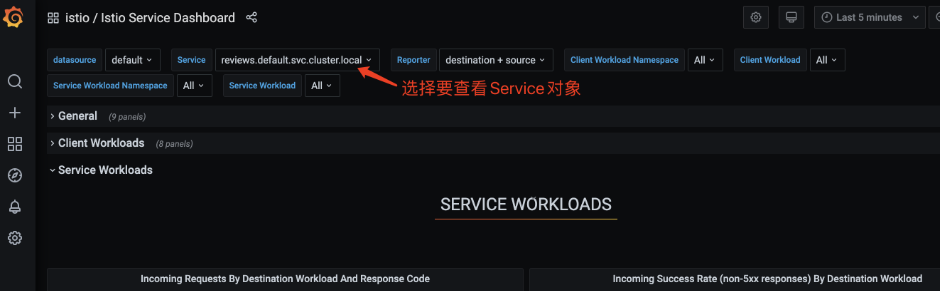

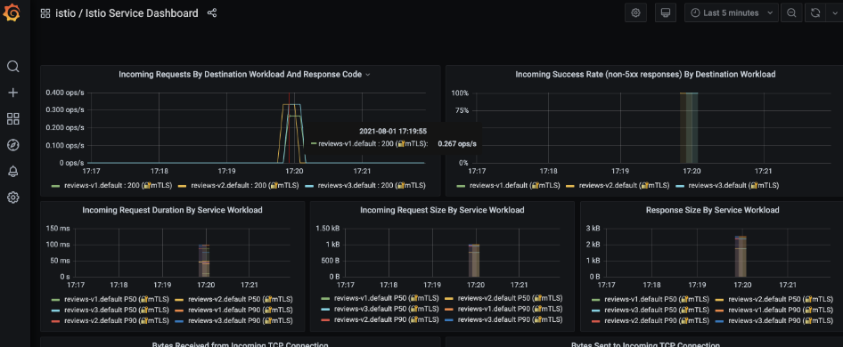