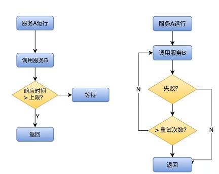
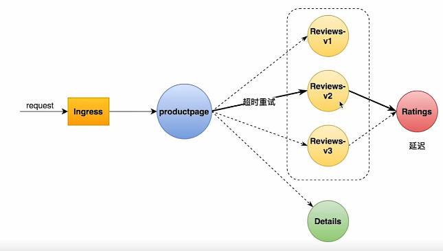
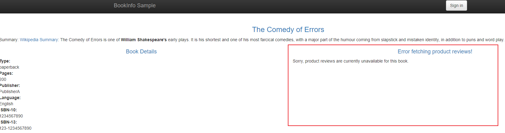
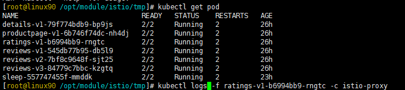
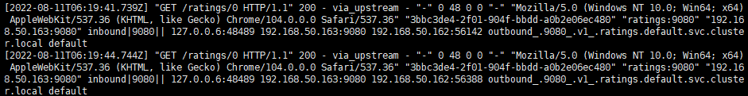
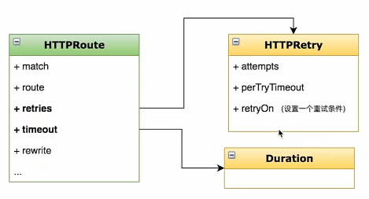

# Istio_超时重试

----

+	超时
	*	控制故障范围，避免故障扩散
+	重试
	*	解决网络抖动时通信失败的问题



# 任务:添加超时重试策略

+	任务说明
	*	添加超时策略
	*	添加重试策略
+	任务目标
	*	学会在VirtualService中添加超时和重试的配置项
	*	理解超时重试对提升应用健壮性的意义



# 超时演示步骤

参考:[设置请求超时](https://istio.io/latest/zh/docs/tasks/traffic-management/request-timeouts/)

+	给ratings服务添加延迟
+	给reviews服务添加超时策略
+	给ratings服务添加重试策略


1. 将请求路由到 reviews 服务的 v2 版本，它会发起对 ratings 服务的调用

```yaml
# vs_reviews.yaml
apiVersion: networking.istio.io/v1alpha3
kind: VirtualService
metadata:
  name: reviews
spec:
  hosts:
    - reviews
  http:
  - route:
    - destination:
        host: reviews
        subset: v2
```

2. 给对 ratings 服务的调用添加 2 秒的延迟：

```yaml
# vs_ratings.yaml
apiVersion: networking.istio.io/v1alpha3
kind: VirtualService
metadata:
  name: ratings
spec:
  hosts:
  - ratings
  http:
  - fault:
      delay:
        percent: 100
        fixedDelay: 2s
    route:
    - destination:
        host: ratings
        subset: v1
```

3.	在浏览器中打开 Bookinfo 的网址 http://$GATEWAY_URL/productpage。

这时可以看到 Bookinfo 应用运行正常（显示了评级的星型符号），但是每次刷新页面，都会有 2 秒的延迟。

4. 	现在给对 reviews 服务的调用增加一个半秒的请求超时

```yaml
apiVersion: networking.istio.io/v1alpha3
kind: VirtualService
metadata:
  name: reviews
spec:
  hosts:
  - reviews
  http:
  - route:
    - destination:
        host: reviews
        subset: v2
    timeout: 0.5s
```



5.	刷新 Bookinfo 页面。

这时候应该看到 1 秒钟就会返回，而不是之前的 2 秒钟，但 reviews 是不可用的。

!>	即使超时配置为半秒，响应仍需要 1 秒，是因为 productpage 服务中存在硬编码重试，因此它在返回之前调用 reviews 服务超时两次。

6. 复盘一下上面的配置

+	reviews 访问 ratings
+	reviews设置如果访问其他服务时,在0.5秒内得不到响应就快速失败
+	ratings设置任何来访问的服务延迟2s再响应
+	此时通过 reviews 访问 ratings,reviews会快速失败

# 重试演示步骤

1. 先把前面timeout设置取消

```yaml
# vs_reviews.yaml
apiVersion: networking.istio.io/v1alpha3
kind: VirtualService
metadata:
  name: reviews
spec:
  hosts:
    - reviews
  http:
  - route:
    - destination:
        host: reviews
        subset: v2
```


2. 给对 ratings 服务的调用添加 5 秒的延迟,并添加两次重试

```yaml
# vs_ratings.yaml
apiVersion: networking.istio.io/v1alpha3
kind: VirtualService
metadata:
  name: ratings
spec:
  hosts:
  - ratings
  http:
  - fault:					# 故障注入
      delay:
        percent: 100
        fixedDelay: 5s		# 固定延迟5s
    route:
    - destination:
        host: ratings
        subset: v1
    retries:
      attempts: 2 			# 尝试几次
      perTryTimeout: 1s 	# 每次尝试需要等待多长时间
```

3. Bookinfo 的网址 http://$GATEWAY_URL/productpage。

如下查看日志,可以看到重试两次






4. 复盘一下上面的配置

+	reviews 访问 ratings
+	ratings没做限制
+	ratings故障注入,固定5s延迟才会响应
+	ratings设置Timeout为1s,尝试两次
+	所以日志可以看到请求两次

# 配置分析

