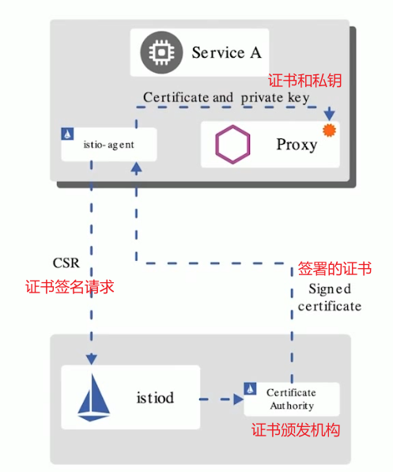

# Istio_配置TLS安全网关

----

## Istio 1.5的安全更新

+	SDS (安全发 现服务)趋于稳定、默认开启
+	对等认证和请求认证配置分离
+	自动 mTLS从alpha 变为beta,默认开启
+	Node agent和Pilot agent合并，简化Pod安全策略的配置
+	支持first- party-jwt (ServiceAccountToken) 作为third-party-jwt的备用
+	...

## 任务:配置基于SDS的安全网关

+	任务说明
	*	配置安全网关，为外部提供HTTPS访问方式
+	任务目标
	*	学习配置全局自动的TLS、mTLS
	*	了解SDS及工作原理
	

## 安全发现服务(SDS)

+	身份和证书管理
+	实现安全配置自动化
+	中心化SDS Server 
+	优点:
	*	无需挂载secret卷
	*	动态更新证书，Envoy无需重启
	*	可监视多个证书密钥对

## 演示

+	确认curl命令的编译包
+	生成证书、密钥
+	配置TLS网关和路由
+	curl测试

