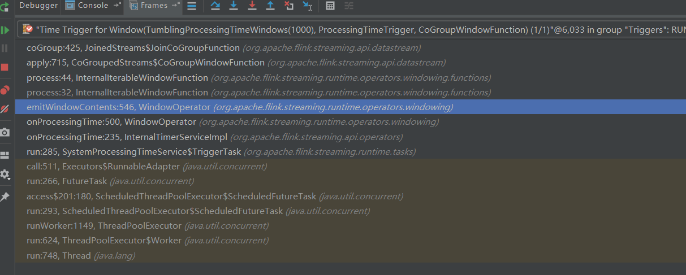

## 基本概念

双流Join是Flink面试的高频问题。一般情况下说明以下几点就可以hold了：

1.  Join大体分类只有两种：Window Join和Interval Join。Window Join又可以根据Window的类型细分出3种：
    Tumbling Window Join、Sliding Window Join、Session Widnow Join。
2.  Windows类型的join都是利用window的机制，先将数据缓存在Window State中，当窗口触发计算时，执行join操作；
3.  interval join也是利用state存储数据再处理，区别在于state中的数据有失效机制，依靠数据触发数据清理；
4.  目前Stream join的结果是数据的笛卡尔积；
5.  日常使用中的一些问题，数据延迟、window序列化相关。特别期待有人留言说下使用中的问题。

## 源码速读

### 说明

1.  源码版本: flink-release-1.6.1
2.  关注的流程：window join 的处理

### 代码样例

首先看看双流join的样例：

```scala
/* From JoinedStream.java 的注释
* DataStream<Tuple2<String, Integer>> one = ...;
* DataStream<Tuple2<String, Integer>> twp = ...;
*
* DataStream<T> result = one.join(two)
*     .where(new MyFirstKeySelector())co
*     .equalTo(new MyFirstKeySelector())
*     .window(TumblingEventTimeWindows.of(Time.of(5, TimeUnit.SECONDS)))
*     .apply(new  ());
* } </pre>
*/
```

### 关键方法的实现

在api层面，前面的算子where、equals、window等操作基本就是在记录信息。方法**apply**的实现中可以看到关键处理：

```scala
// From JoinedStream.java
public <T> DataStream<T> apply(JoinFunction<T1, T2, T> function, TypeInformation<T> resultType) {
	//clean the closure
	function = input1.getExecutionEnvironment().clean(function);

	return input1.coGroup(input2) //产生CoGroupedStream
			.where(keySelector1)
			.equalTo(keySelector2)
			.window(windowAssigner)
			.trigger(trigger)
			.evictor(evictor)
			.apply(new JoinCoGroupFunction<>(function), resultType); //Join的处理方法是JoinCoGroupFunction

}

//From CoGroupedStreams.java
public <T> DataStream<T> apply(CoGroupFunction<T1, T2, T> function, TypeInformation<T> resultType) {
	//clean the closure
	function = input1.getExecutionEnvironment().clean(function);

	UnionTypeInfo<T1, T2> unionType = new UnionTypeInfo<>(input1.getType(), input2.getType());
	UnionKeySelector<T1, T2, KEY> unionKeySelector = new UnionKeySelector<>(keySelector1, keySelector2);

	DataStream<TaggedUnion<T1, T2>> taggedInput1 = input1
			.map(new Input1Tagger<T1, T2>())
			.setParallelism(input1.getParallelism())
			.returns(unionType);
	DataStream<TaggedUnion<T1, T2>> taggedInput2 = input2
			.map(new Input2Tagger<T1, T2>())
			.setParallelism(input2.getParallelism())
			.returns(unionType);

	DataStream<TaggedUnion<T1, T2>> unionStream = taggedInput1.union(taggedInput2);

	// we explicitly create the keyed stream to manually pass the key type information in
	// 看到了window的身影
	WindowedStream<TaggedUnion<T1, T2>, KEY, W> windowOp =
			new KeyedStream<TaggedUnion<T1, T2>, KEY>(unionStream, unionKeySelector, keyType)
			.window(windowAssigner);

	if (trigger != null) {
		windowOp.trigger(trigger);
	}
	if (evictor != null) {
		windowOp.evictor(evictor);
	}
	//windows的apply会触发具体的join Function
	return windowOp.apply(new CoGroupWindowFunction<T1, T2, T, KEY, W>(function), resultType);
}
```

从上面的源码可以获得3个关键点：

1.  Join后的流是CoGroupedStream；
2.  Join后的数据处理类是CoGroupWindowFunction；
3.  GoGroupWindowFunction中WrappedFunction是JoinCoGroupFunction；

欧阔，有了这些关键信息。下一步通过debug跟踪和源码阅读相结合，来看看flink是如何join数据的。

## 数据是如何join的

来看window join的一个调用栈：

咱们可以追溯到，当window 触发后，会调用CoGroupedStream$CoGroupWindowFunction。打开源码看看：

```scala
//From CoGroupWindowFunction::apply
@Override
public void apply(KEY key,
		W window,
		Iterable<TaggedUnion<T1, T2>> values,
		Collector<T> out) throws Exception {

	List<T1> oneValues = new ArrayList<>();
	List<T2> twoValues = new ArrayList<>();

	//首先对窗口缓存的数据分为oneValues和TwoValues，分别对应两条流的数据。
	for (TaggedUnion<T1, T2> val: values) {
		if (val.isOne()) {
			oneValues.add(val.getOne());
		} else {
			twoValues.add(val.getTwo());
		}
	}
	//warppedFunction是上一节中提到的JoinCoGroupFunction
	wrappedFunction.coGroup(oneValues, twoValues, out);
}
```

顺藤摸瓜：

```scala
//From JoinedCoGroupFunction::CoGroup
@Override
public void coGroup(Iterable<T1> first, Iterable<T2> second, Collector<T> out) throws Exception {
	// 双层循环产生数据的笛卡尔积
	for (T1 val1: first) {
		for (T2 val2: second) {
			out.collect(wrappedFunction.join(val1, val2));
		}
	}
}
```

是不是有种What the F**K的感觉，**window + 简单的双层循环就搞定了双流join**。State在Flink中的地位可见一斑。

## IMO

本节内容基本都是IMO，如果有不同意见，请给我留言，我会在第一时间回复您：

1.  Flink流Join的方式还有待丰富，网上有人通过在JoinFunction中加过滤实现leftjoin、rightjoin等很赞；
2.  因为基于window，不在window中缓存的数据就得不到处理。在实际应用中，会出现故障后部分数据滞后较长时间的问题，比较难办。
3.  Flink的整体处理对State的依赖很大，能避开序列化吃CPU的状况么？拭目以待。

## 后记

说个和本话题不相关的类JoinOperator。JoinOperator里面的处理很复杂，感觉含金量很高。后来翻了整条双流Join的处理链路，发现跟JoinOperator压根不沾边，看它的创建和使用场景，大多都是Graph相关\[/dogo\]。是类名容易混淆还是另有深意，不下判定。懂的同学请留言指点。

看完Join的源码后，计划探索memorySegment的应用，看看它是徒有其表还是另有玄机。也希望大家提一些觉得有意思可以探索下的点一起玩一玩。

# 参考
[解读Flink双流Join](https://blog.csdn.net/xianzhen376/article/details/89810958)