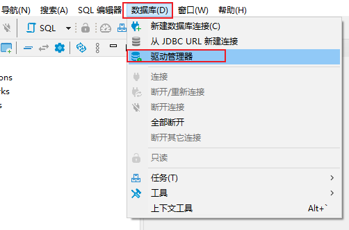
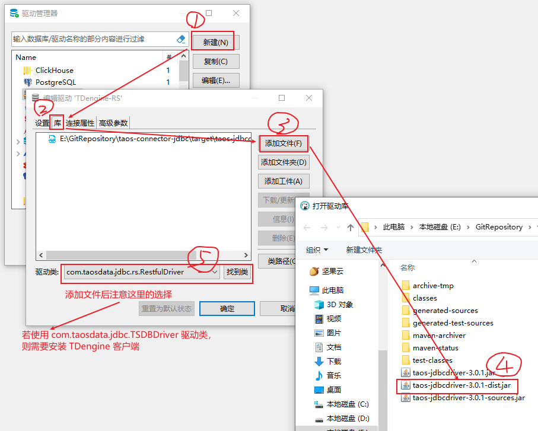
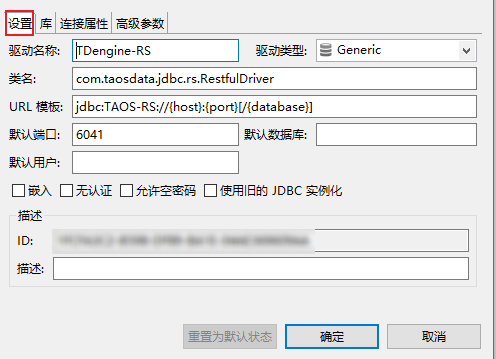
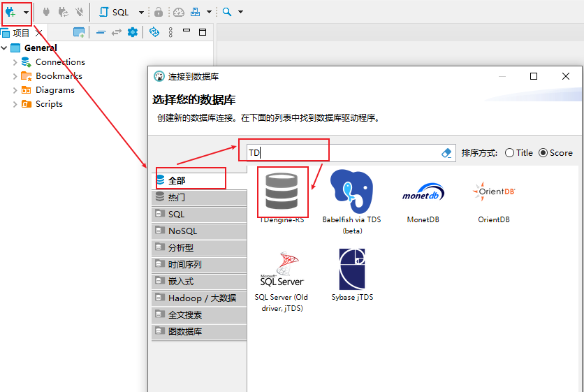
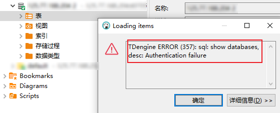

# TDengine的安装和使用

----

## Docker安装TDengine

+	参考
	*	[通过 Docker 快速体验 TDengine](https://docs.taosdata.com/get-started/docker/)
	*	[How to use Docker to run TDengine](https://hub.docker.com/r/tdengine/tdengine)

```bash
docker run -d \
   --name tdengine \
   --hostname="tdengine-server" \ 
   -v ~/work/taos/log:/var/log/taos \
   -v ~/work/taos/data:/var/lib/taos \
   -p 6030:6030 \
   -p 6041:6041 \
   -p 6043-6049:6043-6049 \
   -p 6043-6049:6043-6049/udp \
   tdengine/tdengine
```

注意：TDengine 3.0 服务端仅使用 6030 TCP 端口。6041 为 taosAdapter 所使用提供 REST 服务端口。6043-6049 为 taosAdapter 提供第三方应用接入所使用端口，可根据需要选择是否打开

## 使用DBeaver连接

+	参考
	*	[如何通过 IDEA 数据库管理工具连接 TDengine？](https://www.taosdata.com/engineering/12428.html)
	*	[如何通过开源数据库管理工具 DBeaver 连接 TDengine](https://www.taosdata.com/engineering/12880.html)
	
### 源码编译 JDBC-Connector

1.	首先从 GitHub 仓库克隆 JDBC 连接器的源码，`git clone https://github.com/taosdata/taos-connector-jdbc.git` （需要旧版本可以 -b 指定对应版本分支）
2. 	在 taos-connector-jdbc 目录下执行：`mvn clean package -Dmaven.test.skip=true`

### 配置 DBeaver

1.	点击数据库标签，选择驱动管理器



2.	新建驱动，选择编译好的 dist-jar 驱动包(注意：若使用 com.taosdata.jdbc.TSDBDriver 驱动类，则需要安装 TDengine 客户端)



3.	填写一下驱动名称，简单填下配置



4.	连接

+	taos数据库默认用户为`root`，默认密码为`taosdata`



+	安装好taos数据库后，可以通过：`alter user root pass 'your password'` 进行修改
+	（注意：此时用taosdata密码仍可以连接，但是看不到数据库了）

会报如下错误




