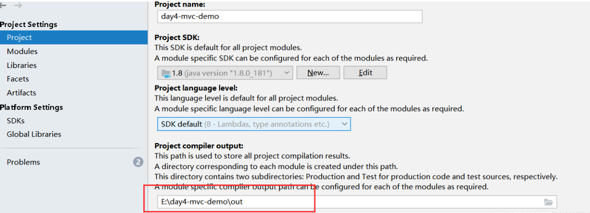
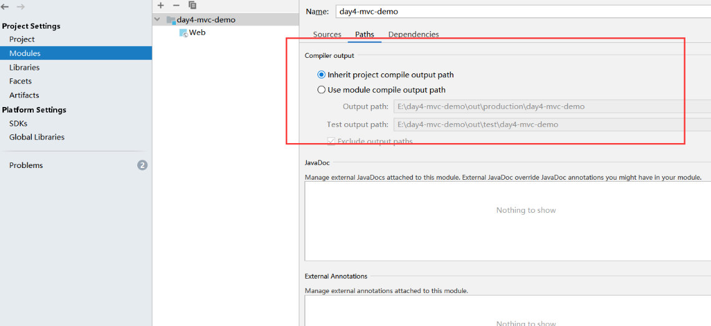
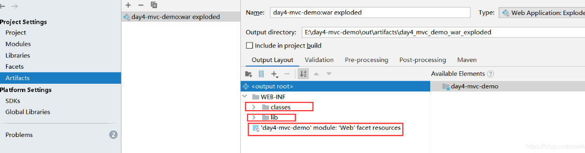

#	idea中的modules、facets、artificats的作用

----

##	Modules

+	首先是 Modules，显示的`是该工程的模块结构`，有sources，paths，dependencies组成

##	Factes

+	Facets：它的作用就是`配置项目框架类支持`。表述了`在Module中使用的各种各样的框架、技术和语言`。这些Facets让Intellij IDEA知道怎么对待module内容，并保证与相应的框架和语言保持一致。
+	比如我们现在要开发的是一个 web 项目，那就需要 web 相关的 Facet，事实上，如果没有这个配置支持，编译器也不知道这个项目是个 web 项目，也就不会去读取 web.xml 的配置，更无法被 tomcat 这种容器支持。
+	`Facet 是和 Module 紧密结合的`，你如果是在 Module 里配置了，那么 Facet 里边也会出现，而如果你先在 Facet 里配置，它会要求你选择 Module，所以结果是一致的。

##	Artifacts

+	Artifacts是maven中的一个概念，`表示某个module要如何打包`，例如war exploded、war、jar、ear等等这种打包形式；
+	Artifacts，它的`作用是整合编译后的 java 文件，资源文件`等，有不同的整合方式，比如war、jar、war exploded 等，
+	对于 Module 而言，有了 Artifact 就可以部署到 web 容器中了。`其中 war 和 war exploded 区别就是后者不压缩，开发时选后者便于看到修改文件后的效果`。

##	各个模块的输出目录

1.	Project 选项里有一个 Project compilerc output 目录，这个是整个 Project 的编译输出目录；

2.	Modules 的具体单个 Module 的 Path 选项里有个 Compiler output，可以选择继承 Project 或者自定义输出目录， `project和modules是一种总体和个体配置的关系`。

3.	Artifacts 也有一个 Output Directory：Artifacts 里的输出目录是跟容器有关系的，在容器运行的时候，会把前两者中起作用的那个（个体配置优先）的 classes 文件复制到 Artifacts 配置的目录的 WEB-INF下边，然后把 Module 的 Facet 里的资源文件目录复制到 Artifacts 目录里，再就是复制 lib 下的 jar 包到 WEB-INF 下，之后项目就可以启动了。

