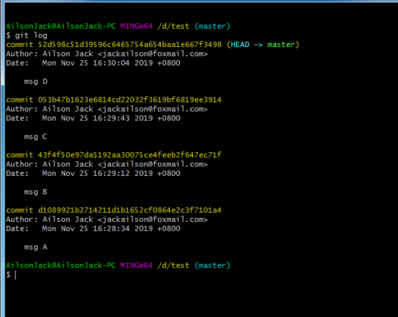
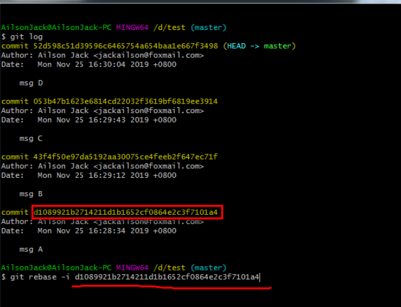
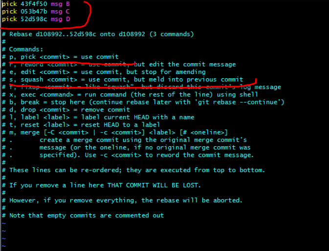
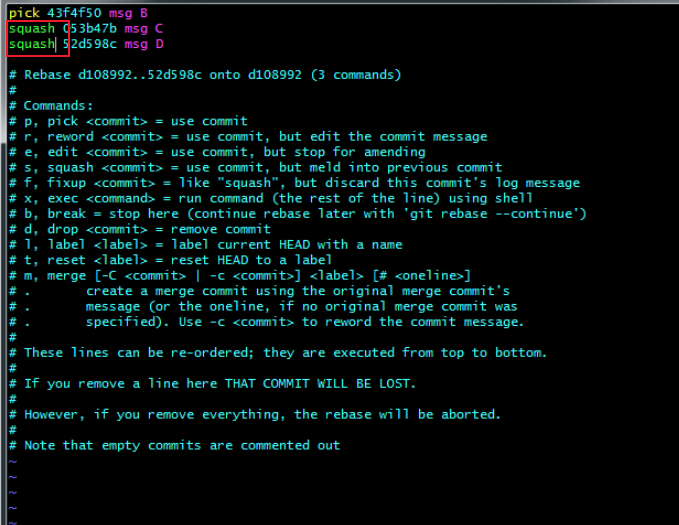
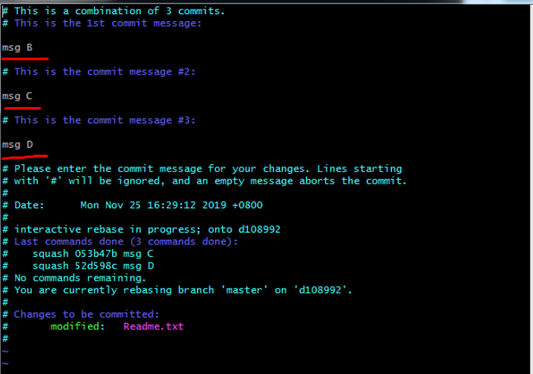
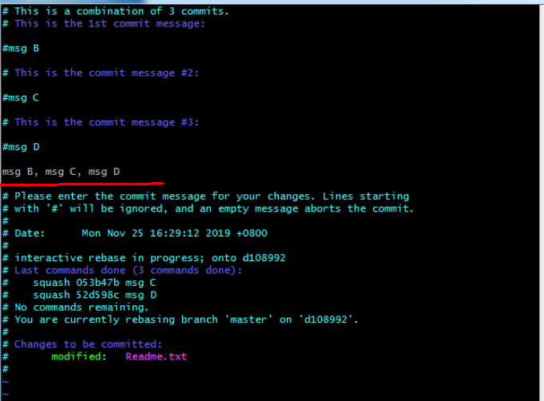
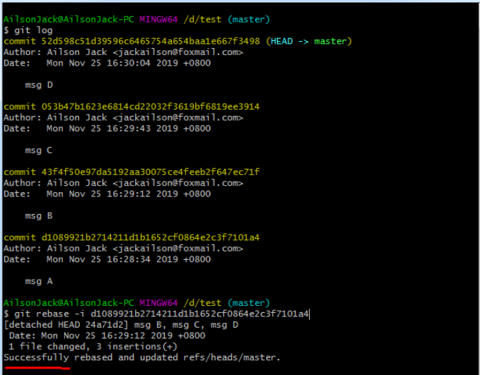
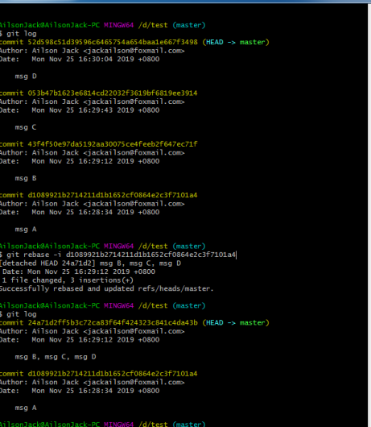

# Git多个commit合并成一个

----

# 使用 git reset

git log如下

```
85d5d8fa468b06bb9a62fafde01d80cbb7396682 # 我改的
621ca4121f971d9604e395556763551427d799d9 # 我改的
f744d2e91916ab7831f3a7695d1d1825916db164 # 我改的
5c135e49e683563fa470d7f5c281050ec1d73af9 # 我改的
295ac3b842b4ecb6eff1c9954a281a4606a8bc84 # 别人改的
```

目的

```
8403afe13664d6bb7f5a5557716a030e9389a944 # 我改的
295ac3b842b4ecb6eff1c9954a281a4606a8bc84 # 别人改的
```

思路：使用 git reset --soft 回退版本库和暂存区的版本，同时保留工作区的变动，之后再重新提交工作区的内容就好了。

```bash
# 查看前10个commit
git log -10

# 从版本库恢复文件到暂存区，不改动工作区的内容
git reset --soft 295ac3b842b4ecb6eff1c9954a281a4606a8bc84	# 别人改的commitID

# add已经跟踪的文件
git add -u

# 提交
git commit -m "修改信息"

# 强制push以替换远程仓的commitID
# git push --force
```

如果push失败，出现Reject，则需要开启分支强制合入的选项，取消分支保护。

# 使用 git rebase（用这个）

```bash
# 查看前10个commit
git log -10

# 将4个commit压缩成一个commit
git rebase -i HEAD~4    # 也可以使用 git rebase -i 295ac3b842b4ecb6eff1c9954a281a4606a8bc84  # 别人改的commitID

# 跳出vi界面，修改commit前的关键字，具体怎么改见后面的例子
# -> pick：使用该commit信息
# -> reword：使用该commit信息，修改commit信息
# -> squash：使用该commit信息，将commit信息合入上一个commit
# -> fixup：丢弃commit信息

# add已经跟踪的文件
git add -u

# 提交
git commit -m "修改信息"

# 强制push以替换远程仓的commitID
# git push --force
```

注意：git rebase 会临时创建一个新分支进行，如果弄着出错了，可以 git checkout 原分支名 切换回原分支之后重新 git rebase。


## 举例说明

### 查看当前的提交信息

执行命令：git log，可以查看当前的一些提交信息，这些提交按照时间先后顺序为：最先提交 msg A -> 然后 msg B -> 然后 msg C -> 最后 msg D。



### 选择要合并的commit的前一个commit ID

底下例子的效果是要合并 msg B，msg C，msg D。

执行命令：git rebase -i commit_id。
- 底下例子中，使用的 msg A 的 commit ID
  - 也就是说要合并msg B，msg C，msg D，则使用msg B前一个commit ID
- `这里的commit_id是待合并的多个commit之前的那个commit ID`。

在我这里也就是执行命令：git rebase -i d1089921b2714211d1b1652cf0864e2c3f7101a4，执行完命令后就进入到vi的编辑模式：





### pick、reword、squash、fixup使用

上图中，pick表示使用当前的commit，squash表示这个commit会被合并到前一个commit。

我们这里需要将msg C，msg D合并到msg B中，因为msg B是最靠近msg A的，因此这里选择将msg C，msg D合并到msg B中。

在键盘上敲i键进入insert模式，然后将msg C，msg D前面的pick修改成squash：



修改完成后，按esc键，冒号，输入wq进行保存。之后会继续跳转到commit message 的编辑界面：



将上图中画线的内容删掉或者注释，然后写一个新的commit信息作为这3个commit的log信息，我这里的新的信息为：msg B, msg C, msg D，如下图所示：



然后保存退出，就会跳转到最初的命令界面：



Successfully表示操作成功。

### 查看新的commit信息

执行命令：git log，查看当前的commit信息：



从上图中，可以看到，我这里已经将msg B，msg C，msg D这3个commit合并成1个新的commit。


# 参考

- [git 多个commit合并成一个commit](https://blog.csdn.net/jackailson/article/details/104571235)
- [两种方法合并多个commit为一个](https://blog.csdn.net/Spade_/article/details/108698036)

