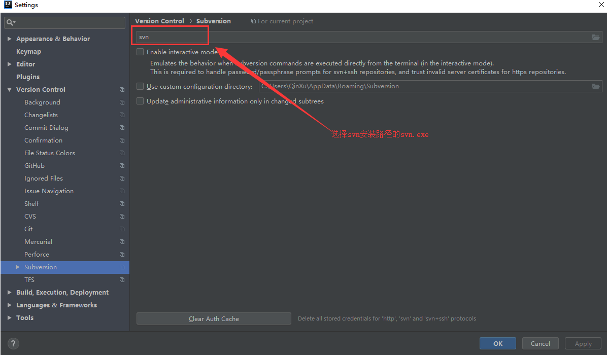
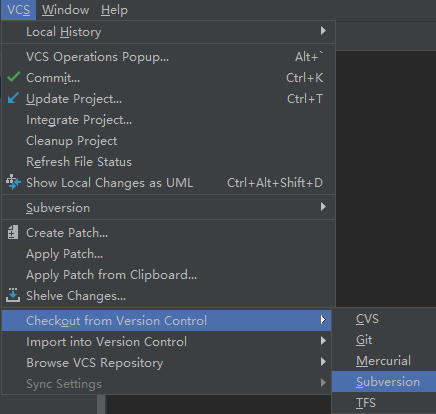
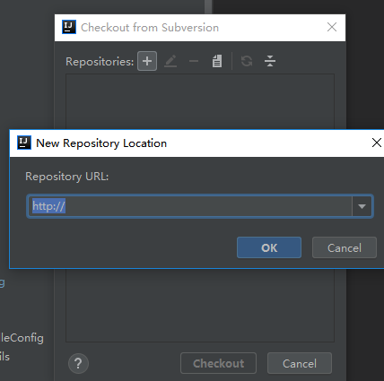
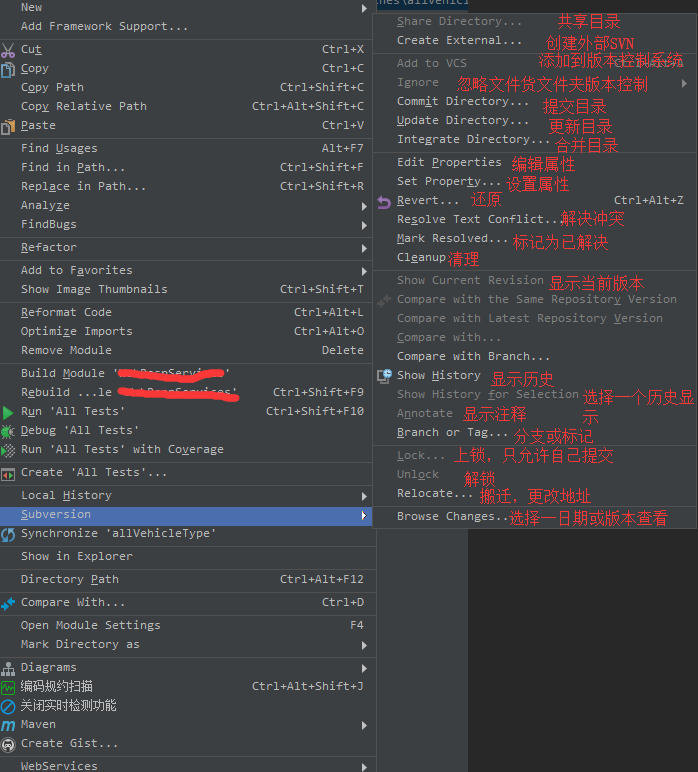
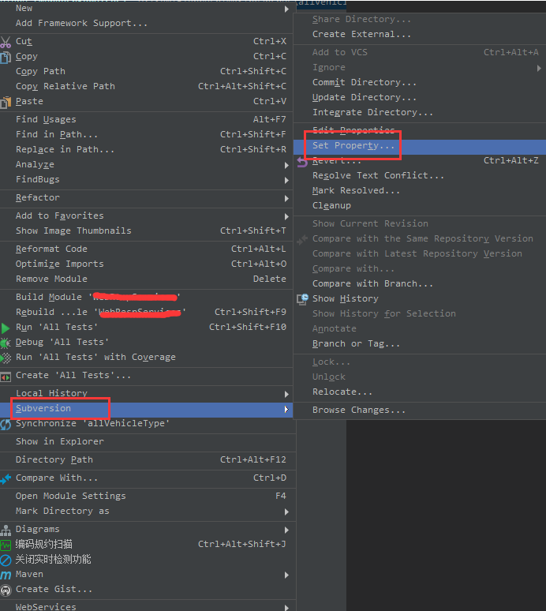
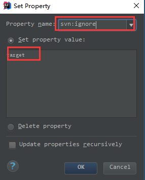
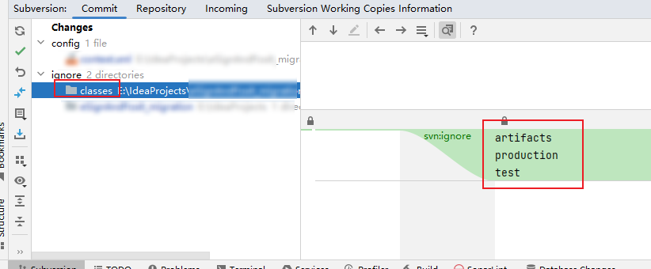
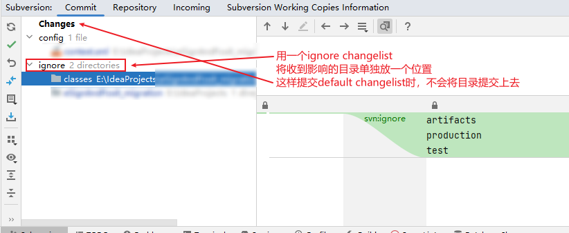

# IDEA集成SVN

----

## idea中配置svn

在idea中使用subversion提交代码需要使用SVN

[SVN下载官网](https://tortoisesvn.net/downloads.html)

可以根据自己电脑下载相应的版本，如果安装了的需要检查下SVN安装目录下边是否有 svn.exe,如果没有idea集成svn的时候会报错，没有的话需要重装svn,`安装的时候勾选 command line client tools` 安装就可以了

安装好svn客户端后，在idea File ——>Settings ——>Version Control ——> Subversion



## 检出svn项目

重启idea，VCS——>Checkout from Version Control ——>Subversion



输入svn的地址check要下载的项目，就OK了



## 提交更新

提交更新项目：选中项目点击右键



## 忽略文件或文件夹

### 忽略文件夹操作

maven项目上传得时候target是禁止上传的，会占用内存：Subversion——>Set Property



忽略target文件夹提交SVN



### idea中忽略文件夹的最佳实践

1.	不要使用递归忽略，因为进行了上述操作后，虽然文件夹底下的文件会被递归忽略，但文件夹本身需要提交一次，如下



2.	所以我们在有需要忽略的文件夹的上一级目录，右键，进行[忽略文件夹操作](/2022/20221108-idea集成svn?id=忽略文件夹操作)，只忽略当前目录下的文件夹，而不是递归

3.	受到影响的文件夹，提交代码的时候是会被提交的，但在生产实际时是不能提交的，那么我们可以创建一个ignore changelist



## 附录

### svn的忽略说明

#### SVN的ignore属性

+	svn通过属性来判断如何处理仓库中的文件。
+	其中有一个属性便是`svn:ignore`。你可以使用 svn propset 来设置svn:ignore在单独的目录
+	你可以给svn：ignore设置一个值，文件名或者是表达式。

例如：
```
svn propset svn:ignore *.class .
```

复制代码这时你使用svn status命令，就看不到。class文件了。如果你也想查看忽略的文件，你可以输入：

```
svn status --no-ignore
```

#### 忽略文件夹

1.	忽略文件夹，千万不要加斜杠。

```
svn propset svn:ignore bin . # yes  
svn propset svn:ignore /bin . # nope   
svn propset svn:ignore bin/ . # nope
```

2.	使用 —R 递归属性配置

使用上面的方法只能忽略当前目录，如果你想要自己的子文件夹也进行忽略 要使用-R进行操作。

```
svn propset svn:ignore -R *.class .
```

#### 忽略多种类型的文件

通过以下的命令你可以忽略 `*.class,*.apk, and Thumbs.db`

```
svn propset svn:ignore -R *.class .  
svn propset svn:ignore -R *.apk .   
svn propset svn:ignore -R Thumbs.db .
```

复制代码或者，你可以这样：

```
svn propset svn:ignore -R "*.class
> *.apk
> Thumbs.db" .
```

#### 使用-F通过配置文件来忽略

如android的，eclipse工程中需要忽略一些文件。 于是新建一个文本文档.svnignore并在其中写入：

```
build
bin  
gen  
proguard  
.classpath  
.project  
local.properties  
Thumbs.db  
*.apk  
*.ap_  
*.class  
*.dex
```

然后执行：

```
svn propset svn:ignore -R -F .svnignore .
```

全局忽略完成。

注意事项
进行上述步骤之后，每个文件夹内的bin，gen等目录都会被忽略。所以起名字的时候不要起和忽略的名字相同的文件。

#### 对忽略进行查看，删除

查看全部

```
svn status --no-ignore
```

查看指定目录

```
svn proplist -v [PATH]
```

删除忽略

```
svn status --no-ignore
```

#### svn还有坑

当你使用add的时候，千万`不要使用`

```
svn add *
```

这样会把忽略中的文件也添加到仓库。

应该使用下面的命令行代替

```
svn add --force .
```

注意是点，千万别写成*

如果在忽略之前，文件已经被add，应先删除

```
svn delete [path]
```

只从svn中忽略，而不删除文件

```
svn delete --keep-local [path]
```

#### svn add后的数据如何 恢复/取消/还原

有时候你发现svn add后，这个提交的数据又不需要了。这时候需要有svn revert来处理了。

比如

```
A testcase/perday.php
```

如何取消呢？

```
svn revert testcase/perday.php
```

会出现下面的提示：

已恢复“testcase/perday.php”

说明脚本已经恢复了到原来的状态，不受SVN 版本控制了。

如何恢复整个目录？？有时候你将整个目录都svn add了，整个目录有不同深度的文件夹，这时候你需要用其他方式来解决

```
svn revert --depth=infinity .
```


## 参考

+	[使用svn进行文件和文件夹的忽略](https://juejin.cn/post/6844903527408467976)
+	[IntelliJ IDEA 集成 SVN](https://www.cnblogs.com/qinxu/p/10278822.html)

