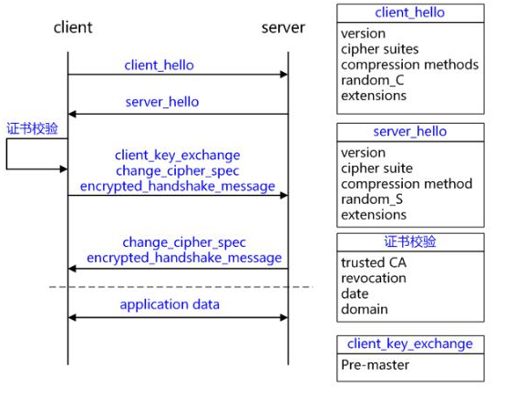

# SNI协议说明

----

## 什么是SNI

1. 服务器名称指示（英语：Server Name Indication，简称SNI）
2. 是用来改善服务器与客户端 SSL (Secure Socket Layer)和 TLS (Transport Layer Security) 的一个扩展
3. 主要解决一台服务器只能使用一个证书(一个域名)的缺点，随着服务器对虚拟主机的支持，一个服务器上可以为多个域名提供服务，因此SNI必须得到支持才能满足需求

## SNI产生背景

SSL以及TLS（SSL的升级版）为客户端与服务器端进行安全连接提供了条件。但是，由于当时技术限制，SSL初期的设计顺应经典的公钥基础设施 PKI(Public Key Infrastructure)设计，PKI 认为一个服务器只为一个域名提供服务，从而一个服务器上也就只能使用一个证书。这样客户端在发送请求的时候，利用DNS域名解析，只要向解析到的IP地址（服务器地址）发送请求，然后服务器将自身唯一的证书返回回来，交给客户端验证，验证通过，则继续进行后续通信。然后通过协商好的加密通道，获得所需要的内容。这意味着服务器可以在 SSL 的启动动阶段发送或提交证书，因为它知道它在为哪个特定的域名服务。
 
随着HTTP服务器开启虚拟主机支持后，每个服务器通过相同的IP地址可以为很多域名提供服务。这种为虚拟主机提供通信安全的简单途径，却经常导致使用了错误的数字证书，因为服务器端无法知道客户端到底请求的是哪个域名下的服务，从而导致浏览器对用户发出警告。
 
不幸的是，当设置了 SSL加密，服务器在读取HTTP请求里面的域名之前已经向客户端提交了证书，也就是已经为默认域提供了服务。但是，一个服务器可能为上千个域名提供服务，不可能将所有证书都发送给客户端，让客户端一一验证，找到与请求域名对应的证书。SNI的设计目的是为了让服务器根据请求来决定为哪个域服务，这个信息通常从HTTP请求头获得。

## SSL/TLS握手

+	熟悉SSL/TLS握手过程的都知道，主要经过以下几个过程
	*	基于RSA握手和密钥交换的客户端验证服务器为示例详解TLS/SSL握手过程。
	*	通过流程的分析能得出`没有SNI的情况下，服务器无法预知客户端到底请求的是哪一个域名的服务。`这个结论



### 1. C->S:client_hello

客户端发起请求，以明文传输请求信息，包含版本信息，加密套件候选列表，压缩算法候选列表，随机数，扩展字段等信息。

+	SSL/STL版本支持的最高TSL协议版本version，从低到高依次 SSLv2 SSLv3 TLSv1 TLSv1.1 TLSv1.2，当前基本不再使用低于 TLSv1 的版本;
+	客户端支持的加密套件 cipher suites 列表， 每个加密套件对应前面 TLS 原理中的四个功能的组合：认证算法 Au (身份验证)、密钥交换算法 KeyExchange(密钥协商)、对称加密算法 Enc (信息加密)和信息摘要 Mac(完整性校验);
+	支持的压缩算法 compression methods 列表，用于后续的信息压缩传输;
+	随机数 random_C，用于后续的密钥的生成;
+	扩展字段 extensions，支持协议与算法的相关参数以及其它辅助信息等，常见的 SNI 就属于扩展字段，后续单独讨论该字段作用。

### 2. server_hello+server_certificate+sever_hello_done
 
+	server_hello, 服务端返回协商的信息结果，包括选择使用的协议版本 version，选择的加密套件 cipher suite，选择的压缩算法 compression method、随机数 random_S 等，其中随机数用于后续的密钥协商;
+	server_certificates, 服务器端配置对应的证书链，用于身份验证与密钥交换;
+	server_hello_done，通知客户端 server_hello 信息发送结束;
 
### 3. 证书校验

+	客户端验证证书的合法性，如果验证通过才会进行后续通信，否则根据错误情况不同做出提示和操作，合法性验证包括如下：
+	证书链的可信性 trusted certificate path，方法如前文所述;
+	证书是否吊销 revocation，有两类方式离线 CRL 与在线 OCSP，不同的客户端行为会不同;
+	有效期 expiry date，证书是否在有效时间范围;
+	域名 domain，核查证书域名是否与当前的访问域名匹配，匹配规则后续分析;

### 4. client_key_exchange+change_cipher_spec+encrypted_handshake_message

+	client_key_exchange，合法性验证通过之后，客户端计算产生随机数字 Pre-master，并用证书公钥加密，发送给服务器;
+	此时客户端已经获取全部的计算协商密钥需要的信息：两个明文随机数 random_C 和 random_S 与自己计算产生的 Pre-master，计算得到协商密钥;
+	enc_key=Fuc(random_C, random_S, Pre-Master)
+	change_cipher_spec，客户端通知服务器后续的通信都采用协商的通信密钥和加密算法进行加密通信;
+	encrypted_handshake_message，结合之前所有通信参数的 hash 值与其它相关信息生成一段数据，采用协商密钥 session secret 与算法进行加密，然后发送给服务器用于数据与握手验证;

### 5. change_cipher_spec+encrypted_handshake_message

+	服务器用私钥解密加密的 Pre-master 数据，基于之前交换的两个明文随机数 random_C 和 random_S，计算得到协商密钥:enc_key=Fuc(random_C, random_S, Pre-Master);
+	计算之前所有接收信息的 hash 值，然后解密客户端发送的 encrypted_handshake_message，验证数据和密钥正确性;
+	change_cipher_spec, 验证通过之后，服务器同样发送 change_cipher_spec 以告知客户端后续的通信都采用协商的密钥与算法进行加密通信;
+	encrypted_handshake_message, 服务器也结合所有当前的通信参数信息生成一段数据并采用协商密钥 session secret 与算法加密并发送到客户端;
 
### 6. 握手结束

客户端计算所有接收信息的 hash 值，并采用协商密钥解密 encrypted_handshake_message，验证服务器发送的数据和密钥，验证通过则握手完成;
 
### 7. 加密通信

开始使用协商密钥与算法进行加密通信。

## SNI 应用

`由以上过程可以知道，没有SNI的情况下，服务器无法预知客户端到底请求的是哪一个域名的服务。`

SNI的TLS扩展通过发送虚拟域的名字做为TSL协商的一部分修正了这个问题

`在Client Hello阶段，通过SNI扩展，将域名信息提前告诉服务器，服务器根据域名取得对应的证书返回给客户端已完成校验过程`。

### curl

Linux中主要的网络交互工具，curl 7.18.1+ & openssl 0.9.8j+ 可以支持SNI，CentOS6.5及以下都是curl 7.15 不支持SNI，curl 7.21.3 又支持了–resolve 参数，可以直接定位到IP地址进行访问，对于一个域名有多个部署节点的服务来说，这个参数可以定向的访问某个设备。基本语法为：

Example:

```
curl -k -I --resolve www.example.com:80:192.0.2.1 https://www.example.com/index.html
```

### WireShark抓包验证SNI

1.	使用curl7.15 （不支持SNI）抓包结果：

20221115091758.png

2.	使用curl7.43（支持SNI）抓包结果：

20221115091821.png

可以看到，使用curl7.15抓包得到的数据无SNI扩展，而是用curl7.43抓包得到的数据，包含SNI扩展，其中包含host信息。

## 参考

+	[SNI(Server Name Indication)](https://blog.csdn.net/makenothing/article/details/53292335)


