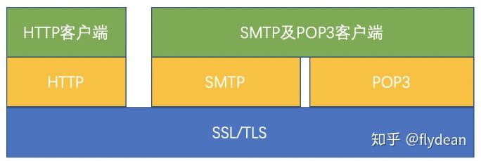
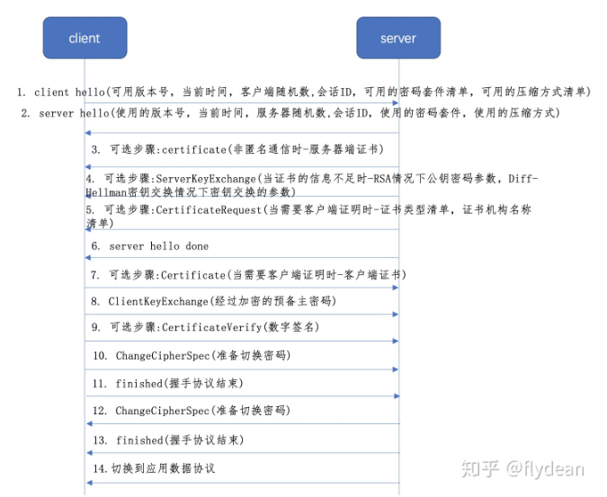
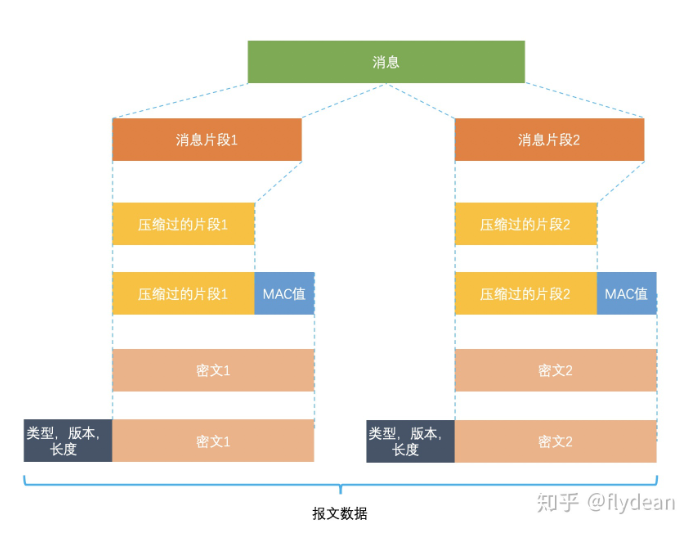

# SSL和TLS协议说明

------

## SSL/TLS是什么

+	`SSL/TLS是一种密码通信框架`
+	他是世界上使用最广泛的密码通信方法。SSL/TLS综合运用了密码学中的对称密码，消息认证码，公钥密码，数字签名，伪随机数生成器等，可以说是密码学中的集大成者。
+	SSL(Secure Socket Layer)安全套接层，是1994年由Netscape公司设计的一套协议，并与1995年发布了3.0版本。
+	TLS(Transport Layer Security)传输层安全是IETF在SSL3.0基础上设计的协议，实际上`相当于SSL的后续版本`。

## SSL/TLS的应用

SSL/TLS是一个安全通信框架，上面可以承载HTTP协议或者SMTP/POP3协议等。

## TLS协议的架构

+	TLS主要分为两层
	*	底层的是TLS记录协议，主要负责使用对称密码对消息进行加密。
	*	上层的是TLS握手协议，主要分为握手协议，密码规格变更协议和应用数据协议4个部分。
		-	握手协议负责在客户端和服务器端商定密码算法和共享密钥，包括证书认证，是4个协议中最最复杂的部分。
		-	密码规格变更协议负责向通信对象传达变更密码方式的信号
		-	警告协议负责在发生错误的时候将错误传达给对方
		-	应用数据协议负责将TLS承载的应用数据传达给通信对象的协议。
		
### 握手协议

握手协议是TLS协议中非常重要的协议，通过客户端和服务器端的交互，和共享一些必要信息，从而生成共享密钥和交互证书。

不说话，先上图：

接下来我们一步步的介绍每一步的含义：

#### 1. client hello

客户端向服务器端发送一个client hello的消息，包含下面内容：

+	可用版本号
+	当前时间
+	客户端随机数
+	会话ID
+	可用的密码套件清单
+	可用的压缩方式清单

`我们之前提到了TLS其实是一套加密框架，其中的有些组件其实是可以替换的，这里可用版本号，可用的密码套件清单，可用的压缩方式清单就是向服务器询问对方支持哪些服务`。

客户端随机数是一个由客户端生成的随机数，用来生成对称密钥。

#### 2. server hello

服务器端收到client hello消息后，会向客户端返回一个server hello消息，包含如下内容：

+	使用的版本号
+	当前时间
+	服务器随机数
+	会话ID
+	使用的密码套件
+	使用的压缩方式

使用的版本号，使用的密码套件，使用的压缩方式是对步骤1的回答。

服务器随机数是一个由服务器端生成的随机数，用来生成对称密钥。

#### 3. 可选步骤:certificate

服务器端发送自己的证书清单，因为证书可能是层级结构的，所以处理服务器自己的证书之外，还需要发送为服务器签名的证书。

+	客户端将会对服务器端的证书进行验证。如果是以匿名的方式通信则不需要证书。

#### 4. 可选步骤:ServerKeyExchange

+	如果第三步的证书信息不足，则可以发送ServerKeyExchange用来构建加密通道。
+	ServerKeyExchange的内容可能包含两种形式：
+	如果选择的是RSA协议，那么传递的就是RSA构建公钥密码的参数（E，N）。我们回想一下RSA中构建公钥的公式：密文=明文^E\ mod\ N密文=明文EmodN， 只要知道了E和N，那么就知道了RSA的公钥，这里传递的就是E，N两个数字。具体内容可以参考[RSA算法详解](http://www.flydean.com/rsa/)
+	如果选择的是Diff-Hellman密钥交换协议，那么传递的就是密钥交换的参数，具体内容可以参考[更加安全的密钥生成方法Diffie-Hellman](http://www.flydean.com/diffie-hellman/)

#### 5. 可选步骤:CertificateRequest

如果是在一个受限访问的环境，比如fabric中，服务器端也需要向客户端索要证书。

如果并不需要客户端认证，则不需要此步骤。

#### 6. server hello done

服务器端发送server hello done的消息告诉客户端自己的消息结束了。

#### 7. 可选步骤:Certificate

对步骤5的回应，客户端发送客户端证书给服务器

#### 8. ClientKeyExchange

+	还是分两种情况：
	*	如果是公钥或者RSA模式情况下，客户端将根据客户端生成的随机数和服务器端生成的随机数，生成预备主密码，通过该公钥进行加密，返送给服务器端。
	*	如果使用的是Diff-Hellman密钥交换协议，则客户端会发送自己这一方要生成Diff-Hellman密钥而需要公开的值。具体内容可以参考更加安全的密钥生成方法Diffie-Hellman，这样服务器端可以根据这个公开值计算出预备主密码。

#### 9. 可选步骤:CertificateVerify

客户端向服务器端证明自己是客户端证书的持有者。

#### 10. ChangeCipherSpec(准备切换密码)

ChangeCipherSpec是密码规格变更协议的消息，表示后面的消息将会以前面协商过的密钥进行加密。

#### 11. finished(握手协议结束)

客户端告诉服务器端握手协议结束了。

#### 12. ChangeCipherSpec(准备切换密码)

服务器端告诉客户端自己要切换密码了。

#### 13. finished(握手协议结束)

服务器端告诉客户端，握手协议结束了。

#### 14. 切换到应用数据协议

这之后服务器和客户端就是以加密的方式进行沟通了。

### 主密码和预备主密码

上图中的步骤8生成了预备主密码，主密码是根据密码套件中定义的单向散列函数实现的伪随机数生成器+预备主密码+客户端随机数+服务器端随机数生成的。

主密码主要用来生成称密码的密钥，消息认证码的密钥和对称密码的CBC模式所使用的初始化向量。详见[分组密码和模式](http://www.flydean.com/block-cipher-mode/)

### TLS记录协议

TLS记录协议主要负责消息的压缩，加密及数据的认证：

消息首先将会被分段，然后压缩，再计算其消息验证码，然后使用对称密码进行加密，加密使用的是CBC模式，CBC模式的初始向量是通过主密码来生成的。

得到密文之后会附加类型，版本和长度等其他信息，最终组成最后的报文数据。

## 来源

+	[一篇文章让你彻底弄懂SSL/TLS协议](https://zhuanlan.zhihu.com/p/133375078)

