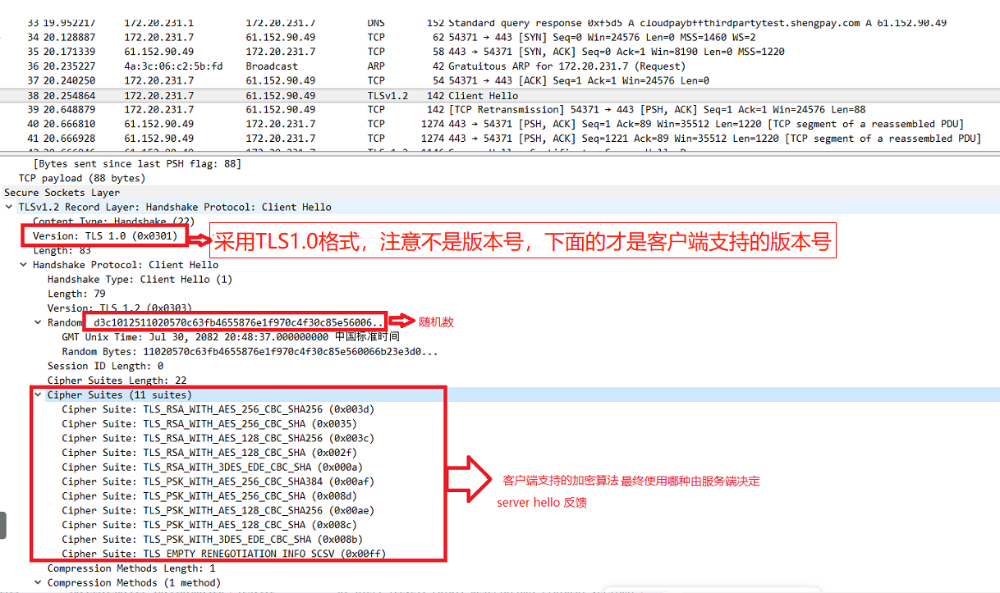

# Wireshark抓包TLS协议栏显示版本不一致问题

----

## TLS协商过程

### 客户端 client hello

生成随机数（client random）和支持的加密方法 给 服务器
*	第一个握手包，因为是握手过程，这个消息里包含了一个客户端生成的随机数 Random1、客户端支持的加密套件（Support Ciphers）和 SSL Version 等信息，因为密钥还没协商，这里还是使用明文传输，注意是明文传输，记录协议的数据载体就是明文的 SSL 握手协议。
*	这里可能大家就会疑惑了,明文传输为什么wireshark协议栏会写TLS版本？稍后解释
	

这里要注意，数据包使用的TLS版本一定要点开报文里的Handshake Protocol下的version来判断，这个字段才真正代表客户端`支持的最高版本TLS协议`。

下图可以看到，Protocol 列, 无论是 client hello 还是 server 的 response 都显示为 TLSv1.2, 其实如果查看 client 的详细版本, 会发现内部其实是 TLSv1.0. 如果不仔细查看, 可能会得出错误的结论。

### 服务器 返回server hello

+	双方使用的加密方法、使用的tls版本号和一个随机数
+	加密套件（cipher suite）：TLS+密钥交换算法+加密算法+认证算法
+	数字证书以及自身通过某种算法生成的参数

### client根据server返回值（随机数，加密套件）交换密钥

服务端收到这个报文后，会使用自己的私钥解开这个随机数。在这个阶段过后，服务端和客户端都有三个随机数：客户端随机数、服务端随机数和预备主密钥。在服务端收到了 Client Key Exchange 消息后，两端都按照相应的算法生成了主密钥，加密密钥交换完成。
后续分别通知对方，后续消息会加密后发送。

## 解释为什么 client hello 显示为TLSv1

除了这个，在测试是还发现另外两个有趣的现象，抓包时看到client hello包为TLSv1，但是过了一会就不见了，发现原来的v1变成了1.2。
把抓到的包保存下来，过一段时间再次打开，原来的v1又不见了，变成了1.2。
为什么会出现这种情况呢? 这要回到 wireshark 的 SSL dissector 的源码, 从源码看, 对于这个 client hello 协议版本的判断, 是即根据 client 又根据 server 两边做判断的. 正常情况下, 两端都是一致的, 或能正常协商的情况下, 依照服务端版本取值的. 如果服务端没回应, 这个时候, 是以 client 端的 client hello 的版本做设置的. 我们这里出现的这个问题, 就是属于服务端有回应, 是不同的版本, 导致 wireshark 的显示为和 client 真正发的不一致的问题.

官方网站有个这样的[问题](https://www.wireshark.org/lists/wireshark-users/201701/msg00004.html)

结论

+	client hello本来就是明文传输，TLSv1只是wireshark在根据 client 又根据 server 两边的结果填充；
+	在用wireshark抓包测试SSL、TLS版本的时候，应主要关注application data包是否采用TLS1.2以上版本，因为这装载的是数据。

## TLS1.3版本怎么看

legacy version和supported_versions
在TLS1.3之前的版本中，legacy version用于进行版本协商，并代表客户端支持的最高版本。在TLS1.3中客户端在supported_versions扩展名中添加客户端所支持的TLS版本列表，与此同时，legacy_version必须设置为0x0303，即TLS1.2的版本号。
如图所示，这是一个TLS 1.3 的client hello，其version是0x0303,它有一个supported_versions的扩展字段，里面支持的最高协议是TLS1.3(0x0304)

## 来源

+	[Wireshark抓包TLS协议栏显示版本不一致问题](https://blog.csdn.net/weixin_43487849/article/details/125500564)
+	[官方对应的问题](https://www.wireshark.org/lists/wireshark-users/201701/msg00004.html)
+	[Wireshark中TLS版本显示说明](https://blog.csdn.net/s2603898260/article/details/122633956)
