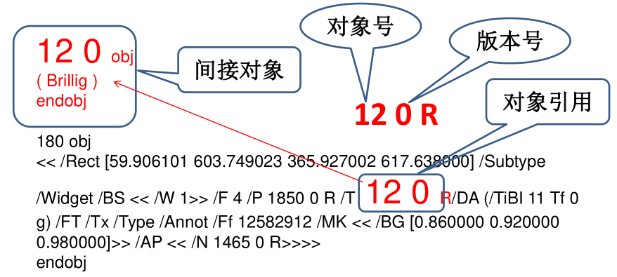

# PDF内置对象

----

# PDF文件支持8种基本类型对象

+	布尔指
+	整数和实数
+	字符串
+	名称
+	数组
+	字典
+	对象
+	流

# 布尔对象(Boolean object)

只有两个值：true和false

# 数值对象(Number object)

+	PDF提供两种数字对象：整数和实数（含负数），实数必须以小数点的形式出现。
+	注意：PDF不支持非十进制基数（比如16#FFFE）或指数格式（比如6.02E23）的数字

# 字串对象(String object)

+	字符串对象有两种表示法
	*	一般可见字符用括号()
	*	16进制表示法用角号<>表示

例如：

```
(This is a string)

<4E6F762073686D6F7A206B6120706F702E>
```

## 文字串（LiteralStrings）

文字串是用含在圆括号内的任意字符编写成的。任何一个字符都可以出现在串里面，除了必需做特别处理的 单括号 和反斜线符号，串中成对的括号不需要特别处理
如果一行太长写不下去，则可以用反斜线（backslash，\）做为续行动作

例如：

```
(These \
two strings \
are the same.)

等于下面这行：

(These two strings are the same.)
```

另外，也可使用反斜杠做为转义字符，转义字符如下表所示，若出现没有在下表中的转义字符，将会被忽略不显示。

| 转义字符 |                    说明                   |
|----------|-------------------------------------------|
| \n       | 换行(Line feed)                           |
| \r       | 归位(Carriage return)                     |
| \t       | 定位(Horizontal tab)                      |
| \b       | 倒退(Backspace)                           |
| \f       | 跳页(Form feed)                           |
| \(       | 左括号(Left parenthesis)                  |
| \)       | 右括号(Right parenthesis)                 |
| \\       | 反斜杠(Backslash)                         |
| \ddd     | 8进位转换字符(Character code ddd (octal)) |


其中8进位转换字符并不一定要3个数字字符，只要遇到非0-7的数字，便视为数字结束（但一般建议是补足3个）。必须注意的是，8进位转换出来的字符是允许ASCII 0的NULL字符的。另外，在()里的%并不视为批注起始字符，而是视为字符串资料的一部份，同时在()里若还有成对的()，可不必使用转义字符，在处理时要特别注意此一情况。

## 十六进制串（Hexadecimal Strings）

至于16进制的资料必须是成对的，若出现不成对的情况，则必须自动补0，例如<901FA>，需算成有3个byte的字符串，分别为90、1F及A0。字符串里的空白字符（比如空格键，Tab键，回车键，行填充符，和表格填充符）需略过

# 名称对象(Name object)

+	名称对象的`起始字符为/`，其后紧接着名称字符串（大小写有关）。
+	其不能出现空白字符（参照下表"空白字符"）。
+	名称字符串里的字符必须在ASCII 33～255之间，且`不能是%()<>[]{}/#这几个字符`。
+	如果名称中希望含有其它不合法的字符时（ASCII 0的NULL字符除外），必须采用#加两个16进位数字的方式来表示字符码。
	*	例如:想加入一个空白字符，则可用/Adobe#20Green，实际名称便是Adobe Green。

| 十进制 |         名字        |
|--------|---------------------|
|      0 | NULL（NUL）         |
|      9 | Tab（HT）           |
|     10 | Line feed（LF）     |
|     12 | Form feed（FF）     |
|     13 | Carriage return(CR) |
|     32 | Space(SP)           |

# 数组对象(Array object)

+	一个PDF数组的元素可以是数字，串，字典或其它对象组合，以及其它数组；
+	一个数组被写成是含在方括号`[and ]`中的一序列对象；
+	PDF只支持一维数组。更高维的数组可以用数组嵌套数组的方式来构建。

例子

```
[549 3.14false (Ralph) /SomeName]
```

# 字典对象(Dictionary object)

+	字典对象是一个包含多部分对象的组合表格，称为字典条目
+	每个条目的第一个元素为关键字，第二个元素是值
+	关键字必需是一个名称值可以为任何对象
	*	值为空值的字典条目相当于无条目
	*	注意：`同一个字典中的两个条目不可以有相同的关键字`。如果`一个关键字多次出现，那么它的值是未给定定义的`
+	字典对象是构建PDF文档最主要的部分。
	*	由于字典中的每个条目指定一个属性的名称和值，这样它们就经常被用来把复杂对象的属性聚集并联系在一块


字典的编写方式是：一序列含在书名号中的关键字与值的配对。比如：

```
<</Type /Example

/Subtype/DictionaryExample
/Version0.01
/IntegerItem12
/StringItem(a string)
/Subdictionary<< /Item1 0.4
/Item2true
/LastItem(not!)
/VeryLastItem(OK)

>>
>>
```

注意：不要混淆书名号与单括号`< and >`， 单括号是分隔一个十六进制串的

# 流对象(Stream object

流对象主要记录一连续的任何资料（例如影像资料），其格式如下：

```
dictionary
stream
...Zero or more bytes...
endstream
```

```
4 0 obj
<<
/Length 23
>> 
stream
1 0 0 RG
0 792 m
612 0  l S
endstream
endobj
```

所有的流都必须是间接引用对象，而且流字典也必须是一个间接引用对象。

紧随着流字典的关键字stream后面必须跟一个行末标识符（要么包含一个回车符和是行末填充符， 要么只是一个行末填充符），不会是单独一个回车符。构成流的序列字节，位于关键字 stream 和endstream 之间，流字典指定确切的流的信息。

流字典通用属性

|   KEY关键字  |     TYPE 类型      |                                                           说明                                                           |
|--------------|--------------------|--------------------------------------------------------------------------------------------------------------------------|
| Length       | Integer            | （必选值）从关键字stream之前的行开始部分到关键字endstream之前的最后字节之间的字节编号                                    |
|              |                    | （endstream之前也有可能有附加EOL标识，它不含在计数之内，也不是流数据逻辑部分。）                                         |
| Filter       | Name /array        | 指明处理流的过滤器的名称                                                                                                 |
| DecodeParms  | 字典或数组         | Filter指明的过滤器的参数                                                                                                 |
| F            | File specification | 流资料所在的文件名称，此时该流资料应被略过                                                                               |
| FFilter      | name or array      | 同Filter，但作用于F制定的流资料                                                                                          |
| FDecodeParms | 字典或数组         | 用来说明FFilter指明的过滤器的参数                                                                                        |
| DL           | Integer            | （1.5以后）一个表示 解码（无过滤器）流中字节编号的非负整数。                                                             |
|              |                    | 比如，它可以被用来测定是否有足够磁盘空间将流读取到一个文件。这个值只被看成是一个线索；某些流过滤器，不可能准确测定这个值 |


# 空对象(Null object)

以null来表示

# 间接对象(indirect object)

+	间接对象可以理解成PDF对象的封装
+	PDF文件中的任何对象都可以被标记为间接对象




 


