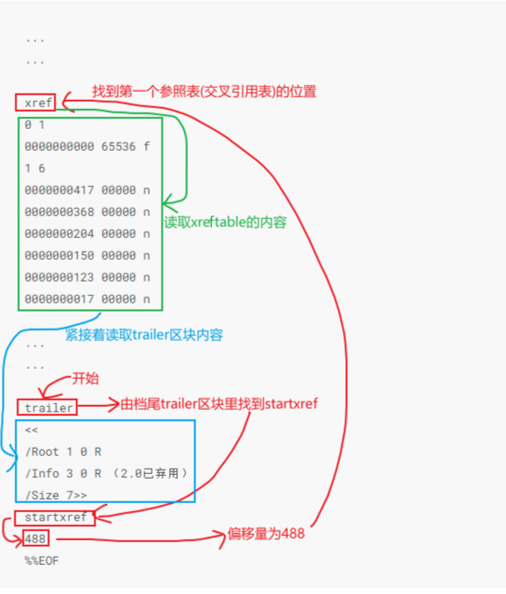

# PDF文件格式

----

# 标准的pdf文档格式

+	header：内含版本资讯
+	body：内含实际的文件内容
+	cross-reference table（简称xref table）：内含对象参照的相关资讯
+	trailer：内含指向xref table、body区的重要相关资讯

# PDF区域内容呈现方式

+	PDF是以行的方式(除了流对象)来呈现资料的，每一行的结束字符，可以是Carriage Return（ASCII 13）、也可以是Line Feed（ASCII 10）、或是两者的组合（ASCII 13紧接着ASCII 10）
+	流对象（stream object）的内容，并非以行的方式呈现，必须另行处理
+	各行内的资料，若遇到%字符，表示该行从%字符后面的所有的资料都是注解，必须加以略除(流对象除外)
+	PDF里的资料是大小写有关的

## PDF文件头(header)

PDF文件的首行就是header部分，声明PDF文件的版本号header只有一行注解文字，且固定以`%PDF-`开头，后面紧接着PDF的版本

例如：

```
%PDF-1.4
```

## 文件体（body）

+	一个PDF文件的文件体包括表示文档内容的对象
+	对象是文档的基本类型，表示文档的各个组成部分，如字体，页面，和实例图形
	*	文件体由一系列间接对象组成，包含了文档内容
	*	文档根节点(catalog)，书签，页面等信息都在文件体
+	从PDF1.5开始，主干部分也可以包含对象流，每个对象流都包含一系列间接对象

## 交叉引用表（Cross-ReferenceTable）

+	交叉引用表是文件体`所有间接对象的索引表`
+	交叉引用表建立了间接对象编号与实际物理位置的对应关系
+	交叉引用表的作用是减少查找间接对象耗费的时间

交叉引用表包含的信息允许对文件中的间接对象进行随意访问，以便不需要阅读整个文件即可定位任何特殊对象了。（从PDF1.5开始，某些或所有的参照表信息也可以被含在参照流中。

交叉引用表是PDF文件唯一有固定格式的一部分，每个交叉引用表都从一个包含关键字xref的行开始。跟着这个行的是一个或多个参照子部分，这些分部可以以任何顺序出现。子部分的构造有益于逐步更新，因为它允许一个新的参照部分附加到PDF文件中来，而包含的选项紧紧只用于已经被附加或删除的对象。对一个从未被更新过的文件，参照部分只包含一个子部分，它的对象编号从0开始。

每个参照表项目固定20 byte

格式如下

|  Byte |                                                                        内容                                                                       |
|-------|---------------------------------------------------------------------------------------------------------------------------------------------------|
| 0-9   | 对象所在的文件位置，靠右，不足时补0                                                                                                               |
| 10    | 空白字符                                                                                                                                          |
| 11-15 | generation number，靠右，不足时补0，表示对象的修改次数,generation number<=65535，一但达到这个数字，该对象编号便不能再使用，而必须另行增加一个编号 |
| 16    | 空白字符                                                                                                                                          |
| 17    | n表示对象使用中，f表示对象未被使用（free）                                                                                                        |
| 18-19 | 空白与换行字符                                                                                                                                    |


以下便是一个xref table的例子：

```
xref                           
0 1 						  //第一个对象ID为0， 包含一个对象
0000000023 65535 f            //偏移量23 始终包含一个生成号为65535的条目  f表示空闲

3 1
0000025324 00000 n

21 1
0000025518 00002 n            //对象从在使用变成空闲时，n变为f，修改次数增加1

22 1
0000025632 00000 n

23 1
0000000024 00001 f            //对象由空闲变成在使用时，只是f变为n，修改次数不增加

24 1
0000000000 00001 f

36 1
0000026900 00000 n            //交叉引用表的最后一次修改次数总是0
```

+	这个Cross-ReferenceTable 有两个参照子部分：
	*	第一个参照子部分是指出了对象0,1,2在文件中的位置（3,127,0）以及说明0,2对象未被使用（f）。
	*	第二个参照子部分是指出了对象5在在文件中的位置（4346），以及说明了对象正在使用（n）

## 文件尾（trailer）

+	PDF文件跟踪器使得应用程序在阅读文件时能够快速的搜索到参照表和某个特殊对象的位置。
+	`应用程序应从尾段开始阅读PDF文件`。
+	文件的最后一行只包含文件的结束符号，即%%EOF。
+	前面两行包括关键字`startref`和`字节偏移值(从文件开始部分到最后面参照表部分中的关键字xref的开始部分)`。
+	放置在startref行前面的是`跟踪器字典`，由关键字trailer和紧跟后面的<<键值对..>>组成

trailer区块的内容如下：

```
xref
trailer 										%关键字,表明是跟踪器字典
<<  											%<<键值对,具体内容为trailer资料>>
/Size  22
/Root  2 0 R 
/Info  1 0 R （2.0已弃用）
/ID  [  <  81b14aafa313db63dbd6f981e49f94f4 > 
< 81b14aafa313db63dbd6f981e49f94f4 >  ] 
>>
startxref 										%关键字,表明底下一行是偏移量
18799											%xref table开始的文档位置
%%EOF 											%结束符号
```

trailer资料主要由`{/属性名称 属性值}`所组成，以下便是一个例子：

```
/Size 22
/Root 2 0 R
/Info 1 0 R
/Prev 408
```

|   KEY   |    TYPE    | 是否必选 |                                VALUE                                 |
|---------|------------|----------|----------------------------------------------------------------------|
| Size    | integer    | 必选项   | 整个PDF文件的对象个数                                                |
| ID      | array      | 否       | 分别表示旧ID与新ID                                                   |
| Prev    | integer    | 否       | 如果有，后跟数字表示下一个交叉引用表的位置；没有，表示最后一张交叉表 |
| Root    | dictionary | 必选项   | 文件里存放Catalog的对象编号                                          |
| Info    | dictionary | 否       | 表示文件里的摘要资讯所在对象编号                                     |
| Encrypt | dictionary | 否       | 表示PDF档有加密，其后接的词典资料，便是用来解密用的                  |


### 整个读取trailer和xref table的过程应为:

1.	由档尾trailer区块里找到startxref，取得第一个参照表开始的文档位置
2.	移到该参照表的位置，开始读取xref table内容
3.	读取后面紧接着的trailer区块内容
4.	找寻其后紧接的trailer区块中是否有Prev属性，没有即结束
5.	如果有Prev，则其后的数字视为下个xref table的文档位置，回到步骤2



## 对象流(Object Streams)

+	PDF1.5引进了一个全新的流概念，对象流，它包含了一系列PDF对象。
+	对象流的`用途是允许压缩更多数目的PDF对象，以此来大量减少PDF文件大小`。
+	流中的对象都是指压缩对象。

任何一个PDF对象都可以出现在对象流，以下几种情况例外
+	流对象
+	生成编号非0的对象
+	一篇文档的加密字典
+	表示对象流字典中Length选项值的对象

除了流的标准关键字外，对象流字典还描述了包含一下选项

| KEY关键字 | TYPE 类型 | 可选 |                     说明                     |
|-----------|-----------|------|----------------------------------------------|
| Type      | Name      | 必选 | Objstrm，表示该对象含有对象流                |
| N         | Integer   | 必选 | 对象流中压缩对象的个数                       |
| First     | Integer   | 必选 | 首个压缩对象的字节偏移量（在解压后的流中）   |
| Extends   | Stream    | 可选 | 一个引用对象流，当前对象留被认为是一个扩充流 |


例子解析：

/n 3: 说明对象流中对象的个数为3

/first24 :说明对象流中第一个压缩对象在流中的位置（解压缩后的）

11 012 547 13 665：对象流中包含的3个对象11,12,13，并指出了对象相对于流中第一个对象的的偏移地址（0,547,665）

## 参照流

从PDF1.5开始，参照信息被存储在参照流中而不是参照表中。参照流提高以下优势：

+	更简洁紧凑的表示参照信息。
+	可以访问存储在对象流中的压缩对象，并允许以后加入新的参照选项类型。

参照流是流对象，包含一个字典和一个流对象，参照流字典相当于trailer，

流对象相当于参照表。

如以下例子所示：
+	注意现在紧跟着关键字startxref的值是参照流的偏移值而不是关键字xref。
+	对于那些全部用参照流的文件（PDF1.5及以上）关键字xref和跟踪器不再被使用。
+	因此，除了startxref address %%EOF片断和标注特例外，一个PDF1.5的文件完全是一序列的对象。

### 参照流字典 Cross-Reference Stream Dictionary

除了对所有流和trailer字典的通用选项外，参照流还包含下表所示的选项

|  KEY  |   TYPE  |                                                   说明                                                  |
|-------|---------|---------------------------------------------------------------------------------------------------------|
| type  | name    | 值必须是xref（说明该流为参照流）                                                                        |
| size  | integer | 说明参照表中对象的个数                                                                                  |
| index | array   | 一个数组，第一个值表示为第一个对象的编号，第二个值表示参照流中对象的总数                                |
| prev  | integer | 从文件开始部分到先前参照流的开始部分的子节偏移值。     本选项与跟踪器字典（表3.13）中的Prev选项作用相同 |
|       |         | （只有当文件有多个参照流的时候才会呈现；在混合参照文件（pdf1.4）中没有意义）                            |
| W     | array   | 无                                                                                                      |


### 参照流数据 Cross-Reference Stream Data

参照流中的每个选项都有一个或多个数据域，第一个数据域指派选项类型，在PDF1.5中，只允许类型0，1，和2。其它的值都被看成是 空值对象引用，这样就允许以后定义新的选项类型

数据以渐进的数据域编号编写；每个数据域的长度受W选项中对应的值制约，每个为位置对应的值说明：

| key | field |                   说明                  |
|-----|-------|-----------------------------------------|
|   0 |     1 | 值为0，表示该对象闲置                   |
|   0 |     2 | 下一个闲置对象的对象编号                |
|   0 |     3 | 对象编号被再次使用的生成编号            |
|   1 |     1 | 值为1，对象正在使用中（不是压缩的对象） |
|   1 |     2 | 对象的偏移值，从文件的开始部分开始      |
|   1 |     3 | 对象的生成编号，缺省值为：0             |
|   2 |     1 | 值为2，对象为压缩对象                   |
|   2 |     2 | 存储对象的对象流的对象编号              |
|   2 |     3 | 对象流中对象的属性                      |


# 实例分析

```
%PDF-1.4 																		%以”%PDF-“开头，后面紧接着PDF的版本号1.4，标识该实例文件尾PDF1.4版本

%																				%The main part of the PDF file: all indirect objects
2 0 obj                                     									%Object对象，其中2是Obj顺序号，0是Obj版本号
<</Length 78/                        											%流对象的长度
/Filter /FlateDecode                          									%流对象的压缩方式为zip 的压缩算法
>> 
stream                                    										%流对象
x3P0T5T0P04_\\N!\f
!)\_@i__CPH!$KR3$_$___a__
endstream                              											%流对象结束标志
endobj
4 0 obj

<</Parent 3 0 R              													%其父对象号为3 以及Pages对象
/Contents 2 0 R             													%页面内容对象的对象号为2
/Type /Page
/Resources                       												%该页包含的资源
<</ProcSet [/PDF /Text /ImageB /ImageC /ImageI]
/Font<</F1 1 0 R>>                              								%字体的类型
>> 
/MediaBox[0 0 595 842]                    										%页面显示大小，以像素为单位
/Rotate 90>>                                         							%旋转90度
endobj

1 0 obj
<</BaseFont/Helvetica/Type/Font/Encoding/WinAnsiEncoding/Subtype/Type1>>
endobj

3 0 obj
<</Type/Pages              														%对象类型为pages
/Count 1                                  										%页码数量为1
/Kids[4 0 R]>>                         											%kids 对象说明它的子页对象为4
endobj

5 0 obj
<</Type /Catalog                   												%对象类型为目录对象(Catalog)
/Pages 3 0 R>>
endobj

6 0 obj
<</Producer(iText 5.3.2 2000-2012 1T3XT BVBAAGPLversionAGPLversion)	    		%PDF制造程序
/ModDate (D:20170117135923+08'00')                                            	%pdf修改时间
/CreationDate (D:20170117135923+08'00')>>                                 		%pdf创建时间
endobj

xref                    %表示交叉引用表开始
0 7                     %0 表明引用表描述的对象从0 开始，7 说明共有7 个对象
0000000000 65535 f      %一般pdf 都是以这行开始交叉引用表的，起始地址0 和产生号
0000000326 00000 n     
0000000015 00000 n
0000000414 00000 n
0000000159 00000 n
0000000465 00000 n
0000000510 00000 n

trailer                 														%说明文件尾对象开始
<</Root 5 0 R           														%说明根对象号为12
/ID [<5b8ddc49e2b4b9f1e7f7ebeb1a341470><181621ccb8119e9a276d185458fd2c41>]       %分别表示旧ID与新ID
/Info 6 0 R            															%表示文件里的摘要资讯所在对象编号
/Size 7                  														%7说明PDF 文件对象数目
>> 
startxref
663                     %663 为交叉引用表的偏移地址，此处为十进制表示
%%EOF                   %结束标识
```


# 参考

+	[PDF文档结构说明](https://blog.csdn.net/lamb7758/article/details/56015876)


