# PDF图形对象和颜色空间

----

# 几个例子

```
%PDF-2.0				% HEAD, to show PDF version

%BODY
1 0 obj						% from Root
<</Type /Catalog			% Catalog dictionary
/Pages 2 0 R				% the indirect object of PageTree, is 2 0 
>>
endobj

2 0 obj						% from Pages
<</Type /Pages				% PageTree dictionary
/Kids [3 0 R 5 0 R 7 0 R]				% subnode of PageTree, include 3 0
/Count 3					% count of Pages
>>
endobj


%%%%%%%%%%%%%%%%%%%%%%%%%%%%%%%
%%文本对象的绘制
%%%%%%%%%%%%%%%%%%%%%%%%%%%%%%%

3 0 obj						% from PageTree Kids
<</Type /Page		% Page dictionary
/Parent 2 0 R			% Parent is 2 0
/MediaBox [0 0 600 800]	% rectangle to show the Page
/Contents 4 0 R		% the indirect object of Page Contents, is 4 0 
>>
endobj

4 0 obj
<<
/Length 65			%the size of stream
>>
stream
q					%图形入栈
BT	%开始一个文本对象
/Font1 800 Tf	%Tf:set the text font
2 Tr 		%tr:设置渲染模式
0 0 1 RG 	%设置描边颜色的颜色空间和颜色
20 w 		%设置线条宽度
(A) Tj		%Tj:绘制文本
ET 			%ET:结束一个文本对象
Q					%图形出栈
endstream
endobj

%%%%%%%%%%%%%%%%%%%%%%%%%%%%%%%
%%路径对象绘制
%%%%%%%%%%%%%%%%%%%%%%%%%%%%%%%

5 0 obj
<</Type /Page
/Parent 2 0 R
/MediaBox [0 0 600 800]
/Contents 6 0 R
>>
endobj

6 0 obj
<<
/Length 65
>>
stream
q
50 w 	%设置线条宽度
0 0 1 RG 	%设置描边颜色和描边颜色空间
1 1 0 rg 	%设置填充颜色和填充颜色空间
100 100 300 300 re 	%re:构造一个矩形
B 	%填充路径,然后描边
Q
endstream
endobj

%%%%%%%%%%%%%%%%%%%%%%%%%%%%%%%
%%图像的绘制
%%%%%%%%%%%%%%%%%%%%%%%%%%%%%%%
7 0 obj
<</Type /Page
/Parent 2 0 R
/MediaBox [0 0 600 800]
/Contents 8 0 R
>>

8 0 obj
<<
/Length 100
>>
stream

q
240 0 0 240 150 400 cm 	%cm:变换矩阵
/Image2 Do 				%Do:图像绘制操作符,绘制图像
Q
endstream
endobj


xref							% XREF, this file has no xref


trailer						% TRAILER, file begin position
<</Size 0				% Size of xref, this file has no xref, so it is 0
/Root 1 0 R				% the indirect object of Root, is 1 0
>>

startxref
0

%%EOF					% End of file 
```

## 文本对象的绘制

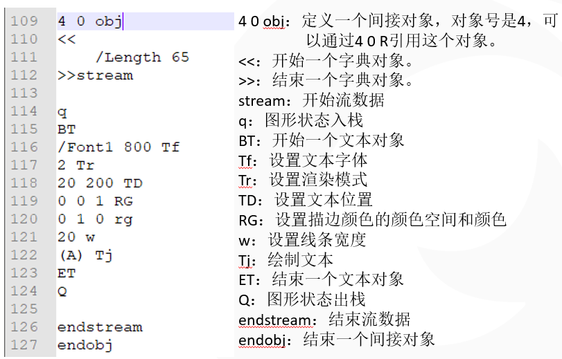

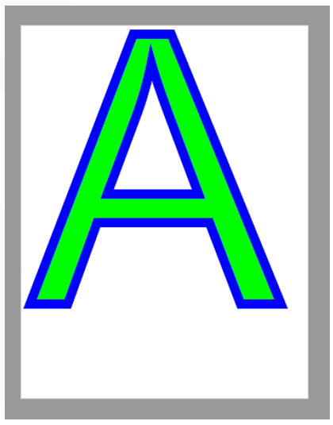

## 一个路径对象的绘制

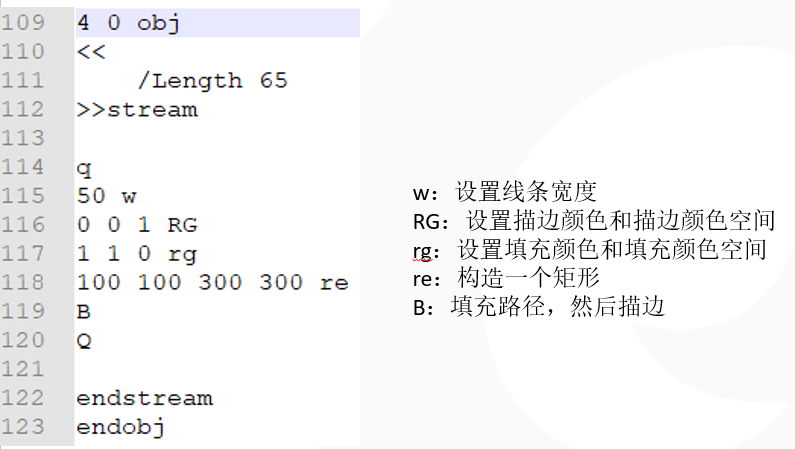

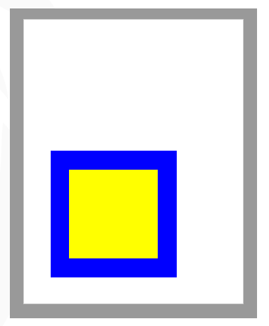

## 一个图像的绘制

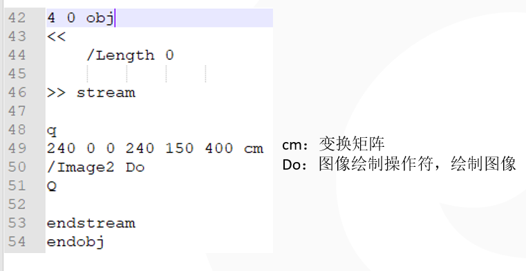

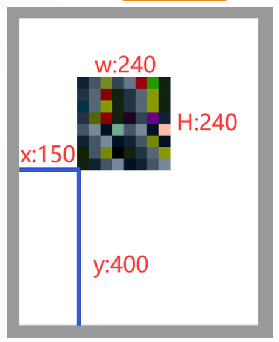

# 内容流和操作符

## PDF内容流

+	由图形操作符和操作数组成。
+	图形操作符描述了在光栅输出设备上显示页面时，对象的绘制步骤。


## 图形操作符

+	图形状态操作符：处理图形状态数据。
	*	包括当前转换矩阵(CTM)， 颜色，当前剪切路径等。
+	路径构造操作符：定义path的形状，轨迹，区域。
	*	包括开始新路径
	*	封闭路径
	*	添加直线和曲线
+	路径绘制操作符：给路径或者区域着色。
+	其它绘制操作符：绘制图像（Do），渐变对象（sh）等。
+	文本操作符：显示各种字体的字符字形。

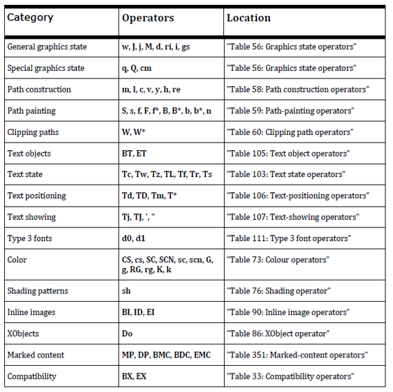

# 图形对象

图形对象由内容流中的操作符和操作数描述，操作符和操作数使用后缀表示法

+	PDF目前支持5种类型的图形对象
	*	Path：由直线，矩形或者三次贝塞尔曲线组成的形状
	*	Text：字符
	*	Xobject：内容流外部定义的一组对象，通过资源名引用
	*	InlineImage：使用精简语法表示的直接包含在内容流中的小图像
	*	渐变对象：颜色可以平滑过渡的图形
	
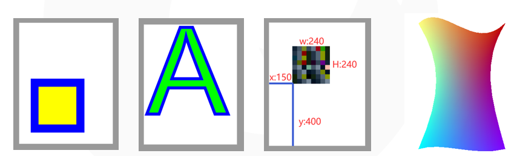

# 坐标系

## 作用

确定对象的显示位置，方向和大小。

## 设备坐标空间和用户坐标空间

### 设备空间

+	特定设备的坐标系
+	不同设备的设备空间`原点在输出页面上的位置可能不同`，`坐标轴的方向也可能不同`。

### 用户空间

+	为了避免在设备空间中指定对象出现的设备相关效果。PDF定义了`与设备无关的坐标系。称作用户空间`。
	*	它与当前页面保持相同的关系，也可以看作页面空间
	*	页面字典的CropBox指定一个在用户空间的矩形区域，对应于输出介质的可见区域。

### 用户空间对象在设备空间的位置如何确定？

`CTM(当前转换矩阵)`提供了用户空间坐标与设备空间坐标的映射关系。

### CTM的计算

CTM应该根据特定输出设备的原生分辨率调整。

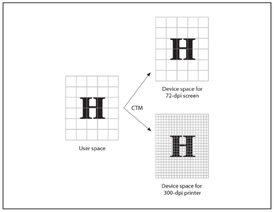

## 其它坐标空间

+	文本空间：文本坐标在文本空间中指定，文本矩阵定义从文本空间到用户空间的转换。
+	字形空间：字体的字符字形在字形空间
	*	定义，字体矩阵定义字形空间到文本空间的转换。
+	图像空间：图像在图像空间定义，图像在用户空间的大小
	*	是`1*1`，可通过cm放大图像。
+	复合空间：XObject的空间叫做复合空间，从复合空间到用户空间的转换由包含在XObject中的复合矩阵指定。
+	Pattern空间：Pattern的空间叫做Pattern空间。由包含在Pattern中的矩阵指定。

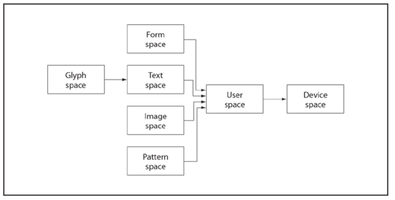

## 常见变换

转换矩阵cm：指定两个坐标空间之间的关系。通过修改转换矩阵，可以缩放，旋转，平移，扭曲对象

+	表示：包含6个元素的数组：`[a b c d e f]`
	*	平移：`[1 0 0 1 tx ty]`，tx和ty指定将坐标系原点在水平和垂直维度上平移的距离
	*	缩放：`[sx 0 0 sy 0 0]`,将原对象在新坐标系中水平和垂直方向分别放大sx，sy倍
	*	旋转：`[cosq sinq –sinq cosq 0 0]`，将坐标系的轴逆时针旋转角度q
	*	扭曲：`[1 tana tanb 1 0 0]`，将x轴扭曲角度a,将y轴扭曲角度b

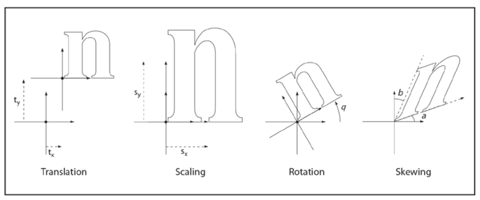

## 坐标的计算

转换改变的是坐标系，而不是图形对象，
即每个像素从原坐标系到目标坐标系的映射关系。


数组`[a b c d e f]`在实际运用时，应转换为右图的矩阵参与计算：

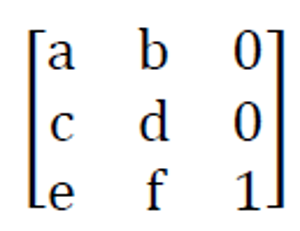

坐标转换应表示为矩阵乘法：

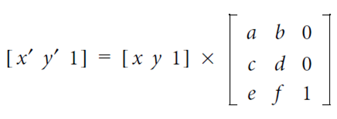

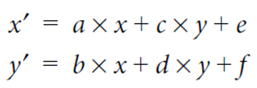

# 图形状态

一个内部数据结构，用于保存当前图像的控制参数。

图形状态堆栈：用于封装图形状态。
+	q：将目前的图形状态保存在堆栈
+	Q：弹出堆栈中的图形状态。

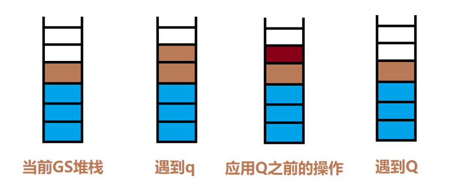

| 设备无关 |   设备相关   |
|----------|--------------|
| CTM      | 叠印         |
| 剪切路径 | 叠印模式     |
| 颜色空间 | 底层颜色去除 |
| 颜色     | 转印函数     |
| 文本状态 | 网目调       |
| 线条宽度 | 平度         |
| 混合模式 | 平滑度       |
| 软蒙版   |              |
| 透明度   |              |
| ...      |              |


## 图像状态操作符

用来设置图形状态

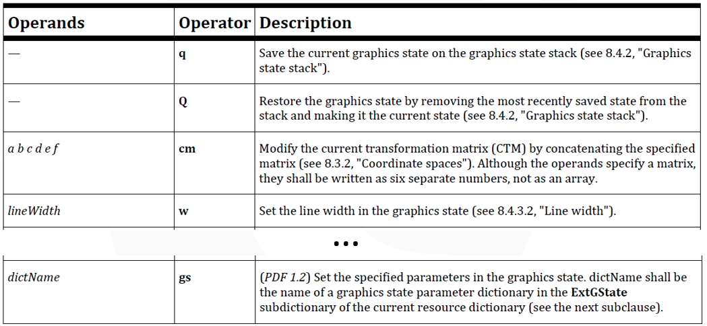

## 图形状态参数字典

+	图形状态中的一些参数不能使用简单操作符设置，它使用gs操作符设置。
	*	通过gs设置的图形状态是一组图形状态，这组图形状态可以包含一个或多个图形状态。
	*	gs操作符的操作数是一个name对象
	*	通过gs设置的图形状态都有一个使用name对象表示的名字，可以通过此名字在资源字典的ExtGState子字典中找到对应的用字典表示的一组图形状态。

这一组用字典表示的图形状态叫做：图形状态参数字典。

图形状态参数字典中可以包含一个或多个条目。

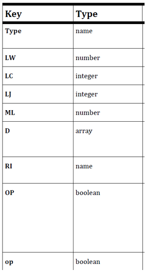

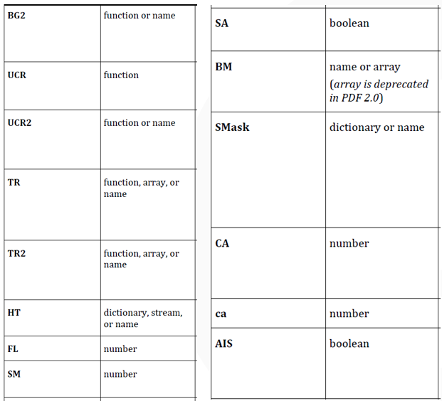

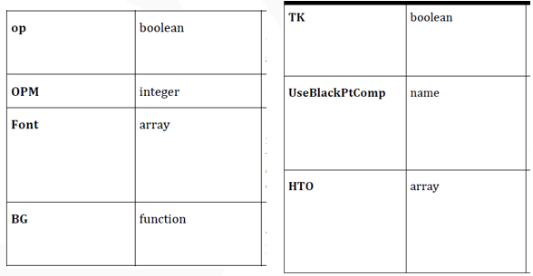


# 路径构造与绘制

3种路径操作符：
+	路径构造操作符：定义路径的几何形状
+	路径绘制操作符：给几何形状着色
+	剪切路径操作符：定义裁剪区域

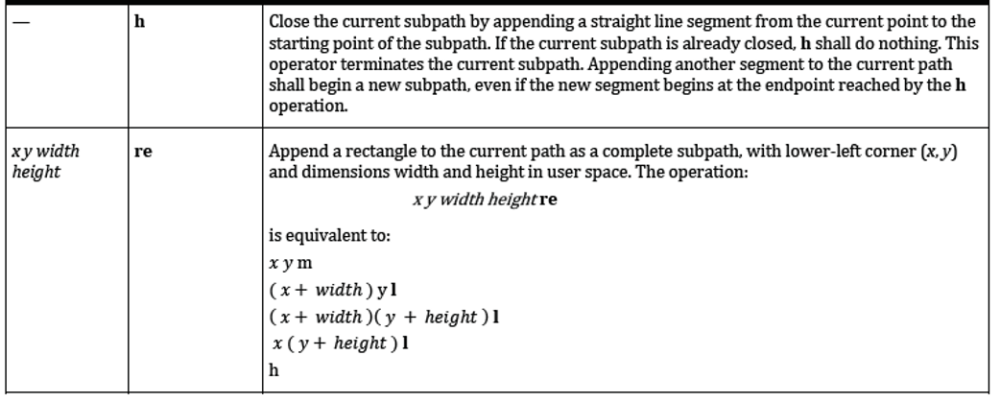

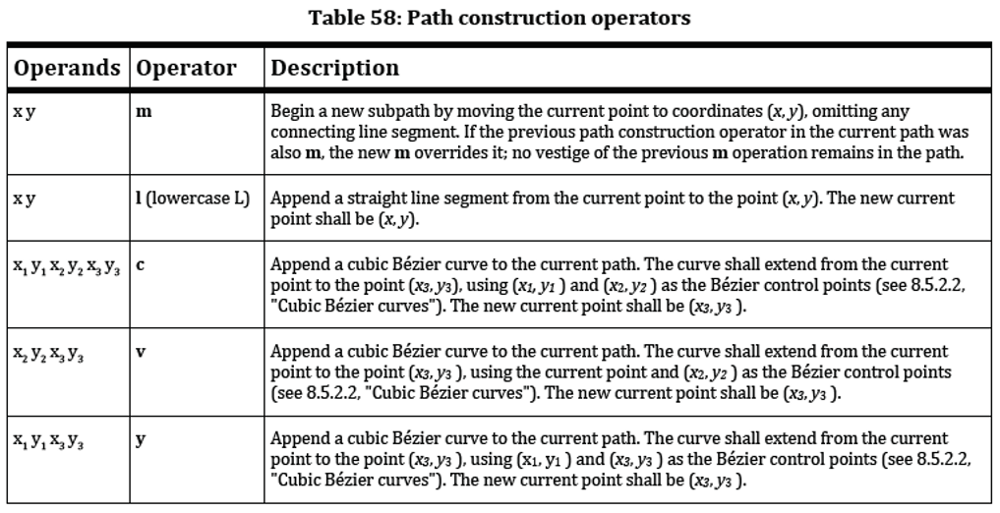

## 三次贝塞尔曲线

曲线应该使用三次贝塞尔曲线表示。三次贝塞尔曲线使用4个点定义：2个端点（P0,P3），2个控制点（P1,P2）。
给定4个点的坐标，应通过在以下公式中改变参数t（0-1）生成曲线：

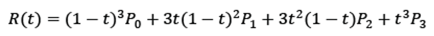

曲线路径构造方法：
+	x1 y1 x2 y2 x3 y3 c	
+	（P0由当前点隐含定义，不需指定）
+	x2 y2 x3 y3 v		（P1与P0重合）
+	x1 y1 x3 y3 y 		（P2与P3重合）


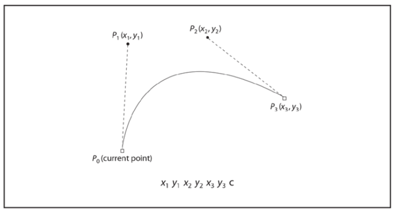

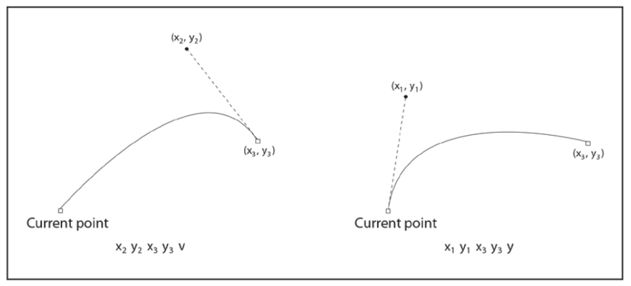

## 路径绘制操作符

路径绘制操作符结束一个路径对象，并绘制路径对象。

+	描边：S操作符沿当前路径绘制线条，使用w操作符设置的宽度。
+	填充：f操作符使用当前的填充色填充当前路径包围的区域。填充之前，应隐含的封闭任何开放的子路径。

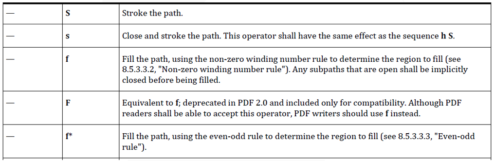

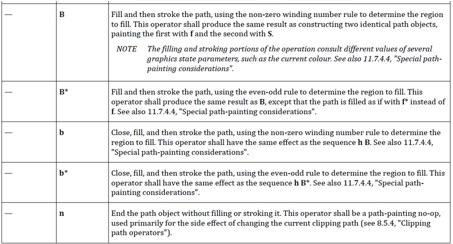

# 填充规则

+	对于一个简单的路径，可以很直观的了解哪些区域位于当前路径内部，从而执行填充操作。
+	对于复杂路径，内部区域无法直观的界定。这时，需要根据2种规则判断哪些点位于路径内部。
	*	非0绕数
	*	奇偶规则
	*	[看这里](/2022/20221122-非零环绕数规则和奇偶规则)


# 剪切路径

剪切路径操作符：`W/W*`。剪切路径操作符定义剪切路径，剪切路径在图形状态中定义，剪切路径的封闭子路径定义了可以绘制的区域。绘制对象时，应只绘制剪切路径内部的区域。

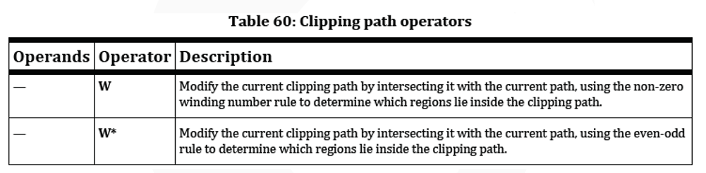

举例

```
%PDF-1.7				    % HEAD, to show PDF version

%BODY
1 0 obj						% from Root
<</Type /Catalog			% Catalog dictionary
/Pages 2 0 R				% the indirect object of PageTree, is 2 0 
>>
endobj

2 0 obj						% from Pages
<</Type /Pages				% PageTree dictionary
/Kids [3 0 R]				% subnode of PageTree, include 3 0
/Count 1					% count of Pages
>>
endobj

3 0 obj                     % from PageTree Kids
<</Type /Page               % Page dictionary
/Parent 2 0 R               % Parent is 2 0
/MediaBox [0 0 600 800]     % rectangle to show the Page
/Contents 4 0 R             % the indirect object of Page Contents, is 4 0 
>>
endobj

4 0 obj
<<
/Length 65                  %the size of stream
>>
stream
100 100 100 100 re
300 300 100 100 re
100 300 100 100 re
300 100 100 100 re
W                           %剪切路径操作符
n                           %n操作符是无操作的路径绘制操作符,它不在页面上放置任何标记,它和裁剪路径操作符一起使用来建立新的裁剪路径

q
50 w                        %w:设置线条宽度
0 0 1 RG                    %RG:设置描边颜色的颜色空间和颜色
1 1 0 rg                    %rg:设置填充颜色和填充颜色空间
100 100 300 300 re          %re:构造一个矩形
B                           %填充路径,然后描边
Q
endstream
endobj


xref						% XREF, this file has no xref

trailer						% TRAILER, file begin position
<</Size 0				    % Size of xref, this file has no xref, so it is 0
/Root 1 0 R				    % the indirect object of Root, is 1 0
>>

startxref
0

%%EOF					    % End of file 
```

效果如下

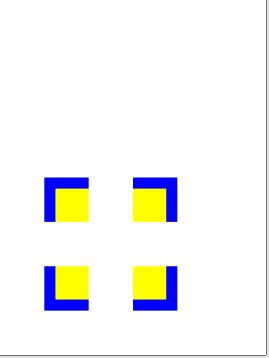


