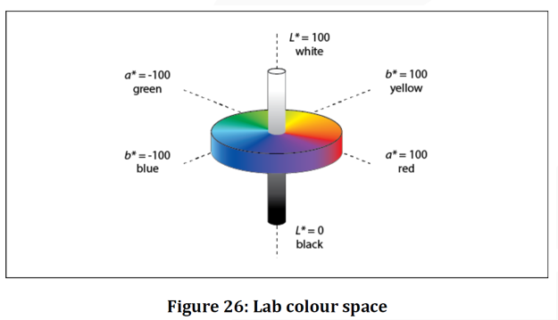

# PDF图形对象和颜色空间

----

# 几个例子

```
%PDF-2.0				% HEAD, to show PDF version

%BODY
1 0 obj						% from Root
<</Type /Catalog			% Catalog dictionary
/Pages 2 0 R				% the indirect object of PageTree, is 2 0 
>>
endobj

2 0 obj						% from Pages
<</Type /Pages				% PageTree dictionary
/Kids [3 0 R 5 0 R 7 0 R]				% subnode of PageTree, include 3 0
/Count 3					% count of Pages
>>
endobj


%%%%%%%%%%%%%%%%%%%%%%%%%%%%%%%
%%文本对象的绘制
%%%%%%%%%%%%%%%%%%%%%%%%%%%%%%%

3 0 obj						% from PageTree Kids
<</Type /Page		% Page dictionary
/Parent 2 0 R			% Parent is 2 0
/MediaBox [0 0 600 800]	% rectangle to show the Page
/Contents 4 0 R		% the indirect object of Page Contents, is 4 0 
>>
endobj

4 0 obj
<<
/Length 65			%the size of stream
>>
stream
q					%图形入栈
BT	%开始一个文本对象
/Font1 800 Tf	%Tf:set the text font
2 Tr 		%tr:设置渲染模式
0 0 1 RG 	%设置描边颜色的颜色空间和颜色
20 w 		%设置线条宽度
(A) Tj		%Tj:绘制文本
ET 			%ET:结束一个文本对象
Q					%图形出栈
endstream
endobj

%%%%%%%%%%%%%%%%%%%%%%%%%%%%%%%
%%路径对象绘制
%%%%%%%%%%%%%%%%%%%%%%%%%%%%%%%

5 0 obj
<</Type /Page
/Parent 2 0 R
/MediaBox [0 0 600 800]
/Contents 6 0 R
>>
endobj

6 0 obj
<<
/Length 65
>>
stream
q
50 w 	%设置线条宽度
0 0 1 RG 	%设置描边颜色和描边颜色空间
1 1 0 rg 	%设置填充颜色和填充颜色空间
100 100 300 300 re 	%re:构造一个矩形
B 	%填充路径,然后描边
Q
endstream
endobj

%%%%%%%%%%%%%%%%%%%%%%%%%%%%%%%
%%图像的绘制
%%%%%%%%%%%%%%%%%%%%%%%%%%%%%%%
7 0 obj
<</Type /Page
/Parent 2 0 R
/MediaBox [0 0 600 800]
/Contents 8 0 R
>>

8 0 obj
<<
/Length 100
>>
stream

q
240 0 0 240 150 400 cm 	%cm:变换矩阵
/Image2 Do 				%Do:图像绘制操作符,绘制图像
Q
endstream
endobj


xref							% XREF, this file has no xref


trailer						% TRAILER, file begin position
<</Size 0				% Size of xref, this file has no xref, so it is 0
/Root 1 0 R				% the indirect object of Root, is 1 0
>>

startxref
0

%%EOF					% End of file 
```

## 文本对象的绘制


## 一个路径对象的绘制


## 一个图像的绘制


# 内容流和操作符

## PDF内容流

+	由图形操作符和操作数组成。
+	图形操作符描述了在光栅输出设备上显示页面时，对象的绘制步骤。


## 图形操作符

+	图形状态操作符：处理图形状态数据。
	*	包括当前转换矩阵(CTM)， 颜色，当前剪切路径等。
+	路径构造操作符：定义path的形状，轨迹，区域。
	*	包括开始新路径
	*	封闭路径
	*	添加直线和曲线
+	路径绘制操作符：给路径或者区域着色。
+	其它绘制操作符：绘制图像（Do），渐变对象（sh）等。
+	文本操作符：显示各种字体的字符字形。


# 图形对象

图形对象由内容流中的操作符和操作数描述，操作符和操作数使用后缀表示法

+	PDF目前支持5种类型的图形对象
	*	Path：由直线，矩形或者三次贝塞尔曲线组成的形状
	*	Text：字符
	*	Xobject：内容流外部定义的一组对象，通过资源名引用
	*	InlineImage：使用精简语法表示的直接包含在内容流中的小图像
	*	渐变对象：颜色可以平滑过渡的图形
	


# 坐标系

## 作用

确定对象的显示位置，方向和大小。

## 设备坐标空间和用户坐标空间

### 设备空间

+	特定设备的坐标系
+	不同设备的设备空间`原点在输出页面上的位置可能不同`，`坐标轴的方向也可能不同`。

### 用户空间

+	为了避免在设备空间中指定对象出现的设备相关效果。PDF定义了`与设备无关的坐标系。称作用户空间`。
	*	它与当前页面保持相同的关系，也可以看作页面空间
	*	页面字典的CropBox指定一个在用户空间的矩形区域，对应于输出介质的可见区域。

### 用户空间对象在设备空间的位置如何确定？

`CTM(当前转换矩阵)`提供了用户空间坐标与设备空间坐标的映射关系。

### CTM的计算

CTM应该根据特定输出设备的原生分辨率调整。


## 其它坐标空间

+	文本空间：文本坐标在文本空间中指定，文本矩阵定义从文本空间到用户空间的转换。
+	字形空间：字体的字符字形在字形空间
	*	定义，字体矩阵定义字形空间到文本空间的转换。
+	图像空间：图像在图像空间定义，图像在用户空间的大小
	*	是`1*1`，可通过cm放大图像。
+	复合空间：XObject的空间叫做复合空间，从复合空间到用户空间的转换由包含在XObject中的复合矩阵指定。
+	Pattern空间：Pattern的空间叫做Pattern空间。由包含在Pattern中的矩阵指定。


## 常见变换

转换矩阵cm：指定两个坐标空间之间的关系。通过修改转换矩阵，可以缩放，旋转，平移，扭曲对象

+	表示：包含6个元素的数组：`[a b c d e f]`
	*	平移：`[1 0 0 1 tx ty]`，tx和ty指定将坐标系原点在水平和垂直维度上平移的距离
	*	缩放：`[sx 0 0 sy 0 0]`,将原对象在新坐标系中水平和垂直方向分别放大sx，sy倍
	*	旋转：`[cosq sinq –sinq cosq 0 0]`，将坐标系的轴逆时针旋转角度q
	*	扭曲：`[1 tana tanb 1 0 0]`，将x轴扭曲角度a,将y轴扭曲角度b


## 坐标的计算

转换改变的是坐标系，而不是图形对象，
即每个像素从原坐标系到目标坐标系的映射关系。


数组`[a b c d e f]`在实际运用时，应转换为右图的矩阵参与计算：


坐标转换应表示为矩阵乘法：


# 图形状态

一个内部数据结构，用于保存当前图像的控制参数。

图形状态堆栈：用于封装图形状态。
+	q：将目前的图形状态保存在堆栈
+	Q：弹出堆栈中的图形状态。


| 设备无关 |   设备相关   |
|----------|--------------|
| CTM      | 叠印         |
| 剪切路径 | 叠印模式     |
| 颜色空间 | 底层颜色去除 |
| 颜色     | 转印函数     |
| 文本状态 | 网目调       |
| 线条宽度 | 平度         |
| 混合模式 | 平滑度       |
| 软蒙版   |              |
| 透明度   |              |
| ...      |              |


## 图像状态操作符

用来设置图形状态


## 图形状态参数字典

+	图形状态中的一些参数不能使用简单操作符设置，它使用gs操作符设置。
	*	通过gs设置的图形状态是一组图形状态，这组图形状态可以包含一个或多个图形状态。
	*	gs操作符的操作数是一个name对象
	*	通过gs设置的图形状态都有一个使用name对象表示的名字，可以通过此名字在资源字典的ExtGState子字典中找到对应的用字典表示的一组图形状态。

这一组用字典表示的图形状态叫做：图形状态参数字典。

图形状态参数字典中可以包含一个或多个条目。


# 路径构造与绘制

3种路径操作符：
+	路径构造操作符：定义路径的几何形状
+	路径绘制操作符：给几何形状着色
+	剪切路径操作符：定义裁剪区域


## 三次贝塞尔曲线

曲线应该使用三次贝塞尔曲线表示。三次贝塞尔曲线使用4个点定义：2个端点（P0,P3），2个控制点（P1,P2）。
给定4个点的坐标，应通过在以下公式中改变参数t（0-1）生成曲线：


曲线路径构造方法：
+	x1 y1 x2 y2 x3 y3 c	
+	（P0由当前点隐含定义，不需指定）
+	x2 y2 x3 y3 v		（P1与P0重合）
+	x1 y1 x3 y3 y 		（P2与P3重合）


## 路径绘制操作符

路径绘制操作符结束一个路径对象，并绘制路径对象。

+	描边：S操作符沿当前路径绘制线条，使用w操作符设置的宽度。
+	填充：f操作符使用当前的填充色填充当前路径包围的区域。填充之前，应隐含的封闭任何开放的子路径。


# 填充规则

+	对于一个简单的路径，可以很直观的了解哪些区域位于当前路径内部，从而执行填充操作。
+	对于复杂路径，内部区域无法直观的界定。这时，需要根据2种规则判断哪些点位于路径内部。
	*	非0绕数
	*	奇偶规则
	*	[看这里](/2022/20221122-非零环绕数规则和奇偶规则)


# 剪切路径

剪切路径操作符：`W/W*`。剪切路径操作符定义剪切路径，剪切路径在图形状态中定义，剪切路径的封闭子路径定义了可以绘制的区域。绘制对象时，应只绘制剪切路径内部的区域。


举例

```
%PDF-1.7				    % HEAD, to show PDF version

%BODY
1 0 obj						% from Root
<</Type /Catalog			% Catalog dictionary
/Pages 2 0 R				% the indirect object of PageTree, is 2 0 
>>
endobj

2 0 obj						% from Pages
<</Type /Pages				% PageTree dictionary
/Kids [3 0 R]				% subnode of PageTree, include 3 0
/Count 1					% count of Pages
>>
endobj

3 0 obj                     % from PageTree Kids
<</Type /Page               % Page dictionary
/Parent 2 0 R               % Parent is 2 0
/MediaBox [0 0 600 800]     % rectangle to show the Page
/Contents 4 0 R             % the indirect object of Page Contents, is 4 0 
>>
endobj

4 0 obj
<<
/Length 65                  %the size of stream
>>
stream
100 100 100 100 re
300 300 100 100 re
100 300 100 100 re
300 100 100 100 re
W                           %剪切路径操作符
n                           %n操作符是无操作的路径绘制操作符,它不在页面上放置任何标记,它和裁剪路径操作符一起使用来建立新的裁剪路径

q
50 w                        %w:设置线条宽度
0 0 1 RG                    %RG:设置描边颜色的颜色空间和颜色
1 1 0 rg                    %rg:设置填充颜色和填充颜色空间
100 100 300 300 re          %re:构造一个矩形
B                           %填充路径,然后描边
Q
endstream
endobj


xref						% XREF, this file has no xref

trailer						% TRAILER, file begin position
<</Size 0				    % Size of xref, this file has no xref, so it is 0
/Root 1 0 R				    % the indirect object of Root, is 1 0
>>

startxref
0

%%EOF					    % End of file 
```

效果如下


# 颜色空间

## 什么是颜色空间？

+	所有的颜色组成了颜色空间。
+	颜色是人眼对不同频率的光线的感受，为了对颜色进行表示，人们建立了多种模型，一维，二维，三维，四维空间坐标来表示某一颜色。这种坐标系统所能定义的色彩范围叫做颜色空间。

## 颜色值

+	表示某个颜色空间中某一组颜色的数值叫做颜色值。颜色值包含一个或者多个颜色分量。
+	不同的颜色空间包含不同的颜色分量。
+	指定颜色时需要同时指定颜色值和颜色值所属的颜色空间。

## 颜色空间种类

3大类，11小类


# pdf中的颜色空间

## 定义方式

定义方式:数组
+	第一个元素是颜色空间的名称，
+	其余元素进一步描述颜色空间的参数。
+	对于不需要参数的颜色空间，可以使用名称本身。

## 指定颜色空间

+	在内容流中：CS设置描边颜色空间，cs设置填充颜色空间。
+	在内容流外部：用ColorSpace字典条目设置，后跟颜色空间对象。

## 指定颜色

+	SC和SCN设置描边颜色，sc和scn设置填充颜色
+	G，RG，K既设置描边颜色空间又设置颜色，g，rg，k类似。

## 设备颜色空间

颜色值直接映射到设备着色剂的应用。比如油墨量或者显示器的荧光强度。
这种颜色空间表示的颜色在不同设备上的结果可能不一致。

+	DeviceGray：
	*	1个分量，控制消色光的强度，范围从黑色到白色，范围0.0-1.0。
	*	0.0对应黑色，1.0对应白色。中间值对应不同的灰度级别。


+	DeviceRGB：RGB颜色模型，3个分量，表示红绿蓝的强度，每个分量范围0.0-1.0。


+	DeviceCMYK：以打印机为代表的CMYK颜色模型。4个分量。每个分量范围0.0-1.0。


## 基于CIE的颜色空间

+	使页面描述以与人类视觉感知有关的方式指定颜色值。
+	目标是`让相同的颜色在不同的输出设备上生成一致的结果`。

基于CIE的颜色空间有3个分量，任意命名为ABC。通过2个阶段生成CIE 1931XYZ颜色空间中的XYZ的3个分量。

+	第一阶段：对分量的值应用解码函数，结果乘以一个`3*3`矩阵，生成3个中间分量LMN。
+	第二个阶段：以类似的方式变换中间分量，生成XYZ。


### CalRGB

表示


解释：
+	WhitePoint：白点，3个数组成的数组，指定了CIE 1931 XYZ中扩散白点的三刺激值。
+	Gamma：指定颜色空间中ABC分量的伽马值。
+	Matrix：9个值组成的数组，指定关于最终XYZ表示形式的颜色空间中已经解码ABC分量的线性解释。
+	BlackPoint：3个数组成的数组，指定CIE 1931 XYZ 中扩散黑点的三刺激值。

理解白点和黑点：定义域A`[0，100]`映射到值域B`[0，100]`，在定义域中值为20的数映射到值域中也对应20这个数。定义域C为`[0，50]`，映射到值域B`[0，100]`时，定义域	中的20映射到值40。白点可看作定义域中100的这个值，黑点可看作是定义域中的0，XYZ是不变的，	可以看作值域是不变的。	通过调整白点和黑点，相同的ABC值可以得到不同的XYZ的值。


XYZ的计算：

只有一个变化阶段，第二个阶段看作恒等变换，XYZ=LMN。


显示器并不能显示XYZ颜色空间的颜色。当一个XYZ颜色空间的颜色要在显示器显示时，需要转换为RGB颜色。

XYZ到RGB的计算：
+	白点矫正，矫正到sRGB的标准白点D65下的XYZ值。
+	将D65下的XYZ值转换为sRGB颜色空间的RGB分量。
+	XYZ转换到线性RGB值。
+	sRGB压缩。

### CalGray

基于CIE的单分量颜色空间，被称为基于CIE的A颜色空间。只有一个变换阶段。

A表示灰色分量。
解码函数DecodeA由颜色空间字典中的Gamma指定。
变换矩阵A从字典的WhitePoint得到。
MatrixLMN隐含的采用恒等变换。转换为XYZ的方式如下：


表示：


字典:


计算:


### Lab

在Lab颜色空间中，ABC表示`CIE 1976 L*a*b*`空间中的`L*，a*，b*`分量。
第一个分量的范围是0-100。
第二个和第三个分量的值有颜色空间字典中的Rang条目定义。




表示


也有一个白点，黑点。
Rang：4个数组成的数组，`[Amin，Amax，Bmin，Bmax]`指定`a*`和`b*`有效值的范围。应将指定范围外的分量值调整为有效值。默认值`[-100，100，-100，100]`。


计算：
也是基于CIE的ABC颜色空间，有2个变化阶段。
但是每个阶段的解码函数和矩阵系数不应指定，他们具有隐含的常量值。

第一个阶段：


第二个阶段：


g(x)定义为：


### ICCBased

与前面3个颜色空间不同，ICCBased颜色空间到XYZ的映射是通过ICC配置文件实现的。
配置文件是基于国际色彩联盟定义的跨平台颜色配置文件。ICC配置文件的详细格式信息可以参考ICC规范。

表示：`[/ICCBased stream]`
流包含一个ICC配置文件。


+	N：ICC配置文件数据描述的颜色空间中颜色分量的数量，N的值应是1，3，4。
+	Alternate：在不支持流数据指定的颜色空间时，应使用的备用颜色空间。

流中的流字典可以包含如下条目：


计算：使用开源库，litterCMS(little color manager system)


## 特殊颜色空间

特殊颜色空间在底层颜色空间的基础上添加功能和特性。

Pattern：指定使用底纹而不是单个颜色绘制区域。底纹分为拼贴底纹和渐变底纹2种。（下节内容）
Indexed：使用颜色表绘制区域。

表示：


+	第一个元素是固定的颜色空间名称：/Indexed。
+	base：一个数组或者名称。指定基本颜色空间。应使用基本颜色空间解释颜色表的值。
+	hival：一个整数。指定最大的索引值。
+	lookup：定义颜色表。可以是一个流或者字符串。数据长度为：m*(hival + 1)字节。m是基本颜色空间的颜色分量个数。每个颜色值的范围是0-255，由单个字节表示。

## Separation

一个包含四个元素的数组，第一个元素是颜色空间的名称/Separation，其余元素是其它参数。
表示：


+	name：指定Separation颜色空间要表示的着色剂名	称的名称对象（或者特殊的All，None）。 	特殊着色剂All引用输出设备上可用的所	有着色剂。特殊着色剂None不应生成任	何可见输出。
+	以下2个参数在设备没有对应的着色剂时使用。
	*	alternateSpace：替代颜色空间对象，一个数组或者名称。不能是另一个特殊颜色空间。
	*	tintTransform：转换函数。通过该函数将颜色值转换为备用颜色空间的颜色分量值。
	


## DeviceN

与Separation类似，不同的是Separation可以包含一个着色剂。DeviceN可以包含任意数量的着色剂。
Separation可以看作是只有一个着色剂的DeviceN颜色空间。

表示：


+	Names：指定单个颜色分量的名称对象的数组。数组长度表示	这个DeviceN颜色空间颜色分量的个数。	names中不能使用All名称。
+	只要有一个着色剂不存在于输出设备，就需要用备用颜色空间和转换函数计算颜色。
+	attributes：可选。可以将DeviceN指定为NChannel类型，同时定义每个着色剂的转换函数。对于NChannel类型DeviceN颜色空间，只有在输出设备上不存在的分量，才使用备用颜色空间和转换函数计算颜色。

20221124111134.png

## 颜色操作符

设置颜色空间和颜色值。

+	CS：设置颜色空间，操作数是name，name对应于资源字典中的某个颜色空间。
+	SC：设置颜色值，操作数是n个浮点数，操作数的个数由之前设置的颜色空间包含的   颜色分量的个数决定。只能设置设备颜色空间，基于CIE的颜色空间（ICCBased颜色空间除外）和Indexed颜色空间。
+	SCN：同SC，也支持设置pattern，separation，DeviceN和ICCBased颜色空间。

+	G:同时设置颜色空间和颜色值。设置的颜色空间为DeviceGray。操作数是一个浮点数。
+	RG:同时设置颜色空间和颜色值。设置的颜色空间为DeviceRGB。操作数是3个浮点数。
+	K:同时设置颜色空间和颜色值。设置的颜色空间为DeviceCMYK。操作数是4个浮点数。

所有颜色操作符的大写表示设置描边色，小写表示设置填充色。


