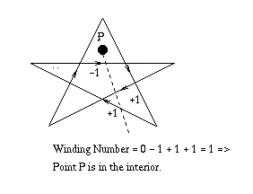
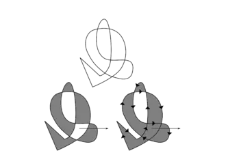
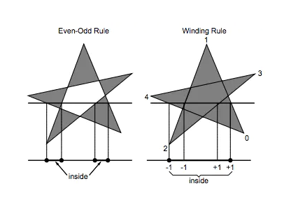

# 非零环绕数规则和奇偶规则

----

# 奇偶规则

奇偶规则（Odd-even Rule）：奇数表示在多边形内，偶数表示在多边形外。

从该点p任意方向的一条射线，若与该射线相交的多边形边的数目为奇数，则p是多边形内部点，否则是外部点。

# 非零环绕数规则

非零环绕数规则（Nonzero Winding Number Rule）：若环绕数非零则表示在多边形内，否则是外部点。

首先使多边形的边变为矢量。将环绕数初始化为零。再从该点p作任意方向的一条射线。当从p点沿射线方向移动时，对在每个方向上穿过射线的边计数，每当多边形的边从左到右穿过射线时，环绕数加1，从右到左时，环绕数减1。处理完多边形的所有相关边之后，若环绕数为非零，则p为内部点，否则，p是外部点。

# 例子

1.	判断点p是否在多边形内

从点p向外作任意方向的一条射线，多边形的边从左到右经过射线时环数减1，多边形的边从右往左经过射线时环数加1，最后环数不为0，即表示在多边形内部。

2.	如下图所示，左侧表示用奇-偶规则判断绕环数为2 ，表示在多边形外，所以没有填充。右侧图用非零绕环规则判断出绕数为2，非0表示在多边形内部，所以填充。

3.	左侧为奇-偶规则，右侧为非零环绕数规则，实心区域表示在多边形内部，空心区域表示在多边形外部

