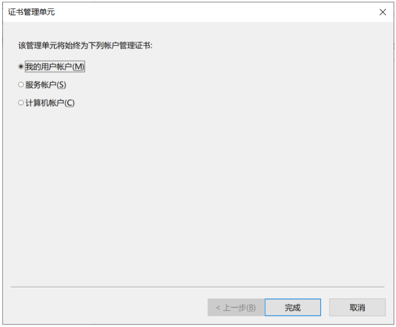

#   数字签名简介

##  基本特征
数字签名必须保证以下三点：

-   报文鉴别——接收者能够核实发送者对报文的签名；
-   报文的完整性——接收者不能伪造对报文的签名或更改报文内容。
-   不可否认——发送者事后不能抵赖对报文的签名；

##  数字签名的验证过程

上图位用户A使用数字签名向用户B传输一份文件的过程：

-   首先，文件经过单向散列函数的处理得到一份占128位的摘要（无论文件多大，经过单向散列函数的处理，生成的摘要都是128位），这份摘要相当于该文件的"指纹"，能够唯一地识别文件。注意：只要文件发生改动，经过单向散列函数处理后得到地摘要都会不一样。所以，文件和文件的摘要具有很强的对应关系。
-   随后，用户A使用自己地私钥对这份128位地摘要进行加密，得到一份加密地摘要。
-   然后，用户A把文件、加密的摘要和公钥打包一起发给用户B。传输的过程中并没有对文件进行加密处理。
-   用户B将收到的文件经过单向散列函数处理得出一份128位摘要，这份摘要是通过收到的文件得到的，存在被更改的可能；使用A提供的公钥对收到的"加密的摘要"进行解密得到另一份128位摘要，这份摘要是通过原始文件得到的，一般认为代表真正的文件；然后将两份摘要进行比较。
-   如果两份摘要相等，说明文件经过用户A签名之后，在传输的过程中没有被更改；若不相等，说明文件在传输过程中被更改了，或者说已经不是原来的文件了，此时用户A的签名失效。

### 数字签名三个特征的验证

-   不可否认——只有用户A拥有私钥A，并能使用私钥A产生"加密的摘要"，这样用户A就不能否认给用户B发送了经过签名的密文。
-   报文的完整性——用户B通过比较得出的两份摘要是否相等，可以判断签名或文件内容是否发生改变。
-   报文鉴别——用户B可以使用收到的公钥对"加密的摘要"进行解密，从而核实用户A对文件的签名。

### 需要强调

-   用户A使用私钥对由文件生成的128位摘要进行加密的过程称为数字签名的过程，得到的"加密的摘要"，称为该文件的数据签名。
-   用户A使用私钥加密的是摘要而不是文件。
-   用户B验证签名实际上是比较得出的两份摘要是否相等。

##  数字签名使用的场合

什么时候使用这种不对文件加密，而对文件的摘要加密（对文件进行签名）的技术呢？

-   数字签名解决的核心问题是：确保收到的文件没有被更改。
-   比如：公司的领导给员工下发放假通知，这时候就需要对邮件进行数字签名来证明这个通知是领导发的。员工收到通知，看到上面有领导的签名，于是就可以放心休假了。如果有人冒充领导发通知，上面没有领导的签名，员工休假回来就要扣工资。同样的，通知有了领导的签名，领导想抵赖也不行。

#   证书颁发机构CA

##  CA简介

-   证书颁发机构，即认证中心CA (Certification Authority)，来将公钥与其对应的实体（人或机器）进行绑定(binding)；即给公司或个人颁发证书。
-   认证中心一般由政府出资建立。每个实体都有CA 发来的证书(certificate)，里面有公钥及其拥有者的标识信息。此证书被 CA 进行了数字签名。任何用户都可从可信的地方获得认证中心 CA 的公钥，此公钥用来验证某个公钥是否为某个实体所拥有。有的大公司也提供认证中心服务。

如图所示，用户A使用数字签名时给用户B发送了一个数据包，数据包中包含了A的公钥、文件和加密的摘要。那么问题来了：用户B如何确定收到的公钥是用户A发送的，而不是他人冒充用户A发送的呢？

举个例子：把用户A的公钥和私钥假设为身份证。如果是用户A自己造的身份证别人会信吗？反之，用户A拿着真正的身份证去住宾馆，老板一开始也不相信身份证是用户A的，但是老板相信给用户A发身份证的公安局，老板通过比对公安网上对应身份证号码的信息就可以判断这个身份证是不是用户A的，由此可以确认用户A的身份。
同理，B一开始并不确认收到的公钥是来自用户A的，用户A也可抵赖B收到的公钥不是自己发送的。这时就需要有一个双方都信任的第三方证书颁发机构来协调。

##  证书颁发和使用过程

-   首先，用户A向证书颁发机构提交个人信息，申请证书。通过CA审核后，CA生成用户A的证书，证书中包括了A的公钥和私钥还有CA的数字签名。证书颁发机构CA本身拥有一对密钥，这是对CA所颁发的证书进行数字签名和保密的基础，绝不能泄露。
-   用户A收到的证书中包括了带有CA数字签名的，专属A公钥和私钥，CA的数字签名确保了别人不能伪造用户A的公钥和私钥。
-   同时，用户B也必须信任给用户A颁发证书的第三方认证机构CA，即用户B拥有CA颁发的"CA公钥"。
-   通信时，用户A向用户B发送的数据包中的"加密的摘要"上有用户A的数字签名，“A公钥” 上有认证机构CA的数字签名。用户B收到数据包之后，先要验证收到的 “A公钥” 是否来源合法：是认证机构颁发的带有CA签名的公钥吗？用户B并不信任用户A，但是用户B信任第三方认证机构CA。所以，用户B先使用证书颁发机构颁发的 "CA公钥" 验证收到的 "A公钥" 是否由同一认证机构颁发，是否在颁发之后更改过。
-   验证通过后，用户B便相信收到的 "A公钥" 确实来自真实的用户A。随后再使用 "A公钥" 对 "加密的摘要" 进行解密，进行上文提到的对比操作，以判断文件是否更改。

##  查看计算机信任的认证机构

信任一个第三方认证机构就意味着拥有该机构颁发的包含该机构公钥的证书。

在Windows系统开始菜单中输入"MMC"命令，打开 "Microsoft 管理工具" 。

打开 "文件" 菜单栏，选择 "添加或删除管理单元" 选项，找到 "证书" 。

点击 "添加" ，选择需要查看帐户的证书。可重复操作，添加多个账户。

添加完成之后，点击 "确认" ，即可查看相关帐户的证书。

双击列表中的一个 "证书" ，在 "详细信息" 中可以找到证书对应的 "公钥" 。

##  证书的吊销
当用户A遗失或泄露了CA颁发的证书后，为了避免他人使用该证书冒充用户A，用户A向认证机构CA "挂失" 该证书。于是认证机构CA把该证书放入该认证机构的证书吊销列表（CRL）中，并在网上公示。

用户B在收到用户A的公钥时，除了要验证该公钥是否位认证机构颁发的，还要登录认证机构的网站查看该公钥是否已被认证机构吊销变为无效证书。

##  总结

认证机构CA的作用：

-   为企业和用户颁发数字证书，确保这些企业和个人的身份是真实的；
-   发布证书吊销列表，供用户查询收到的证书是否已被机构吊销而无效；

认证机构发挥作用的前提：

-   企业和个人都要信任认证机构。

