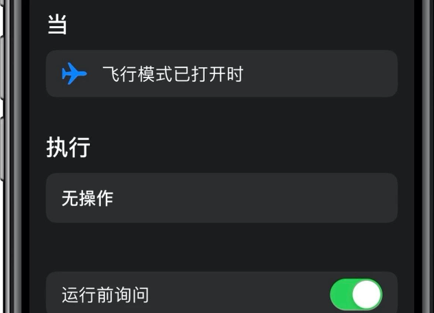
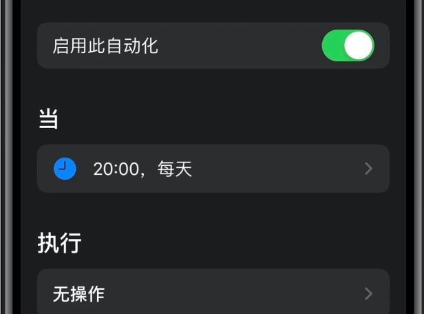

# 快捷指令自动化中的地理围栏功能不生效的解决方案

----

## 为什么不生效

参考：[快捷指令自动化运行需解锁？这些细节你需要了解一下](https://zhuanlan.zhihu.com/p/112860605)

打开快捷指令后，选择「自动化」，点击「 创建个人自动化 」在「新自动化」下面所提供的包括当天、时钟、达到等13个触发选项，我们都可以理解为自动化触发条件

其中触发场景按照自动运行和非自动运行可以分为两大类，首先我们看看自动运行有哪些场景

- 飞行模式
- 闹钟
- CarPlay 车载
- 勿扰模式
- 低电量模式
- NFC
- 打开 App
- Apple Watch 体能训练

在创建自动运行类自动化时，设置中会有「运行时询问」的选项。我们关闭运行前询问后的按钮，即可实现自动运行的效果

接下来看看非自动运行都有哪些场景

- 到达
- 我离开前
- 蓝牙
- 离开
- 当天
- Wi-Fi

在创建非自动运行类自动化时，设置中不会有「运行时询问」的选项。所以用这个类别下的场景作为触发条件，是无法实现自动运行的

所以以下需求能否自动运行的问题就有了答案

- [ ] 回答家时自动播放音乐
- [x] 闹钟关闭时自动运行「早安 | 晚安」
- [ ] 连接AirPods时自动播放音乐
- [x] 连接CarPlay 车载时自动开始导航
- [x] 低电量模式打开时自动关闭wifi或蓝牙

## 退而求其次的方案

参考：[关于位置的自动化不能自动运行](https://sharecuts.cn/post/3336)

如果是ios15，专注模式里面可以设置位置自动化，即到达某地开启xx专注模式，离开某地关闭xx专注模式。那么可以在快捷指令自动化里面设置如果这个专注模式被打开，就执行“某个功能 + 关闭专注模式”

### 实际场景

我的实际场景是米家里面，离开某个位置就开启摄像机。

具体操作如下：

1. 米家设置手动执行的智能：米家 - 智能 - 手动执行（新版本叫做批量控制） - 设置开启摄像机
2. 添加到Siri：设置完成后 - 添加到Siri（这样快捷方式才有对应操作）
3. 设置 - 专注模式中：设置某个专注模式 - 离开某个位置时 - 开启专注模式
4. 快捷指令中：条件为“专注模式 - 开启” - 执行为“关闭专注模式 + 米家关闭摄像机 + 等待3s”（[见讨论：这里要等待3s是因为米家app的显示，貌似是异步执行](https://www.v2ex.com/t/810135)）
