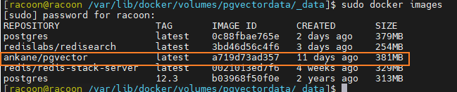
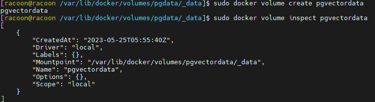
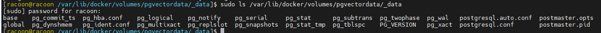
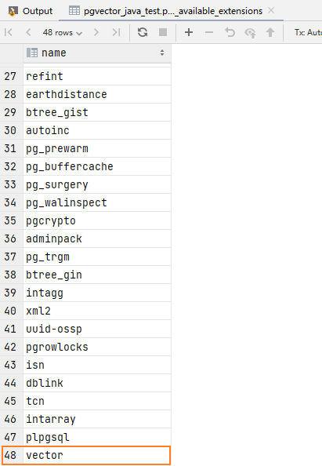
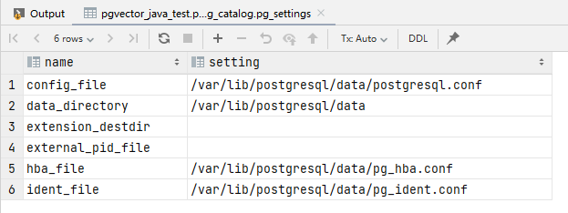

# 安装postgre和pgvector

---

## 安装

使用docker安装

* 拉取镜像

```bash
docker pull ankane/pgvector
```

* 查看镜像

```bash
docker images
```



* 创建本地卷

```bash
docker volume create pgdata
```



* 启动容器时，使用持久数据存储启动
  * run ：创建并运行一个容器；
  * –name ：指定容器名称。（容器名称 自己设置）
  * -e POSTGRES_PASSWORD =postgres，设置环境变量，指定数据库的登录口令为postgres
  * -p ：指定宿主机和 Docker 容器端口映射，冒号前为宿主机端口号，另一个是容器端口号。（Docker的容器默认情况下只能由本地主机访问，即A主机上的容器不能被B主机访问，所以要做端口映射）（端口号 自己设置）
  * -d ankane/pgvector ：指定使用ankane/pgvector作为镜像

```bash
sudo docker run --name pgvector -e POSTGRES_PASSWORD=postgres -p 5432:5432 -v pgvectordata:/var/lib/postgresql/data -d ankane/pgvector
```

* 验证持久数据目录

```bash
sudo ls /var/lib/docker/volumes/pgvectordata/_data
```



## 管理postgres

* 进入容器，新开一个 Terminal 进入容器

```bash
# 查看容器 ID
docker ps

docker exec -it containerName /bin/bash
```

* 切换到postgres用户

```bash
su postgres
```

* 创建sonar用户（一个新角色，可用于代码质量检测）

```bash
createuser -P -s -e sonar
```

* 连接数据库

```bash
psql
```

* 创建sonar数据库

```bash
create database sonar owner=sonar;
```

* 查看创建后的数据库

```bash
\l
```

### 查看PostgreSQL数据库Extension

* 查看当前服务器可用的Extension扩展列表

```sql
select name from pg_available_extensions;
```



* 安装可用的Extension扩展

```sql
create extension vector ;
```

* 删除Extension扩展，查看验证

```sql
drop extension vector ;
 
\dx
List of installed extensions
```

## 配置外网访问

* `select name, setting from pg_settings where category = 'File Locations'`找到配置文件地址



* 上述的查询结果中，有hba_file的地址，打开pg_hba.conf并做相应修改
  * 由于是docker安装的，要注意去映射到宿主机的目录中找
  * 规则说明
    * `host  all    all    192.168.1.0/24    md5`：表示允许网段192.168.1.0上的所有主机使用所有合法的数据库用户名访问数据库，并提供加密的密码验证。
      * 数字24是子网掩码，表示允许192.168.1.0--192.168.1.255的计算机访问
    * `host  all    all    0.0.0.0/0    md5`：表示允许所有主机使用所有合法的数据库用户名访问数据库，并提供加密的密码验证。

```bash
# TYPE DATABASE  USER    CIDR-ADDRESS     METHOD
# "local" is for Unix domain socket connections only
local all    all               trust
# IPv4 local connections:
host  all    all    127.0.0.1/32     trust
host  all    all    192.168.1.0/24    md5

host  all    all    0.0.0.0/0    md5
# IPv6 local connections:
host  all    all    ::1/128       trust
```

* 在同样有 config_file的地址，打开 postgresql.conf 并做相应修改。在其中添加 `listen_addresses = '*'`

## 参考

* [在Docker中安装Postgresql](https://zhuanlan.zhihu.com/p/434248483)
* [查看PostgreSQL数据库Extension](https://blog.csdn.net/zhanyong168/article/details/104361364)
