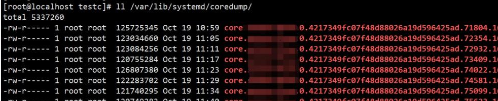

## 打开coredump

### 查看是否打开了coredump

```bash
ulimit -a   //未设置之前
```

### 当前连接打开coredump

可以使用下面命令修改

```bash
ulimit -c 1024
ulimit -c unlimited    //大小不受限
```

### 永久打开coredump

配置文件中修改

`vim /etc/profile`，然后添加上面的命令 `ulimit - c unlimited`.然后执行 `source /etc/profile`或者重启使刚刚的配置可以生效。

> Ubuntu20.4 坑1：这样修改并不能永久改变，因为在终端执行ulimit -c查看，并不是我们设置的结果。

## core文件存储路径

### CentOS

查看文件目录

```bash
$ cat /proc/sys/kernel/core_pattern
core
```

- 这里为core,表示其会在当前目录下生成一个名为core的缓存文件
- 例如，如果在 /home/user/my_program 目录下运行程序，并且核心转储文件的命名模式为 "core"，那么生成的核心转储文件将被保存在 /home/user/my_program 目录下，文件名为 "core"

**修改文件目录**

查看core_pattern 配置:

(*如果配置了路径，需要检查保存路径是否有写权限*)

```bash
cat /proc/sys/kernel/core_pattern
|/usr/lib/systemd/systemd-coredump %P %u %g %s %t %c %h %e
```

发现配置和以前不一样，所以临时改了下，改成：

```bash
echo  "core-%e-%p-%t" > /proc/sys/kernel/core_pattern
```

果然再次运行程序可以在可执行文件所在的目录生成core文件。

如果我们 `想让core文件固定产生在一个目录`中，可以在上面的配置中加上路径即可。 比如：

```bash
echo "/tmp/core-%e-%p-%t" >/proc/sys/kernel/core_pattern
```

* %% – 符号%
* %p – 进程号
* %u – 进程用户id
* %g – 进程用户组id
* %s – 生成core文件时收到的信号
* %t – 生成core文件的时间戳(seconds since 0:00h, 1 Jan 1970)
* %h – 主机名
* %e – 程序文件名

这样更改只是临时的，要想 `目录更改永久生效`可以通过更改配置文件：

```bash
$ vim /etc/sysctl.conf
添加一行：kernel.core_pattern=core-%e-%p-%t
```

执行：`sysctl -p` 让配置立刻生效。 写个测试代码：

```C
#include <stdio.h>
  
int main(int argc ,char * argv[])
{
        printf("hello core\n");
        int * p = NULL;
        *p = 2;
        return 0;
}

```

编译和执行：

```bash
gcc 1.c && a.out
```

生成core文件：

```bash
-rw------- 1 root root 499712 Oct 20 22:18 core-a.out-252068-1634739501
```

### CentOS8

centos8的默认配置有区别

```bash
|/usr/lib/systemd/systemd-coredump %P %u %g %s %t %c %h %e
```

看下手册说明:

```bash
Since kernel 2.6.19, Linux supports an alternate syntax for the
       /proc/sys/kernel/core_pattern file.  If the first character of
       this file is a pipe symbol (|), then the remainder of the line is
       interpreted as the command-line for a user-space program (or
       script) that is to be executed.
```

即从2.6.19内核版本以后，core的设置可以通过管道传递给用户的程序，这个程序必须写绝对路径，以空格分割后面传递的参数。后面用到的%P和前面的是一样的，标识进程号。

注意

* 这个程序以root用户和root用户组作为执行的用户和用户组，但是不会带来特殊权限绕过。
  简单来说，core通过管道的方式被 `/usr/lib/systemd/systemd-coredump` 程序处理了。
* 默认情况下core被以LZ4压缩的格式放置在/var/lib/systemd/coredump/ 目录中；
* 特意排查下没有core的主机确实如此，如下：



简单点，可以通过命令查看最近5个core文件：

```bash
coredumpctl list | tail -5
```


说明：

> The information shown for each core dump includes the date and time of the dump, the PID, UID, and GID of the dumping process, the signal number that caused the core dump, and the pathname of the executable that was being run by the dumped process

对于我们习惯core在当前文件产生，而且是非压缩的来说，这种压缩方式还挺难用，不过linux系统提供了一个命令，可以把core文件根据pid转存到当前目录，如下：

```bash
coredumpctl dump 92362 -o core
```

把pid为92362 的进程的core文件转存到本目录的core。 如果你要说我就喜欢原来的方式，也可以通过如下命令进行更改：

```bash
$ echo "kernel.core_pattern=core.%p" > \
/etc/sysctl.d/50-coredump.conf
#/lib/systemd/systemd-sysctl
```

临时的可以如下改下：

```bash
sysctl -w kernel.core_pattern="%e-%s.core"
```

和我们上面的改法没有实质的差别。

### Ubuntu

打开文件 `/etc/sysctl.conf` ，添加以下内容：

```bash
kernel.core_pattern = /var/core/core_%e_%p   
kernel.core_uses_pid = 0   //是否加上pid` 
```

这样看似完成了，但是被ubuntu server 20.04的core生成机制给坑了一把。所以还是生成不了。

```bash
$ cat /proc/sys/kernel/core_pattern
|/usr/share/apport/apport %p %s %c %d %P %E` 
```

> ubuntu的服务apport.service。自动生成崩溃报告，官方为了自动收集错误的。这个玩意会导致 `core_pattern`的设置不能一直有效，只要这个服务存在，系统重新启动后就会把 `core_pattern`改为一个特定的值，直接导致coredump无法生成。

这个服务对我们来说，基本没用。修改 `/etc/default/apport`文件，enabled 设置为0。这个时候再看一下：

```bash
$ cat /proc/sys/kernel/core_pattern
/var/core/core_%e_%p 
```

```bash
# ./test
段错误 (核心已转储)
# cd /var/core
root@jqw-virtual-machine:/var/core# ls
core_test_2422` 
```

## 使用

通常做法是

* 打开 `ulimit -c`后就会生成Core dump
  - `6.9G Nov 2 21:58 core.26972`
  - 注：因Coredump文件较大，所以通常在进程Crash的写Coredump时cpu load和iowait都较高
* 分析Core dump的一个工具是gdb，所以必须安装gdb
  - `$ gdb --version`
* 分析Java进程crash生成的coredump
  - 输入 `bt`或 `bt full`或 `wheres`命令查看backtrace
    - 从这里就可以看到一些实际的C堆栈
    - 如#15 0x00007f21149fcc3d in resizestack (L=0x2, n=0) at lj_state.c:71
  - btfull命令可以看到详细的信息包括调用参数等
  - 此时结合源代码如 lj_state.c:71 + 参数分析原因
* 按q退出

举例

```bash
gdb 应用程序名 core.xxx
> where
```

## 参考

- [core文件去哪里了](https://zhuanlan.zhihu.com/p/424222735)
- [ubuntu 16.04开启coredump并设置core文件的产生位置](https://blog.csdn.net/qq_16019185/article/details/82620803)
- [ubuntu server 20.04 systemd服务如何生成core文件](https://blog.csdn.net/qq_15328161/article/details/109085705)
- [Segmentation fault(core dumped)](https://zhuanlan.zhihu.com/p/201330829)
- [Core dump实战分析之Java版](https://www.jianshu.com/p/2cdf71f99209)
