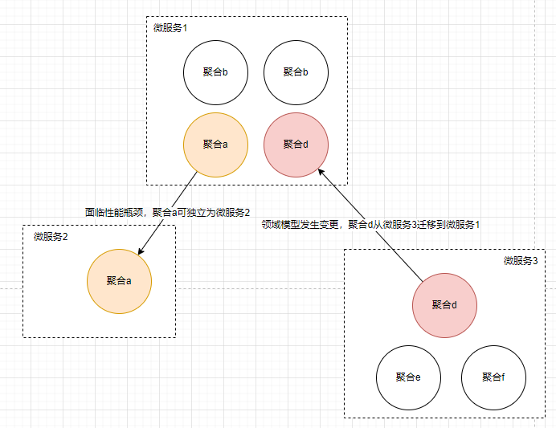
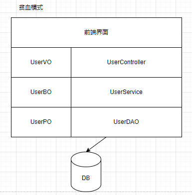
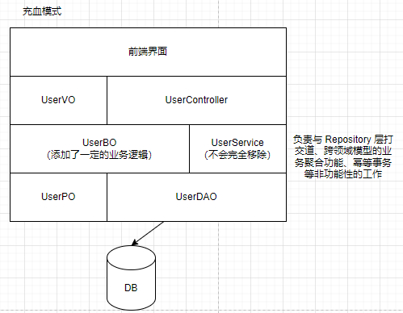
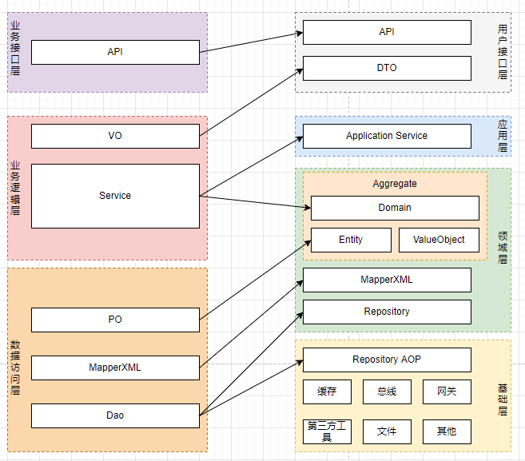
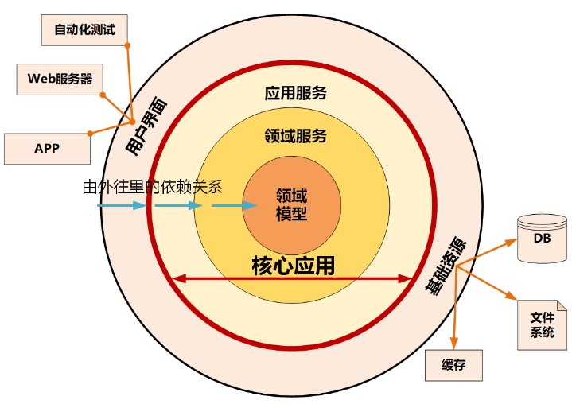
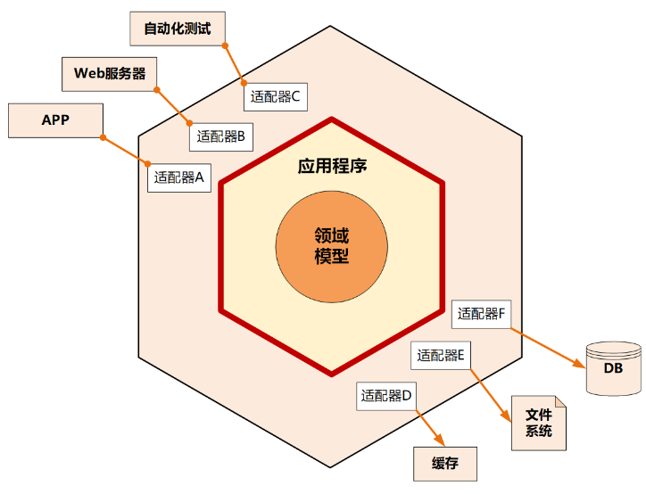
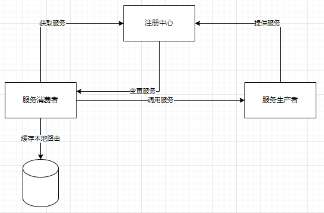
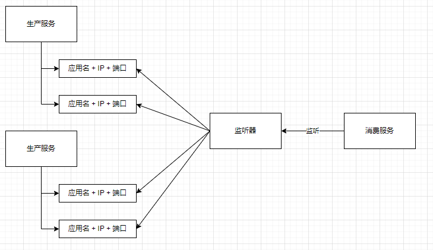
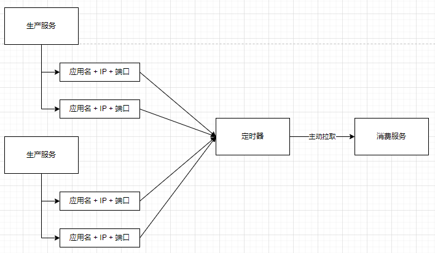

## 微服务的关注点

- 当我们准备确定微服务架构时（包括将旧的庞大的业务系统拆分成一个个简单的微服务时），就意味着我们希望通过合理的微服务设计，尽量让每次的需求变更都可以交给一个小团队独立完成，让需求变更落到某个微服务上进行变更。而不是简单的将服务拆分后，每次来一个需求，需要更新好几个微服务。
- 微服务的架构技术已经谈过了，虽然有一些细节需要调整，但本身并不算难，或者说并不算重点，我们还是应该将关注点放到如何真正的将微服务落地到具体业务。因为具体落地的时候才会发现，真正难的是微服务按照什么原则拆分、如何拆分，以及会面对哪些潜在的风险。
- 不合理的微服务拆分不仅不能提高研发效率，反倒使得研发效率更低。因为拆分不合理的情况下，会出现需求变更，多个微服务都要跟着变更。也就是说，有一个新的需求进来时，多个团队都要为了维护这个需求修改代码，或者多个微服务需要同时修改，同时发布，同时升级。

### 一个微服务要多小?

> 澳大利亚 REALESTATE. COM. AU 的 JON EAVES 认为， 一个 微服务应该可以在两周内完全重写，这个经验法则在他所处的特定上下文中是有效的。
> 我可以给出的另一个比较老套的答案是：足够小即可，不要过小。当我在会议上做演讲的时候，几乎每次都会问听众：谁认为自己的系统太大了，想把它拆成更小的。几乎所有人都会举手。看起来大家都能够意识到什么是“过大”，那么换句话说，如果你不再感觉你的代码库过大，可能它就足够小了。
> 纽曼(SAM NEWMAN). 微服务设计 (图灵程序设计丛书) (P. 2). 人民邮电出版社. KINDLE 版本.

### 拆分成微服务原则

（若有需要拆分的服务）
那么这里需要讨论两个问题：
1. 什么是高质量的代码？
2. 拆分成微服务的指导思想是什么？

什么是高质量代码？第一反应就是“高内聚，低耦合”，或者各种设计原则。但从目的出发，可以概括为：当用户提出一个需求变更时，为了实现这个变更而修改软件的成本越低越好。更具体一点，为实现这个变更而改的代码越少越好。

微服务拆分要求“小而专”，这就意味着不是简单的拆分，而是要在设计层面上做到“低耦合，高内聚”，或者说“单一职责原则”。再大白话一点，**就是有一个需求变更时，我们需要修改n个微服务的代码，然后测试n个微服务。那么最好的情况就是n等于0的时候，不过显然是不可能的，而次好的情况是n等于1**。那么，可以的出的结论是，**每个微服务都围绕着一个原因**，那么由于这个原因而需要更改的代码都会落在这个微服务中。

## 代码改造

针对业务系统，重新梳理概念模型 + 数据模型，切分出松耦合、高内聚的微服务，保障项目组在做正确的事情。

### 微服务架构的演进

一般来说，每个微服务代表的聚合业务并不是一层不变的，也就是说微服务本身不是一层不变的。



为了适应如上的微服务的演进，我们需要对代码进行改造

### 贫血和充血改造

- [贫血和充血模型说明](#贫血和充血模型)
- 注意，一般来说贫血处理查询，而充血处理增删改




## 传统三层架构调整

为了使代码能适应微服务架构的演进，如下调整传统的三层代码架构。
主要调整业务逻辑层和数据访问层。

- 接口层引入了 DTO（Data Transfer Object），给前端提供了更多的可使用数据和更高的展示灵活性。
- 将业务逻辑层的服务拆分到了应用层和领域层。.
    - 能够改善三层架构核心业务逻辑混乱，代码改动相互影响大的情况。
    - 应用层快速响应前端的变化
    - 领域层实现领域模型的能力。
- 将数据访问层拆分到领域层和基础层
    - 这里采用了仓储（Repository）设计模式，通过依赖倒置实现各层对基础资源的解耦。
    - 仓储接口放在领域层中，仓储实现放在基础层。原来三层架构通用的第三方工具包、驱动、Common、Utility、Config 等通用的公共的资源类统一放到了基础层。





## 微服务之间集成

- 同步调用增加防腐层（Anti-Corruption Layer, ACL）
    - 反腐败层定义：包含3个组件：适配、转换、外观，将系统中的一部分（DDD 称为边界上下文）与另一个边界上下文隔离开来。它的工作是确保一个边界概念中的语义不会"腐蚀"另一个边界概念的语义。
    - 在不共享相同语义的不同子系统之间实施外观或适配器层
- 异步调用采用消息队列的方式
    - 要保证最终一致性

## 处理底层技术耦合

## 本地有状态排查

### 什么是本地有状态

本地有状态服务：传统开发程序通常会保存一些本地化的数据。
我们需要处理程序中已有状态的数据存放。比如业务节点内存中保存用户登录所需的Session数据，这种数据经常会被保存在本地节点所开辟的一块内存空间中。

### 为什么需要处理

K8S会对Pod节点进行弹性扩缩和资源调度。如果服务在本地存储数据，那么就可能出现因为K8S的调度导致这部分已经存储在本地的数据丢失。因为启用新的业务Pod，无法读取原有的Pod上的数据。

### 有哪些本地有状态

- 客户端（一般没影响）
    - 对于BS架构的互联网应用来说，客户端主要分为页面缓存和浏览器缓存两种，对于APP而言主要是自身所使用的缓存
- 网络
    - 主要指代理服务器对客户端请求数据的缓存
    - Web代理缓存
    - 边缘缓存（CDN边缘缓存）
- 服务端
    - 服务器本地缓存（localCache），对于Java来说，本读缓存数据直接保存在JVM中
    - 服务器本地文件
    - 分布式缓存（Redis等）

### 如何解决

将这部分有状态的信息数据存储到一个公共的服务组件里去，而不是放在业务服务本地资源的空间里，比如我们可以把数据存储在数据库、消息队列、分布式存储里

## 组件标准
制定微服务开发规范，保障项目组按照统一的开发规范（技术架构）正确做事；

### 注册中心

#### 注册中心功能

- 服务注册表
    - 服务注册表是注册中心的核心，它用来记录各个微服务实例的信息，例如微服务的名称、IP、端口等。服务注册表提供查询API和管理API，查询API用于查询可用的微服务实例，管理API用于服务的注册与注销。
- 服务注册与发现
    - 服务注册是指微服务在启动时，将自己的信息注册到注册中心的过程。
    - 服务发现是指查询可用的微服务列表及网络地址的机制。
- 服务检查
    - 注册中心使用一定的机制定时检测已注册的服务，如发现某实例长时间无法访问，就会从服务注册表移除该实例。
- 
### 配置文件管理

ConfigMap没有版本管理
也就是说，万一想要回滚应用，而这个应用使用了ConfigMap，并且ConfigMap里面的内容也需要回滚，就会出问题。

### 端口问题

采用原生部署时，我们会考虑端口冲突问题，要考虑每个微服务的端口不能一样，因为使用原生部署应用时，同一台服务器启动多个任务端口会冲突，又有机器节点故障时需要手动迁移应用的情况，如果部分微服务端口一样，迁移的过程可能会受阻。
而使用容器部署时，每个容器相互隔离，所有应用可以采用同样的端口。

## 业务日志改造

### 日志收集方案

#### 方案一：打印到标准输出

通过在每个节点上运行一个日志收集的 agent 来采集日志数据，日志采集 agent 是一种专用工具，用于将日志数据推送到统一的后端。一般来说，这种 agent 用一个容器来运行，可以访问该节点上所有应用程序容器的日志文件所在目录。

由于这种 agent 必须在每个节点上运行，所以直接使用 DaemonSet 控制器运行该应用程序即可。在节点上运行一个日志收集的 agent 这种方式是最常见的一直方法，因为它只需要在每个节点上运行一个代理程序，并不需要对节点上运行的应用程序进行更改，对应用程序没有任何侵入性，但是这种方法也仅仅适用于收集输出到 stdout 和 stderr 的应用程序日志。

#### 方案二：sidecar容器收集日志
可以直接在 Pod 中启动另外一个 sidecar 容器，直接将应用程序的日志通过这个容器重新输出到 stdout，这样是不是通过上面的节点日志收集方案又可以完成了。

由于这个 sidecar 容器的主要逻辑就是将应用程序中的日志进行重定向打印，所以背后的逻辑非常简单，开销很小，而且由于输出到了 stdout 或者 stderr，所以我们也可以使用 kubectl logs 来查看日志了。

#### 方案三：直接从应用程序收集日志
也完全可以通过直接在应用程序中去显示的将日志推送到日志后端

#### 结论

方案一
- 所有日志都必须是out前台输出，真实业务场景中无法保证所有日志都在前台输出
- 只能有一个日志输出文件，而真实业务场景中往往有多个日志输出文件

方案二
- 低耦合，扩展性强，方便维护和升级
- 需要对kubernetes的yaml文件进行单独配置，略显繁琐

方案三
- 可以不需要k8s
- 需要侵入代码

### 日志规范

#### 日志的字段

日志中通常必备的字段有：Time、Level、Location。对于特定模块/流程/业务，还需要有一些 Common 的字段，

例如：
- 如果使用 Trace 系统，可以把 TraceID 附加到日志中；
- 固定的流程需要附加对应的字段，例如订单的生命周期中，一定要有订单号、用户 ID 等信息，这些信息可以通过 Context 附加到对应流程的日志实例上；
- HTTP 请求需要记录：URL、Method、Status、Latency、Inflow、OutFlow、ClientIP、UserAgent 等，详情可以参考 Nginx日志格式；
- 如果多个模块的日志都打印到同一个流/文件中，必须有字段标识模块名。

日志的字段规约最好由运维平台/中间件平台自顶向下推动，约束每个模块/流程的程序员按照规定打印日志。

#### 日志表现形式
- 使用 KeyValue 对形式的日志格式，比如我们阿里的飞天日志库采用的就是这种形式

```log
[2019-12-30 21:45:30.611992]    [WARNING]       [958] [block_writer.cpp:671]  path:pangu://localcluster/index/3/prom/7/1577711464522767696_0_1577711517     min_time:1577712000000000       max_time:1577715600000000       normal_count:27595      config:prom     start_line:57315569     end_line:57343195       latency(ms):42  type:AddBlock
```

- 另外推荐的是 JSON 日志格式，支持以 JSON 格式输出的日志库很多，而且大部分的日志采集 Agent 都支持 JSON 格式的日志收集。

```json
{"addr":"tcp://0.0.0.0:10010","caller":"main.go:98","err":"listen tcp: address tcp://0.0.0.0:10010: too many colons in address","level":"error","msg":"Failed to listen","ts":"2019-03-08T10:02:47.469421Z"}
```

注意：绝大部分场景不建议使用非可读的日志格式（例如 ProtoBuf、Binlog 等）。

#### 单条日志换行问题

非必要情况下，尽量不要一条日志输出成多行，这种对于采集、解析和索引的代价都比较高。

#### 控制日志输出量

日志的输出量直接影响到磁盘使用以及对于应用的性能消耗，日志太多不利于查看、采集、分析；日志太少不利于监控，同时在出现问题的时候没办法调查。

一般线上应用需合理控制日志的数据量：

- 服务入口的请求和响应日志没有特殊原因都要输出并采集，采集的字段可以根据需求调整；
- 错误日志一般都要打印，如果太多，可以使用采样方式打印；
- 减少无效日志输出，尤其是循环中打印日志的情况需尽量减少；
- 请求型的日志（比如 Ingress、Nginx 访问日志）一般不超过 5MB/s（500 字节每条，不超过 1W/s），应用程序日志不超过 200KB/s（2KB 每条，不超过 100 条/s）。

#### 参考

- [日志规范](#日志规范)
- [9 个技巧，解决 K8s 中的日志输出问题](https://developer.aliyun.com/article/747821)


## 微服务的运营管理
微服务拆分之后，最大的挑战来自于运维、监控、故障处理，如果团队没有微服务运行的经验，故障之后无法快速定位、快速回复，会受到更大的业务压力，因此后期的微服务运营平台或者管理平台对团队异常重要，需要配套设计及时跟上，支撑微服务的运行管理。

### 内存溢出问题排查
这个问题承接日志改造
这里以对 Java 内存溢出问题的分析为例

在原有部署模式中，一旦业务服务出现问题，至少本地的日志和场景仍然能够保存，通过登录服务器是可以查看的。但是在K8S + 容器中，如果Java服务内存溢出，就会导致K8S里面的Pod节点不可用，则造成我们无法通过登录容器进行分析和排查。

原有部署模式中，我们常用jmap，通过 -dump 选项，把 Java 堆中的对象 dump 到本地文件，然后进行分析。
容器化的方式也是同样的道理，我们的目的还是要把容器里面的日志导入 node 节点，或者导出到中心化的存储上去。可以用这种方式来做：在 docker 里面挂接一个 node 节点存储空间（PVC），接着配置一个参数，在 JVM 上通过配置 DumpPath（路径在你共享的硬盘上），这样就可以实现在内存溢出后，把这些信息都 dump 到你的共享硬盘的路径下。那么再出现内存溢出问题时，即使你的 Pod 节点不可用了，但是日志还是能够非常清晰的在 node 本地并留存。

### 程序健康问题

[容器探针](#容器探针)

- tcpSocket: 端口健康检查
- exec: 根据指定命令的返回值
- httpGet: 接口级健康检查
    - 程序需要改造出一个健康检查接口
    - 接口本身任意一个都是可以的，但是最后有一个统一的规范

# 附录

## 仓储模式

- 仓储本质上是提供提供数据的抽象
- 仓储模式包含仓储接口和仓储实现
    - 仓储接口面向领域层提供基础层数据处理相关的接口，
    - 仓储实现完成仓储接口对应的数据持久化相关的逻辑处理。
    - 一个聚合配备一个仓储，由仓储完成聚合数据的持久化。领域层逻辑面向仓储接口编程，聚合内的数据持久化过程为DO（领域对象）转PO（持久化对象）
- 可以看看代码设计
    - https://www.cnblogs.com/jiyukai/p/14825980.html
    - https://www.cnblogs.com/CreateMyself/p/14259187.html

## 架构模型

### 整洁架构

整洁架构又名“洋葱架构”。整洁架构的层就像洋葱片一样，它体现了分层的设计思想。在整洁架构里，同心圆代表应用软件的不同部分，从里到外依次是领域模型、领域服务、应用服务和最外围的容易变化的内容，比如用户界面和基础设施。

整洁架构最主要的原则是依赖原则，它定义了各层的依赖关系，**越往里依赖越低，代码级别越高，越是核心能力**。外圆代码依赖只能指向内圆，内圆不需要知道外圆的任何情况。

在洋葱架构中，各层的职能是这样划分的：





- 领域模型实现领域内核心业务逻辑，它封装了企业级的业务规则。**领域模型的主体是实体，一个实体可以是一个带方法的对象，也可以是一个数据结构和方法集合**。
- 领域服务实现涉及多个实体的复杂业务逻辑。
- 应用服务实现与用户操作相关的服务组合与编排，它包含了应用特有的业务流程规则，封装和实现了系统所有用例。
- 最外层主要提供适配的能力，适配能力分为主动适配和被动适配。主动适配主要实现外部用户、网页、批处理和自动化测试等对内层业务逻辑访问适配。被动适配主要是实现核心业务逻辑对基础资源访问的适配，比如数据库、缓存、文件系统和消息中间件等。
- 红圈内的领域模型、领域服务和应用服务一起组成软件核心业务能力

### 六边形架构

六边形架构又名“端口适配器架构”。追溯微服务架构的渊源，一般都会涉及到六边形架构。





**六边形架构的核心理念是：应用是通过端口与外部进行交互的**。这也是微服务架构下 API 网关盛行的主要原因。

在六边形架构中，**红圈内的核心业务逻辑（应用程序和领域模型）与外部资源（包括 APP、Web 应用以及数据库资源等）完全隔离，仅通过适配器进行交互**。它**解决了业务逻辑与用户界面的代码交错问题，很好地实现了前后端分离**。六边形架构各层的依赖关系与整洁架构一样，都是由外向内依赖。

六边形架构将系统分为内六边形和外六边形两层，这两层的职能划分如下：

- 红圈内的六边形实现应用的核心业务逻辑；
- 外六边形完成外部应用、驱动和基础资源等的交互和访问，对前端应用以 API 主动适配的方式提供服务，对基础资源以依赖倒置被动适配的方式实现资源访问。
- 六边形架构的一个端口可能对应多个外部系统，不同的外部系统也可能会使用不同的适配器，由适配器负责协议转换。这就使得应用程序能够以一致的方式被用户、程序、自动化测试和批处理脚本使用

### 参考

[架构模型](https://hanchenhao.github.io/MadBOK/DomainDrivenDesign/09-%E6%9E%B6%E6%9E%84%E6%A8%A1%E5%9E%8B.html#%E6%95%B4%E6%B4%81%E6%9E%B6%E6%9E%84)

## Kubernetes常用日志收集方案

[Kubernetes 常用日志收集方案](https://ost.51cto.com/posts/12304)

## 贫血和充血模型

### MVC架构
在Java后台中，MVC架构是一种常见的系统架构，其核心目的在我看来是为了解耦。M-model，V-view，C-controller，另外MVC对于不同的项目和业务而言并没有非常严格的限制，在前后分离的项目中，对于后台而言，MVC一般分为为DAO（Repository）、Service、Controller。

### 贫血模型

贫血模型（Anemic Domain Model），只包含数据，不包含业务逻辑的类。由于数据与操作分离，破坏了面向对象的封装特性，是一种典型的面向过程的编程风格。

举个例子来讲
- User、UserDAO作为数据访问层
- UserBO、UserService作为业务逻辑层
- UserVO、UserController作为接口层；

其中UserBO只作为纯粹的数据结构，没有业务处理，业务逻辑集中在Service中。像UserBO这样的纯数据结构的就可以称之为贫血模型，同样的还有User和UserVO，这样的设计破坏了Java面向对象设计的封装特性，属于面向过程的编程风格。

### 充血模型

充血模型（Rich Domain Model），将数据和业务放在一个类里面。这种充血模型满足面向对象的封装特性，是典型的面向对象编程风格。
DDD核心是为了根据业务对系统的服务进行拆分。领域驱动设计的核心还是基于对业务的理解，不能一味追求这样的概念。对于充血模型的开发的MVC架构，其核心区别在于Service层：包含Domain类和Service类。Domain对于BO而言，添加了一定的业务逻辑，降低Service中的业务逻辑量。

### 为什么贫血模式比充血模式流行

- 那么充血模型对于贫血模型好在哪里呢？对于贫血模型而言，由于**数据和业务的分离，数据在脱离业务的情况下可以被任务程序修改，数据操作将不受限制等**。
- 为什么贫血模型这么盛行？一是对于大部分业务而言都比较简单，基本上都是围绕SQL的CRUD操作，仅仅通过贫血模型设计就可以完成业务。而是充血模型的设计难度较大。
- 两者设计思路的区别？
    - 前者通常是在拿到需求后，先根据数据库表建立Modle，然后Servcie、Controller等进行代码填充，其中一个很重要的核心就是SQL，对于这个需求而言，大部分业务都是围绕这简单亦或复杂的SQL来完成的，当这个模块需要其它功能的时候，往往都是在基础上添加SQL来实现的。这样就会导致其中有很大一部分代码产生冗余，随着业务的深入，将会有大量类似的SQL出现在系统中。在这个过程中，基本上就忽略了DDD开发模式，失去了很多代码复用的机会。 
    - 基于充血模型的DDD开发模式下，首先需要根据业务，定义领域模型所包含的数据和方法，相当于设计可复用的业务中间层。对于之后的新功能的开发，都将基于这些已经定义好的领域模型来开发。
    - 两者很大的区别就在于后者会花费更多的时间在领域模型设计上。

### 小结
基于充血模型的 DDD 开发模式跟基于贫血模型的传统开发模式相比，主要区别在 Service层。在基于充血模型的开发模式下，我们将部分原来在 Service 类中的业务逻辑移动到了一个充血的 Domain 领域模型中，让 Service 类的实现依赖这个 Domain 类。 在基于充血模型的 DDD 开发模式下，Service 类并不会完全移除，而是负责一些不适合放在 Domain 类中的功能。比如，负责与 Repository 层打交道、跨领域模型的业务聚合功能、幂等事务等非功能性的工作

### 参考
- [代码设计-贫血模型和充血模型](https://juejin.cn/post/7034390958460370958)


## 日志规范

### 为何需要规范日志

1.	日志能够快速反应系统的运行状态
2.	能够便于后期运维和开发人员迅速定位线上问题
3.	和监控系统结合，便于监控系统进行日志采集，拿到系统运行的相关指标，有利于分析系统的性能瓶颈，提前规避风险
4.	便于统计与业务相关的指标数据，进行相关的业务分析和功能优化

### 日志规范

#### 日志文件命名

- 类型标识：指此日志文件的功能或者用途。比如web服务我们常有access.log和request.log日志文件，其中access和request就是类型标识，而java的gc日志通常命名为gc.log，这样一目了然。而通常用来记录服务的整体运行日志一般用服务名称（serviceName，appkey）或者机器名（hostName）来命名，如nginx.log
- 日志级别
    - 日志级别一般分为：DEBUG、INFO、WARN、ERROR、FATAL
    - 在实际编写代码中，可以采取严格匹配模式或者非严格匹配模式
        - 严格匹配模式即INFO日志文件中只打印INFO日志，ERROR日志文件只打印ERROR日志
        - 非严格匹配模式即INFO日志文件可以打印INFO日志、WARN日志、ERROR日志、FATAL日志，WARN日志文件可以打印WARN日志、ERROR日志、FATAL日志，以此类推
- 日志生成时间：在日志文件名称中附带上日志文件创建的时间，方便在查找日志文件时进行排序
- 日志备份编号：当进行日志切割时，如果是以文件大小进行滚动，此时可以在日志文件名称末尾加上编号

#### 日志滚动

- 第一种：按照时间滚动
- 第二种：按照单个日志文件大小滚动
- 第三种：同时按照时间和单个日志文件大小滚动。

#### 日志级别

日志的级别通常有以下几种：debug/trace、info、warning、error、fatal

这几种日志级别的严重程序依次递增：

- debug/trace：debug和trace级别的日志由于打印内容较多，所以通常情况下不适用于线上生产环境使用，一般使用于前期线下环境调试。即使线上环境要使用，也需要通过开关来控制，只在定位追踪线上问题时才开启；
- info：info日志一般用来记录系统运行的关键状态、关键业务逻辑或者关键执行节点。但切记一点，info日志绝不可滥用，如果info日志滥用，则和debug/trace日志没有太大区别了。
- warning：warning日志一般用来记录系统运行时的一些非预期情况，顾名思义，是作为一种警示，提醒开发和运维人员需要关注，但是不用人为介入立刻去处理的。
- error：error日志一般用来记录系统运行时的一些普通错误，这些错误一旦出现，则表示已经影响了用户的正常访问或者使用，通常意味着需要人为介入处理。但很多时候在生产环境中，也不一定是出现error日志就需要人工立即介入处理的，通常会结合error日志的数量以及持续时间来进行综合判断。
- fatal：属于系统致命错误，一般出现意味着系统基本等于挂掉了，需要人工立即介入处理。

#### 日志打印时机选择
由于日志是为了方便我们了解系统当前的运行状况以及定位线上问题，所以日志打印的时机非常重要，如果滥用日志，则会导致日志内容过多，影响问题定位的效率；如果日志打印过少，则容易导致缺少关键日志，导致在线上定位问题时找不到问题根音。因此把握日志打印的时机至关重要，以下是常见的适合打印日志的时机：

1. http调用或者rpc接口调用:在程序调用其他服务或者系统的时候，需要打印接口调用参数和调用结果(成功/失败)。
2. 程序异常:在程序出现exception的时候，要么选择向上抛出异常，要么必须在catch块中打印异常堆栈信息。不过需要注意的是，最好不要重复打印异常日志，比如在catch块里既向上抛出了异常，又去打印错误日志(对外rpc接口函数入口处除外)。
3. 特殊的条件分支:程序进入到一些特殊的条件分支时，比如特殊的else或者switch分支。比如我们根据工龄计算薪资：

```java
public double calSalaryByWorkingAge(int age) {
    // 理论上工龄不可能小于0，所以需要打印出这种非预期情况，当然通过抛出异常的方式也是可行的。
    if (age < 0) {
        logger.error("wrong age value, age:{}", age);
        return 0;
    }
    // ..
}
```
4.	关键执行路径及中间状态:在一些关键的执行路径以及中间状态也需要记录下关键日志信息，比如一个算法可能分为很多步骤，每隔步骤的中间输出结果是什么，需要记录下来，以方便后续定位跟踪算法执行状态。
5.	请求入口和出口:在函数或者对外接口的入口/出口处需要打印入口/出口日志，一来方便后续进行日志统计，同时也更加方便进行系统运行状态的监控。

#### 日志内容与格式

日志打印时机决定了能够根据日志去进行问题定位，而日志的内容决定了是否能够根据日志快速找出问题原因，因此日志内容也是至关重要的。通常来说，一行日志应该至少包括以下几个组成部分：

- logTag
- param
- exceptionStacktrace

logTag为日志标识，用来标识此日志输出的场景或者原因，param为函数调用参数，exceptionStacktrace为异常堆栈。举例说明：

```java
// good case
public class HttpClient {
    private static final Logger LOG = LoggerFactory.getLogger(HttpClient.class);
    public static String sendPost(String url, String param) {
        try {
            // do something
        } catch (Exception ex) {
            // 有关键logTag，有参数信息，有错误堆栈
            LOG.error("post request error!!!, url:[[}], param:[{}]", url, param, ex);
        } finally {
            try {
                // ……
            } catch (IOException ex) {
                LOG.error("close stream error!!!, url:[[}], param:[{}]", url, param, ex);
            }
            return xxx;
        }
    }
}
```

另外，对于对外http接口或者rpc接口，最好对于每个请求都有requestId，以便跟踪每个请求后续所有的执行路径。

## 容器探针

容器探测用于检测容器中的应用实例是否正常工作，是保障业务可用性的一种传统机制。如果经过探测，实例的状态不符合预期，那么kubernetes就会把该问题实例“摘除”,不承担业务流量。

kubernetes提供了两种探针来实现容器探测，分别是：
- livenessProbes: 存活性探针,用于检测应用实例当前是否处于正常运行状态,如果不是，k8s会重启容器
- readinessProbes: 就绪性探针，用于检测应用实例当前是否可以接收请求，如果不能，k8s不会转发流量

上面两种探针目前均支持三种探测方式
- Exec命令：在容器内执行一次命令，如果命令执行的退出码是0，则认为程序正常，否则不正常

```yaml
...
livenessProbe
  exec:
    command
    - cat
    - /tmp/health
...
```

- TCPSocket：将会尝试访问一个用户容器的端口，如果能够建立这条连接，则认为程序正常，否则不正常

```yaml
...
livenessProbe
  tcpSocket:
    port: 8080
...
```

- HTTPGet：调用容器内Web应用的URL，如果返回的状态码在200和399之间，则认为程序正常，否则不正常

```yaml
...
livenessProbe
  httpGet:
    path: /   # URI地址
    port: 80  # 端口号
...
```

## 服务中心

### 服务中心架构
 




整体的执行流程如下：
- 在服务启动时，服务提供者通过内部的注册中心客户端应用自动将自身服务注册到注册中心，包含主机地址、服务名称等等信息；
- 在服务启动或者发生变更的时候，服务消费者的注册中心客户端程序则可以从注册中心中获取那些已经注册的服务实例信息或者移除已下线的服务
- 上图还多一个设计缓存本地路由，缓存本地路由是为了提高服务路由的效率和容错性，服务消费者可以配备缓存机制以加速服务路由。更重要的是，当服务注册中心不可用时，服务消费者可以利用本地缓存路由实现对现有服务的可靠调用

### 及时知道变更

在整个执行的过程中，其中有点有一点是比较难的，服务消费者如何及时知道服务的生产者如何及时变更的，这个问题也是经典的生产者消费者的问题，解决的方式有两种
- 发布-订阅模式：服务消费者能够实时监控服务更新状态，通常采用监听器以及回调机制，经典的案例就是Zookeeper；





- 主动拉取策略：服务的消费者定期调用注册中心提供的服务获取接口获取最新的服务列表并更新本地缓存,经典案例就是Eureka；





### 参考
- [5种微服务注册中心如何选型？这几个维度告诉你！](https://juejin.cn/post/7012084821224603656)

