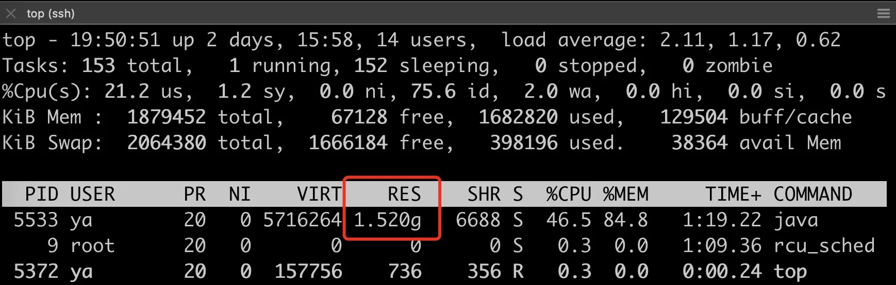
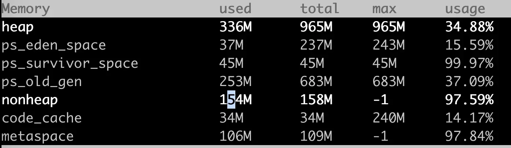

# JVM内存分布

# 整体定位哪块出了问题

JVM 启动完通过 top 看到的 RES 内存就已经超过了 1.5G



那么需要查看内存分布情况，这里推荐使用alibaba提供的工具`arthas`（[安装说明](#arthas)见附录）

启动后，输入`dashboard`查看当前的内存使用情况，如下所示



可以看到发现进程占用的堆内存只有 300M 左右，非堆（non-heap）也很小，加起来才 500 M 左右，那内存被谁消耗了。这就要看看 JVM 内存的几个组成部分了

我一般这样划分：


每种类型的内存都有其特定的用途，理解它们的区别和用途对于优化 JVM 性能和排查内存问题非常重要。

从前面内存分布图可以看出，可以知道，JVM的内存大概分为下面几个部分

- 堆（Heap）：eden、metaspace、old 区域等
- 线程栈（Thread Stack）：每个线程栈预留 1M 的线程栈大小
- 非堆（Non-heap）：包括 code_cache、metaspace 等
- 堆外内存
  - unsafe.allocateMemory 和 DirectByteBuffer 申请的堆外内存
  - native （C/C++ 代码）申请的内存
- 还有 JVM 运行本身需要的内存，比如 GC 等。

所以，我们将矛盾直指剩下的区域

接下来怀疑堆外内存和 native 内存可能存在泄露问题。堆外内存可以通过 开启 `NMT（NativeMemoryTracking)` 来跟踪，加上 `-XX:NativeMemoryTracking=detail` 再次启动程序，也发现内存占用值远小于 RES 内存占用值。

这个参数可以追踪以下类型的内存：

- Java堆（Heap）：这是 JVM 运行时数据区的主要区域，其中存储了所有类实例和数组。
- 类（Class）：这部分内存存储了类和类加载器。
- 线程（Thread）：每个线程在 JVM 中都有一些本地内存，包括线程栈。
- 代码（Code）：这部分内存存储了 JVM 的代码缓存。
- GC（Garbage Collector）：这部分内存被垃圾收集器使用。
- 内部（Internal）：这部分内存被 JVM 内部使用，用于各种目的。
- 符号（Symbol）：这部分内存存储了 JVM 使用的符号。
- NIO（Native Input/Output）：这部分内存被 Java 的 NIO 库使用。
- 其他（Other）：这部分内存被 JVM 使用，但不属于上述任何类别。

也就是说，NMT 不会追踪 native （C/C++ 代码）申请的内存，到这里基本已经怀疑是 native 代码导致的

# 附录

## arthas

[文档看这里](https://arthas.aliyun.com/doc/)

### 安装

authas是一个jar包，可以直接下载后运行，推荐使用 arthas-boot.jar 。下载arthas-boot.jar，然后用java -jar的方式启动

```bash
## 下载
wget https://alibaba.github.io/arthas/arthas-boot.jar
```

### 启动

```bash
## 第一次启动会下载依赖包
java -jar arthas-boot.jar [pid]
```

### 问题

如果碰到如下错误，是因为`Java程序运行用户与arthas运行用户不一致`

```bash
[INFO] Try to attach process 26614
Picked up JAVA_TOOL_OPTIONS:
[ERROR] Start arthas failed, exception stack trace:
com.sun.tools.attach.AttachNotSupportedException: Unable to open socket file: target process not responding or HotSpot VM not loaded
        at sun.tools.attach.LinuxVirtualMachine.<init>(LinuxVirtualMachine.java:106)
        at sun.tools.attach.LinuxAttachProvider.attachVirtualMachine(LinuxAttachProvider.java:78)
        at com.sun.tools.attach.VirtualMachine.attach(VirtualMachine.java:250)
        at com.taobao.arthas.core.Arthas.attachAgent(Arthas.java:102)
        at com.taobao.arthas.core.Arthas.<init>(Arthas.java:27)
        at com.taobao.arthas.core.Arthas.main(Arthas.java:161)
[ERROR] attach fail, targetPid: 26614
```

如果服务器没有网络，可以按如下方法进行离线安装

1. 先在可联网的电脑上，执行java -jar arthas-boot.jar，从执行记录中可以看到，下载下来的依赖包放在了
2. 进入到/Users/jinchao/.arthas/lib/3.1.7/arthas路径下，把所有的内容打包即可，与arthas-boot.jar一起上传到离线的服务器。
3. 把打包的文件放在服务器上的用户根目录下，比如jinchao用户，放在/home/jinchao/.arthas下就可以。当然也可以指定执行路径。


