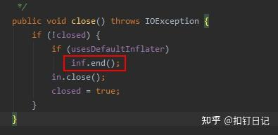

# Java进程内存问题排查

## 问题现象

7月25号，我们一服务的内存占用较高，约13G，容器总内存16G，占用约85%，触发了内存报警(阈值85%)，而我们是按容器内存60%(9.6G)的比例配置的JVM堆内存。看了下其它服务，同样的堆内存配置，它们内存占用约70%~79%，此服务比其它服务内存占用稍大。


那为什么此服务内存占用稍大呢，它存在内存泄露吗？

## 排查步骤

### 检查Java堆占用与gc情况

```bash
jcmd 1 GC.heap_info
```


```bash
jstat -gcutil 1 1000
```

可见堆使用情况正常。

### 检查非堆

用arthas的memory命令查看

### 开启JVM的NMT原生内存追踪功能

添加JVM参数-XX:NativeMemoryTracking=detail开启，使用jcmd查看，如下：

```
jcmd 1 VM.native_memory summary
```

NMT只能观察到JVM管理的内存，像通过JNI机制直接调用malloc分配的内存，则感知不到。

### 检查native内存


linux进程启动时，有代码段、数据段、堆(Heap)、栈(Stack)及内存映射段，在运行过程中，应用程序调用malloc、mmap等C库函数来使用内存，C库函数内部则会视情况通过brk系统调用扩展堆或使用mmap系统调用创建新的内存映射段。

而通过pmap命令，就可以查看进程的内存布局，它的输出样例如下：


可以发现，进程申请的所有虚拟内存段，都在pmap中能够找到，相关字段解释如下：

- Address：表示此内存段的起始地址
- Kbytes：表示此内存段的大小(ps：这是虚拟内存)
- RSS：表示此内存段实际分配的物理内存，这是由于Linux是延迟分配内存的，进程调用malloc时Linux只是分配了一段虚拟内存块，直到进程实际读写此内存块中部分时，Linux会通过缺页中断真正分配物理内存。
- Dirty：此内存段中被修改过的内存大小，使用mmap系统调用申请虚拟内存时，可以关联到某个文件，也可不关联，当关联了文件的内存段被访问时，会自动读取此文件的数据到内存中，若此段某一页内存数据后被更改，即为Dirty，而对于非文件映射的匿名内存段(anon)，此列与RSS相等。
- Mode：内存段是否可读(r)可写(w)可执行(x)
- Mapping：内存段映射的文件，匿名内存段显示为anon，非匿名内存段显示文件名(加-p可显示全路径)。

因此，我们可以找一些内存段，来看看这些内存段中都存储的什么数据，来确定是否有泄露。但jvm一般有非常多的内存段，重点检查哪些内存段呢？

有两种思路，如下：

检查那些占用内存较大的内存段，如下：

 ```bash
 pmap -x 1 | sort -nrk3 | less 
 ```

 

 可以发现我们进程有非常多的64M的内存块，而我同时看了看其它java服务，发现64M内存块则少得多。

检查一段时间后新增了哪些内存段，或哪些变大了，如下：

在不同的时间点多次保存pmap命令的输出，然后通过文本对比工具查看两个时间点内存段分布的差异。

```bash
pmap -x 1 > pmap-`date +%F-%H-%M-%S`.log
```


```bash
icdiff pmap-2023-07-27-09-46-36.log pmap-2023-07-28-09-29-55.log | less -SR
```


可以看到，一段时间后，新分配了一些内存段，看看这些变化的内存段里存的是什么内容！

```bash
tail -c +$((0x00007face0000000+1)) /proc/1/mem|head -c $((11616*1024))|strings|less -S
```

说明：

- Linux将进程内存虚拟为伪文件/proc/$pid/mem，通过它即可查看进程内存中的数据。
- tail用于偏移到指定内存段的起始地址，即pmap的第一列，head用于读取指定大小，即pmap的第二列。
- strings用于找出内存中的字符串数据，less用于查看strings输出的字符串。


通过查看各个可疑内存段，发现有不少类似我们一自研消息队列的响应格式数据，通过与消息队列团队合作，找到了相关的消息topic，并最终与相关研发确认了此topic消息最近刚迁移到此服务中。

### 检查被glibc内存分配器缓存的内存

JVM等原生应用程序调用的malloc、free函数，实际是由基础C库libc提供的，而linux系统则提供了brk、mmap、munmap这几个系统调用来分配虚拟内存，所以libc的malloc、free函数实际是基于这些系统调用实现的。

由于系统调用有一定的开销，为减小开销，libc实现了一个类似内存池的机制，在free函数调用时将内存块缓存起来不归还给linux，直到缓存内存量到达一定条件才会实际执行归还内存的系统调用。

所以进程占用内存比理论上要大些，一定程度上是正常的


**malloc_stats函数**

通过如下命令，可以确认glibc库缓存的内存量，如下：

```bash
# 查看glibc内存分配情况，会输出到进程标准错误中
gdb -q -batch -ex 'call malloc_stats()' -p 1   
```


如上，Total (incl. mmap)表示glibc分配的总体情况(包含mmap分配的部分)，其中system bytes表示glibc从操作系统中申请的虚拟内存总大小，in use bytes表示JVM正在使用的内存总大小(即调用glibc的malloc函数后且没有free的内存)。

可以发现，glibc缓存了快500m的内存。

> 注：当我对jvm进程中执行malloc_stats后，我发现它显示的in use bytes要少得多，经过检查JVM代码，发现JVM在为Java Heap、Metaspace分配内存时，是直接通过mmap函数分配的，而这个函数是直接封装的mmap系统调用，不走glibc内存分配器，故in use bytes会小很多。

**malloc_trim函数**

glibc实现了malloc_trim函数，通过brk或madvise系统调用，归还被glibc缓存的内存，如下：

```bash
# 回收glibc缓存的内存
gdb -q -batch -ex 'call malloc_trim(0)' -p 1    
```


可以发现，执行malloc_trim后，RSS减少了约250m内存，可见内存占用高并不是因为glibc缓存了内存。

> 注：通过gdb调用C函数，会有一定概率造成jvm进程崩溃，需谨慎执行。

### 使用tcmalloc的内存泄露检测工具

[使用gperftools分析内存](2025/20250320-使用gperftools分析内存.md)

最终得到pdf如下：


如上，可以发现内存泄露点来自Inflater对象的init和inflateBytes方法，而这些方法是通过JNI调用实现的，它会申请native内存，经过检查代码，发现GZIPInputStream确实会创建并使用Inflater对象，如下：


而它的close方法，会调用Inflater的end方法来归还native内存，由于我们没有调用close方法，故相关联的native内存无法归还。



可以发现，tcmalloc的泄露检测只能看到native栈，如想看到Java栈，可考虑配合使用arthas的profile命令，如下：

```bash
# 获取调用inflateBytes时的调用栈
profiler execute 'start,event=Java_java_util_zip_Inflater_inflateBytes,alluser'
# 获取调用malloc时的调用栈
profiler execute 'start,event=malloc,alluser'
```

如果代码不修复，内存会一直涨吗？

经过查看代码，发现Inflater实现了finalize方法，而finalize方法调用了end方法。

也就是说，若GC时Inflater对象被回收，相关联的原生内存是会被free的，所以内存会一直涨下去导致进程被oom kill吗？maybe，这取决于GC触发的阈值，即在GC触发前JVM中会保留的垃圾Inflater对象数量，保留得越多native内存占用越大。


但我发现一个有趣现象，我通过jcmd强行触发了一次Full GC，如下：

```bash
jcmd 1 GC.run
```

理论上native内存应该会free，但我通过top观察进程rss，发现基本没有变化，但我检查malloc_stats的输出，发现in use bytes确实少了许多，这说明Full GC后，JVM确实归还了Inflater对象关联的原生内存，但它们都被glibc缓存起来了，并没有归还给操作系统。

于是我再执行了一次malloc_trim，强制glibc归还缓存的内存，发现进程的rss降了下来。

# 参考

- [一次Java内存占用高的排查案例，解释了我对内存问题的所有疑问](https://zhuanlan.zhihu.com/p/652545321)
- [JVM内存常见疑问](2025/20250320-JVM内存常见疑问.md)


