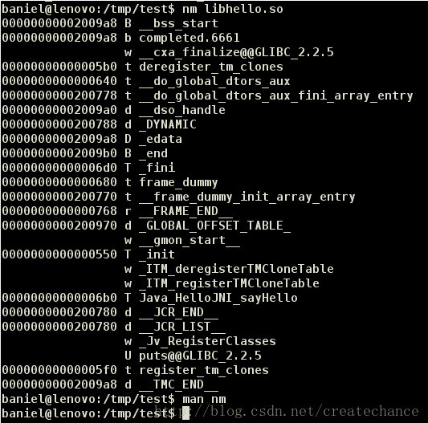
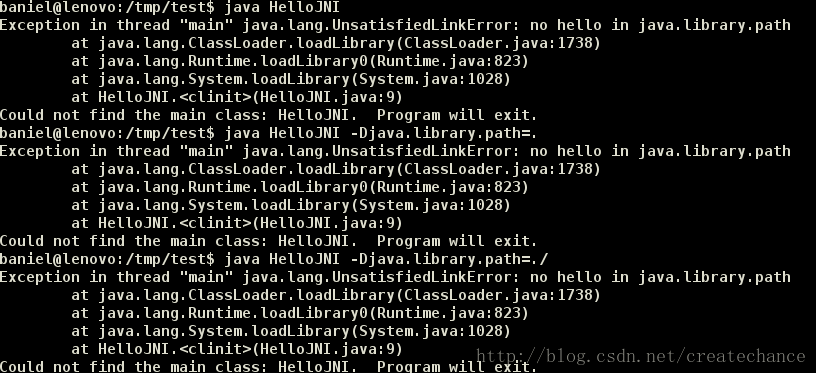
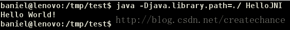

# Java native Interface基础与实践

## 引言

有的时候我们需要使用本地代码（C/C++）来克服Java中的内存管理和性能问题，Java通过JNI机制来支持内地代码的使用。
想要比较好地理解JNI是比较难的，因为它包含了两种语言和运行时机制。
在继续之前，我应该假设你具备以下知识点和技能：
1. java
2. C/C++和gcc编译器
3. 对于windows而言，熟悉Gygwin或者MinGW
4. 对于IDE而言，熟悉Eclipse C/C++ Development Tool (CDT)

## 开始

### 使用C来实现JNI

#### 编写java类

步骤1，编写一个使用C实现函数的java类，HelloJNI.java：

```java
public class HelloJNI {
   static {
      System.loadLibrary("hello"); // Load native library at runtime
                                   // hello.dll (Windows) or libhello.so (Unixes)
   }

   // Declare a native method sayHello() that receives nothing and returns void
   private native void sayHello();

   // Test Driver
   public static void main(String[] args) {
      new HelloJNI().sayHello();  // invoke the native method
   }
}
```

上面代码的静态代码块在这个类被类加载器加载的时候调用了System.loadLibrary()方法来加载一个native库“hello”（这个库中实现了sayHello函数）。这个库在windows平台上对应了“hello.dll”，而在类UNIX平台上对应了“libhello.so”。这个库应该包含在Java的库路径（使用java.library.path系统变量表示）上，否则这个上面的程序会抛出UnsatisfiedLinkError错误。你应该使用VM的参数-Djava.library.path=path_to_lib来指定包含native库的路径。

#### 生成.h文件

接下来，我们使用native关键字将sayHello()方法声明为本地实例方法，这就很明显地告诉JVM：这个方法实现在另外一个语言中（C/C++），请去那里寻找他的实现。注意，一个native方法不包含方法体，只有声明。上面代码中的main方法实例化了一个HelloJJNI类的实例，然后调用了本地方法sayHello()。
下面，我们编译HelloJNI.java成HelloJNI.class

```bash
javac HelloJNI.java
```

接下来，我们利用上面生成的class文件生成用于编写C/C++代码的头文件，使用jdk中的javah工具完成：

```bash
javah HelloJNI
```

上面的命令执行完之后生成了HelloJNI.h：

```cpp
/* DO NOT EDIT THIS FILE - it is machine generated */
#include <jni.h>
/* Header for class HelloJNI */

#ifndef _Included_HelloJNI
#define _Included_HelloJNI
#ifdef __cplusplus
extern "C" {
#endif
/*
 * Class:     HelloJNI
 * Method:    sayHello
 * Signature: ()V
 */
JNIEXPORT void JNICALL Java_HelloJNI_sayHello(JNIEnv *, jobject);

#ifdef __cplusplus
}
#endif
#endif
```

我们看到，上面的头文件中生成了一个Java_HelloJNI_sayHello的C函数：

```c
JNIEXPORT void JNICALL Java_HelloJNI_sayHello(JNIEnv *, jobject);
```

将java的native方法转换成C函数声明的规则是这样的：Java_{package_and_classname}_{function_name}(JNI arguments)。包名中的点换成单下划线。需要说明的是生成函数中的两个参数：

+ `JNIEnv *`：这是一个指向JNI运行环境的指针，后面我们会看到，我们通过这个指针访问JNI函数
+ `jobject`：这里指代java中的this对象


下面我们给出的例子中没有使用上面的两个参数，不过后面我们的例子会使用的。到目前为止，你可以先忽略JNIEXPORT和JNICALL这两个玩意。
上面头文件中有一个extern “C”，同时上面还有C++的条件编译语句，这么一来大家就明白了，这里的函数声明是要告诉C++编译器：这个函数是C函数，请使用C函数的签名协议规则去编译！因为我们知道C++的函数签名协议规则和C的是不一样的，因为C++支持重写和重载等面向对象的函数语法。

#### 用c语言实现.h文件

接下来，我们给出C语言的实现，以实现上面的函数：

C语言实现：

```c
#include <jni.h>
#include <stdio.h>
#include "HelloJNI.h"

// Implementation of native method sayHello() of HelloJNI class
JNIEXPORT void JNICALL Java_HelloJNI_sayHello(JNIEnv *env, jobject thisObj) {
   printf("Hello World!\n");
   return;
}
```

将上面的代码保存为HelloJNI.c。jni.h头文件在 “\include” 和 “\include\win32”目录下，这里的JAVA_HOME是指你的JDK安装目录。

这段C代码的作用很简单，就是在终端上打印Hello Word！这句话。

#### 编译c代码

下面我们编译这段代码，使用GCC编译器：

##### 对于windows上的MinGW：

```bash
> set JAVA_HOME=C:\Program Files\Java\jdk1.7.0_{xx}
      // Define and Set environment variable JAVA_HOME to JDK installed directory
      // I recommend that you set JAVA_HOME permanently, via "Control Panel" ⇒ "System" ⇒ "Environment Variables"
> echo %JAVA_HOME%
      // In Windows, you can refer a environment variable by adding % prefix and suffix 
> gcc -Wl,--add-stdcall-alias -I"%JAVA_HOME%\include" -I"%JAVA_HOME%\include\win32" -shared -o hello.dll HelloJNI.c
      // Compile HellJNI.c into shared library hello.dll
```

也可以分步编译：

```bash
// Compile-only with -c flag. Output is HElloJNI.o
> gcc -c -I"%JAVA_HOME%\include" -I"%JAVA_HOME%\include\win32" HelloJNI.c

// Link into shared library "hello.dll"
> gcc -Wl,--add-stdcall-alias -shared -o hello.dll HelloJNI.o
```

下面，我们使用nm命令来查看生成hello.dll中的函数：

```bash
> nm hello.dll | grep say
624011d8 T _Java_HelloJNI_sayHello@8
```

对于windows上的Cygwin:
首先，你需要讲__int64定义成“long long”类型，通过-D _int64=”long long选项实现。
对于gcc-3，请包含选项-nmo -cygwin来编译dll库，这些库是不依赖于Cygwin dll的。

```bash
> gcc-3 -D __int64="long long" -mno-cygwin -Wl,--add-stdcall-alias 
  -I"<JAVA_HOME>\include" -I"<JAVA_HOME>\include\win32" -shared -o hello.dll HelloJNI.c
```

##### Linux等类UNIX上编译方法

编译生成一个libhello.so共享库在当前目录下

```bash
gcc -fPIC --shared HelloJNI.c -o libhello.so -I /usr/lib/jvm/java-7-openjdk-amd64/include/
```

#### 运行

接下来，让我们运行一下上面的代码吧：

```bash
> java HelloJNI
or
> java -Djava.library.path=. HelloJNI
```

有的时候，你可能需要使用-Djava.library.path来指定加载库的位置，因为可能报出java.lang.UnsatisfiedLinkError错误.

我们首先使用nm命令（关于nm请自行Google或者man）查看libhello.so中都有那些函数：



可以看到我们的sayHello函数已经在这个里面，这说明我们编译的基本没有问题。

下面，我给出在我电脑上运行的效果

首先我们执行java HelloJNI，看看能不能运行：



果然，出现了UnsatisfiedLinkError错误，原因是VM去标准路径下查找这个库，发现找不到，然后就挂了。因此我们还是需要使用-Djava.library.path来明确告诉VM我们的库在哪里（当然，你也可以将你编译出来的库放到系统标准路径中，比如/usr/lib目录下）：



现在OK了，因为我们明确告诉VM，我们的libhello.so就在当前目录下，不用傻傻地去系统中找啦！！

### 使用C/C++混合实现JNI

第一步：编写一个使用本地代码的java类：HelloJNICpp.java

```java
public class HelloJNICpp {
   static {
      System.loadLibrary("hello"); // hello.dll (Windows) or libhello.so (Unixes)
   }

   // Native method declaration
   private native void sayHello();

   // Test Driver
   public static void main(String[] args) {
      new HelloJNICpp().sayHello();  // Invoke native method
   }
}
```

同样地，我们使用javac来编译这个代码：

```bash
> javac HelloJNICpp.java
```

步骤2：生成C/C++的头文件

```bash
> javah HelloJNICpp
```

上面命令会生成一个HelloJNICpp.h的文件，并且这个文件中声明了这个本地函数：

```bash
JNIEXPORT void JNICALL Java_HelloJNICpp_sayHello(JNIEnv *, jobject);
```

步骤3：C/C++编码实现，HelloJNICppImpl.h, HelloJNICppImpl.cpp, 和 HelloJNICpp.c
这里，我们使用C++来实现真正的函数（”HelloJNICppImpl.h” 和 “HelloJNICppImpl.cpp”），而使用C来和java进行交互。（译者注：这样就可以把JNI的代码逻辑和我们真正的业务逻辑分离开了！）

C++头文件：“HelloJNICppImpl.h”

```cpp
#ifndef _HELLO_JNI_CPP_IMPL_H
#define _HELLO_JNI_CPP_IMPL_H

#ifdef __cplusplus
        extern "C" {
#endif
        void sayHello ();
#ifdef __cplusplus
        }
#endif

#endif
```

C++的代码实现：“HelloJNICppImpl.cpp”

```cpp
#include "HelloJNICppImpl.h"
#include  <iostream>

using namespace std;

void sayHello () {
    cout << "Hello World from C++!" << endl;
    return;
}
```

C代码实现和Java的交互：“HelloJNICpp.c”

```c
#include <jni.h>
#include "HelloJNICpp.h"
#include "HelloJNICppImpl.h"

JNIEXPORT void JNICALL Java_HelloJNICpp_sayHello (JNIEnv *env, jobject thisObj) {
    sayHello();  // invoke C++ function
    return;
}
```

将上面的代码编译成一个共享库（在windows上是hello.dll）。
使用windows上的MinGW GCC：

```bash
> set JAVA_HOME=C:\Program Files\Java\jdk1.7.0_{xx}
> g++ -Wl,--add-stdcall-alias -I"%JAVA_HOME%\include" -I"%JAVA_HOME%\include\win32" 
      -shared -o hello.dll HelloJNICpp.c HelloJNICppImpl.cpp
```

步骤4：运行java代码

```bash
> java HelloJNICpp
or
> java -Djava.library.path=. HelloJNICpp
```

### java package中的JNI
在真正的产品化中，所有的java类都是有自己的包的，而不是一个默认的没有名字的包。下面我们说明一下java中的package怎么在JNI中使用。

步骤1：使用JNI的程序， myjni\HelloJNI.java

```java
package myjni; // 多了包名定义

public class HelloJNI {
   static {
      System.loadLibrary("hello"); // hello.dll (Windows) or libhello.so (Unixes)
   }
   // A native method that receives nothing and returns void
   private native void sayHello();

   public static void main(String[] args) {
      new HelloJNI().sayHello();  // invoke the native method
   }
}
```

上面的这个类应该放在myjni目录下。然后我们编译这个代码：

```bash
// change directory to package base directory
> javac myjni\HelloJNI.java
```

步骤2：生成C/C++头文件

如果你的java代码是放在一个包中的，那么你需要使用完全限定名称来生成C/C++头文件的。你可能会需要使用-classpath选项来指定JNI程序的classpath路径，并且可能会使用-d选项来指定生成头文件的目标文件夹。

```bash
> javah --help
......

// Change directory to package base directory
> javah -d include myini.HelloJNI
```

在上面的例子中，我们选择将生层的头文件放在include目录下，因此，我们输出的就是：“include\myjni_HelloJNI.h”.这个头文件声明了这样的本地函数：

```bash
JNIEXPORT void JNICALL Java_myjni_HelloJNI_sayHello(JNIEnv *, jobject);
```

我们看到，和上面的例子相比，这里的名字规则是这样的：Java__methodName，同时，点号换成单下划线。

步骤3：C代码实现：HelloJNI.c

```c
#include <jni.h>
#include <stdio.h>
#include "include\myjni_HelloJNI.h"

JNIEXPORT void JNICALL Java_myjni_HelloJNI_sayHello(JNIEnv *env, jobject thisObj) {
   printf("Hello World!\n");
   return;
}
```

编译C代码：

```bash
> gcc -Wl,--add-stdcall-alias -I<JAVA_HOME>\include -I<JAVA_HOME>\include\win32 -shared -o hello.dll HelloJNI.c
```

运行代码：

```bash
> java myjni.HelloJNI
```

### 使用IDE开发JNI

查看[附录](#附录)

## JNI基础知识

上面我们简单演示了怎么使用JNI，现在我们来系统梳理一下JNI中涉及的基本知识。
JNI定义了以下数据类型，这些类型和Java中的数据类型是一致的：

+ Java原始类型：jint, jbyte, jshort, jlong, jfloat, jdouble, jchar, jboolean这些分别对应这java的int, byte, short, long, float, double, char and boolean。

+ Java引用类型：jobject用来指代java.lang.Object，除此之外，还定义了以下子类型：
  - jclass for java.lang.Class.
  - jstring for java.lang.String.
  - jthrowable for java.lang.Throwable.
  - jarray对java的array。java的array是一个指向8个基本类型array的引用类型。于是，JNI中就有8个基本类型的array：jintArray, jbyteArray, jshortArray, jlongArray, jfloatArray, jdoubleArray, jcharArray 和 jbooleanArray，还有一个就是指向Object的jobjectarray。

Native函数会接受上面类型的参数，并且也会返回上面类型的返回值。然而，本地函数（C/C++）是需要按照它们自己的方式处理类型的（比如C中的string，就是char *）。因此，需要在JNI类型和本地类型之间进行转换。通常来讲，本地函数需要：

+ 接收JNI类型的参数（从java代码中传来）
+ 对于JNI类型参数，需要讲这些数据转换或者拷贝成本地数据类型，比如讲jstring转成char *, jintArray转成C的int[]。需要注意的是，原始的JNI类型，诸如jint，jdouble之类的不用进行转换，可以直接使用，参与计算。
+ 进行数据操作，以本地的方式
+ 创建一个JNI的返回类型，然后讲结果数据拷贝到这个JNI数据中
+ returnJNI类型数据

这其中最麻烦的事莫过于在JNI类型（如jstring, jobject, jintArray, jobjectArray）和本地类型（如C-string, int[]）之间进行转换这件事情了。不过所幸的是，JNI环境已经为我们定义了很多的接口函数来做这种烦人的转换。（译者注：这里就需要使用上面我们提到的JNIEnv*那个参数了！）

## 在Java和Native代码之间传递参数和返回值

### 传递基本类型

传递java的基本类型是非常简单而直接的，一个jxxx之类的类型已经定义在本地系统中了，比如：jint, jbyte, jshort, jlong, jfloat, jdouble, jchar 和 jboolean分别对应java的int, byte, short, long, float, double, char 和 boolean基本类型。

Java JNI 程序：TestJNIPrimitive.java

```java
public class TestJNIPrimitive {
   static {
      System.loadLibrary("myjni"); // myjni.dll (Windows) or libmyjni.so (Unixes)
   }

   // Declare a native method average() that receives two ints and return a double containing the average
   private native double average(int n1, int n2);

   // Test Driver
   public static void main(String args[]) {
      System.out.println("In Java, the average is " + new TestJNIPrimitive().average(3, 2));
   }
}
```

这个JNI程序加载了myjni.dll（windows）库或者libmyjni.so（类UNIX）库。并且声明了一个native方法，这个方法接受两个int类型的参数，并且返回一个double类型的返回值，这个值是两个int型数的平均值。mian方法调用了average函数。

下面，我们将上面的java代码编译成TestJNIPrimitive.class，进而生成C/C++头文件TestJNIPrimitive.h：

```bash
> javac TestJNIPrimitive.java
> javah TestJNIPrimitive       // Output is TestJNIPrimitive.h
```

#### C实现：TestJNIPrimitive.c

头文件TestJNIPrimitive.h中包含了一个函数声明：

```cpp
JNIEXPORT jdouble JNICALL Java_TestJNIPrimitive_average(JNIEnv *, jobject, jint, jint);s
```

可以看到，这里的jint和jdouble分别表示java中的int和double。
jni.h（windows上是win32/jni_mh.h）头文件包含了这些数据类型的定义，同时多了一个jsize的定义：

```cpp
// In "win\jni_mh.h" - machine header which is machine dependent
typedef long            jint;
typedef __int64         jlong;
typedef signed char     jbyte;

// In "jni.h"
typedef unsigned char   jboolean;
typedef unsigned short  jchar;
typedef short           jshort;
typedef float           jfloat;
typedef double          jdouble;
typedef jint            jsize;
```

有趣的是，jint对应到C的long类型（至少是32bit的），而不是C的int类型（至少是16bit的）。于是，在C代码中要使用jint而不是int是很重要的。同时，CygWin不支持__int64类型。

TestJNIPrimitive.c的实现如下：

```c
#include <jni.h>
#include <stdio.h>
#include "TestJNIPrimitive.h"

JNIEXPORT jdouble JNICALL Java_TestJNIPrimitive_average
          (JNIEnv *env, jobject thisObj, jint n1, jint n2) {
   jdouble result;
   printf("In C, the numbers are %d and %d\n", n1, n2);
   result = ((jdouble)n1 + n2) / 2.0;
   // jint is mapped to int, jdouble is mapped to double
   return result;
}
```

然后，我们编译代码成一个共享库：

```bash
// MinGW GCC under Windows
> set JAVA_HOME={jdk-installed-directory}
> gcc -Wl,--add-stdcall-alias -I"%JAVA_HOME%\include" -I"%JAVA_HOME%\include\win32" -shared -o myjni.dll TestJNIPrimitive.c
```

最后，我们运行这个java代码：

```bash
> java TestJNIPrimitive
```

#### C++实现 TestJNIPrimitive.cpp

```cpp
#include <jni.h>
#include <iostream>
#include "TestJNIPrimitive.h"
using namespace std;

JNIEXPORT jdouble JNICALL Java_TestJNIPrimitive_average
          (JNIEnv *env, jobject obj, jint n1, jint n2) {
   jdouble result;
   cout << "In C++, the numbers are " << n1 << " and " << n2 << endl;
   result = ((jdouble)n1 + n2) / 2.0;
   // jint is mapped to int, jdouble is mapped to double
   return result;
}
```

使用g++来编译上面的代码：

```bash
// MinGW GCC under Windows
> g++ -Wl,--add-stdcall-alias -I"%JAVA_HOME%\include" -I"%JAVA_HOME%\include\win32" -shared -o myjni.dll TestJNIPrimitive.cpp
```

### 传递字符串

Java JNI 程序：TestJNIString.java

```java
public class TestJNIString {
   static {
      System.loadLibrary("myjni"); // myjni.dll (Windows) or libmyjni.so (Unixes)
   }
   // Native method that receives a Java String and return a Java String
   private native String sayHello(String msg);

   public static void main(String args[]) {
      String result = new TestJNIString().sayHello("Hello from Java");
      System.out.println("In Java, the returned string is: " + result);
   }
}
```

上面的代码声明了一个native函数sayHello，这个函数接受一个java的String，然后返回一个Java string，main方法调用了sayHello函数。
然后，我们编译上面的代码，并且生成C/C++的头文件：

```bash
> javac TestJNIString.java
> javah TestJNIString
```

#### C代码实现：TestJNIString.c

上面的头文件TestJNIString.h声明了这样的一个函数：

```cpp
JNIEXPORT jstring JNICALL Java_TestJNIString_sayHello(JNIEnv *, jobject, jstring);
```

JNI定义了jstring类型应对java的String类型。上面声明中的最后一个参数jstring就是来自Java代码中的String参数，同时，返回值也是一个jstring类型。

传递一个字符串比传递基本类型要复杂的多，因为java的String是一个对象，而C的string是一个NULL结尾的char数组。因此，我们需要将`Java的String对象转换成C的字符串表示形式：char *`。

前面我们提到，JNI环境指针JNIEnv *已经为我们定义了非常丰富的接口函数用来处理数据的转换：

1. 调用const char* GetStringUTFChars(JNIEnv*, jstring, jboolean*)来将JNI的jstring转换成C的char *
2. 调用jstring NewStringUTF(JNIEnv*, char*)来将C的char *转换成JNI的jstring

因此我们的C程序基本过程如下：

1. 使用GetStringUTFChars()函数来将jstring转换成char *
2. 然后进行需要的数据处理
3. 使用NewStringUTF()函数来将char *转换成jstring，并且返回

```c
#include <jni.h>
#include <stdio.h>
#include "TestJNIString.h"

JNIEXPORT jstring JNICALL Java_TestJNIString_sayHello(JNIEnv *env, jobject thisObj, jstring inJNIStr) {
   // Step 1: Convert the JNI String (jstring) into C-String (char*)
   const char *inCStr = (*env)->GetStringUTFChars(env, inJNIStr, NULL);
   if (NULL == inCSt) return NULL;

   // Step 2: Perform its intended operations
   printf("In C, the received string is: %s\n", inCStr);
   (*env)->ReleaseStringUTFChars(env, inJNIStr, inCStr);  // release resources

   // Prompt user for a C-string
   char outCStr[128];
   printf("Enter a String: ");
   scanf("%s", outCStr);    // not more than 127 characters

   // Step 3: Convert the C-string (char*) into JNI String (jstring) and return
   return (*env)->NewStringUTF(env, outCStr);
}
```

将上面的代码编译成共享库：

```bash
// MinGW GCC under Windows
> gcc -Wl,--add-stdcall-alias -I"<JAVA_HOME>\include" -I"<JAVA_HOME>\include\win32" -shared -o myjni.dll TestJNIString.c
```

最后，运行代码：

```bash
> java TestJNIString
In C, the received string is: Hello from Java
Enter a String: test
In Java, the returned string is: test
```

#### JNI中的string转换函数

上面我们展示了两个函数，现在我们全面梳理下JNI为我们提供的函数。JNI支持Unicode（16bit字符）和UTF-8（使用1~3字节的编码）转化。一般而言，我们应该在C/C++中使用UTF-8的编码方式。
JNI系统提供了如下关于字符串处理的函数（一共两组，UTF8和Unicode）：

```cpp
// UTF-8 String (encoded to 1-3 byte, backward compatible with 7-bit ASCII)
// Can be mapped to null-terminated char-array C-string
const char * GetStringUTFChars(JNIEnv *env, jstring string, jboolean *isCopy);
   // Returns a pointer to an array of bytes representing the string in modified UTF-8 encoding.
void ReleaseStringUTFChars(JNIEnv *env, jstring string, const char *utf);
   // Informs the VM that the native code no longer needs access to utf.
jstring NewStringUTF(JNIEnv *env, const char *bytes);
   // Constructs a new java.lang.String object from an array of characters in modified UTF-8 encoding.
jsize GetStringUTFLength(JNIEnv *env, jstring string);
   // Returns the length in bytes of the modified UTF-8 representation of a string.
void GetStringUTFRegion(JNIEnv *env, jstring str, jsize start, jsize length, char *buf);
   // Translates len number of Unicode characters beginning at offset start into modified UTF-8 encoding 
   // and place the result in the given buffer buf.

// Unicode Strings (16-bit character)
const jchar * GetStringChars(JNIEnv *env, jstring string, jboolean *isCopy);
   // Returns a pointer to the array of Unicode characters
void ReleaseStringChars(JNIEnv *env, jstring string, const jchar *chars);
   // Informs the VM that the native code no longer needs access to chars.
jstring NewString(JNIEnv *env, const jchar *unicodeChars, jsize length);
   // Constructs a new java.lang.String object from an array of Unicode characters.
jsize GetStringLength(JNIEnv *env, jstring string);
   // Returns the length (the count of Unicode characters) of a Java string.
void GetStringRegion(JNIEnv *env, jstring str, jsize start, jsize length, jchar *buf);
   // Copies len number of Unicode characters beginning at offset start to the given buffer buf
```

+ GetStringUTFChars()函数可以将jstring转成char *，这个函数会返回NULL，如果系统的内容分配失败的话。因此，好的做法是检查这个函数的返回是不是NULL。
+ 第三个参数是isCopy，这个参数是一个in-out参数，传进去的是一个指针，函数结束的时候指针的内容会被修改。如果内容是JNI_TRUE的话，那么代表返回的数据是jstring数据的一个拷贝，反之，如果是JNI_FALSE的话，就说明返回的字符串就是直接指向那个String对象实例的。在这种情况下，本地代码不应该随意修改string中的内容，因为修改会代码Java中的修改。JNI系统会尽量保证返回的是直接引用，如果不能的话，那就返回一个拷贝。`通常，我们很少关心修改这些string ，因此我们这里一般传递NULL给isCopy参数`。
+ 必须要注意的是，当你不在需要GetStringUTFChars返回的字符串的时候，一定`记得调用ReleaseStringUTFChars()函数来将内存资源释放！否则会内存泄露！`并且上层java中的GC也不能进行！
+ 另外，`在GetStringUTFChars和ReleaseStringUTFChars不能block！`
+ NewStringUTF()函数可以从char *字符串得到jstring。
+ 关于更详细的描述，请参考[Java Native Interface Specification](http://docs.oracle.com/javase/7/docs/technotes/guides/jni/index.html)

#### C++实现：TestJNIString.cpp

```cpp
#include <jni.h>
#include <iostream>
#include <string>
#include "TestJNIString.h"
using namespace std;

JNIEXPORT jstring JNICALL Java_TestJNIString_sayHello(JNIEnv *env, jobject thisObj, jstring inJNIStr) {
   // Step 1: Convert the JNI String (jstring) into C-String (char*)
   const char *inCStr = env->GetStringUTFChars(inJNIStr, NULL);
   if (NULL == inCStr) return NULL;

   // Step 2: Perform its intended operations
   cout << "In C++, the received string is: " << inCStr << endl;
   env->ReleaseStringUTFChars(inJNIStr, inCStr);  // release resources

   // Prompt user for a C++ string
   string outCppStr;
   cout << "Enter a String: ";
   cin >> outCppStr;

   // Step 3: Convert the C++ string to C-string, then to JNI String (jstring) and return
   return env->NewStringUTF(outCppStr.c_str());
}
```

使用g++编译上面的代码：

```bash
// MinGW GCC under Windows
> g++ -Wl,--add-stdcall-alias -I"<JAVA_HOME>\include" -I"<JAVA_HOME>\include\win32" -shared -o myjni.dll TestJNIString.cpp
```

需要注意的是，在C++中，本地string类的函数调用语法不一样。在C++中，我们使用env->来调用，而不是(env*)->。同时，在C++函数中不需要JNIEnv*这个参数了。


### 传递基本类型的数组

JNI 代码：TestJNIPrimitiveArray.java

```java
public class TestJNIPrimitiveArray {
   static {
      System.loadLibrary("myjni"); // myjni.dll (Windows) or libmyjni.so (Unixes)
   }

   // Declare a native method sumAndAverage() that receives an int[] and
   //  return a double[2] array with [0] as sum and [1] as average
   private native double[] sumAndAverage(int[] numbers);

   // Test Driver
   public static void main(String args[]) {
      int[] numbers = {22, 33, 33};
      double[] results = new TestJNIPrimitiveArray().sumAndAverage(numbers);
      System.out.println("In Java, the sum is " + results[0]);
      System.out.println("In Java, the average is " + results[1]);
   }
}
```

#### C语言实现：TestJNIPrimitiveArray.c

头文件TestJNIPrimitiveArray.h包含以下函数声明：

```cpp
JNIEXPORT jdoubleArray JNICALL Java_TestJNIPrimitiveArray_average (JNIEnv *, jobject, jintArray);
```

在Java中，array是指一种类型，类似于类。一共有9种java的array，8个基本类型的array和一个object的array。JNI针对java的基本类型都定义了相应的array：jintArray, jbyteArray, jshortArray, jlongArray, jfloatArray, jdoubleArray, jcharArray, jbooleanArray，并且也有面向object的jobjectArray。

同样地，你需要在JNI array和Native array之间进行转换，JNI系统已经为我们提供了一系列的接口函数：

1. 使用jint* GetIntArrayElements(JNIEnv *env, jintArray a, jboolean *iscopy)将jintarray转换成C的jint[]
2. 使用jintArray NewIntArray(JNIEnv *env, jsize len)函数来分配一个len字节大小的空间，然后再使用void SetIntArrayRegion(JNIEnv *env, jintArray a, jsize start, jsize len, const jint *buf)函数讲jint[]中的数据拷贝到jintArray中去。

一共有8对类似上面的函数，分别对应java的8个基本数据类型。

因此，native程序需要：

1. 接受来自java的JNI array，然后转换成本地array
2. 进行需要的数据操作
3. 将需要返回的数据转换成jni的array，然后返回

下面是C代码实现的TestJNIPrimitiveArray.c：

```c
#include <jni.h>
#include <stdio.h>
#include "TestJNIPrimitiveArray.h"

JNIEXPORT jdoubleArray JNICALL Java_TestJNIPrimitiveArray_sumAndAverage
          (JNIEnv *env, jobject thisObj, jintArray inJNIArray) {
   // Step 1: Convert the incoming JNI jintarray to C's jint[]
   jint *inCArray = (*env)->GetIntArrayElements(env, inJNIArray, NULL);
   if (NULL == inCArray) return NULL;
   jsize length = (*env)->GetArrayLength(env, inJNIArray);

   // Step 2: Perform its intended operations
   jint sum = 0;
   int i;
   for (i = 0; i < length; i++) {
      sum += inCArray[i];
   }
   jdouble average = (jdouble)sum / length;
   (*env)->ReleaseIntArrayElements(env, inJNIArray, inCArray, 0); // release resources

   jdouble outCArray[] = {sum, average};

   // Step 3: Convert the C's Native jdouble[] to JNI jdoublearray, and return
   jdoubleArray outJNIArray = (*env)->NewDoubleArray(env, 2);  // allocate
   if (NULL == outJNIArray) return NULL;
   (*env)->SetDoubleArrayRegion(env, outJNIArray, 0 , 2, outCArray);  // copy
   return outJNIArray;
}
```

#### JNI基本类型的array函数

JNI基本类型的array（jintArray, jbyteArray, jshortArray, jlongArray, jfloatArray, jdoubleArray, jcharArray 和 jbooleanArray）函数如下：

```cpp
// ArrayType: jintArray, jbyteArray, jshortArray, jlongArray, jfloatArray, jdoubleArray, jcharArray, jbooleanArray
// PrimitiveType: int, byte, short, long, float, double, char, boolean
// NativeType: jint, jbyte, jshort, jlong, jfloat, jdouble, jchar, jboolean
NativeType * Get<PrimitiveType>ArrayElements(JNIEnv *env, ArrayType array, jboolean *isCopy);
void Release<PrimitiveType>ArrayElements(JNIEnv *env, ArrayType array, NativeType *elems, jint mode);
void Get<PrimitiveType>ArrayRegion(JNIEnv *env, ArrayType array, jsize start, jsize length, NativeType *buffer);
void Set<PrimitiveType>ArrayRegion(JNIEnv *env, ArrayType array, jsize start, jsize length, const NativeType *buffer);
ArrayType New<PrimitiveType>Array(JNIEnv *env, jsize length);
void * GetPrimitiveArrayCritical(JNIEnv *env, jarray array, jboolean *isCopy);
void ReleasePrimitiveArrayCritical(JNIEnv *env, jarray array, void *carray, jint mode);
```

同样地，`在get函数和release函数之间也不能always block`。


### 访问Java对象变量和回调Java方法

#### 访问Java对象实例的变量

JNI程序：TestJNIInstanceVariable.java

```java
public class TestJNIInstanceVariable {
   static {
      System.loadLibrary("myjni"); // myjni.dll (Windows) or libmyjni.so (Unixes)
   }

   // Instance variables
   private int number = 88;
   private String message = "Hello from Java";

   // Declare a native method that modifies the instance variables
   private native void modifyInstanceVariable();

   // Test Driver   
   public static void main(String args[]) {
      TestJNIInstanceVariable test = new TestJNIInstanceVariable();
      test.modifyInstanceVariable();
      System.out.println("In Java, int is " + test.number);
      System.out.println("In Java, String is " + test.message);
   }
}
```

这个类包含了两个private实例变量，一个int，一个String对象。然后我们在main中调用本地函数modifyInstanceVariable来修改这两个变量。

C代码实现：TestJNIInstanceVariable.c

```c
#include <jni.h>
#include <stdio.h>
#include "TestJNIInstanceVariable.h"

JNIEXPORT void JNICALL Java_TestJNIInstanceVariable_modifyInstanceVariable
          (JNIEnv *env, jobject thisObj) {
   // Get a reference to this object's class
   jclass thisClass = (*env)->GetObjectClass(env, thisObj);

   // int
   // Get the Field ID of the instance variables "number"
   jfieldID fidNumber = (*env)->GetFieldID(env, thisClass, "number", "I");
   if (NULL == fidNumber) return;

   // Get the int given the Field ID
   jint number = (*env)->GetIntField(env, thisObj, fidNumber);
   printf("In C, the int is %d\n", number);

   // Change the variable
   number = 99;
   (*env)->SetIntField(env, thisObj, fidNumber, number);

   // Get the Field ID of the instance variables "message"
   jfieldID fidMessage = (*env)->GetFieldID(env, thisClass, "message", "Ljava/lang/String;");
   if (NULL == fidMessage) return;

   // String
   // Get the object given the Field ID
   jstring message = (*env)->GetObjectField(env, thisObj, fidMessage);

   // Create a C-string with the JNI String
   const char *cStr = (*env)->GetStringUTFChars(env, message, NULL);
   if (NULL == cStr) return;

   printf("In C, the string is %s\n", cStr);
   (*env)->ReleaseStringUTFChars(env, message, cStr);

   // Create a new C-string and assign to the JNI string
   message = (*env)->NewStringUTF(env, "Hello from C");
   if (NULL == message) return;

   // modify the instance variables
   (*env)->SetObjectField(env, thisObj, fidMessage, message);
}
```

为了访问对象中的变量，我们需要：

1. 调用GetObjectClass()获得目标对象的类引用
2. 从上面获得的类引用中获得Field ID来访问变量，你需要提供这个变量的名字，变量的描述符（也称为签名）。对于java类而言，描述符是这样的形式：“Lfully-qualified-name;”(注意最后有一个英文半角分号)，其中的包名点号换成斜杠(/)，比如java的Stirng类的描述符就是“Ljava/lang/String;”。对于基本类型而言，I代表int，B代表byte，S代表short，J代表long，F代表float，D代表double，C代表char，Z代表boolean。对于array而言，使用左中括号`“[”`来表示，比如`“[Ljava/lang/Object;”`表示Object的array，`“[I”`表示int型的array。
3. 基于上面获得的Field ID，使用GetObjectField() 或者 Get_primitive-type_Field()函数来从中解析出我们想要的数据
4. 使用SetObjectField() 或者 Set_primitive-type_Field()函数来修改变量

JNI中用来访问实例变量的函数有：

```cpp
jclass GetObjectClass(JNIEnv *env, jobject obj);
   // Returns the class of an object.

jfieldID GetFieldID(JNIEnv *env, jclass cls, const char *name, const char *sig);
  // Returns the field ID for an instance variable of a class.

NativeType Get<type>Field(JNIEnv *env, jobject obj, jfieldID fieldID);
void Set<type>Field(JNIEnv *env, jobject obj, jfieldID fieldID, NativeType value);
  // Get/Set the value of an instance variable of an object
  // <type> includes each of the eight primitive types plus Object.
```

#### 访问类中的static变量

访问类中的static变量类似于上面访问普通的实例变量，只是我们这里使用的函数是GetStaticFieldID(), Get|SetStaticObjectField(), Get|SetStatic_Primitive-type_Field()。

JNI 程序： TestJNIStaticVariable.java

```java
public class TestJNIStaticVariable {
   static {
      System.loadLibrary("myjni"); // nyjni.dll (Windows) or libmyjni.so (Unixes)
   }

   // Static variables
   private static double number = 55.66;

   // Declare a native method that modifies the static variable
   private native void modifyStaticVariable();

   // Test Driver
   public static void main(String args[]) {
      TestJNIStaticVariable test = new TestJNIStaticVariable();
      test.modifyStaticVariable();
      System.out.println("In Java, the double is " + number);
   }
}
```

C语言实现：C Implementation - TestJNIStaticVariable.c

```c
#include <jni.h>
#include <stdio.h>
#include "TestJNIStaticVariable.h"

JNIEXPORT void JNICALL Java_TestJNIStaticVariable_modifyStaticVariable
          (JNIEnv *env, jobject thisObj) {
   // Get a reference to this object's class
   jclass cls = (*env)->GetObjectClass(env, thisObj);

   // Read the int static variable and modify its value
   jfieldID fidNumber = (*env)->GetStaticFieldID(env, cls, "number", "D");
   if (NULL == fidNumber) return;
   jdouble number = (*env)->GetStaticDoubleField(env, cls, fidNumber);
   printf("In C, the double is %f\n", number);
   number = 77.88;
   (*env)->SetStaticDoubleField(env, cls, fidNumber, number);
}
```

JNI中用来访问类中的static变量的函数如下：

```cpp
jfieldID GetStaticFieldID(JNIEnv *env, jclass cls, const char *name, const char *sig);
  // Returns the field ID for a static variable of a class.

NativeType GetStatic<type>Field(JNIEnv *env, jclass clazz, jfieldID fieldID);
void SetStatic<type>Field(JNIEnv *env, jclass clazz, jfieldID fieldID, NativeType value);
  // Get/Set the value of a static variable of a class.
  // <type> includes each of the eight primitive types plus Object.
```

#### 回调实例的普通和static方法

你可以在native代码中回调java中的普通或者static的方法。下面是实例：

JNI程序：TestJNICallBackMethod.java

```java
public class TestJNICallBackMethod {
   static {
      System.loadLibrary("myjni"); // myjni.dll (Windows) or libmyjni.so (Unixes)
   }

   // Declare a native method that calls back the Java methods below
   private native void nativeMethod();

   // To be called back by the native code
   private void callback() {
      System.out.println("In Java");
   }

   private void callback(String message) {
      System.out.println("In Java with " + message);
   }

   private double callbackAverage(int n1, int n2) {
      return ((double)n1 + n2) / 2.0;
   }

   // Static method to be called back
   private static String callbackStatic() {
      return "From static Java method";
   }

   // Test Driver 
   public static void main(String args[]) {
      new TestJNICallBackMethod().nativeMethod();
   }
}
```

这个类中声明了一个native函数nativeMethod()，并且在main方法中调用了这个函数。nativeMethod()这个函数会回调这个类中定义的各种方法。

C语言实现：TestJNICallBackMethod.c

```c
#include <jni.h>
#include <stdio.h>
#include "TestJNICallBackMethod.h"

JNIEXPORT void JNICALL Java_TestJNICallBackMethod_nativeMethod
          (JNIEnv *env, jobject thisObj) {

   // Get a class reference for this object
   jclass thisClass = (*env)->GetObjectClass(env, thisObj);

   // Get the Method ID for method "callback", which takes no arg and return void
   jmethodID midCallBack = (*env)->GetMethodID(env, thisClass, "callback", "()V");
   if (NULL == midCallBack) return;
   printf("In C, call back Java's callback()\n");
   // Call back the method (which returns void), baed on the Method ID
   (*env)->CallVoidMethod(env, thisObj, midCallBack);

   jmethodID midCallBackStr = (*env)->GetMethodID(env, thisClass,
                               "callback", "(Ljava/lang/String;)V");
   if (NULL == midCallBackStr) return;
   printf("In C, call back Java's called(String)\n");
   jstring message = (*env)->NewStringUTF(env, "Hello from C");
   (*env)->CallVoidMethod(env, thisObj, midCallBackStr, message);

   jmethodID midCallBackAverage = (*env)->GetMethodID(env, thisClass,
                                  "callbackAverage", "(II)D");
   if (NULL == midCallBackAverage) return;
   jdouble average = (*env)->CallDoubleMethod(env, thisObj, midCallBackAverage, 2, 3);
   printf("In C, the average is %f\n", average);

   jmethodID midCallBackStatic = (*env)->GetStaticMethodID(env, thisClass,
                                 "callbackStatic", "()Ljava/lang/String;");
   if (NULL == midCallBackStatic) return;
   jstring resultJNIStr = (*env)->CallStaticObjectMethod(env, thisClass, midCallBackStatic);
   const char *resultCStr = (*env)->GetStringUTFChars(env, resultJNIStr, NULL);
   if (NULL == resultCStr) return;
   printf("In C, the returned string is %s\n", resultCStr);
   (*env)->ReleaseStringUTFChars(env, resultJNIStr, resultCStr);
}
```

为了能够回调实例中的方法，我们需要：

1. 通过GetObjectClass()函数获得这个实例的类对象
2. 从上面获得类对象中，调用GetMethodID()函数来获得Method ID，Method ID表示了实例中的某个方法的抽象。你需要提供这个方法的名字和签名信息，签名规则和变量类似。签名的格式是这样的：(parameters)return-type。`如果我们实在觉得jni的签名不好记忆的话，我们可以是用JDK为我们提供的工具javap来获得某个class类中的所有方法的签名`，使用-s选项表示打印签名，-p表示显示private成员：

```bash
> javap --help
> javap -s -p TestJNICallBackMethod
  .......
  private void callback();
    Signature: ()V

  private void callback(java.lang.String);
    Signature: (Ljava/lang/String;)V

  private double callbackAverage(int, int);
    Signature: (II)D

  private static java.lang.String callbackStatic();
    Signature: ()Ljava/lang/String;
  .......
```

从上面的输出我们可以清楚地看到类中每一个方法的签名。

3. 基于上面我们获得的Method ID，我们可以调用_Primitive-type_Method() 或者 CallVoidMethod() 或者 CallObjectMethod()来调用这个方法。如果某个方法需要参数的话，就在后面跟上参数即可。
4. 如果想要调用一个static方法的话，使用GetMethodID(), CallStatic_Primitive-type_Method(), CallStaticVoidMethod() 或者 CallStaticObjectMethod()。
JNI中用来回调实例和static方法的所有函数（两类，普通的和static的）：

```cpp
jmethodID GetMethodID(JNIEnv *env, jclass cls, const char *name, const char *sig);
   // Returns the method ID for an instance method of a class or interface.

NativeType Call<type>Method(JNIEnv *env, jobject obj, jmethodID methodID, ...);
NativeType Call<type>MethodA(JNIEnv *env, jobject obj, jmethodID methodID, const jvalue *args);
NativeType Call<type>MethodV(JNIEnv *env, jobject obj, jmethodID methodID, va_list args);
   // Invoke an instance method of the object.
   // The <type> includes each of the eight primitive and Object.

jmethodID GetStaticMethodID(JNIEnv *env, jclass cls, const char *name, const char *sig);
   // Returns the method ID for an instance method of a class or interface.

NativeType CallStatic<type>Method(JNIEnv *env, jclass clazz, jmethodID methodID, ...);
NativeType CallStatic<type>MethodA(JNIEnv *env, jclass clazz, jmethodID methodID, const jvalue *args);
NativeType CallStatic<type>MethodV(JNIEnv *env, jclass clazz, jmethodID methodID, va_list args);
   // Invoke an instance method of the object.
   // The <type> includes each of the eight primitive and Object.
```

#### 回调复写的父类实例方法
JNI提供了一系列的形如 CallNonvirtual_Type_Method()之类的函数来调用父类实例的方法：

1. 首先获得Method ID，使用GetMethodID()
2. 基于上获得的Method ID，通过调用 CallNonvirtual_Type_Method()函数来调用相应的方法，并且在参数中给出object，父类和参数列表。
JNI中用来访问父类方法的函数：

```cpp
NativeType CallNonvirtual<type>Method(JNIEnv *env, jobject obj, jclass cls, jmethodID methodID, ...);
NativeType CallNonvirtual<type>MethodA(JNIEnv *env, jobject obj, jclass cls, jmethodID methodID, const jvalue *args);
NativeType CallNonvirtual<type>MethodV(JNIEnv *env, jobject obj, jclass cls, jmethodID methodID, va_list args);
```

### 创建Object和Object arrays

你可以在native代码中构造jobject和jobjectarray，通过调用NewObject() 和 newObjectArray()函数，然后讲它们返回给java代码。

#### 回调Java构造器来创建一个新的java对象

回调一个构造器和回调其他的方法是类似的，首先通过init作为方法名，V作为返回值来获得Method ID，然后通过NewObject()函数来构建一个java类对象。

JNI程序：TestJavaConstructor.java

```java
public class TestJNIConstructor {
   static {
      System.loadLibrary("myjni"); // myjni.dll (Windows) or libmyjni.so (Unixes)
   }

   // Native method that calls back the constructor and return the constructed object.
   // Return an Integer object with the given int.
   private native Integer getIntegerObject(int number);

   public static void main(String args[]) {
      TestJNIConstructor obj = new TestJNIConstructor();
      System.out.println("In Java, the number is :" + obj.getIntegerObject(9999));
   }
}
```

这个类声明了一个getIntegerObject的native方法，这个方法接受一个int的数据，然后在native代码中创建一个Integer类型的对象，其中的值就是这个值。

C代码实现：TestJavaConstructor.c

```c
#include <jni.h>
#include <stdio.h>
#include "TestJNIConstructor.h"

JNIEXPORT jobject JNICALL Java_TestJNIConstructor_getIntegerObject
          (JNIEnv *env, jobject thisObj, jint number) {
   // Get a class reference for java.lang.Integer
   jclass cls = (*env)->FindClass(env, "java/lang/Integer");

   // Get the Method ID of the constructor which takes an int
   jmethodID midInit = (*env)->GetMethodID(env, cls, "<init>", "(I)V");
   if (NULL == midInit) return NULL;
   // Call back constructor to allocate a new instance, with an int argument
   jobject newObj = (*env)->NewObject(env, cls, midInit, number);

   // Try runnning the toString() on this newly create object
   jmethodID midToString = (*env)->GetMethodID(env, cls, "toString", "()Ljava/lang/String;");
   if (NULL == midToString) return NULL;
   jstring resultStr = (*env)->CallObjectMethod(env, newObj, midToString);
   const char *resultCStr = (*env)->GetStringUTFChars(env, resultStr, NULL);
   printf("In C: the number is %s\n", resultCStr);

   return newObj;
}
```

JNI中用于创建对象（jobject）的函数有：

```cpp
jclass FindClass(JNIEnv *env, const char *name);

jobject NewObject(JNIEnv *env, jclass cls, jmethodID methodID, ...);
jobject NewObjectA(JNIEnv *env, jclass cls, jmethodID methodID, const jvalue *args);
jobject NewObjectV(JNIEnv *env, jclass cls, jmethodID methodID, va_list args);
   // Constructs a new Java object. The method ID indicates which constructor method to invoke

jobject AllocObject(JNIEnv *env, jclass cls);
  // Allocates a new Java object without invoking any of the constructors for the object.
```

#### 对象（object）的array

JNI程序：TestJNIObjectArray.java

```java
import java.util.ArrayList;

public class TestJNIObjectArray {
   static {
      System.loadLibrary("myjni"); // myjni.dll (Windows) or libmyjni.so (Unixes)
   }
   // Native method that receives an Integer[] and
   //  returns a Double[2] with [0] as sum and [1] as average
   private native Double[] sumAndAverage(Integer[] numbers);

   public static void main(String args[]) {
      Integer[] numbers = {11, 22, 32};  // auto-box
      Double[] results = new TestJNIObjectArray().sumAndAverage(numbers);
      System.out.println("In Java, the sum is " + results[0]);  // auto-unbox
      System.out.println("In Java, the average is " + results[1]);
   }
}
```

为了简单起见，这个类声明了一个native方法，这个方法接受一个Integer类型的array，然后在本地代码中计算这个array中的数的和与平均数，然后讲这两个数以Double array的形式返回。
C代码实现：TestJNIObjectArray.c

```c
#include <jni.h>
#include <stdio.h>
#include "TestJNIObjectArray.h"

JNIEXPORT jobjectArray JNICALL Java_TestJNIObjectArray_sumAndAverage
          (JNIEnv *env, jobject thisObj, jobjectArray inJNIArray) {
   // Get a class reference for java.lang.Integer
   jclass classInteger = (*env)->FindClass(env, "java/lang/Integer");
   // Use Integer.intValue() to retrieve the int
   jmethodID midIntValue = (*env)->GetMethodID(env, classInteger, "intValue", "()I");
   if (NULL == midIntValue) return NULL;

   // Get the value of each Integer object in the array
   jsize length = (*env)->GetArrayLength(env, inJNIArray);
   jint sum = 0;
   int i;
   for (i = 0; i < length; i++) {
      jobject objInteger = (*env)->GetObjectArrayElement(env, inJNIArray, i);
      if (NULL == objInteger) return NULL;
      jint value = (*env)->CallIntMethod(env, objInteger, midIntValue);
      sum += value;
   }
   double average = (double)sum / length;
   printf("In C, the sum is %d\n", sum);
   printf("In C, the average is %f\n", average);

   // Get a class reference for java.lang.Double
   jclass classDouble = (*env)->FindClass(env, "java/lang/Double");

   // Allocate a jobjectArray of 2 java.lang.Double
   jobjectArray outJNIArray = (*env)->NewObjectArray(env, 2, classDouble, NULL);

   // Construct 2 Double objects by calling the constructor
   jmethodID midDoubleInit = (*env)->GetMethodID(env, classDouble, "<init>", "(D)V");
   if (NULL == midDoubleInit) return NULL;
   jobject objSum = (*env)->NewObject(env, classDouble, midDoubleInit, (double)sum);
   jobject objAve = (*env)->NewObject(env, classDouble, midDoubleInit, average);
   // Set to the jobjectArray
   (*env)->SetObjectArrayElement(env, outJNIArray, 0, objSum);
   (*env)->SetObjectArrayElement(env, outJNIArray, 1, objAve);

   return outJNIArray;
}
```

不像基本数据类型的array那样，你需要使用Get|SetObjectArrayElement()函数来处理每一个元素。
JNI提供了创建对象array（jobjectArray）的函数如下：

```cpp
jobjectArray NewObjectArray(JNIEnv *env, jsize length, jclass elementClass, jobject initialElement);
   // Constructs a new array holding objects in class elementClass.
   // All elements are initially set to initialElement.

jobject GetObjectArrayElement(JNIEnv *env, jobjectArray array, jsize index);
   // Returns an element of an Object array.

void SetObjectArrayElement(JNIEnv *env, jobjectArray array, jsize index, jobject value);
   // Sets an element of an Object array.
```

### 本地和全局引用

管理引用是编写高效程序的关键。比如，我们会在本地代码中经常使用FindClass(), GetMethodID(), GetFieldID()来会的一个jclass，jmethodID和jfieldID。其实这些变量应该只是在第一次的时候获取，之后直接使用就可以了，而不用每次都去获取一遍，这样可以提高程序执行效率。
JNI讲本地代码中的对象引用分为了两种类型： 本地和全局引用
1. 本地引用是在本地代码中创建的，并且当函数退出或者返回的时候就被free了。它的有效范围只是这个native函数的内部。你也可以调用DeleteLocalRef()来显式地将某个本地引用作废，这样可以让垃圾回收时能够将这部分回收。作为参数传递到本地函数中的对象引用是本地引用，所有的从JNI函数返回的java对象（jobject）都是本地引用。
2. 全局引用会保留直到程序员调用DeleteGlobalRef()手动free掉他们，你可以使用NewGlobalRef()函数从本地引用创建一个全局引用。
下面我们给出一个例子。

```java
public class TestJNIReference {
   static {
      System.loadLibrary("myjni"); // myjni.dll (Windows) or libmyjni.so (Unixes)
   }

   // A native method that returns a java.lang.Integer with the given int.
   private native Integer getIntegerObject(int number);

   // Another native method that also returns a java.lang.Integer with the given int.
   private native Integer anotherGetIntegerObject(int number);

   public static void main(String args[]) {
      TestJNIReference test = new TestJNIReference();
      System.out.println(test.getIntegerObject(1));
      System.out.println(test.getIntegerObject(2));
      System.out.println(test.anotherGetIntegerObject(11));
      System.out.println(test.anotherGetIntegerObject(12));
      System.out.println(test.getIntegerObject(3));
      System.out.println(test.anotherGetIntegerObject(13));
   }
}
```

上面的JNI程序声明了两个native函数，这两个都创建并且返回java.lang.Integer对象。在C代码实现中，我们需要获得java.lang.Integer的类引用，然后我们从中找到构造器的method ID，然后调用构造器。然而，我们希望，将我们获得的class引用和Method ID缓存起来，这样我们下次在使用的时候就不用再次去获取了。
下面是我们的C代码，我们希望这样可以OK（然而事实是不行！！！）：

```c
#include <jni.h>
#include <stdio.h>
#include "TestJNIReference.h"

// Global Reference to the Java class "java.lang.Integer"
static jclass classInteger;
static jmethodID midIntegerInit;

jobject getInteger(JNIEnv *env, jobject thisObj, jint number) {

   // Get a class reference for java.lang.Integer if missing
   if (NULL == classInteger) {
      printf("Find java.lang.Integer\n");
      classInteger = (*env)->FindClass(env, "java/lang/Integer");
   }
   if (NULL == classInteger) return NULL;

   // Get the Method ID of the Integer's constructor if missing
   if (NULL == midIntegerInit) {
      printf("Get Method ID for java.lang.Integer's constructor\n");
      midIntegerInit = (*env)->GetMethodID(env, classInteger, "<init>", "(I)V");
   }
   if (NULL == midIntegerInit) return NULL;

   // Call back constructor to allocate a new instance, with an int argument
   jobject newObj = (*env)->NewObject(env, classInteger, midIntegerInit, number);
   printf("In C, constructed java.lang.Integer with number %d\n", number);
   return newObj;
}

JNIEXPORT jobject JNICALL Java_TestJNIReference_getIntegerObject
          (JNIEnv *env, jobject thisObj, jint number) {
   return getInteger(env, thisObj, number);
}

JNIEXPORT jobject JNICALL Java_TestJNIReference_anotherGetIntegerObject
          (JNIEnv *env, jobject thisObj, jint number) {
   return getInteger(env, thisObj, number);
}
```

在上面的程序中，我们调用FindClass()获得了java.lang.Integer类引用，然后把它保存在一个全局静态的变量中。然而，在第二次调用中这个引用却无效了（并不是NULL）。这是因为FindClass()返回的是本地类引用，一旦当getInteger函数返回的时候，这个局部引用就失效了。
为了解决这个问题，我们需要从局部引用中创建一个全局引用，然后再赋值给全局static变量：

```c
// Get a class reference for java.lang.Integer if missing
if (NULL == classInteger) {
   printf("Find java.lang.Integer\n");
   // FindClass returns a local reference
   jclass classIntegerLocal = (*env)->FindClass(env, "java/lang/Integer");
   // Create a global reference from the local reference
   classInteger = (*env)->NewGlobalRef(env, classIntegerLocal);
   // No longer need the local reference, free it!
   (*env)->DeleteLocalRef(env, classIntegerLocal);
}
```

需要注意的是，jmethodID和jfieldID并不是jobject，因此他们不能创建一个全局引用！！

## JNI Common Errors

```bash
ERROR MESSAGE: SEVERE: java.lang.UnsatisfiedLinkError: no xxx in java.library.path
PROBABLE CAUSES: Your program uses a native library from a 3rd-party API (such as JOGL), 
   which cannot be located in the native library search paths.
POSSIBLE SOLUTION:
A Java Native Library (JNI) contains non-Java library codes (in filetype of ".dll" in Windows, ".so" in Linux, 
   ".jnilib" in MacOS). For example, JOGL's "jogl_xxx.dll", "gluegen-rt.dll".
   These dll's are needed for proper operations.
The directory path of native libraries must be included in Java system's property "java.library.path".
The "java.library.path" usually mirrors the Envrionment Variable PATH. You can list the entries by issuing:
   System.out.println(System.getProperty("java.library.path"));

To include a directory in "java.library.path", you can use VM command-line option -Djava.library.path=pathname
For JRE:
   > java -Djava.library.path=d:\bin\jogl2.0\lib myjoglapp
 
For Eclipse, the VM command-line option can be set in "Run Configuration..." ⇒ "Arguments" ⇒ "VM Arguments".
Alternatively, you can create a User library and specifying the native library (Refer to "Eclipse How-To")
 
For NetBeans, the VM command-line option can be set in "Set Configuration" ⇒ "Customize..." ⇒ "Run" ⇒ "VM options".
```

## Debugging JNI Programs

参考附录中的[visual studio和idea配合使用](#visual-studio和idea配合使用)


# 参考

+ [Java Native Interface (JNI)](https://www3.ntu.edu.sg/home/ehchua/programming/java/JavaNativeInterface.html)
+ [Java Native Interface(JNI)从零开始详细教程](https://blog.csdn.net/createchance/article/details/53783490)
+ [JAVA 使用JNI与C++交互的详细过程](https://blog.csdn.net/qq_43851684/article/details/112795681)
+ [Java Native Interface Specification](http://docs.oracle.com/javase/7/docs/technotes/guides/jni/index.html)
+ [Wiki "Java Native Interface"](http://en.wikipedia.org/wiki/Java_Native_Interface)
+ [Liang, "The Java Native Interface - Programmer's Guide and Specification", Addison Wesley, 1999, available online](http://java.sun.com/docs/books/jni/html/jniTOC.html)
+ [JNI Tips](http://developer.android.com/guide/practices/jni.html)


# 附录

## JNI in Eclipse

您需要安装Eclipse和Eclipse CDT（C/C++开发工具）插件。阅读“[Eclipse for C/C++](https://www3.ntu.edu.sg/home/ehchua/programming/howto/EclipseCpp_HowTo.html)”了解如何安装CDT。

第1步：创建Java项目

创建一个新的Java项目（HelloJNI），下面的Java类为"HelloJNI.java"：

```java
public class HelloJNI {
   static {
      System.loadLibrary("hello"); // hello.dll (Windows) or libhello.so (Unixes)
   }
 
   // Declare native method
   private native void sayHello();
 
   // Test Driver
   public static void main(String[] args) {
      new HelloJNI().sayHello();  // Allocate an instance and invoke the native method
   }
}
```

第2步：将Java项目转换为C/C++ Makefile项目

+ 在"HelloJNI"项目上右键 ⇒ New ⇒ Other... ⇒ Convert to a C/C++ Project (Adds C/C++ Nature) ⇒ Next.
+ 将出现“Convert to a C/C++ Project”对话框。在“Project type”中，选择“Makefile Project”⇒在“Toolchains”中，选择“MinGW GCC”完成。

现在，您可以将此项目作为Java以及C/C++项目运行。

步骤3：生成C/C++头文件(Pre JDK-10)

在项目下创建一个名为“jni”的目录，用来保存所有的C/C++代码（具体操作：right-click on the project ⇒ New ⇒ Folder ⇒ In "Folder name", enter "jni"）
在jni目录下创建makefile（具体操作：right-click on the "jni" folder ⇒ new ⇒ File ⇒ In "File name", enter "makefile"），然后键入如下代码，请注意，需要使用制表符（而不是空格）进行缩进。

```bash
# Define a variable for classpath
CLASS_PATH = ../bin

# Define a virtual path for .class in the bin directory
vpath %.class $(CLASS_PATH)

# $* matches the target filename without the extension
# Pre JDK-10. JDK 10 removes the javah utility, need to use javac -h instead [TO CHECK]
HelloJNI.h : HelloJNI.class
	javah -classpath $(CLASS_PATH) $*
```

这个makefile会创建头文件“HelloJNI.h”，它有一个依赖项“HelloJNI.class”，并调用javah上的HelloJNI.class实用程序（在-classpath下）来构建目标头文件

创建HelloJNI.h(具体操作：right-click on the makefile ⇒ Make Targets ⇒ Create ⇒ In "Target Name", enter "HelloJNI.h")

运行目标“HelloJNI.h”的makefile，通过`right-click on the makefile ⇒ Make Targets ⇒ Build ⇒ Select the target "HelloJNI.h" ⇒ Build`操作，会在“jni”目录中生成头文件“HelloJNI.h”。必要时刷新（F5）。输出是：

```bash
make HelloJNI.h 
javah -classpath ../bin HelloJNI
```

有关makefile的详细信息，请阅读“[GCC和make](https://www3.ntu.edu.sg/home/ehchua/programming/cpp/gcc_make.html)”

或者，您也可以使用CMD shell来运行make文件：

```bash
// change directory to the directory containing makefile
> make HelloJNI.h
```

您甚至可以使用CMD shell来运行javah（Pre JDK-10）：

```bash
> javah -classpath ../bin HelloJNI
```

第4步：C实现 - HelloJNi. c

创建一个名为“HelloJNI.c”的C程序（具体操作步骤：right-click on the "jni" folder ⇒ New ⇒ Source file ⇒ In "Source file", enter "HelloJNI.c"），然后键入如下代码

```c
#include <jni.h>
#include <stdio.h>
#include "HelloJNI.h"
 
JNIEXPORT void JNICALL Java_HelloJNI_sayHello(JNIEnv *env, jobject thisObj) {
   printf("Hello World!\n");
   return;
}
```

修改makefile成如下，用以然后生成共享库“hello.dll”（同样，使用tab缩进行。）

```bash
# Define a variable for classpath
CLASS_PATH = ../bin

# Define a virtual path for .class in the bin directory
vpath %.class $(CLASS_PATH)

all : hello.dll

# $@ matches the target, $< matches the first dependency
hello.dll : HelloJNI.o
	gcc -Wl,--add-stdcall-alias -shared -o $@ $<

# $@ matches the target, $< matches the first dependency
HelloJNI.o : HelloJNI.c HelloJNI.h
	gcc -I"D:\bin\jdk1.7\include" -I"D:\bin\jdk1.7\include\win32" -c $< -o $@

# $* matches the target filename without the extension
HelloJNI.h : HelloJNI.class
	javah -classpath $(CLASS_PATH) $*

clean :
	rm HelloJNI.h HelloJNI.o hello.dll
```

Right-click on the "makefile" ⇒ Make Targets ⇒ Create ⇒ In "Target Name", enter "all". Repeat to create a target "clean".

Run the makefile for the target "all", by right-click on the makefile ⇒ Make Targets ⇒ Build ⇒ Select the target "all" ⇒ Build. The outputs are:

```bash
make all
javah -classpath ../bin HelloJNI
gcc -I"D:\bin\jdk1.7\include" -I"D:\bin\jdk1.7\include\win32" -c HelloJNI.c -o HelloJNI.o
gcc -Wl,--add-stdcall-alias -shared -o hello.dll HelloJNI.o
```

共享库“hello.dll”应已在“jni”目录中创建。

第5步：运行JavaJNI程序

您可以运行JavaJNI程序HelloJNI。但是，您需要提供到“hello.dll”的库路径。这可以通过VM参数来完成-Djava.library.path。(具体步骤：Right-click on the project ⇒ Run As ⇒ Run Configurations ⇒ Select "Java Application" ⇒ In "Main" tab, enter the main class "HelloJNI" ⇒ In "Arguments", "VM Arguments", enter "-Djava.library.path=jni" ⇒ Run)

您将看到输出“Hello World！”显示在控制台上。

## visual studio和idea配合使用

参考：https://blog.csdn.net/qq_43851684/article/details/112795681

