# Jacoco上手指南

JaCoCo是面向Java的开源代码覆盖率工具，JaCoCo以Java代理模式运行，它负责在运行测试时检测字节码。 JaCoCo会深入研究每个指令，并显示每个测试过程中要执行的行。 为了收集覆盖率数据，JaCoCo使用ASM即时进行代码检测，并在此过程中从JVM Tool Interface接收事件，最终生成代码覆盖率报告。

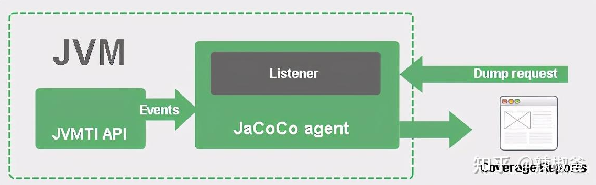

jacoco运行有离线（offline）、在线（on the fly）模式之说，所谓在线模式就是在应用启动时加入jacoco agent进行插桩，在开发、测试人员使用应用期间实时地进行代码覆盖率分析。相信很多的java项目开发人员并不会去写单元测试代码的，因此覆盖率统计就要把手工测试或接口测试覆盖的情况作为重要依据，显然在线模式更符合实际需求，本文以在线模式为例进行演示。

## Jacoco安装

从[官网](https://www.jacoco.org/jacoco/)下载最新版本并解压到指定目录

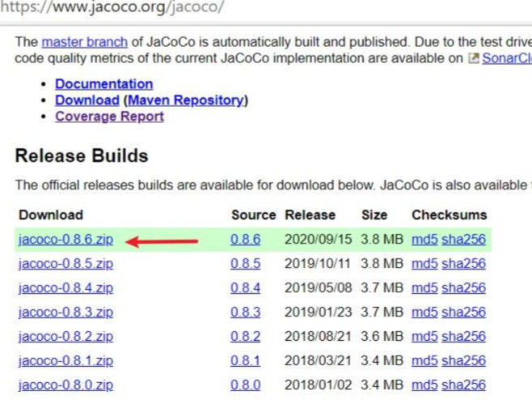

主要用到如下二个jar包：

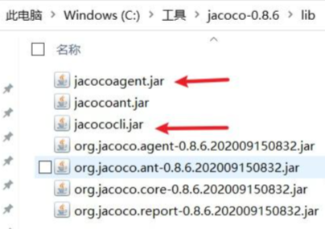

在线模式jacoco覆盖率统计包含三个步骤：

- 启动应用增加jacoco agent进行插桩，该步骤会启动TCP Server。
- 从TCP Server dump生成代码覆盖率文件，生成的文件格式为.exec格式的二级制文件。
- 解析.exec格式文件生成html格式代码覆盖率报告。

## 准备Java示例代码

事先需要创建java示例代码，本文不聚焦java代码相关的内容，大家可以使用自己的java项目代码进行验证

> 注意：在线模式使用的代码一定要是类似web应用这种永远不会退出的程序为例，因为收集jacoco agent要启用tcp server，如果程序执行完就退出了tpc server也关闭了。

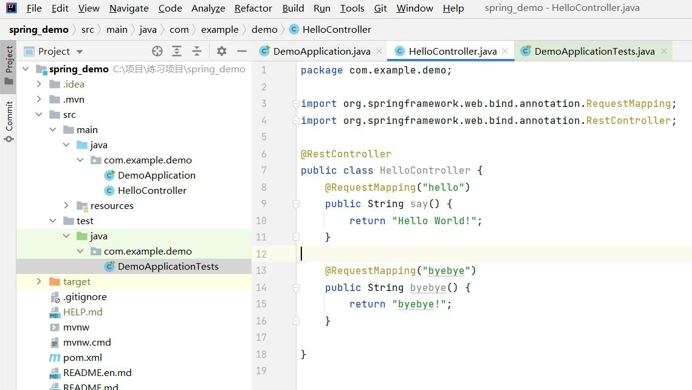

示例代码就是提供两个简单的URL访问：

- http://127.0.0.1:8080/hello
- http://127.0.0.1:8080/byebye

执行构建命令mvn clean package后，会在target目录生成可运行的jar包

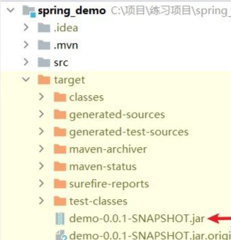

## 启动jacoco agent进行插桩

打开cmd，cd到示例代码的target目录，执行如下命令：

```bash
java -javaagent:C:\工具\jacoco-0.8.6\lib\jacocoagent.jar=includes=*,output=tcpserver,port=6300,address=localhost,append=true -jar demo-0.0.1-SNAPSHOT.jar
```

关键参数说明：

- `-javaagent:C:\工具\jacoco-0.8.6\lib\jacocoagent.jar=includes=*`，这个参数就是启用jacoco代理参数，其中C:\工具\jacoco-0.8.6\lib\jacocoagent.jar就是之前下载jacoco解压后的jacocoagent.jar的绝对路径，includes表示对要插桩的包进行过滤，*代表所有的class都要进行插桩，也可以根据情况进行过滤，如includes=com.mycompany.*
- `output=tcpserver`，这里不需要改动，表示以TCP Server方式启动应用并插桩
- `port=6300`，Jacoco开启的TCP Server的端口，不能被占用
- `address=localhost`，对外开放的地址，也可以指定IP地址
- `demo-0.0.1-SNAPSHOT.jar`，就是示例代码构建后target目录生成的jar包，需要根据实际情况更新

执行后就会启动web服务，截图如下：

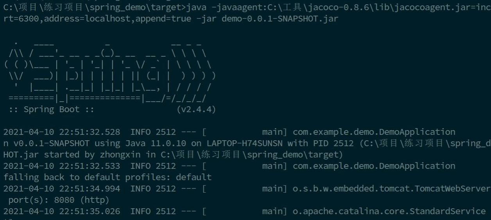

> 特别提醒：为了对比实时统计代码覆盖率的效果，此时请先不要请求上面提到的任何一个URL，切记！

## dump生成覆盖率文件

保持服务启动，再打开一个cmd窗口同样cd到target目录，执行如下命令从上一步开启的TCP Server中dump出覆盖率文件

```bash
java -jar C:\工具\jacoco-0.8.6\lib\jacococli.jar dump --address localhost --port 6300 --destfile ./jacoco_tcp_01.exec
```

参数说明：

- --destfile ./jacoco_tcp.exec，其中./jacoco_tcp.exec为生成exec文件名，表示在当前目录生成

其他参数和上一步类似，不再特别说明，注意需要更新jacococli.jar的绝对路径，执行成功后，会在target目录生成相应的.exec文件

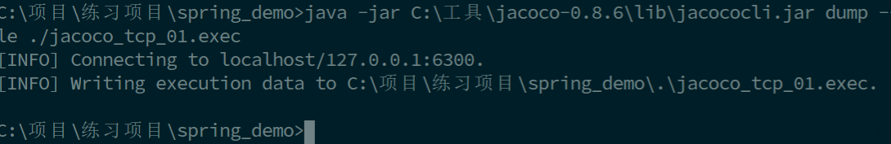

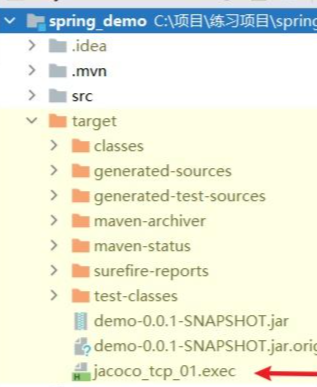

接下来，我们在浏览器中访问该web示例应用提供的两个

- http://127.0.0.1:8080/hello
- http://127.0.0.1:8080/byebye

应用会调用相应的方法并正常返回结果，然后，我们再次执行dump命令再生成一个.exec文件，命名为jacoco_tcp_02.exec

```bash
java -jar C:\工具\jacoco-0.8.6\lib\jacococli.jar dump --address localhost --port 6300 --destfile ./jacoco_tcp_02.exec
```

## 分析exec文件生成html报告

dump命令生成的.exec文件为二进制文件，需要进行解析，以生成html报告为例，执行如下的命令分别将两个.exec文件解析成html报告

```bash
java -jar C:\工具\jacoco-0.8.6\lib\jacococli.jar report ./jacoco_tcp_01.exec --classfiles .\classes --sourcefiles ..\src\main\java --html report01
java -jar C:\工具\jacoco-0.8.6\lib\jacococli.jar report ./jacoco_tcp_01.exec --classfiles .\classes --sourcefiles ..\src\main\java --html report02
```

参数说明：

- ./jacoco_tcp_01.exec，表示要解析的exec文件的相对路径
- --classfiles .\classes，需要指定生成的classes文件目录，参见下图
- --sourcefiles ..\src\main\java，需要指定源码的文件目录，参见下图

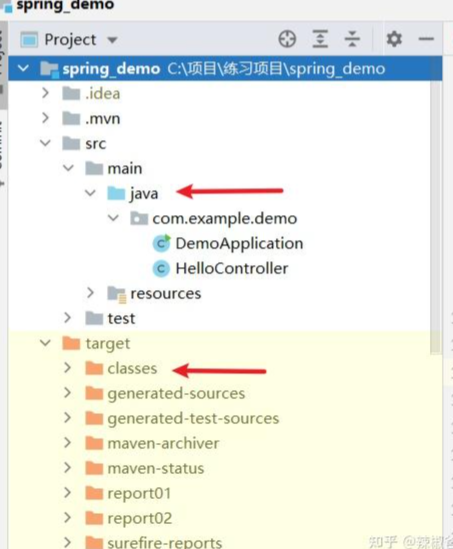

最终，target目录会生成report01、report02两个目录，分别打开其中的index.html查看代码覆盖率结果。

我们发现report01中的代码覆盖率为73%，其中say()和bybye()两个方法没有被覆盖：

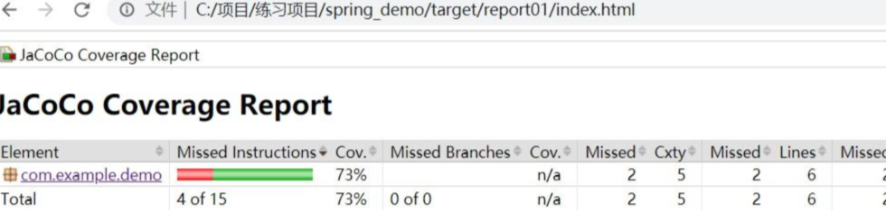

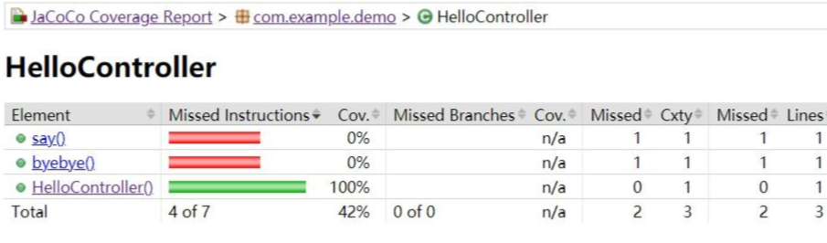

而我们访问了对应的服务之后生成的report02覆盖率报告为100%，say()和bybye()这两个方法都覆盖到了：

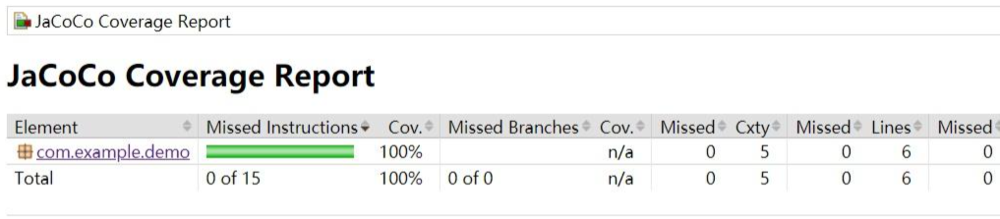

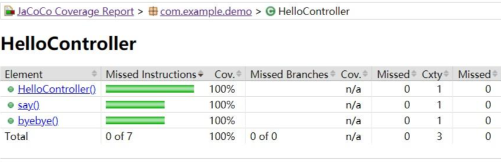


# 来源与参考

- [Java代码覆盖率工具Jacoco上手指引](https://zhuanlan.zhihu.com/p/363864068)