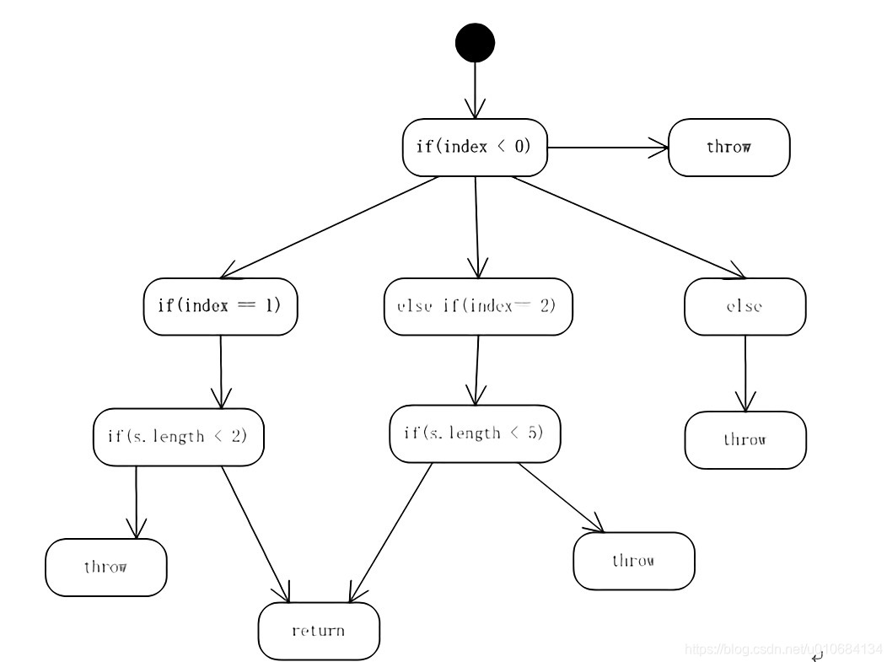

# Jacoco基础说明

## 市场上主要代码覆盖率工具

|工具|Jacoco|Emma|Cobertura|
|----|----|----|----|
|原理|使用 ASM 修改字节码|修改 jar 文件，class 文件字节码文件|基于 jcoverage,基于 asm 框架对 class 文件插桩|
|覆盖粒度|行，类，方法，指令，分支|行，类，方法，基本块，指令，无分支覆盖|项目，包，类，方法的语句覆盖/分支覆盖|
|插桩|on the fly、offline|on the fly、offline|offline，把统计代码插入编译好的class文件中|
|生成结果|在 Tomcat 的 catalina.sh 配置 javaangent 参数，指出需要收集覆盖率的文件，shutdown 时才收集，只能使用 kill 命令关闭 Tomcat，不要使用 kill -9|html、xml、txt，二进制格式报表|html，xml|
|缺点|需要源代码|1、需要 debug 版本，并打来 build.xml 中的 debug 编译项； 2、需要源代码，且必须与插桩的代码完全一致|1、不能捕获测试用例中未考虑的异常； 2、关闭服务器才能输出覆盖率信息（已有修改源代码的解决方案，定时输出结果；输出结果之前设置了 hook，会与某些服务器的 hook 冲突，web 测试中需要将 cobertura.ser 文件来回 copy|
|性能|快|小巧|插入的字节码信息更多|
|执行方式|maven，ant，命令行|命令行|maven，ant|
|Jenkins 集成|生成 html 报告，直接与 hudson 集成，展示报告，无趋势图|无法与 hudson 集成|有集成的插件，美观的报告，有趋势图|
|报告实时性|默认关闭，可以动态从 jvm dump 出数据|可以不关闭服务器|默认是在关闭服务器时才写结果|
|维护状态|持续更新中|停止维护|停止维护|

Tip：Jacoco 也是 Emma 团队开发的

## JaCoCo

### JaCoco是什么
Java Code Coverage Library，是一个开源的覆盖率工具。Jacoco 可以嵌入到 Ant 、Maven 中，并提供了 EclEmma Eclipse 插件,也可以使用 Java Agent 技术监控 Java 程序。很多第三方的工具提供了对 Jacoco 的集成，如：Sonar、Jenkins、IDEA.

### Java Counters

- 参考：[Jacoco Code Coverage](https://www.jianshu.com/p/16a8ce689d60)
- 参见官方文档：[Coverage Counters](https://www.jacoco.org/jacoco/trunk/doc/counters.html)

Jacoco 包含了多种尺度的覆盖率计数器,包含

- 指令级（Instructions,C0 coverage）
- 分支（Branches,C1 coverage）
- 圈复杂度（Cyclomatic Complexity）
- 行（Lines）
- 方法（Non-abstract Methods）
- 类（Classes）

详细说明：

- Instructions：Jacoco 计算的最小单位就是字节码指令。指令覆盖率表明了在所有的指令中，哪些被执行过以及哪些没有被执行。这项指数完全独立于源码格式并且在任何情况下有效，不需要类文件的调试信息。
- Branches：Jacoco 对所有的 if 和 switch 指令计算了分支覆盖率。这项指标会统计所有的分支数量，并同时支出哪些分支被执行，哪些分支没有被执行。这项指标也在任何情况都有效。异常处理不考虑在分支范围内。
  - 在有调试信息的情况下，分支点可以被映射到源码中的每一行，并且被高亮表示。
  - 红色钻石：无覆盖，没有分支被执行。
  - 黄色钻石：部分覆盖，部分分支被执行。
  - 绿色钻石：全覆盖，所有分支被执行。
- [Cyclomatic Complexity](#圈复杂度)：Jacoco 为每个非抽象方法计算圈复杂度，并也会计算每个类、包、组的复杂度。根据 McCabe 1996 的定义，圈复杂度可以理解为覆盖所有的可能情况最少使用的测试用例数。这项参数也在任何情况下有效。
- Lines：该项指数在有调试信息的情况下计算。
  - 因为每一行代码可能会产生若干条字节码指令，所以我们用三种不同状态表示行覆盖率
  - 红色背景：无覆盖，该行的所有指令均无执行。
  - 黄色背景：部分覆盖，该行`部分指令`被执行。
  - 绿色背景：全覆盖，该行所有指令被执行。
- Methods：每一个非抽象方法都至少有一条指令。若一个方法至少被执行了一条指令，就认为它被执行过。因为 Jacoco 直接对字节码进行操作，所以有些方法没有在源码显示（比如某些构造方法和由编译器自动生成的方法）也会被计入在内。
- Classes：每个类中只要有一个方法被执行，这个类就被认定为被执行。同 5 一样，有些没有在源码声明的方法被执行，也认定该类被执行。

### jacoco处理合并的逻辑

参考：[jacoco的多次代码提交merge分析](https://blog.csdn.net/tushuping/article/details/115008152)

官方明确说了，`只有相同代码生成的exec文件才能做merge操作`，具体原因参照[classid的说明](#什么是classid)

- 加载需要合并的exec文件
- 加载一个文件
- 解析文件里面的类id,类名和探针
- 存放在一个map里
- 然后将后面的类和探针进行合并，合并前会将classid，类全限定名以及探针数量进行对比，其中一项失败就会导致整个类合并失败

# 附录

## 圈复杂度

参考：[圈复杂度详解以及解决圈复杂度常用的方法](https://blog.csdn.net/u010684134/article/details/94410027)

### 什么是代码圈复杂度？

圈复杂度(Cyclomatic Complexity)是一种代码复杂度的衡量标准，由 Thomas McCabe 于 1976年定义。它可以用来衡量一个模块判定结构的复杂程度，数量上表现为独立现行路径条数，也可理解为覆盖所有的可能情况最少使用的测试用例数。圈复杂度大说明程序代码的判断逻辑复杂，可能质量低且难于测试和维护。程序的可能错误和高的圈复杂度有着很大关系。

### 代码圈复杂度的计算方法

通常使用的计算公式是`V(G) = e – n + 2`
- e 代表在控制流图中的边的数量（对应代码中顺序结构的部分）
- n 代表在控制流图中的节点数量，包括起点和终点，节点对应代码中的分支语句
- 所有终点只计算一次，即便有多个return或者throw

根据公式 `V(G) = e – n + 2 = 12 – 8 + 2 = 6` ，上图的圈复杂段为6。

说明一下为什么n = 8，虽然图上的真正节点有12个，但是其中有5个节点为throw、return，这样的节点为end节点，只能记做一个。

### 增加圈复杂度的语句

在代码中的表现形式：在一段代码中含有很多的 if / else 语句或者其他的判定语句（if / else , switch / case , for , while , | | , ? , …）

## 什么是classid

详细请参见[官方文档](https://www.eclemma.org/jacoco/trunk/doc/classids.html)

JaCoCo中实现的类ID是64位整数值，这个整数值是使用原始类文件的CRC64校验和创建的，用来明确标识Java类，所以类里面的代码不一样，这个类ID就不一样。
 
类 ID 仅对完全相同的类文件（逐字节）相同

官方提到的可能会获得不同的类文件有几个原因

- 使用的工具链不同会导致编译 Java 源文件将生成不同的类文件：
  - 不同的编译器供应商（例如 Eclipse 与 Oracle JDK）
  - 不同的编译器版本
  - 不同的编译器设置（例如调试与非调试）
- 此外，后处理类文件（混淆、AspectJ 等）通常会更改类文件
- 即使文件系统上的类文件相同，JaCoCo 运行时代理看到的类也可能是不同的。当在 JaCoCo 代理程序或特殊类装入器预处理类文件之前配置了另一个 Java 代理程序时，通常会发生这种情况
  - Mocking frameworks 模拟框架
  - Application servers 应用程序服务器
  - Persistence frameworks 持久性框架