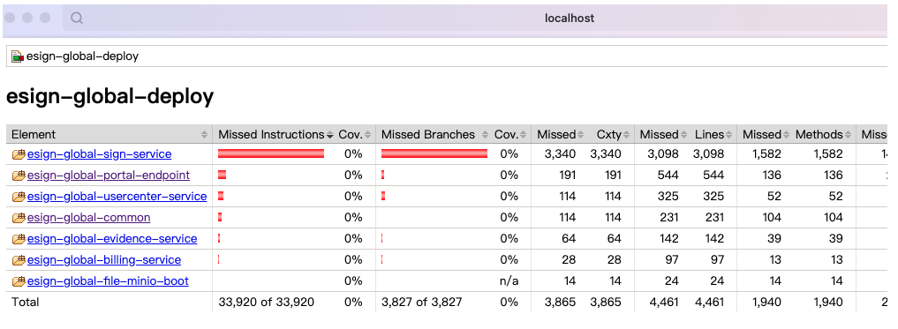

## maven的phase和goal

在讲jacoco配置之前，先讲一下maven插件配置的phase和goal。

### phase(插件阶段)

- phase由goal构成。
- phase其实就是goal的容器，实际被执行的都是goal。
- phase被执行时，实际执行的都是被绑定到该phase的goal。

比如执行 mvn package（这里的package为phase）， 就包含了validate、 compile、test、package四个goal（目标）。

### goal(目标)

一个goal（目标）代表一个具体的task。goal可以属于某一个phase，也可以独立存在。例如，如下面的命令：

```bash
mvn clean dependency:copy-dependencies package
```

这里的clean和package是一个阶段，dependency:copy-dependencies是一个独立存在目标。这里clean 阶段将会被首先执行，然后 dependency:copy-dependencies 目标会被执行，最终 package 阶段被执行。

**由上可以总结出，goal在一下两种情况下会被触发**：

- goal绑定到了某个phase，执行这个phase时会自动执行；
- 通过命令明确执行 `mvn <plugin name>:<goal>`，如 `mvn clean:clean`；

## 单模块生成单元测试覆盖率报告

单模块场景比较简单，在代码根目录的pom.xml添加以下配置即可：

```xml
<plugin>
    <groupId>org.jacoco</groupId>
    <artifactId>jacoco-maven-plugin</artifactId>
    <version>0.8.5</version>
    <executions>
        <execution>
            <goals>
                <goal>prepare-agent</goal>
            </goals>
        </execution>
        <execution>
            <id>report</id>
            <phase>test</phase>
            <goals>
                <goal>report</goal>
            </goals>
        </execution>
    </executions>
</plugin>
```

jacoco的report目标默认是在verify阶段，这里将report目标重新绑到了test阶段。

当执行mvn test时，会在代码的target/site/jacoco目录下生成单元测试的覆盖率报告。

## 多模块生成单元测试覆盖率报告

假设当前有一个多模块项目，代码结构如下所示：

```
├── module1
│   └── pom.xml
├── module2
│   └── pom.xml
├── module3
│   └── pom.xml
├── pom.xml
```

第一：需要在项目下添加一个用来聚合的模块，例如可以叫report。添加聚合模块后的代码结构如下

```
├── module1
│   └── pom.xml
├── module2
│   └── pom.xml
├── module3
│   └── pom.xml
├── report
│   └── pom.xml
├── pom.xml
```

第二：在项目parent目录的pom.xml需要添加jacoco插件

- 回顾一下：[plugin放在parent的pluginManagement内和放在plugins对子模块影响有什么不同](#plugin放在parent的pluginmanagement内和放在plugins对子模块影响有什么不同)


```xml
<plugins>
    <plugin>
        <groupId>org.apache.maven.plugins</groupId>
        <artifactId>maven-surefire-plugin</artifactId>
        <version>2.18.1</version>
        <configuration>
            <skipTests>false</skipTests>
            <testFailureIgnore>true</testFailureIgnore>
        </configuration>
    </plugin>
    <plugin>
        <groupId>org.jacoco</groupId>
        <artifactId>jacoco-maven-plugin</artifactId>
        <version>0.8.5</version>
        <executions>
            <execution>
                <id>my-prepare-agent</id>
                <goals>
                    <goal>prepare-agent</goal>
                </goals>
            </execution>
        </executions>
    </plugin>
</plugins>
```

第三：在聚合模块report中配置jacoco聚合报告

```xml
<plugins>
    <plugin>
        <groupId>org.jacoco</groupId>
        <artifactId>jacoco-maven-plugin</artifactId>
        <version>0.8.5</version>
        <executions>
            <execution>
                <id>my-report</id>
                <phase>test</phase>
                <goals>
                    <goal>report-aggregate</goal>
                </goals>
            </execution>
        </executions>
    </plugin>
</plugins>
```

第四：在聚合模块report的pom.xml中引用其他模块（非常重要，只有引用的模块的覆盖率才会被聚合到报告中，未引用的模块的覆盖率不会被收集和聚合）：

```xml
<dependencies>
    <dependency>
        <groupId>@project.groupId@</groupId>
        <artifactId>module1</artifactId>
        <version>${project.version}</version>
    </dependency>
    <dependency>
        <groupId>@project.groupId@</groupId>
        <artifactId>module2</artifactId>
        <version>${project.version}</version>
    </dependency>
    <dependency>
        <groupId>@project.groupId@</groupId>
        <artifactId>module3</artifactId>
        <version>${project.version}</version>
    </dependency>
</dependencies>
```

配置完成后，在项目根目录下执行mvn test，执行成功后会在report/target/site/jacoco-aggregate 目录下生成各个模块的覆盖测试报告。

如果不想要默认的报告路径，也可以在outputDirectory中配置报告的输出路径：

```xml
<build>
    <plugins>
        <plugin>
        <groupId>org.jacoco</groupId>
        <artifactId>jacoco-maven-plugin</artifactId>
        <version>0.8.5</version>
        <executions>
            <execution>
            <id>report-aggregate</id>
            <phase>test</phase>
            <goals>
                <goal>report-aggregate</goal>
            </goals>
            <configuration>
                <outputDirectory>target/site/jacoco</outputDirectory>
            </configuration>
            </execution>
        </executions>
        </plugin>
    </plugins>
</build>
```

## 覆盖率为0问题

按照上述文章提到的方法配置后，可以得到聚合的报告了，但是覆盖率都为0，这又是怎么回事呢？



这里需要涉及另外一个插件：`maven-surefire-plugin`

需要在maven-surefire-plugin中配置引用jacoco插件的输出属性argLine

原理分析：jacoco在prepare-agent阶段会生成一个属性，这个属性指向jacoco的runtime agent，默认这个属性叫argLine，我们需要在maven-surefire-plugin的配置中，引用这个属性，这样在surefire执行测试时，才会能够找到并挂载jacoco的agent，从而实现代码覆盖率的统计（当然我们也可以自定义这个属性的名字）

```xml
<plugins>
    <plugin>
        <groupId>org.apache.maven.plugins</groupId>
        <artifactId>maven-surefire-plugin</artifactId>
        <version>2.18.1</version>
        <configuration>
            <skipTests>false</skipTests>
            <testFailureIgnore>true</testFailureIgnore>
            <!-- 增加了这里 -->
            <argLine>${argLine}</argLine>
        </configuration>
    </plugin>
    <plugin>
        <groupId>org.jacoco</groupId>
        <artifactId>jacoco-maven-plugin</artifactId>
        <version>0.8.5</version>
        <executions>
            <execution>
                <id>my-prepare-agent</id>
                <goals>
                    <goal>prepare-agent</goal>
                </goals>
            </execution>
        </executions>
    </plugin>
</plugins>
```

或者在prepare-agent阶段自定义jacoco输出的属性名，那么你的根pom文件是这样的

```xml
<plugins>
    <plugin>
        <groupId>org.apache.maven.plugins</groupId>
        <artifactId>maven-surefire-plugin</artifactId>
        <version>2.18.1</version>
        <configuration>
            <skipTests>false</skipTests>
            <testFailureIgnore>true</testFailureIgnore>
            <argLine>${jacocoArgLine}</argLine>
        </configuration>
    </plugin>
    <plugin>
        <groupId>org.jacoco</groupId>
        <artifactId>jacoco-maven-plugin</artifactId>
        <version>0.8.5</version>
        <executions>
            <execution>
                <id>my-prepare-agent</id>
                <goals>
                    <goal>prepare-agent</goal>
                </goals>
                <configuration>
                  <propertyName>jacocoArgLine</propertyName>
                </configuration>
            </execution>
        </executions>
    </plugin>
</plugins>
```

好了，这时再去运行一下：

```bash
mvn test -Dmaven.test.failure.ignore=true
```

# 参考

- [jacoco插件配置生成单元测试覆盖率报告](https://blog.csdn.net/weixin_38384296/article/details/122655287)
- [springboot多模块工程单元测试jacoco统计代码覆盖率总结](https://blog.csdn.net/boweiqiang/article/details/128559724)

# 附录

## plugin放在parent的pluginManagement内和放在plugins对子模块影响有什么不同

在 Maven 中，`<pluginManagement>` 和 `<plugins>` 元素都可以用来配置插件，但是它们对子模块的影响是不同的：

`<pluginManagement>`：在父 POM 中的 `<pluginManagement>` 中定义的插件配置，只是提供了一种默认的插件配置方式。这些配置只有在子模块中显式声明了该插件时才会被应用。也就是说，`<pluginManagement>` 中的插件配置不会直接影响到子模块，除非子模块中也定义了这个插件。

`<plugins>`：在父 POM 中的 `<plugins>` 中定义的插件配置，会被所有的子模块继承。这意味着，这些插件会在所有的子模块中执行，除非子模块中显式地覆盖了这些配置。

所以，如果你希望一个插件在所有的子模块中都执行，你应该将它放在父 POM 的 `<plugins>` 中。如果你只是希望提供一个插件的默认配置，供子模块选择性地使用，你应该将它放在父 POM 的 `<pluginManagement>` 中。
