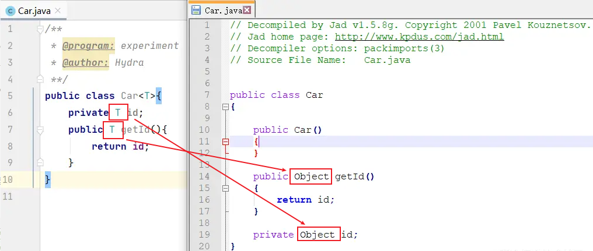
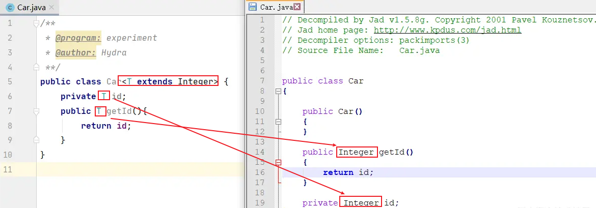
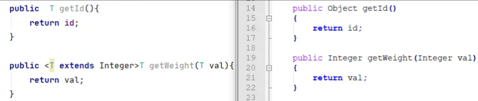
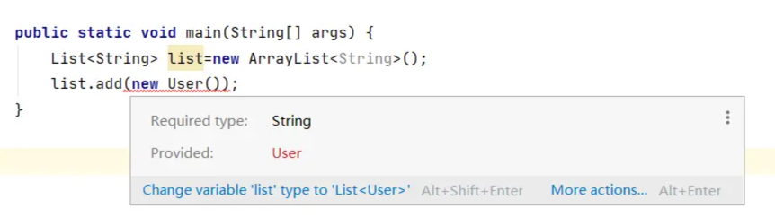
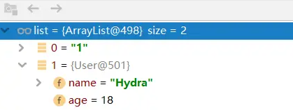
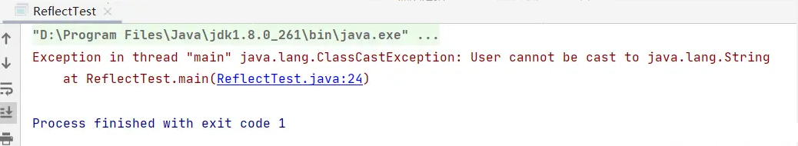
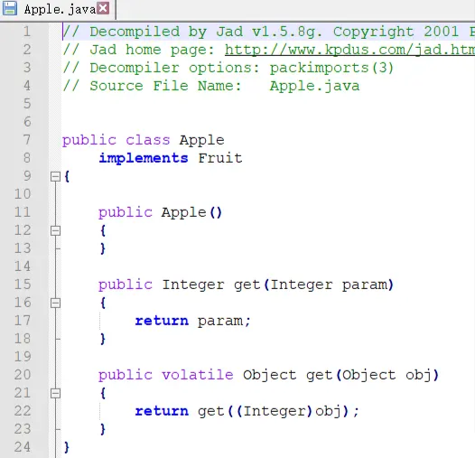
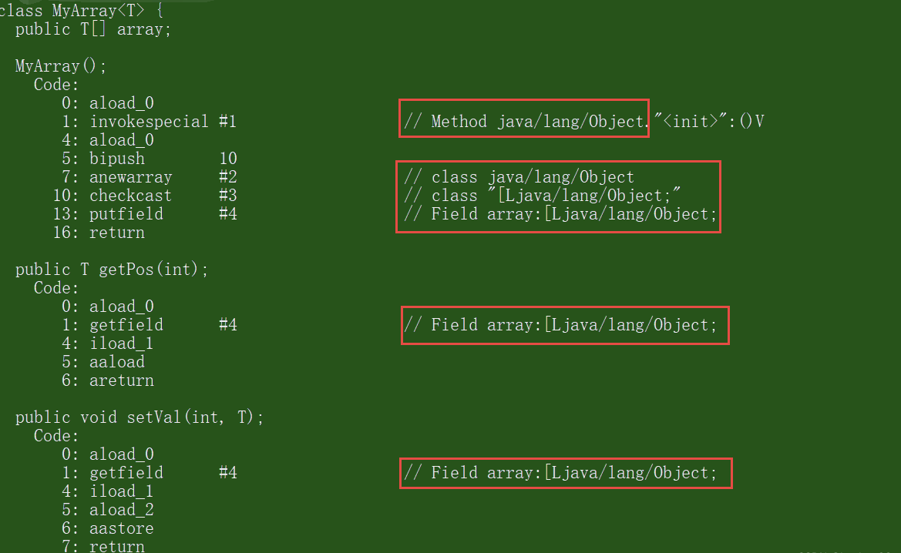
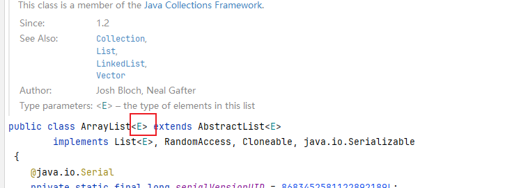

# Java泛型

对java的泛型特性的了解仅限于表面的浅浅一层，直到在学习设计模式时发现有不了解的用法，才想起详细的记录一下。

本文参考java 泛型详解、Java中的泛型方法、 java泛型详解

## 概述

什么是泛型？为什么要使用泛型？

泛型，即“参数化类型”。

- 提到参数，最熟悉的就是定义方法时有形参，然后调用此方法时传递实参。
- 那么参数化类型怎么理解呢？顾名思义，就是`将类型由原来的具体的类型参数化`，类似于方法中的变量参数，此时类型也定义成参数形式（可以称之为类型形参），然后在使用/调用时传入具体的类型（类型实参）。
- 泛型的本质是为了参数化类型（在不创建新的类型的情况下，通过泛型指定的不同类型来控制形参具体限制的类型）。也就是说在泛型使用过程中，操作的数据类型被指定为一个参数，这种参数类型可以用在类、接口和方法中，分别被称为泛型类、泛型接口、泛型方法。

## 一个栗子

```java
List arrayList = new ArrayList();
arrayList.add("aaaa");
arrayList.add(100);

for(int i = 0; i< arrayList.size();i++){
    String item = (String)arrayList.get(i);
    Log.d("泛型测试","item = " + item);
}
```

毫无疑问，程序的运行结果会以崩溃结束：

```bash
java.lang.ClassCastException: java.lang.Integer cannot be cast to java.lang.String
```

ArrayList可以存放任意类型，例子中添加了一个String类型，添加了一个Integer类型，再使用时都以String的方式使用，因此程序崩溃了。

为了解决类似这样的问题（在编译阶段就可以解决），泛型应运而生。

我们将第一行声明初始化list的代码更改一下，编译器会在编译阶段就能够帮我们发现类似这样的问题。

```java
List<String> arrayList = new ArrayList<String>();
...
//arrayList.add(100); 在编译阶段，编译器就会报错
```

## 特性

泛型只在编译阶段有效。看下面的代码：

```java
List<String> stringArrayList = new ArrayList<String>();
List<Integer> integerArrayList = new ArrayList<Integer>();

Class classStringArrayList = stringArrayList.getClass();
Class classIntegerArrayList = integerArrayList.getClass();

if(classStringArrayList.equals(classIntegerArrayList)){
    Log.d("泛型测试","类型相同");
}
```

输出结果：`D/泛型测试: 类型相同`。

通过上面的例子可以证明，在编译之后程序会采取去泛型化的措施。也就是说Java中的泛型，只在编译阶段有效。在编译过程中，正确检验泛型结果后，会将泛型的相关信息擦出，并且在对象进入和离开方法的边界处添加类型检查和类型转换的方法。也就是说，泛型信息不会进入到运行时阶段。

对此总结成一句话：泛型类型在逻辑上看以看成是多个不同的类型，实际上都是相同的基本类型。

# 泛型的使用

泛型有三种使用方式，分别为

- 泛型类
- 泛型接口
- 泛型方法

## 泛型类

泛型类型用于类的定义中，被称为泛型类。通过泛型可以完成对一组类的操作对外开放相同的接口。最典型的就是各种容器类，如：List、Set、Map。

一个最普通的泛型类：

- 类名后的 `<T>` 代表占位符，表示当前类是一个泛型类，常用的其他名称有：
  - E 表示 Element
  - K 表示 Key
  - V 表示 Value
  - N 表示 Number
  - T 表示 Type
  - S, U, V 等等... ...

```java
//此处T可以随便写为任意标识，常见的如T、E、K、V等形式的参数常用于表示泛型
//在实例化泛型类时，必须指定T的具体类型
public class Generic<T>{ 
    //key这个成员变量的类型为T,T的类型由外部指定  
    private T key;

    //泛型构造方法形参key的类型也为T，T的类型由外部指定
    public Generic(T key) {
        this.key = key;
    }

    //泛型方法getKey的返回值类型为T，T的类型由外部指定
    public T getKey(){
        return key;
    }
}
```

```java
// 泛型的类型参数只能是类类型（包括自定义类），不能是简单类型
// 传入的实参类型需与泛型的类型参数类型相同，即为Integer.
Generic<Integer> genericInteger = new Generic<Integer>(123456);

// 传入的实参类型需与泛型的类型参数类型相同，即为String.
Generic<String> genericString = new Generic<String>("key_vlaue");
Log.d("泛型测试","key is " + genericInteger.getKey());
Log.d("泛型测试","key is " + genericString.getKey());
```

```
12-27 09:20:04.432 13063-13063/? D/泛型测试: key is 123456
12-27 09:20:04.432 13063-13063/? D/泛型测试: key is key_vlaue
```

定义的泛型类，就一定要传入泛型类型实参么？并不是这样。

- 在使用泛型的时候如果传入泛型实参，则会根据传入的泛型实参做相应的限制，此时泛型才会起到本应起到的限制作用。
- 如果不传入泛型类型实参的话，在泛型类中使用泛型的方法或成员变量定义的类型可以为任何的类型。

```java
Generic generic = new Generic("111111");
Generic generic1 = new Generic(4444);
Generic generic2 = new Generic(55.55);
Generic generic3 = new Generic(false);

Log.d("泛型测试","key is " + generic.getKey());
Log.d("泛型测试","key is " + generic1.getKey());
Log.d("泛型测试","key is " + generic2.getKey());
Log.d("泛型测试","key is " + generic3.getKey());
```

```
D/泛型测试: key is 111111
D/泛型测试: key is 4444
D/泛型测试: key is 55.55
D/泛型测试: key is false
```

注意：

- 泛型的类型参数只能是类类型，不能是简单类型。
- 不能对确切的泛型类型使用instanceof操作。
  - 如下面的操作是非法的，编译时会出错。
  - `if(ex_num instanceof Generic<Number>){ }`

## 泛型接口

泛型接口与泛型类的定义及使用基本相同。泛型接口常被用在各种类的生产器中，可以看一个例子：

```java
//定义一个泛型接口
public interface Generator<T> {
    public T next();
}
```

当实现泛型接口的类，未传入泛型实参时：

```java
/**
 * 未传入泛型实参时:
 * 与泛型类的定义相同，在声明类的时候，需将泛型的声明也一起加到类中
 * 即：class FruitGenerator<T> implements Generator<T>{
 * 如果不声明泛型，如：class FruitGenerator implements Generator<T>，编译器会报错："Unknown class"
 */
class FruitGenerator<T> implements Generator<T>{
    @Override
    public T next() {
        return null;
    }
}
```

当实现泛型接口的类，传入泛型实参时：

```java
/**
 * 传入泛型实参时：
 * 定义一个生产器实现这个接口,虽然我们只创建了一个泛型接口Generator<T>
 * 但是我们可以为T传入无数个实参，形成无数种类型的Generator接口。
 * 在实现类实现泛型接口时，如已将泛型类型传入实参类型，则所有使用泛型的地方都要替换成传入的实参类型
 * 即：Generator<T>，public T next();中的的T都要替换成传入的String类型。
 */
public class FruitGenerator implements Generator<String> {

    private String[] fruits = new String[]{"Apple", "Banana", "Pear"};

    @Override
    public String next() {
        Random rand = new Random();
        return fruits[rand.nextInt(3)];
    }
}
```

## 泛型通配符`?`

已知Ingeter是Number的一个子类(同时我们也验证过`Generic<Ingeter>`与`Generic<Number>`实际上是相同的一种基本类型)，那么，

- 在使用`Generic<Number>`作为形参的方法中，能否使用`Generic<Ingeter>`的实例传入呢？
- 在逻辑上类似于`Generic<Number>`和`Generic<Ingeter>`是否可以看成具有父子关系的泛型类型呢？

为了弄清楚这个问题，我们使用`Generic<T>`这个泛型类继续看下面的例子：

```java
public void showKeyValue1(Generic<Number> obj){
    Log.d("泛型测试","key value is " + obj.getKey());
}
```

```java
Generic<Integer> gInteger = new Generic<Integer>(123);
Generic<Number> gNumber = new Generic<Number>(456);

showKeyValue(gNumber);

// showKeyValue这个方法编译器会为我们报错：Generic<java.lang.Integer> 
// cannot be applied to Generic<java.lang.Number>
// showKeyValue(gInteger);
```

通过提示信息我们可以看到`Generic<Integer>不能被看作为Generic<Number>的子类`

由此可以看出:同一种泛型可以对应多个版本（因为参数类型是不确定的），不同版本的泛型类实例是不兼容的。

回到上面的例子，如何解决上面的问题？总不能为了定义一个新的方法来处理`Generic<Integer>`类型的类，这显然与java中的多态理念相违背。因此我们需要一个在逻辑上可以表示同时是`Generic<Integer>`和`Generic<Number>`父类的引用类型。由此类型通配符应运而生。

我们可以将上面的方法改一下：

```java
public void showKeyValue1(Generic<?> obj){
    Log.d("泛型测试","key value is " + obj.getKey());
}
```

类型通配符一般是使用`?`代替具体的类型实参
- !!!注意，`此处?是类型实参，而不是类型形参`。问号是实参而不是形参。
- 再直白点的意思就是，此处的`?`和Number、String、Integer一样都是一种实际的类型，`可以把?看成所有类型的父类`。
- 是一种真实的类型。


## 泛型方法

在java中,泛型类的定义非常简单，但是泛型方法就比较复杂了。

尤其是我们见到的大多数泛型类中的成员方法也都使用了泛型，有的甚至泛型类中也包含着泛型方法，这样在初学者中非常容易将泛型方法理解错了。

- 泛型类，是在`实例化类的时候`指明泛型的具体类型；
- 泛型方法，是在`调用方法的时候`指明泛型的具体类型。

```java
/**
 * 泛型方法的基本介绍
 * @param tClass 传入的泛型实参
 * @return T 返回值为T类型
 * 说明：
 *     1）public 与 返回值中间<T>非常重要，可以理解为声明此方法为泛型方法。
 *     2）只有声明了<T>的方法才是泛型方法，泛型类中的使用了泛型的成员方法并不是泛型方法。
 *     3）<T>表明该方法将使用泛型类型T，此时才可以在方法中使用泛型类型T。
 *     4）与泛型类的定义一样，此处T可以随便写为任意标识，常见的如T、E、K、V等形式的参数常用于表示泛型。
 */
public <T> T genericMethod(Class<T> tClass)throws InstantiationException, IllegalAccessException {
    T instance = tClass.newInstance();
    return instance;
}
```

```java
Object obj = genericMethod(Class.forName("com.test.test"));
```

### 泛型方法的基本用法

```java
public class GenericTest {
   //这个类是个泛型类，在上面已经介绍过
   public class Generic<T>{     
        private T key;

        public Generic(T key) {
            this.key = key;
        }

        //我想说的其实是这个，虽然在方法中使用了泛型，但是这并不是一个泛型方法。
        //这只是类中一个普通的成员方法，只不过他的返回值是在声明泛型类已经声明过的泛型。
        //所以在这个方法中才可以继续使用 T 这个泛型。
        public T getKey(){
            return key;
        }

        /**
         * 这个方法显然是有问题的，在编译器会给我们提示这样的错误信息"cannot reslove symbol E"
         * 因为在类的声明中并未声明泛型E，所以在使用E做形参和返回值类型时，编译器会无法识别。
        public E setKey(E key){
             this.key = keu
        }
        */
    }

    /** 
     * 这才是一个真正的泛型方法。
     * 首先在public与返回值之间的<T>必不可少，这表明这是一个泛型方法，并且声明了一个泛型T
     * 这个T可以出现在这个泛型方法的任意位置.
     * 泛型的数量也可以为任意多个 
     *    如：public <T,K> K showKeyName(Generic<T> container){
     *        ...
     *        }
     */
    public <T> T showKeyName(Generic<T> container){
        System.out.println("container key :" + container.getKey());
        //当然这个例子举的不太合适，只是为了说明泛型方法的特性。
        T test = container.getKey();
        return test;
    }

    //这也不是一个泛型方法，这就是一个普通的方法，只是使用了Generic<Number>这个泛型类做形参而已。
    public void showKeyValue1(Generic<Number> obj){
        Log.d("泛型测试","key value is " + obj.getKey());
    }

    //这也不是一个泛型方法，这也是一个普通的方法，只不过使用了泛型通配符?
    //同时这也印证了泛型通配符章节所描述的，?是一种类型实参，可以看做为Number等所有类的父类
    public void showKeyValue2(Generic<?> obj){
        Log.d("泛型测试","key value is " + obj.getKey());
    }

     /**
     * 这个方法是有问题的，编译器会为我们提示错误信息："UnKnown class 'E' "
     * 虽然我们声明了<T>,也表明了这是一个可以处理泛型的类型的泛型方法。
     * 但是只声明了泛型类型T，并未声明泛型类型E，因此编译器并不知道该如何处理E这个类型。
    public <T> T showKeyName(Generic<E> container){
        ...
    }  
    */

    /**
     * 这个方法也是有问题的，编译器会为我们提示错误信息："UnKnown class 'T' "
     * 对于编译器来说T这个类型并未项目中声明过，因此编译也不知道该如何编译这个类。
     * 所以这也不是一个正确的泛型方法声明。
    public void showkey(T genericObj){

    }
    */

    public static void main(String[] args) {


    }
}
```

### 类中的泛型方法

当然这并不是泛型方法的全部，泛型方法可以出现杂任何地方和任何场景中使用。但是有一种情况是非常特殊的，当泛型方法出现在泛型类中时，我们再通过一个例子看一下

```java
public class GenericFruit {
    class Fruit{
        @Override
        public String toString() {
            return "fruit";
        }
    }

    class Apple extends Fruit{
        @Override
        public String toString() {
            return "apple";
        }
    }

    class Person{
        @Override
        public String toString() {
            return "Person";
        }
    }

    class GenerateTest<T>{
        public void show_1(T t){
            System.out.println(t.toString());
        }

        //在泛型类中声明了一个泛型方法，使用泛型E，这种泛型E可以为任意类型。可以类型与T相同，也可以不同。
        //由于泛型方法在声明的时候会声明泛型<E>，因此即使在泛型类中并未声明泛型，编译器也能够正确识别泛型方法中识别的泛型。
        public <E> void show_3(E t){
            System.out.println(t.toString());
        }

        //在泛型类中声明了一个泛型方法，使用泛型T，注意这个T是一种全新的类型，可以与泛型类中声明的T不是同一种类型。
        public <T> void show_2(T t){
            System.out.println(t.toString());
        }
    }

    public static void main(String[] args) {
        Apple apple = new Apple();
        Person person = new Person();

        GenerateTest<Fruit> generateTest = new GenerateTest<Fruit>();
        //apple是Fruit的子类，所以这里可以
        generateTest.show_1(apple);
        //编译器会报错，因为泛型类型实参指定的是Fruit，而传入的实参类是Person
        //generateTest.show_1(person);

        //使用这两个方法都可以成功
        generateTest.show_2(apple);
        generateTest.show_2(person);

        //使用这两个方法也都可以成功
        generateTest.show_3(apple);
        generateTest.show_3(person);
    }
}
```

### 泛型方法与可变参数

再看一个泛型方法和可变参数的例子

```java
public <T> void printMsg( T... args){
    for(T t : args){
        Log.d("泛型测试","t is " + t);
    }
}
```

```
printMsg("111",222,"aaaa","2323.4",55.55);
```

### 静态方法与泛型

静态方法有一种情况需要注意一下，那就是在类中的静态方法使用泛型：
- 静态方法无法访问类上定义的泛型；
- 如果静态方法操作的引用数据类型不确定的时候，必须要将泛型定义在方法上。

即：如果静态方法要使用泛型的话，必须将静态方法也定义成泛型方法。

```java
public class StaticGenerator<T> {

    /**
     * 如果在类中定义使用泛型的静态方法，需要添加额外的泛型声明（将这个方法定义成泛型方法）
     * 即使静态方法要使用泛型类中已经声明过的泛型也不可以。
     * 如：public static void show(T t){..},此时编译器会提示错误信息：
          "StaticGenerator cannot be refrenced from static context"
     */
    public static <T> void show(T t){

    }
}
```

### 泛型方法总结

泛型方法能使方法独立于类而产生变化，以下是一个基本的指导原则：

- 无论何时，`如果你能做到，你就该尽量使用泛型方法`。也就是说，如果使用泛型方法将整个类泛型化，那么就应该使用泛型方法。
- 对于一个static的方法而已，无法访问泛型类型的参数。所以如果`static方法要使用泛型能力，就必须使其成为泛型方法`。

## 泛型上下边界

在使用泛型的时候，我们还可以为传入的泛型类型实参进行上下边界的限制，如：类型实参只准传入某种类型的父类或某种类型的子类。

- `<? extends T>`：是指上界通配符（Upper Bounds Wildcards）
- `<? super T>`：是指下界通配符（Lower Bounds Wildcards）

为泛型添加上边界，即传入的类型实参必须是指定类型的子类型

```java
public void showKeyValue1(Generic<? extends Number> obj){
    Log.d("泛型测试","key value is " + obj.getKey());
}
```

```java
Generic<String> generic1 = new Generic<String>("11111");
Generic<Integer> generic2 = new Generic<Integer>(2222);
Generic<Float> generic3 = new Generic<Float>(2.4f);
Generic<Double> generic4 = new Generic<Double>(2.56);

//这一行代码编译器会提示错误，因为String类型并不是Number类型的子类
//showKeyValue1(generic1);

showKeyValue1(generic2);
showKeyValue1(generic3);
showKeyValue1(generic4);
```

如果我们把泛型类的定义也改一下:

```java
public class Generic<T extends Number>{
    private T key;

    public Generic(T key) {
        this.key = key;
    }

    public T getKey(){
        return key;
    }
}
```

```java
//这一行代码也会报错，因为String不是Number的子类
Generic<String> generic1 = new Generic<String>("11111");
```

再来一个泛型方法的例子：

```java
//在泛型方法中添加上下边界限制的时候，必须在权限声明与返回值之间的<T>上添加上下边界，即在泛型声明的时候添加
//public <T> T showKeyName(Generic<T extends Number> container)，编译器会报错："Unexpected bound"
public <T extends Number> T showKeyName(Generic<T> container){
    System.out.println("container key :" + container.getKey());
    T test = container.getKey();
    return test;
}
```

通过上面的两个例子可以看出：`泛型的上下边界添加，必须与泛型的声明在一起`。

## 泛型的擦除机制(Type Erasure)

!> 要理解定义，先看完底下的[类型擦除做了什么](#类型擦除做了什么)

定义：Java的类型擦除机制是指`在编译期间将泛型的类型参数替换为其边界或Object类型`，从而实现泛型代码运行时无需知晓实际类型参数。

先看一道常见的面试题，下面的代码的执行结果是什么？

```java
public static void main(String[] args) {
    List<String> list1=new ArrayList<String>();
    List<Integer> list2=new ArrayList<Integer>();
    System.out.println(list1.getClass()==list2.getClass());
}
```

首先，我们知道getClas方法获取的是对象运行时的类（Class），那么这个问题也就可以转化为`ArrayList<String>`和`ArrayList<Integer>`的对象在运行时对应的Class是否相同？

我们直接揭晓答案，运行上面的代码，程序会打印true，说明虽然在代码中声明了具体的泛型，但是两个List对象对应的Class是一样的，对它们的类型进行打印，结果都是：

```
class java.util.ArrayList
```

也就是说，虽然`ArrayList<String>`和`ArrayList<Integer>`在编译时是不同的类型，但是在编译完成后都被编译器简化成了ArrayList，这一现象，被称为`泛型的类型擦除(Type Erasure)`。

泛型的本质是参数化类型，而类型擦除使得类型参数只存在于编译期，在运行时，jvm是并不知道泛型的存在的。

那么为什么要进行泛型的类型擦除呢？查阅的一些资料中，解释说类型擦除的主要目的是避免过多的创建类而造成的运行时的过度消耗。试想一下，如果用`List<A>`表示一个类型，再用`List<B>`表示另一个类型，以此类推，无疑会引起类型的数量爆炸。

在对类型擦除有了一个大致的了解后，我们再看看下面的几个问题。

### 类型擦除做了什么？

上面我们说了，编译完成后会对泛型进行类型擦除，如果想要眼见为实，实际看一下的话应该怎么办呢？那么就需要对编译后的字节码文件进行反编译了，这里使用一个轻量级的小工具Jad来进行反编译（可以从这个地址进行下载：https://varaneckas.com/jad/）

Jad的使用也很简单，下载解压后，把需要反编译的字节码文件放在目录下，然后在命令行里执行下面的命令就可以在同目录下生成反编译后的.java文件了：

```bash
jad -sjava Test.class 
```

好了，工具准备好了，下面我们就看一下不同情况下的类型擦除。

#### 无限制类型擦除

当类定义中的类型参数没有任何限制时，在类型擦除后，会被直接替换为Object。

在下面的例子中，`<T>`中的类型参数T就全被替换为了Object（左侧为编译前的代码，右侧为通过字节码文件反编译得到的代码）：



#### 有限制类型擦除

当类定义中的类型参数存在限制时，在类型擦除中替换为类型参数的上界或者下界。下面的代码中，经过擦除后T被替换成了Integer：



#### 擦除方法中的类型参数

比较下面两边的代码，可以看到在擦除方法中的类型参数时，和擦除类定义中的类型参数一致，无限制时直接擦除为Object，有限制时则会被擦除为上界或下界：



### 反射能获取泛型的类型吗

估计对Java反射比较熟悉小伙伴要有疑问了，反射中的getTypeParameters方法可以获得类、数组、接口等实体的类型参数，如果类型被擦除了，那么能获取到什么呢？我们来尝试一下使用反射来获取类型参数：

```java
System.out.println(Arrays.asList(list1.getClass().getTypeParameters()));
```

执行结果如下：

```
[E]
```

同样，如果打印Map对象的参数类型：

```java
Map<String,Integer> map=new HashMap<>();
System.out.println(Arrays.asList(map.getClass().getTypeParameters()));
```

最终也只能够获取到：

```
[K, V]
```

可以看到通过getTypeParameters方法只能获取到泛型的参数占位符，而不能获得代码中真正的泛型类型。

### 能在指定类型的List中放入其他类型的对象吗？

使用泛型的好处之一，就是在编译的时候能够检查类型安全，但是通过上面的例子，我们知道运行时是没有泛型约束的，那么是不是就意味着，在运行时可以把一个类型的对象能放进另一类型的List呢？我们先看看正常情况下，直接调用add方法会有什么报错：



当我们尝试将User类型的对象放入String类型的数组时，泛型的约束会在编译期间就进行报错，提示提供的User类型对象不适用于String类型数组。那么既然编译时不行，那么我们就在运行时写入，借助真正运行的class是没有泛型约束这一特性，使用反射在运行时写入：

```java
public class ReflectTest {
    static List<String> list = new ArrayList<>();

    public static void main(String[] args) {
        list.add("1");
        ReflectTest reflectTest =new ReflectTest();
        try {
            Field field = ReflectTest.class.getDeclaredField("list");
            field.setAccessible(true);
            List list=(List) field.get(reflectTest);
            list.add(new User());
        } catch (Exception e) {
            e.printStackTrace();
        }        
    }
}
```

执行上面的代码，不仅在编译期间可以通过语法检查，并且也可以正常地运行，我们使用debug来看一下数组中的内容：



可以看到虽然数组中声明的泛型类型是String，但是仍然成功的放入了User类型的对象。那么，如果我们在代码中尝试取出这个User对象，程序还能正常执行吗，我们在上面代码的最后再加上一句：

```java
System.out.println(list.get(1));
```

再次执行代码，程序运行到最后的打印语句时，报错如下：



异常提示User类型的对象无法被转换成String类型，这是否也就意味着，在取出对象时存在强制类型转换呢？我们来看一下ArrayList中get方法的源码：

```java
public E get(int index) {
    rangeCheck(index);
    return elementData(index);
}

E elementData(int index) {
    return (E) elementData[index];
}
```

可以看到，在取出元素时，会将这个元素强制类型转换成泛型中的类型，也就是说在上面的代码中，最后会尝试强制把User对象转换成String类型，在这一阶段程序会报错。

通过这一过程，也再次证明了泛型可以对类型安全进行检测。

### 类型擦除会引起什么问题

下面我们看一个稍微有点复杂的例子，首先声明一个接口，然后创建一个实现该接口的类：

```java
public interface Fruit<T> {
    T get(T param);
}

public class Apple implements Fruit<Integer> {
    @Override
    public Integer get(Integer param) {
        return param;
    }
}
```

按照之前我们的理解，在进行类型擦除后，应该是这样的：

```java
public interface Fruit {
    Object get(Object param);
}

public class Apple implements Fruit {
    @Override
    public Integer get(Integer param) {
        return param;
    }
}
```

但是，如果真是这样的话那么代码是无法运行的，因为虽然Apple类中也有一个get方法，但是与接口中的方法参数不一致，也就是说没有覆盖接口中的方法。针对这种情况，编译器会通过添加一个桥接方法来满足语法上的要求，同时保证了基于泛型的多态能够有效。

我们反编译上面代码生成的字节码文件：



可以看到，编译后的代码中生成了两个get方法。参数为Object的get方法负责实现Fruit接口中的同名方法，然后在实现类中又额外添加了一个参数为Integer的get方法，这个方法也就是理论上应该生成的带参数类型的方法。最终用接口方法调用额外添加的方法，通过这种方式构建了接口和实现类的关系，类似于起到了桥接的作用，因此也被称为桥接方法，最终，通过这种机制保证了泛型情况下的Java多态性。


### 小结

本节由面试中常见的一道面试题入手，介绍了java中泛型的类型擦除相关知识，通过这一过程，也便于大家理解`为什么平常总是说java中的泛型是一个伪泛型`，同时也有助于大家认识到java中泛型的一些缺陷。了解类型擦除的原因以及原理，相信能够方便大家在日常的工作中更好的使用泛型。


## 泛型到底是如何进行编译的？

泛型的语法实际上是非常复杂不容易理解的，我们需要借助他的字节码文件去观察，

使用命令：`javap -c `查看字节码文件



## 泛型数组

看到了很多文章中都会提起泛型数组，经过查看sun的说明文档，在java中是”不能创建一个确切的泛型类型的数组”的。

也就是说下面的这个例子是不可以的：

```java
List<String>[] ls = new ArrayList<String>[10];  
```



我们代码中`<E>`传入的是String，在编译期间，泛型类型参数String被擦除了，`List<String>`被替换成了`List<Object>`，而在运行时，get方法返回的是Object类型，需要强制转换为String类型，也就是说，我们无法在运行时获取到类型参数的具体值，因为编译器已经将其擦除了。


而使用通配符创建泛型数组是可以的，如下面这个例子：

```java
List<?>[] ls = new ArrayList<?>[10]; 
```

这样也是可以的：

```java
List<String>[] ls = new ArrayList[10];
```

下面使用[Sun的一篇文档](https://docs.oracle.com/javase/tutorial/extra/generics/fineprint.html)的一个例子来说明这个问题：

```java
List<String>[] lsa = new List<String>[10]; // 这种写法是不允许的，这里只是用以说明问题
Object o = lsa;
Object[] oa = (Object[]) o;
List<Integer> li = new ArrayList<Integer>();    
li.add(new Integer(3));
oa[1] = li; // 不健全，但通过运行时存储检查
String s = lsa[1].get(0); // 运行时错误：ClassCastException。
```

这种情况下，由于JVM泛型的擦除机制，在运行时JVM是不知道泛型信息的，所以可以给oa[1]赋上一个ArrayList而不会出现异常，
但是在取出数据的时候却要做一次类型转换，所以就会出现ClassCastException，如果可以进行泛型数组的声明，上面说的这种情况在编译期将不会出现任何的警告和错误，只有在运行时才会出错。
而对泛型数组的声明进行限制，对于这样的情况，可以在编译期提示代码有类型安全问题，比没有任何提示要强很多。

下面采用通配符的方式是被允许的:数组的类型不可以是类型变量，除非是采用通配符的方式，因为对于通配符的方式，最后取出数据是要做显式的类型转换的。

```java
List<?>[] lsa = new List<?>[10]; // OK, 无界通配符类型的数组.    
Object o = lsa;    
Object[] oa = (Object[]) o;    
List<Integer> li = new ArrayList<Integer>();    
li.add(new Integer(3));    
oa[1] = li; // Correct.    
Integer i = (Integer) lsa[1].get(0); // OK
```

# 参考

- [java 泛型详解-绝对是对泛型方法讲解最详细的，没有之一](https://www.cnblogs.com/coprince/p/8603492.html)
- [面试官：说说什么是泛型的类型擦除？](https://juejin.cn/post/6999797611146248222)