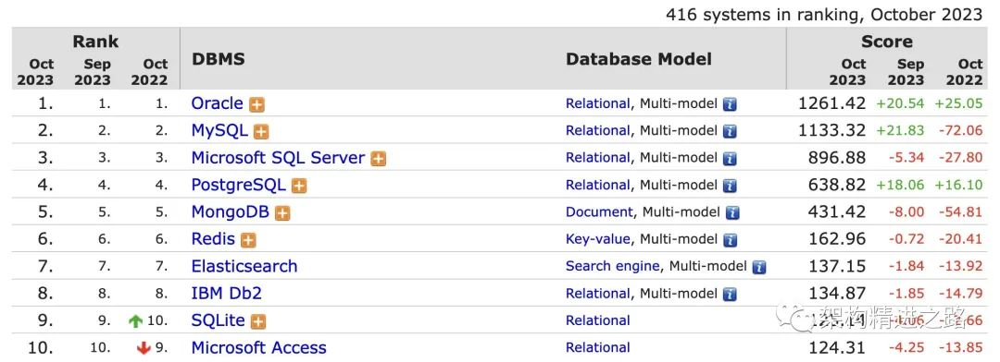
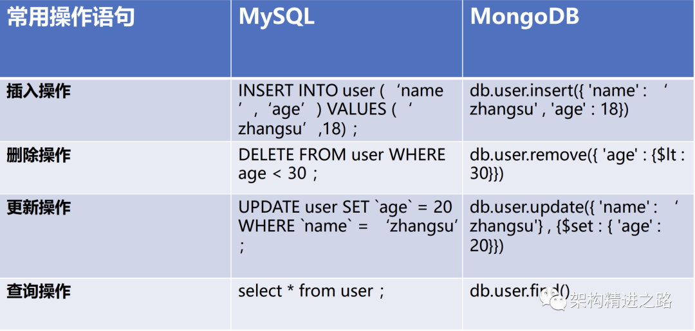
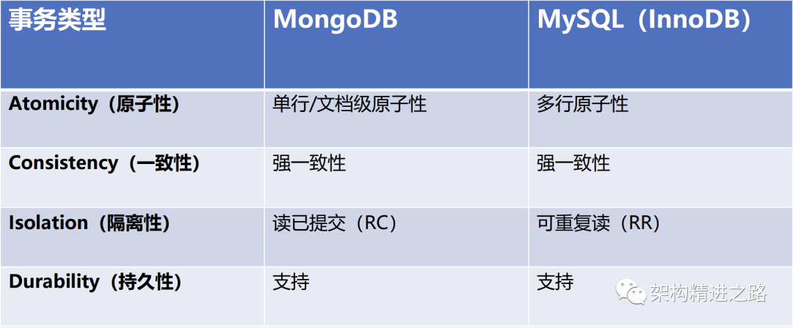
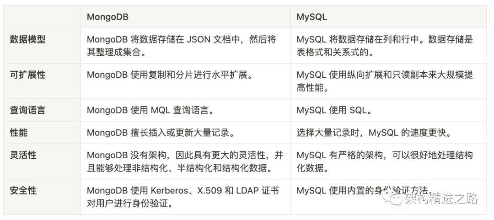
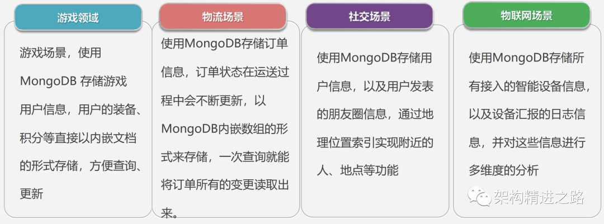

# MySQL与MongoDB该如何做技术选型

# 引言

一般情况下，会考虑到MySQL与MongoDB如何做技术选型的时候，你一定是遇到了类似于非结构化数据JSON的存取难题，否则大家都直接MySQL开始搞起了。

为什么要关注MongoDB呢？

下图是DB-Engines 2023年10月数据库的排名统计，可以看到MongoDB总排名在第5，在Nosql数据库中排名第1。

既然要做技术选型，那就先要弄明白其中的一些区别和差异。

# MySQL和MongoDB简介

## 什么是MySQL？

MySQL是一个关系型数据库管理系统，由瑞典MySQL AB 公司开发，属于 Oracle 旗下产品。MySQL是最流行的关系型数据库管理系统之一，在 WEB 应用方面，MySQL是最好的RDBMS (Relational Database Management System，关系数据库管理系统)应用软件之一。

主要特点：

- 强大的体系结构
- 集群架构的多样性
- 完整的复制体系
- 强大的多行事务的支持
- 不同的插件式存储引擎的支持（InnoDB）
- 第三方工具种类丰富，社区用户活跃

## 什么是MongoDB？

MongoDB 是一个基于分布式文件存储的数据库。由C++语言编写，旨在为WEB应用提供可扩展的高性能数据存储解决方案。

MongoDB将数据存储为一个文档，数据结构由键值(key=>value)对组成。MongoDB文档类似于JSON 对象。字段值可以包含其他文档，数组及文档数组。

主要特点：

- 文档模式，无结构化数据，灵活的数据结构，适合快速开发，迭代场景
- 功能强大，位置索引、文本索引、TTL索引
- 副本集自动切换，保证数据的高可靠，服务的高可用性。
- 自动分片，存储容量、服务能力横向能力
- 适应于物流，物联网等海量数据场景
- aggregation & mapreduce

# MongoDB与MySQL之间的差异

## 相关概念及术语的差异

|- |SQL Terms/Concepts|MongoDB Terms、Concepts|
|----|----|----|
|数据库|database|database|
|表|table|collection|
|行|row|document|
|字段|column|field|
|索引|index|index|

## 存储数据结构的差异

MySQL 的存储结构分为5 级：表空间、段、簇、页、行。表空间可以看做是InnoDB 存储引擎逻辑结构的最高层，所有的数据都存放在表空间中。

MySQL 不同引擎有不同的存储方式，而 MongoDB 以类JSON的文档的格式存储。

## 增删改查操作的差异

当从数据库表或表组合中请求信息时，MySQL 使用 结构化查询语言（SQL），SQL是最流行和利用最广泛的查询语言，大多数开发人员都有这方面的经验。

相反，MongoDB 则使用非结构化查询语言（MQL）。要从JSON文档数据库请求数据或信息，首先必须指定具有结果应匹配的属性的文档。

> 尽管 MQL 和 SQL 有相似之处，但 MQL 通常需要额外花费精力进行学习。

## 事务支持的差异

当应用程序类型需要多行事务时，关系数据库是最合适的选择。除了提供安全性，MySQL还实现了高事务处理率。而 MongoDB 仅支持单文档事务操作，弱一致性。

## 性能测试总结分析

- 插入速度总结：`MongoDB不指定_id插入 > MySQL不指定主键插入 > MySQL指定主键插入 > MongoDB指定_id插入`。
- MongoDB在指定_id插入的时候，插入性能下降非常厉害。
- MySQL非常稳定，无论在指定主键还是在不指定主键插入的情况下，其效率都差不了。
- MongoDB会充分利用内存作为缓存。

## 其他主要差异

接下来，我们将介绍一些其他主要差异。

# 应用场景分析

作为文档数据库，由于MongoDB并不限制用户存储数据的体量和类型，因此适合大数据的应用环境。而得益于MongoDB的水平可扩展能力，以及与云服务的敏捷性结合，它不但能够减少开发者的工作量，简化业务与项目的扩展流程，还能够提供高可用性和数据的快速恢复。

不过，MongoDB在数据的可靠性、一致性、以及安全性等方面，不如MySQL。此外，当应用程序需要提供多行事务(如，会计和银行系统)时，以MySQL为首的关系型数据库提供了高事务处理率(high transaction rate)。实际上，与MySQL专注于提供事务的ACID和安全性不同的是，MongoDB更专注于提供高插入率(high insert rate)。

MongoDB 的应用已经渗透到各个领域，比如游戏、物流、电商、内容管理、社交、物联网、视频直播等。

# 总结

综上所述，MySQL是一个开放源代码的关系数据库，这意味着它的数据被组织成表格，使您可以将数据与数据库的其他部分相关联。MongoDB也是开源的，但是，它是一个文档数据库。因此，它不关联记录，并且其数据模式是不固定的，从而允许具有更高插入能力的更具动态性和灵活性的数据库。

在确定最佳数据库系统之前，应明确并确定特定业务或项目的优先级。

- MongoDB比MySQL更能处理大量数据，因此，对于基于云的服务，易于增长和更改的应用程序以及数据量大的环境，它是最合适的选择。
- 相反，MySQL的固定和结构化数据模式提供了比大多数数据库更高的一致性和可靠性。
- 使用MySQL的另一个巨大好处是，由于符合ACID的事务而具有卓越的数据安全性，是重视此功能的应用程序的最合适选择。

总之，MongoDB和MySQL都很优秀，具体如何选择，完全取决于您的具体应用需求和系统特征。

# 来源

- [MySQL与MongoDB，该如何做技术选型？](https://mp.weixin.qq.com/s/8Q4UAYPbiOXMV8vj7Duomw)