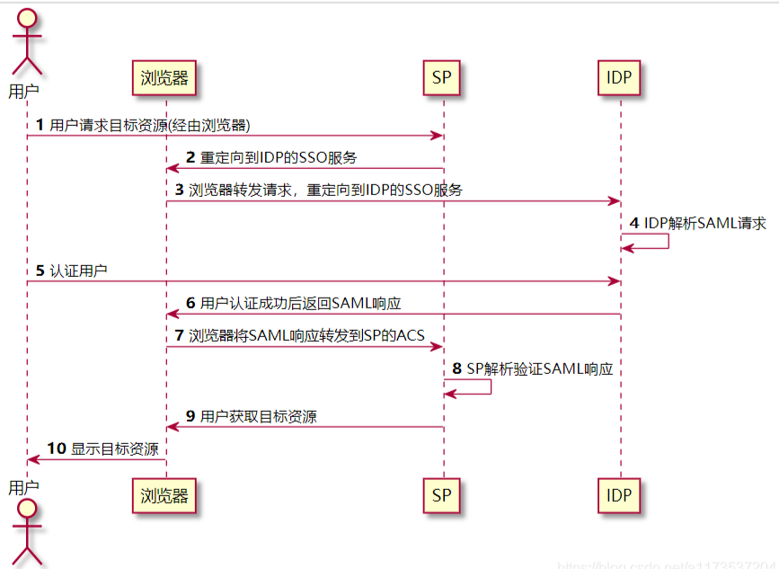
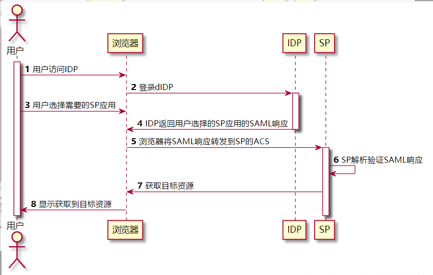

# SAML概述

SAML（Security Assertion Markup Language 安全断言标记语言）是一个基于XML的开源标准数据格式，为在安全域间交换身份认证和授权数据，尤其是在IDP（Identity Provider身份提供方）和SP（Service Provider 服务提供方）之间。

SAML是OASIS（Organization for the Advancement of Structured Information Standards 安全服务技术委员会）制定的标准，始于2001年，其最新主要版本SAML 2.0于2005年发布。

SAML解决的最主要的需求是基于Web的单点登录（SSO）。

# SAML协议中定义了三种角色

- User Agent：用户代理，一般指自然人用户通过浏览器进行服务访问或者向其他服务提供者请求资源的的系统主体；
- IDP（Identity Provider身份提供方）：创建、维护和管理主体的身份信息，并向联邦内的其他服务提供者提供主体身份验证；
- SP（Service Provider 服务提供方）：通过解析IDP发出的身份认证断言，验证主体身份认证信息后，给主体或联邦内其他系统提供服务。

# SAML协议说明

## Metadata

SAML协议规定，要让IDP和SP实现SSO，需要在IDP和SP进行参数配置，主要是交换IDP和SP的Metadata（元数据）信息，IDP的Metadata示例如下：

```xml
  <md:EntityDescriptor entityID="https://idp.example.org/SAML2" validUntil="2013-03-22T23:00:00Z"
    xmlns:md="urn:oasis:names:tc:SAML:2.0:metadata"
    xmlns:saml="urn:oasis:names:tc:SAML:2.0:assertion"
    xmlns:ds="http://www.w3.org/2000/09/xmldsig#">
    <!-- insert ds:Signature element (omitted) -->
    <!-- insert md:IDPSSODescriptor element (below) -->
    <md:Organization>
      <md:OrganizationName xml:lang="en">Some Non-profit Organization of New York</md:OrganizationName>
      <md:OrganizationDisplayName xml:lang="en">Some Non-profit Organization</md:OrganizationDisplayName>
      <md:OrganizationURL xml:lang="en">https://www.example.org/</md:OrganizationURL>
    </md:Organization>
    <md:ContactPerson contactType="technical">
      <md:SurName>SAML Technical Support</md:SurName>
      <md:EmailAddress>mailto:saml-support@example.org</md:EmailAddress>
    </md:ContactPerson>
  </md:EntityDescriptor>
```

主要元素信息为：

|标签 |说明 |
|----|----|
|<md:EntityDescriptor>下的entityID|IDP的唯一标识。|
|<md:EntityDescriptor>下的validUntil|元数据的过期时间。|
|<ds:Signature>|包含数字签名，以确保元数据的真实性和完整性。|
|<md:Organization>|组织信息。|
|<md:ContactPerson>|联系人信息。|

IDP的SSO相关Metadata是`<md:IDPSSODescriptor>`元素，示例如下：

```xml
  <md:IDPSSODescriptor
    protocolSupportEnumeration="urn:oasis:names:tc:SAML:2.0:protocol">
    <md:KeyDescriptor use="signing">
      <ds:KeyInfo>...</ds:KeyInfo>
    </md:KeyDescriptor>
    <md:ArtifactResolutionService isDefault="true" index="0"
      Binding="urn:oasis:names:tc:SAML:2.0:bindings:SOAP"
      Location="https://idp.example.org/SAML2/ArtifactResolution"/>
    <md:NameIDFormat>urn:oasis:names:tc:SAML:1.1:nameid-format:emailAddress</md:NameIDFormat>
    <md:NameIDFormat>urn:oasis:names:tc:SAML:2.0:nameid-format:transient</md:NameIDFormat>
    <md:SingleSignOnService
      Binding="urn:oasis:names:tc:SAML:2.0:bindings:HTTP-Redirect"
      Location="https://idp.example.org/SAML2/SSO/Redirect"/>
    <md:SingleSignOnService
      Binding="urn:oasis:names:tc:SAML:2.0:bindings:HTTP-POST"
      Location="https://idp.example.org/SAML2/SSO/POST"/>
    <md:SingleSignOnService
      Binding="urn:oasis:names:tc:SAML:2.0:bindings:HTTP-Artifact"
      Location="https://idp.example.org/SAML2/Artifact"/>
    <saml:Attribute
      NameFormat="urn:oasis:names:tc:SAML:2.0:attrname-format:uri"
      Name="urn:oid:1.3.6.1.4.1.5923.1.1.1.1"
      FriendlyName="eduPersonAffiliation">
      <saml:AttributeValue>member</saml:AttributeValue>
      <saml:AttributeValue>student</saml:AttributeValue>
      <saml:AttributeValue>faculty</saml:AttributeValue>
      <saml:AttributeValue>employee</saml:AttributeValue>
      <saml:AttributeValue>staff</saml:AttributeValue>
    </saml:Attribute>
  </md:IDPSSODescriptor>
```

主要元素信息为：


|标签 |说明 |
|----|----|
|<md:KeyDescriptor use="signing">|IDP配置的一个私有SAML签名密钥和/或一个私有后端通道TLS密钥。|
|<md:ArtifactResolutionService>下的Binding|SAML绑定信息。|
|<md:NameIDFormat>|SSO支持的SAML名称标识格式。|
|<md:SingleSignOnService>|单点登录信息。|
|<saml:Attribute>|IDP提供的断言的属性。|

SP的Metadata与IDP的类似。从上面的示例中我们看到交换IDP和SP的Metadata，主要就是交换两部分信息，一部分是实体的唯一标识、签名信息等，让IDP和SP能够唯一识别对方的身份；另一部分是绑定信息、名称标识格式等SSO相关信息，让IDP和SP能够进行SSO。更详细的Metadata信息可以查看《SAML 模板使用指南》

## SAMLRequest

SP在请求IDP进行身份认证时会发送一个SAMLRequest，它是Base64编码以后的`<samlp:AuthnRequest>`元素，示例如下：

```xml
  <samlp:AuthnRequest
    xmlns:samlp="urn:oasis:names:tc:SAML:2.0:protocol"
    xmlns:saml="urn:oasis:names:tc:SAML:2.0:assertion"
    ID="identifier_1"
    Version="2.0"
    IssueInstant="2004-12-05T09:21:59Z"
    AssertionConsumerServiceIndex="0">
    <saml:Issuer>https://sp.example.com/SAML2</saml:Issuer>
    <samlp:NameIDPolicy
      AllowCreate="true"
      Format="urn:oasis:names:tc:SAML:2.0:nameid-format:transient"/>
  </samlp:AuthnRequest>
```

主要元素信息为：

|标签 |说明 |
|----|----|
|<samlp:AuthnRequest>下的IssueInstant|消息签发时间。|
|<saml:Issuer>|消息签发者。|
|<samlp:NameIDPolicy>|向IDP请求身份认证。|

如果需要的话，SAMLRequest还可以使用SigningKey进行签名。


### SAMLResponse

IDP接收到SP的SAMLRequest后，进行用户身份认证，生成主会话，然后返回一个XHTML表单：

```html
  <form method="post" action="https://sp.example.com/SAML2/SSO/POST" ...>
    <input type="hidden" name="SAMLResponse" value="response" />
    ...
    <input type="submit" value="Submit" />
  </form>
```

其中SAMLResponse的值是Base64编码以后的`<samlp:Response>`元素，示例如下：

```xml
 <samlp:Response
    xmlns:samlp="urn:oasis:names:tc:SAML:2.0:protocol"
    xmlns:saml="urn:oasis:names:tc:SAML:2.0:assertion"
    ID="identifier_2"
    InResponseTo="identifier_1"
    Version="2.0"
    IssueInstant="2004-12-05T09:22:05Z"
    Destination="https://sp.example.com/SAML2/SSO/POST">
    <saml:Issuer>https://idp.example.org/SAML2</saml:Issuer>
    <samlp:Status>
      <samlp:StatusCode
        Value="urn:oasis:names:tc:SAML:2.0:status:Success"/>
    </samlp:Status>
    <saml:Assertion
      xmlns:saml="urn:oasis:names:tc:SAML:2.0:assertion"
      ID="identifier_3"
      Version="2.0"
      IssueInstant="2004-12-05T09:22:05Z">
      <saml:Issuer>https://idp.example.org/SAML2</saml:Issuer>
      <!-- a POSTed assertion MUST be signed -->
      <ds:Signature
        xmlns:ds="http://www.w3.org/2000/09/xmldsig#">...</ds:Signature>
      <saml:Subject>
        <saml:NameID
          Format="urn:oasis:names:tc:SAML:2.0:nameid-format:transient">
          3f7b3dcf-1674-4ecd-92c8-1544f346baf8
        </saml:NameID>
        <saml:SubjectConfirmation
          Method="urn:oasis:names:tc:SAML:2.0:cm:bearer">
          <saml:SubjectConfirmationData
            InResponseTo="identifier_1"
            Recipient="https://sp.example.com/SAML2/SSO/POST"
            NotOnOrAfter="2004-12-05T09:27:05Z"/>
        </saml:SubjectConfirmation>
      </saml:Subject>
      <saml:Conditions
        NotBefore="2004-12-05T09:17:05Z"
        NotOnOrAfter="2004-12-05T09:27:05Z">
        <saml:AudienceRestriction>
          <saml:Audience>https://sp.example.com/SAML2</saml:Audience>
        </saml:AudienceRestriction>
      </saml:Conditions>
      <saml:AuthnStatement
        AuthnInstant="2004-12-05T09:22:00Z"
        SessionIndex="identifier_3">
        <saml:AuthnContext>
          <saml:AuthnContextClassRef>
            urn:oasis:names:tc:SAML:2.0:ac:classes:PasswordProtectedTransport
         </saml:AuthnContextClassRef>
        </saml:AuthnContext>
      </saml:AuthnStatement>
    </saml:Assertion>
  </samlp:Response>
```

主要元素信息为：

|标签 |说明 |
|----|----|
|<samlp:Response>下的IssueInstant|消息签发时间。|
|<samlp:Response>下的Destination|消息发送目的地，即请求身份认证的SP地址。|
|<saml:Issuer>|消息签发者。|
|<saml:Assertion>|SAML断言信息。|
|<saml:Subject>|主体身份信息。|
|<saml:SubjectConfirmationData>|主体身份确认信息。|
|<saml:Conditions>|条件信息，主体身份信息在这个条件下有效。|
|<saml:AuthnStatement>|SAML认证状态。|

一般情况下IDP会用自己的私钥对SAMLResponse进行签名，SP接收到SAMLResponse以后，先Base64解码得到`<samlp:Response>`元素，然后用公钥检查签名，验证完以后提取主体身份信息，找到对应的子账户信息，生成子会话。SAMLResponse中重要的是Assertion部分， 包含有用户的Subject 身份信息。 默认一般用IDP的私钥对整个SAMLResponse 签名， 也可以是对Assertion 签名， 或是二者兼而有之， 取决于IDP和SP的协商。

## SAMLBinding

SAML协议中一共规定了如下几种Binding方式：

- SAML SOAP Binding
- Reverse SOAP (PAOS) Binding
- HTTP Redirect Binding
- HTTP POST Binding
- HTTP Artifact Binding
- SAML URI Binding

不同的Binding方式使用不同的通信方式和消息体，使用最多的是HTTP Redirect Binding和HTTP POST Binding方式，其次是HTTP Artifact Binding。常用方式是SP使用HTTP Redirect Binding通过浏览器将SAMLRequest转发到IDP的SSO地址，IDP使用HTTP POST Binding方式将用SAMLResponse返回到SP的ACS地址。


# SAML的流程

## SP发起SSO

用户请求SP资源，SP生成SAML请求，IDP接收并解析SAML请求并进行用户认证后返回SAML响应，SP接收并解析SAML响应后，提起其中的令牌Assertion, 提供被请求的资源给用户使用。

具体流程如下：



### 1、用户请求目标资源

用户向SP请求目标资源，例如目标资源为：

`https://sp.example.com/myresource`

SP会进行安全检查，如果SP已经存在有效的IDP安全会话上下文，则认为已经登录过， 跳过步骤2~8。

### 2、重定向到IDP的SSO服务

SP会生成SAMLRequest，同时会把SP当前发起的URL生成一个随机数opaque， 临时存放， 同时把它作为RelayState，然后使用标准的HTTP 302重定向redirect到IDP的SSO服务，例如：

```
302 Redirect

Location: http://{url}/sso?SAMLRequest=xxx&RelayState=opaque
```

RelayState是SP的发起URL的不透明引用，SAMLRequest是Base64编码以后的`<samlp:AuthnRequest>`元素。如果需要的话，SAMLRequest还可以使用SigningKey进行签名。

### 3、浏览器转发SAML请求，重定向到IDP的SSO服务

浏览器将SP的SAMLRequest和RelayState通过一个GET请求转发到IDP的SSO服务：

```
GET /SAML2/SSO/Redirect?SAMLRequest=request&RelayState=opaque HTTP/1.1

Host: idp.example.org
```

### 4、IDP解析SAML请求

IDP解析SAML请求，通过Base64解码得到<samlp:AuthnRequest>元素。IDP会验证用户是否已经登录，如果已经登录则跳过步骤5。

### 5、认证用户

IDP认证用户身份，常用的方法是IDP返回登录页面给用户，IDP可以配置自己需要的认证方式， 比如用户使用账号和密码进行登录认证。

### 6、用户认证成功后返回SAML响应

IDP认证用户身份以后会返回SAMLResponse响应，包含有用户的Subject 身份信息。

### 7、浏览器将SAML响应转发到SP的ACS

浏览器将SAMLResponse和RelayState以POST的方式转发到SP的ACS URL， SP继续解析令牌。

```
POST /SAML2/SSO/POST HTTP/1.1

Host: sp.example.com

Content-Type: application/x-www-form-urlencoded

Content-Length: nnn

SAMLResponse=response&RelayState=opaque
```

### 8、SP解析验证SAML响应

SP处理SAMLResponse响应，Base64解码得到`<samlp:Response>`元素，最重要的是要用SP中的公钥， 来检查签名的合法性， 如果合法 ，则抽取其中包含的用户信息Subject，找到对应的SP应用子账户， 生成SP安全会话上下文。

### 9、用户获取目标资源

用户成功获取SP提供的目标资源。如果SP发现RelayState中有对应的URL， 则提取这个URL， 跳转到对应的URL。


## IDP发起SSO

同上面的SP发起SSO不同， IDP发起可以实现用户登录IDP，`在IDP中选择某个SP应用`，IDP跳转到SP，用户使用SP的资源。

具体的流程如下：



### 1、用户访问IDP

用户打开IDP的登录页面。

### 2、用户登录IDP

使用配置好的如账号密码等方式登录到IDP。

### 3、用户选择需要的SP应用

用户在IDP中选择需要使用的SP应用，继续流程。

### 4、IDP返回用户选择的SP应用的SAML响应

IDP生成用户选择的SP应用的SAMLResponse响应（前文已介绍），返回给用户的浏览器。

### 5、浏览器将SAML响应转发到SP的ACS

浏览器将SAMLResponse和RelayState以POST的方式转发到SP的ACS URL。

### 6、SP解析验证SAML响应

SP处理SAMLResponse响应，Base64解码得到`<samlp:Response>`元素，最重要的是要用SP中的公钥， 来检查签名的合法性， 如果合法 ，则抽取其中包含的用户信息Subject，找到对应的SP应用子账户， 生成SP安全会话上下文。

注： 可以看到， 这一步和SP发起中的第8步非常类似， 包括下一步。

### 7、用户获取目标资源

自此，SSO结束，用户成功获取SP提供的目标资源。如果SP发现RelayState中有对应的URL， 则提取这个URL， 跳转到对应的URL。

### 8、显示目标资源

用户看到对应的应用目标资源。

# 相关资料

- https://blog.csdn.net/a1173537204/article/details/114839749
- http://docs.oasis-open.org/security/saml/v2.0/saml-core-2.0-os.pdf
- http://docs.oasis-open.org/security/saml/v2.0/saml-bindings-2.0-os.pdf
- http://docs.oasis-open.org/security/saml/v2.0/saml-profiles-2.0-os.pdf
- http://docs.oasis-open.org/security/saml/v2.0/saml-metadata-2.0-os.pdf
- http://docs.oasis-open.org/security/saml/v2.0/saml-authn-context-2.0-os.pdf
- http://docs.oasis-open.org/security/saml/v2.0/saml-conformance-2.0-os.pdf
- http://docs.oasis-open.org/security/saml/v2.0/saml-sec-consider-2.0-os.pdf
- http://docs.oasis-open.org/security/saml/v2.0/saml-glossary-2.0-os.pdf
