# CAS详细认证流程

# 简介

CAS解决了单点登录的问题，网上有很多关于CAS是如何实现单点的文章，但是很少有对详细认证流程做解释，这里做一下梳理。

# 核心概念

## TGT

Ticket Granting Ticket

TGT 是CAS 为用户签发的登录 ticket，也是用于验证用户登录成功的唯一方式。 TGT 封装了用户信息，CAS 通过 Cookie 值（TGC）为 key 查询缓存中有无 TGT（TGC=>TGT（key=>value）），如果有的话就说明用户已经登录成。

## TGC

Ticket Granting Cookie

CAS 会将生成的 TGT 放在 session(默认放在session中，实际项目放在redis中这里只是举例) 中，而 TGC 就是这个 session 的唯一标识(sessionId)，按`key=>value`形式理解可以认为是可以认为是 `TGC=>TGT`，TGC 以 cookie 的形式保存在浏览器中，每次访问单点域名都会尝试携带 TGC。（每个服务都会在 session 和 cookie 中保存对应的 TGT 和 TGC）

## ST

Service Ticket

ST 是当用户访问某一服务时提供的 ticket。用户在访问其他服务时，发现没有 登录 ，那么就会302到 CAS 服务器获取 ST。然后会携带着 ST 302 回来，本地应用根据ST去CAS获取登录的用户信息，并且保存在本地应用中。

# 环境准备

我们这里准备了3台节点来测试,1和2服务分别对应接入单点的2个系统，我们开启这3个服务

| 序号 | 域名          | 作用              |
| :--- | :------------ | :---------------- |
| 1    | app1.com      | 应用1             |
| 2    | app2.com      | 应用2             |
| 3    | localhost/cas | CAS单点登录服务器 |

## 访问逻辑图




## 第一次访问app1

我们访问app1下的接口http://app1.com:8181/book/books ，由于此时浏览器第一次访问app1，之前并没登录，在CAS的client中会做一次跳转，将我们访问的地址重新定向到cas单点登录服务器,我们可以看到此时浏览器一共做了2次操作，第一次如下图，服务器返回302，在respone中返回Location:来标明接下来要重定向的地址，在url中带了一个service的参数，这个参数用来标明在Cas认证完成后，要调转回原来服务的地址


接下来浏览器根据上一步浏览器返回的地址进行跳转，跳转到CAS服务器，进行账号密码认证


## 第一次认证

接上上一步，我们在CAS中输入账号和密码，我们可以看到浏览器进行了如下操作
提交账号密码并返回302进行重定向，我们可以注意一下在重定向的Location:中返回了一个临时票据ST，并且我们注意到当前在CAS服务器的这个域名下存入了cookieTGC,这里是跨域完成单点登录最重要的一步，因为传统模式下cookie是不能跨域的，但是我们单点登录不同系统往往是跨域名的，如果只将cookie存在当前系统下的不行的，因为不同域不能访问不同的cookie，于是CAS投机取巧的把cookie存放在了CAS所在的域名下，所有子系统在浏览器第一次访问时都要跳转的CAS服务器，那么这时候CAS就可以获取CAS服务端下的cookie，那么这时候CAS服务器只要查看本域名下时候有cookie就知道用户是否已经登陆过，如果登陆了再把信息存入到各个系统的session中，这样就不要每次访问都经过cas服务器，具体原理我们在下面查看


访问重定向的地址，其中地址中带上ST临时票据来进行安全认证，并且返回302，重新定向到我们最开始访问的地址


最后访问我们最开始要访问的地址


这时我们发现请求中已经没有带上任何cookie的信息了，那么CAS是如何知道我们已经完成过登录验证了呢？因为我们使用的CAS提供的client包已经将SESSION_ID存入服务器的SESSION，这里的原理就和我们使用SESSION来做登录原理一样了。

我们来查看一下具体源码来证实一下我们的想法
CAS客户端主要是由Servlet拦截器去实现的，我们在上一篇提到的博文中在客户端中注册了Cas30ProxyReceivingTicketValidationFilter拦截器和AuthenticationFilter拦截器，而且规定Cas30ProxyReceivingTicketValidationFilter拦截器必须要在AuthenticationFilter的前面，这是为什么呢？因为前者是负责验证ticket的或者是用来做认证的(没有登录的话跳转到CAS服务器)，前者认证完ticket会把验证对象放入到session中，如果AuthenticationFilter发现session中存在验证对象则跳过拦截器。
我们查看一下Cas30ProxyReceivingTicketValidationFilter拦截器的父类AbstractTicketValidationFilter，其中的doFilter方法实现了拦截器的主体逻辑，下面我的注释已经写出最主要的逻辑

```java
public abstract class AbstractTicketValidationFilter extends AbstractCasFilter {
    public final void doFilter(ServletRequest servletRequest, ServletResponse servletResponse, FilterChain filterChain) throws IOException, ServletException {
        //此方法验证拦截器的前置条件在Cas30ProxyReceivingTicketValidationFilter中实现的是代理前置过滤，如果拦截器设置了代理地址则不进入拦截器
        if (this.preFilter(servletRequest, servletResponse, filterChain)) {
            HttpServletRequest request = (HttpServletRequest)servletRequest;
            HttpServletResponse response = (HttpServletResponse)servletResponse;
            String ticket = this.retrieveTicketFromRequest(request);
            if (CommonUtils.isNotBlank(ticket)) {
                this.logger.debug("Attempting to validate ticket: {}", ticket);

                try {
                    //此部分为远程调用CAS服务端接口来验证ticket是否合法，如果合法生成Assertion验证对象
                    Assertion assertion = this.ticketValidator.validate(ticket, this.constructServiceUrl(request, response));
                    this.logger.debug("Successfully authenticated user: {}", assertion.getPrincipal().getName());
                    request.setAttribute("_const_cas_assertion_", assertion);
                    //将验证对象存入session
                    if (this.useSession) {
                        request.getSession().setAttribute("_const_cas_assertion_", assertion);
                    }

                    this.onSuccessfulValidation(request, response, assertion);
                    if (this.redirectAfterValidation) {
                        this.logger.debug("Redirecting after successful ticket validation.");
                        response.sendRedirect(this.constructServiceUrl(request, response));
                        return;
                    }
                } catch (TicketValidationException var8) {
                    this.logger.debug(var8.getMessage(), var8);
                    this.onFailedValidation(request, response);
                    if (this.exceptionOnValidationFailure) {
                        throw new ServletException(var8);
                    }

                    response.sendError(403, var8.getMessage());
                    return;
                }
            }

            filterChain.doFilter(request, response);
        }
    }
}
```

上面我们说到Cas30ProxyReceivingTicketValidationFilter必须要在AuthenticationFilter拦截器之前，我们现在看下AuthenticationFilter拦截器又做了什么最主要的逻辑就是从session中获取验证过滤器中放入的Assertion对象，如果存在则认为已经登陆过，没有则跳转到CAS服务器去登陆

```java
public class AuthenticationFilter extends AbstractCasFilter {
    public final void doFilter(ServletRequest servletRequest, ServletResponse servletResponse, FilterChain filterChain) throws IOException, ServletException {
        HttpServletRequest request = (HttpServletRequest)servletRequest;
        HttpServletResponse response = (HttpServletResponse)servletResponse;
        //如果跳过验证，白名单
        if (this.isRequestUrlExcluded(request)) {
            this.logger.debug("Request is ignored.");
            filterChain.doFilter(request, response);
        } else {
            HttpSession session = request.getSession(false);
            Assertion assertion = session != null ? (Assertion)session.getAttribute("_const_cas_assertion_") : null;
            //如果session中存在值则跳出拦截器，认为此次访问已经登陆过
            if (assertion != null) {
                filterChain.doFilter(request, response);
            } else {
                //如果session中没有值重定向到CAS服务器去登陆
                String serviceUrl = this.constructServiceUrl(request, response);
                String ticket = this.retrieveTicketFromRequest(request);
                boolean wasGatewayed = this.gateway && this.gatewayStorage.hasGatewayedAlready(request, serviceUrl);
                if (!CommonUtils.isNotBlank(ticket) && !wasGatewayed) {
                    this.logger.debug("no ticket and no assertion found");
                    String modifiedServiceUrl;
                    if (this.gateway) {
                        this.logger.debug("setting gateway attribute in session");
                        modifiedServiceUrl = this.gatewayStorage.storeGatewayInformation(request, serviceUrl);
                    } else {
                        modifiedServiceUrl = serviceUrl;
                    }

                    this.logger.debug("Constructed service url: {}", modifiedServiceUrl);
                    String urlToRedirectTo = CommonUtils.constructRedirectUrl(this.casServerLoginUrl, this.getProtocol().getServiceParameterName(), modifiedServiceUrl, this.renew, this.gateway);
                    this.logger.debug("redirecting to \"{}\"", urlToRedirectTo);
                    this.authenticationRedirectStrategy.redirect(request, response, urlToRedirectTo);
                } else {
                    filterChain.doFilter(request, response);
                }
            }
        }
    }
}
```

## 接下来我们第一次访问APP2应用来证实我们上面所说的流程

在我们已经登陆过app1的情况下我们访问app2 http://app2.com:8282/book/books ，我们看到服务器发出302请求跳转到CAS服务端


接下来浏览器自动跳转到CAS服务器的域名，这里我们看到这里带上了CAS域名localhost下的cookie


这时CAS就用这个cookie从服务端中查找，发现已经登陆过了，继续发出302请求，并且在Location: 跳转地址中在url中下发st


接下来又下发302请求要求浏览器使用st去验证时候是本人发起的访问，如果验证成功在respone中重新定向到我们之前要访问的地址


最后完成访问，这时候session_id已经存入到app2的session中，所以后续的访问不会再经过上面的逻辑，直接从App2服务端中获取session中就知道应用时候已经登陆


## ticket时效总结

由上述论证我们可以得到ticket时效，如果ticket（TGT）在CAS服务端中过期，但是应用中session没有过期，仍然有效的话，那么应用仍然可以登录，如果应用中session时效的话，CAS的ticket(TGT)未过期，那么应用仍然可以通过上述方式重新生成session，只有在CAS中的ticket和应用中的session同时失效的情况下，才需要重新登录

# 来源

- [CAS详细认证流程和部分客户端源码解析](https://liushaohuang.cn/2020/01/07/CAS%E8%AF%A6%E7%BB%86%E8%AE%A4%E8%AF%81%E6%B5%81%E7%A8%8B%E5%92%8C%E9%83%A8%E5%88%86%E5%AE%A2%E6%88%B7%E7%AB%AF%E6%BA%90%E7%A0%81%E8%A7%A3%E6%9E%90/)

# 附件

- [CAS调用关系.drawio](resources/2024/03/CAS调用关系.drawio)
