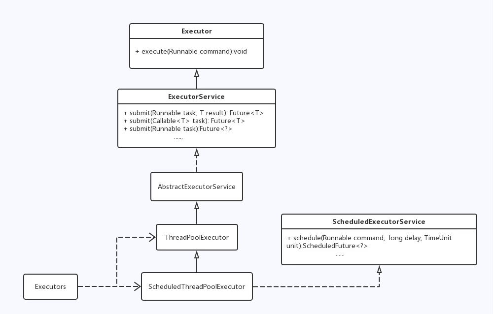
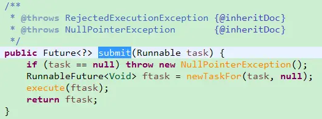
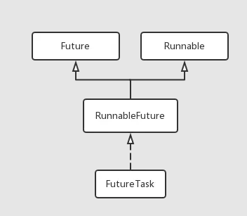
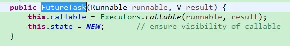
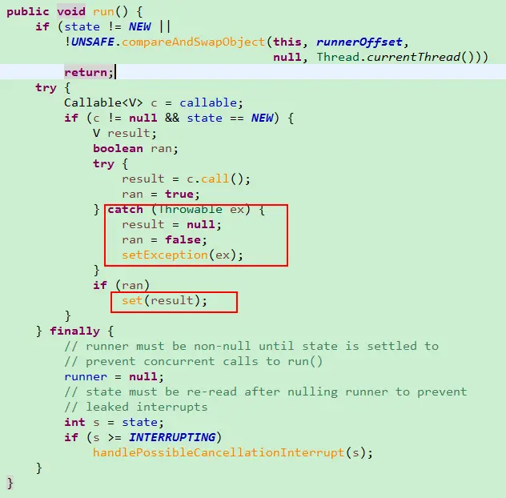
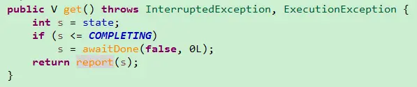
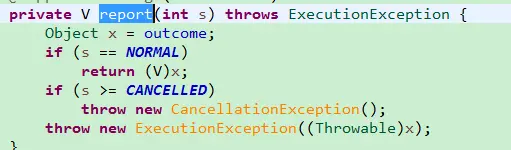

# Java线程池异常处理方案

# 为什么一定要处理异常

考虑这样一个假设的中间件服务器应用程序
- 它聚合来自各种输入源的消息，然后将它们提交到外部服务器应用程序
- 从外部应用程序接收响应并将响应路由回适当的输入源

对于每个输入源，都有一个以其自己的方式接受其输入消息的插件（通过扫描文件目录、等待套接字连接、轮询数据库表等）。插件可以由第三方编写，即使它们是在服务器 JVM 上运行的。

这个应用程序拥有（至少）两个内部工作队列

- 从插件处接收的正在等待被发送到服务器的消息（“出站消息”队列）
- 以及从服务器接收的正在等待被传递到适当插件的响应（“入站响应”队列）。

通过调用插件对象上的服务例程 incomingResponse() ，消息被路由到最初发出请求的插件。

从插件接收消息后，就被排列到出站消息队列中。由一个或多个从队列读取消息的线程处理出站消息队列中的消息、记录其来源并将它提交给远程服务器应用程序（假定通过 Web 服务接口）。远程应用程序最终通过 Web 服务接口返回响应，然后我们的服务器将接收的响应排列到入站响应队列中。一个或多个响应线程从入站响应队列读取消息并将其路由到适当的插件，从而完成往返“旅程”。

在这个应用程序中，有两个消息队列，分别用于出站请求和入站响应，不同的插件内可能也有另外的队列。我们还有几种服务线程，一个从出站消息队列读取请求并将其提交给外部服务器，一个从入站响应队列读取响应并将其路由到插件，在用于向套接字或其它外部请求源提供服务的插件中可能也有一些线程。

`如果这些线程中的一个（如响应分派线程）消失了，将会发生什么`？因为插件仍能够提交新消息，所以它们可能不会立即注意到某些方面出错了。消息仍将通过各种输入源到达，并通过我们的应用程序提交到外部服务。因为插件并不期待立即获得其响应，因此它仍没有意识到出了问题。最后，接收的响应将排满队列。如果它们存储在内存中，那么最终将耗尽内存。即使不耗尽内存，也会有人在某个时刻发现响应得不到传递（这可能需要一些时间，因为系统的其它方面仍能正常发挥作用。）

当主要的任务处理方面由线程池而不是单个线程来处理时，对于偶然的线程泄漏的后果有一定程度的保护，因为一个执行得很好的八线程的线程池，用七个线程完成其工作的效率可能仍可以接受。起初，可能没有任何显著的差异。但是，系统性能最终将下降，虽然这种下降的方式不易被察觉。

服务器应用程序中的线程泄漏问题在于不是总是容易从外部检测它。因为大多数线程只处理服务器的部分工作负载，或可能仅处理特定类型的后台任务，所以当程序实际上遭遇严重故障时，在用户看来它仍在正常工作。这一点，再加上引起线程泄漏的因素并不总是留下明显痕迹，就会引起令人惊讶甚或使人迷惑的应用程序行为。

# 如何处理异常

## 简单了解线程池

jdk中线程池的实现



- Executor定义了一个通用的并发任务框架，即通过execute方法执行一个任务。
- ExecutorService定义了并发框架(线程池)的生命周期。
- 然后实现并发任务框架(线程池)
  - AbstractExecutorService
  - ThreadPoolExecutor
  - ScheduledThreadPoolExecutor（支持定时及周期性任务的执行）。
- Executors相当于一个线程池工厂类，返回了不同执行策略的线程池对象。

我们一般使用Executors.new...方法来得到某种线程池：

| 线程池                  | 说明                                                                                                           |
| :---------------------- | :------------------------------------------------------------------------------------------------------------- |
| newCachedThreadPool     | 创建一个可缓存线程池，如果线程池长度超过处理需要，可灵活回收空闲线程，若无可回收，则新建线程。                 |
| newFixedThreadPool      | 创建一个定长线程池，可控制线程最大并发数，超出的线程会在队列中等待。                                           |
| newSingleThreadExecutor | 创建一个单线程化的线程池，它只会用唯一的工作线程来执行任务，保证所有任务按照指定顺序(FIFO, LIFO, 优先级)执行。 |
| newScheduledThreadPool  | 创建一个定长线程池，支持定时及周期性任务执行。                                                                 |

- 前三者返回ExecutorService实例，他们的实现为ThreadPoolExecutor或其包装类；
- newScheduledThreadPool返回的是ScheduledExecutorService实例，他的实现为ScheduledThreadPoolExecutor或其包装类。

```java
ExecutorService exec = Executors.newFixedThreadPool(8);
```

以上述代码为例，得到ExecutorService实例后，我们可以通过两种方式提交任务(Runnable):

- exec.execute(runnable)
- exec.submit(runnable)

对于这两种不同的任务提交方式，我们有不同的异常处理办法。

## 第一种方案

从exec.submit(runnable)开始分析



使用exec.submit(runnable)这种方式提交任务时，submit方法会将我们的Runnable包装为一个RunnableFuture对象，这个对象实际上是FutureTask实例，然后将这个FutureTask交给execute方法执行。



Future用来管理任务的生命周期，将Future实例提交给异步线程执行后，可以调用Future.get方法获取任务执行的结果。我们知道Runnable执行是没有返回结果的，那么这个结果是怎么来的？



可以看到，在FutureTask的构造方法中，将Runnable包装成了一个Callable类型的对象。



FutureTask的run方法中，调用了callable对象的call方法，也就调用了我们传入的Runnable对象的run方法。可以看到，如果代码(Runnable)抛出异常，会被捕获并且把这个异常保存下来。





可以看到，在调用get方法时，会将保存的异常重新抛出。所以，我们在使用submit方法提交任务的时候，利用返回的Future对象，通过他的get方法可以得到任务运行中抛出的异常，然后针对异常做一些处理。

由于我们在调用submit时并没有给Runnable指定返回结果，所以在将Runnable包装为Callable的时候，会传入一个null，故get方法返回一个null.

当然，我们也可以直接传入Callable类型的任务，这样就可以获取任务执行返回结果，并且得到任务执行抛出的异常。

这就是使用线程池时处理任务中抛出异常的第一种方法：`使用ExecutorService.submit执行任务，利用返回的Future对象的get方法接收抛出的异常，然后进行处理`

## 第二种方案

分析exec.execute(runnable)

利用Future.get得到任务抛出的异常的缺点在于，我们需要显式的遍历Future，调用get方法获取每个任务执行抛出的异常，然后处理。

很多时候我们仅仅是使用exec.execute(runnable)这种方法来提交我们的任务。这种情况下任务抛出的异常如何处理呢？

在使用exec.execute(runnable)提交任务的时候(submit其实也是调用execute方法执行)，我们的任务最终会被一个Worker对象执行。这个Worker内部封装了一个Thread对象，这个Thread就是线程池的工作者线程。工作者线程会调用runWorker方法来执行我们提交的任务：(代码比较长，就直接粘过来了)

```java
final void runWorker(Worker w) {
        Thread wt = Thread.currentThread();
        Runnable task = w.firstTask;
        w.firstTask = null;
        w.unlock(); // allow interrupts
        boolean completedAbruptly = true;
        try {
            while (task != null || (task = getTask()) != null) {
                w.lock();
                // If pool is stopping, ensure thread is interrupted;
                // if not, ensure thread is not interrupted.  This
                // requires a recheck in second case to deal with
                // shutdownNow race while clearing interrupt
                if ((runStateAtLeast(ctl.get(), STOP) ||
                     (Thread.interrupted() &&
                      runStateAtLeast(ctl.get(), STOP))) &&
                    !wt.isInterrupted())
                    wt.interrupt();
                try {
                    beforeExecute(wt, task);
                    Throwable thrown = null;
                    try {
                        task.run();
                    } catch (RuntimeException x) {
                        thrown = x; throw x;
                    } catch (Error x) {
                        thrown = x; throw x;
                    } catch (Throwable x) {
                        thrown = x; throw new Error(x);
                    } finally {
                        afterExecute(task, thrown);
                    }
                } finally {
                    task = null;
                    w.completedTasks++;
                    w.unlock();
                }
            }
            completedAbruptly = false;
        } finally {
            processWorkerExit(w, completedAbruptly);
        }
}
```

上面代码的基本意思就是不停的从任务队列中取出任务执行，如果任务代码(task.run)抛出异常，会被最内层的try--catch块捕获，然后重新抛出。注意到最里面的finally块，在重新
抛出异常之前，要先执行afterExecute方法，这个方法的默认实现为空，即什么也不做。

我们可以在这个方法上做点文章，这就是我们的第二种方法，重写ThreadPoolExecutor.afterExecute方法，处理传递到afterExecute方法中的异常：

```java
class ExtendedExecutor extends ThreadPoolExecutor {
   // ...
   protected void afterExecute(Runnable r, Throwable t) {
     super.afterExecute(r, t);
     if (t == null && r instanceof Future<?>) {
       try {
         Object result = ((Future<?>) r).get();
       } catch (CancellationException ce) {
           t = ce;
       } catch (ExecutionException ee) {
           t = ee.getCause();
       } catch (InterruptedException ie) {
           Thread.currentThread().interrupt(); // ignore/reset
       }
     }
     if (t != null)
       System.out.println(t);
   }
}
```

> When actions are enclosed in tasks (such as FutureTask) either explicitly or via methods such as submit, these task objects catch and maintain computational exceptions, and so they do not cause abrupt termination, and the internal exceptions are not passed to this method. If you would like to trap both kinds of failures in this method, you can further probe for such cases, as in this sample subclass that prints either the direct cause or the underlying exception if a task has been aborted:


上面是java doc给出的建议。可以看到，代码中还处理了task是FutureTask的情况。回想一下submit方式提交任务的情况：

- 在submit方法中，我们传入的Runnable/Callable(要执行的任务)被封装为FutureTask对象，交给execute方法执行
- 经过一系列操作，提交的FutureTask对象被Worker对象中的工作者线程所执行，也就是runWorker方法
- 此时的代码运行情况：runWorker->submit方法封装的FutureTask的run方法->我们提交的Runnable的run方法
- 此时从我们提交的Runnable的run方法中抛出了一个未检测异常RunnableException，被FutureTask的run方法捕获
- FutureTask的run方法捕获异常后保存，不再重新抛出。同时意味着run方法执行结束。
- runWorker方法没有检测到异常，task.run当作正常运行结束。但是还是会执行afterExecute方法。

经过这样的梳理，上面的代码为什么这么写就一目了然了。

上面已经提到了两种解决任务代码抛出未检测异常的方案。

## 第三种方案

接下来是第三种：

当一个线程因为未捕获的异常而退出时，JVM会把这个事件报告给应用提供的UncaughtExceptionHandler异常处理器，如果没有提供任何的异常处理器，那么默认的行为就是将堆栈信息输送到System.err。

看一下上面的runWorker方法，如果task.run(任务代码)抛出了异常，异常会层层抛出，最终导致这个线程退出。此时这个抛出的异常就会传递到UncaughtExceptionHandler实例当中，由uncaughtException(Thread t,Throwable e)这个方法处理。

于是就有了第三种解决任务代码抛出异常的方案：为工作者线程设置UncaughtExceptionHandler，在uncaughtException方法中处理异常

注意，这个方案不适用与使用submit方式提交任务的情况，原因上面也提到了，FutureTask的run方法捕获异常后保存，不再重新抛出，意味着runWorker方法并不会捕获到抛出的异常，线程也就不会退出，也不会执行我们设置的UncaughtExceptionHandler。

如何为工作者线程设置UncaughtExceptionHandler呢？ThreadPoolExecutor的构造函数提供一个ThreadFactory，可以在其中设置我们自定义的UncaughtExceptionHandler，这里不再赘述。

## 第四中方案

至于第四中方案，就很简单了：在我们提供的Runnable的run方法中捕获任务代码可能抛出的所有异常，包括未检测异常。这种方法比较简单，也有他的局限性，不够灵活，我们的处理被局限在了线程代码边界之内。

总结
通过上面的分析我们得到了四种解决任务代码抛异常的方案：

在我们提供的Runnable的run方法中捕获任务代码可能抛出的所有异常，包括未检测异常

使用ExecutorService.submit执行任务，利用返回的Future对象的get方法接收抛出的异常，然后进行处理

重写ThreadPoolExecutor.afterExecute方法，处理传递到afterExecute方法中的异常

为工作者线程设置UncaughtExceptionHandler，在uncaughtException方法中处理异常

要注意的是，使用最后一种方案时，无法处理以submit的方式提交的任务

# 总结

通过上面的分析我们得到了四种解决任务代码抛异常的方案：

- 在我们提供的Runnable的run方法中捕获任务代码可能抛出的所有异常，包括未检测异常
- 使用ExecutorService.submit执行任务，利用返回的Future对象的get方法接收抛出的异常，然后进行处理
- 重写ThreadPoolExecutor.afterExecute方法，处理传递到afterExecute方法中的异常
- 为工作者线程设置UncaughtExceptionHandler，在uncaughtException方法中处理异常

要注意的是，使用最后一种方案时，无法处理以submit的方式提交的任务。

# 来源

- [Java线程池异常处理方案](https://www.jianshu.com/p/30e488f4e021)