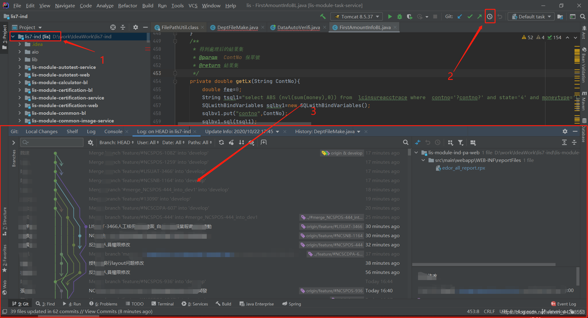
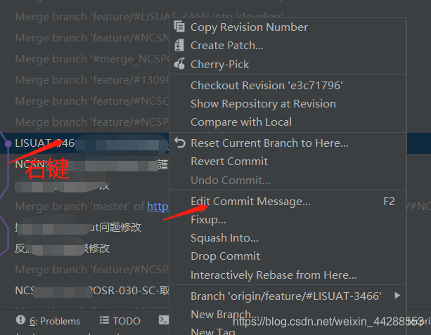
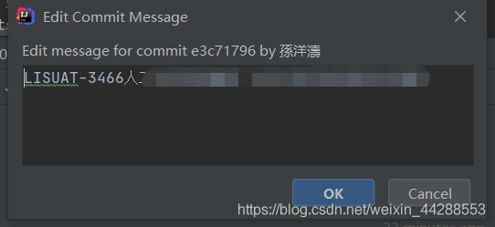
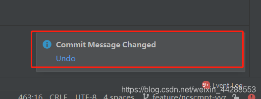
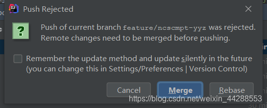
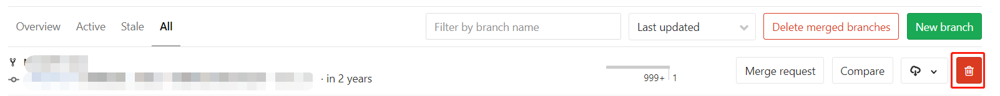
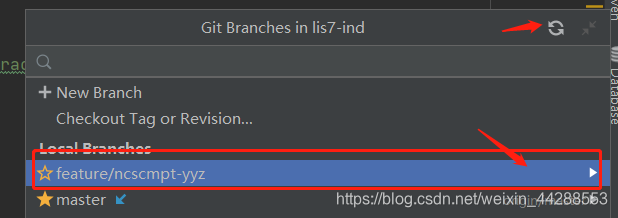

# Idea修改CommitMessage

## 项目没有push

如果项目没有push。在自己的分支上，单点项目名，然后点击历史记录的图标

点击自己的提交记录。右键，点击Edit Commit Message

弹出弹框，修改信息。然后保存即可

提示信息 右下角

## 项目已经push

如果项目已经Push。直接修改Message会提示Push Rejected 这时不要点merge，不仅不会修改Message，还会多两个新的Commit

上远端删除当前分支（一般不会这样干，前面一步点击Merge就好）

点击Cancel，点击刷新分支

重复本地删除分支的方法。

注意：如果右下角没有显示修改成功，而显示其他，如果提示有个Abort选项，点击他就可以更改Message,在重新push到远端。
如果已经合并了的分支，想要修改Message,可以先回滚该分支，然后在修改。

# 来源

- [Idea修改CommitMessage](https://blog.csdn.net/weixin_44288553/article/details/109227870)