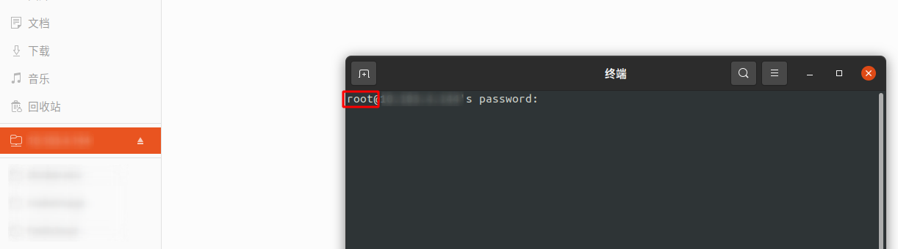

# Ubuntu修改SSH配置文件来更改默认的远程登录用户

## 问题产生
如果不进行修改，使用ubuntu桌面端`连接服务器->右键->在远程终端打开`，默认的用户名是当前登录桌面的用户，要变成下图中的`root`用户，需要修改ssh配置文件



## 问题解决

在 Ubuntu 中，你可以通过修改 SSH 配置文件来更改默认的远程登录用户。

SSH 配置文件通常位于 `~/.ssh/config`。你可以在这个文件中为特定的主机设置默认用户。

以下是一个例子：

```bash
Host your_remote_host
  User your_username
```

在这个例子中，`your_remote_host` 是你的远程主机的名称或 IP 地址，`your_username` 是你想要设置为默认用户的用户名。当你使用 `ssh your_remote_host` 命令连接到远程主机时，SSH 会自动使用 `your_username` 作为用户名。

如果你想为所有的主机设置默认用户，你可以使用 `*` 作为主机名：

```bash
Host *
  User your_username
```

请注意，需要有权限修改 `~/.ssh/config` 文件，并且在修改后，你需要确保这个文件的权限是正确的。

通常，应该使用 `chmod 600 ~/.ssh/config` 命令来设置权限。