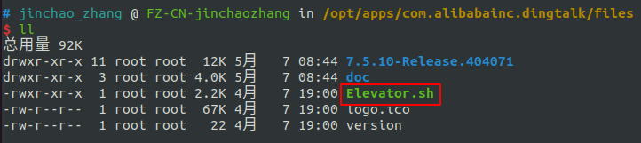
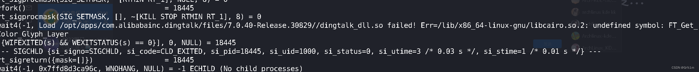
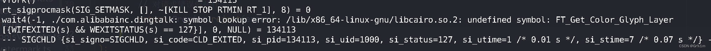
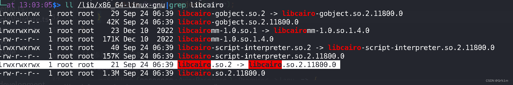

# Ubuntu钉钉运行无反应

deb安装后，钉钉的启动命令在`/opt/apps/com.alibabainc.dingtalk/files/Elevator.sh`

使用命令行启动可以看到报错信息，一般原因是动态库没找到，或者动态库版本不对

# 问题排查步骤

进入命令行运行执行结果

利用strace追踪执行程序的过程

老版本报错

新版本报错

寻找报错点文件，查看版本

排查结论：libcairo.so.2调用系统库文件的版本不对应

# 解决方案

将可用的库文件放进钉钉的执行程序中，并且赋值调用

不要手贱的去apt这个deb, apt install,不要自己安装，不然系统会裂开！

# 排查思路参考：

- https://blog.csdn.net/XDMi_/article/details/133787961
- https://blog.enxm.top/20231012/dinglibcario2.html

