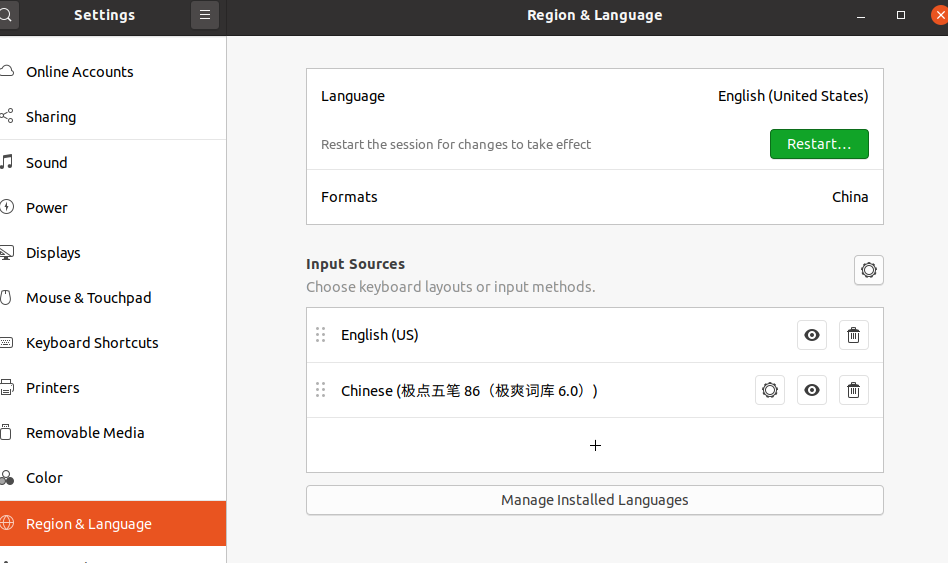
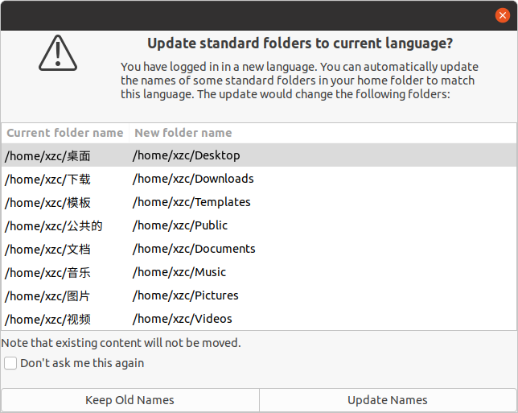
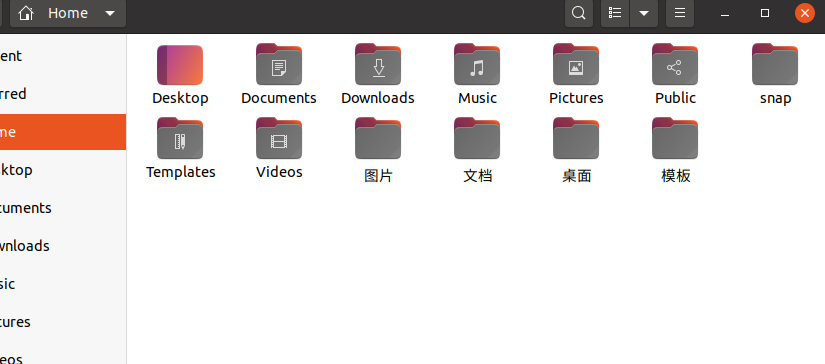
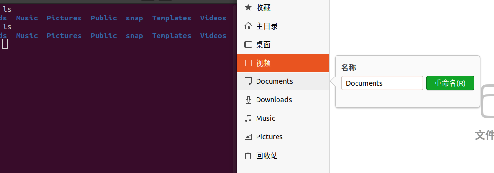

# 修改ubuntu20.04个人文件夹为英文

ubuntu的个人目录中的文件夹名是根据本地语言生成的。中文的话，就是桌面、图片、文档之类的。如果只是用鼠标点这点那来操作，那倒挺好。不过就目前而言，装ubuntu的人，多数都还是会用命令行的，有时候还是要写脚本的。在终端中输入中文，首先你得终端支持中文，写脚本输入中文，还得考虑下编码，甚至有些别人写的软件、脚本，根本不认中文路径，十分不方便。这时候，可以把个人文件夹的名字转换为中文。

在设置／区域与语言中选择英文，然后注销。

接着重新登录，系统就会提示你是否把个人文件夹中的名字转换成英文。

选择转换，即Update Names。注意，如果文件夹中有内容的，旧的还是会保留，需要你手动手移动到新文件夹(Note that existing content will not be moved)。

转换完后，回到设置／区域与语言，选择中文。注销，再重新登录，现在就是中文语言，英文文件夹了。

注意，左边的是书签，不是文件夹名。只是默认情况下是它刚好和文件夹名一样的。如果你打开一个还没在书签栏中的文件夹，点击三角形下拉菜单，是可以添加到书签栏的。同样的，在书签上右键／重命名，也可以只修改书签名为中文，而不修改文件夹名。这样书签栏就统一为中文了。

