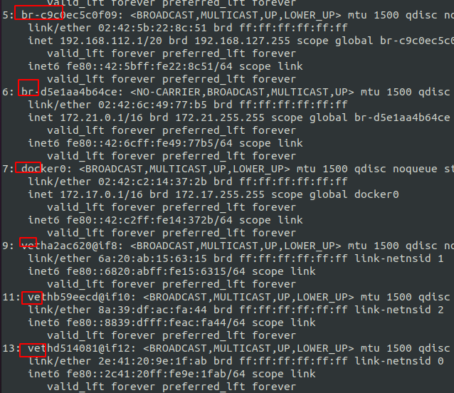
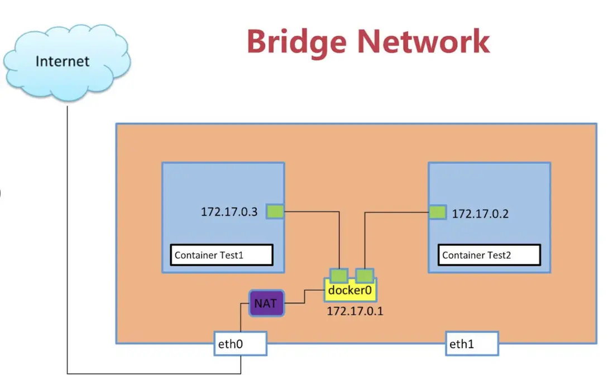

# Docker Network 容器间的通信

# 容器间的通信方式

一个分布式应用，多个容器之间往往需要通信，比如 HTTP 服务容器往往需要与数据库容器进行通信。容器的通信方式有以下几种：

- 通过 docker run 起一个容器时带上 --link 参数指定该容器与其他容器进行相关联 （即将废弃，原理就不描述了）
- 通过 Docker Network 系统来建立通信
- 通过 docker-compose 容器编排工具，其本质也是通过 Docker Network 来通信的

更高级别的容器编排工具，如 Kubernetes 等

这次我们来讲解一下最基础的 Docker Network 系统。

# Docker Network

## 网络驱动模式

veth（Virtual Ethernet）接口是 Linux 网络命名空间中的一种虚拟设备，主要用于连接两个网络命名空间。它总是`成对出现`，形成一个虚拟的以太网线，数据从一端发送会从另一端出来。

Docker Network 有多种驱动模式，默认为 bridge，即桥接模式。

在 Docker 中，当一个容器被创建时，一对 veth 接口也会被创建。其中一个接口在新的网络命名空间（即容器）内，另一个接口在主机的网络命名空间内。这样，容器就可以通过这个 veth 接口与主机进行网络通信。即在新建 network 时，建立一个 bridge（即容器外的一个 Linux 网络接口，通过 ip a 命令可以查看），所有加入此 network 的容器会通过容器内部的网络接口与外部的 bridge 接口的 veth interface 相连，这样，network 内容器间需要彼此通信时就可以通过 bridge 进行转发。

每一个 bridge network（包含其下的容器）都有一个独立的 IP 网段，不同网段间的容器无法通信，这也就是指定 bridge network 进行容器间网络隔离的原理。

用ip a可以看到如下内容



## 默认 Network

```bash
$ docker network ls

NETWORK ID          NAME                DRIVER              SCOPE
9c9d4fd4f950        bridge              bridge              local
3ce82c0caf70        host                host                local
f1a111712ad4        none                null                local
```

Docker 内置了一个默认 bridge network（名为 bridge，第一行），也就是上文中 docker0 接口所属的 network，所有未指定 network 的容器，默认连接到此 network 中，其网段为 172.17.0.1/16。所以，两个未进行任何连接操作的容器是可以通过 IP 地址互相通信的，因为他们同在一个 network 下，但通讯只能通过 IP 地址进行（比如 ping 172.17.0.5），不可以通过容器名通信（比如 ping container-name）。但自定义创建的网络可以通过容器名进行通信。



图中 docker0 即为默认 bridge 网络的网桥，它负责连通所有未指定 network 的容器，并且连通外网

## 自定义网络

```bash
$ docker network create NAME
```

- 不指定 -d 参数，默认创建 bridge 驱动模式的 network。
- 自定义的 bridge network 会有自己专属的一个网段，与其他 network 隔离。
- 可以通过 docker network connect 指令将容器连接到一个 network，也可以在起容器（docker run 指令）时加入 --network 参数指定即将创建的容器加入到哪个 network，还可以通过 docker network disconnect 命令将容器移出自定义的 network。
- 加入到同一个自定义 bridge network 的容器间可以通过容器名进行通信，会自动进行 DNS 解析，但前提是需要给容器指定名称，随机分配的容器名无法被解析。也可以通过 IP 进行通信，因为属于同一个网段。
- 同一个容器可以同时加入到多个 network 下，此时该容器拥有多个网络接口，分别连接到不通的 bridge 上（可以通过 ip a 查看）。

# 参考

- [Docker Network 容器间的通信](https://segmentfault.com/a/1190000020266392)
- [docker容器网络 - 同一个host下的容器间通信](https://my.oschina.net/thinwonton/blog/2993309)
- [Docker Network—Bridge 模式](https://www.cnkirito.moe/docker-network-bridge/)


