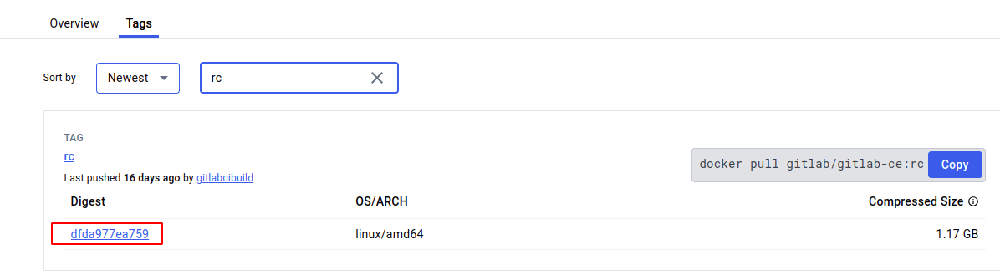
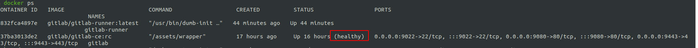
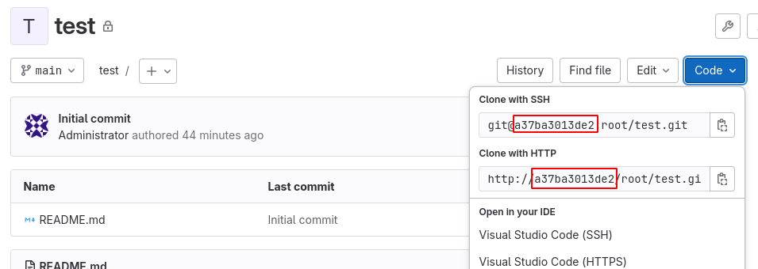
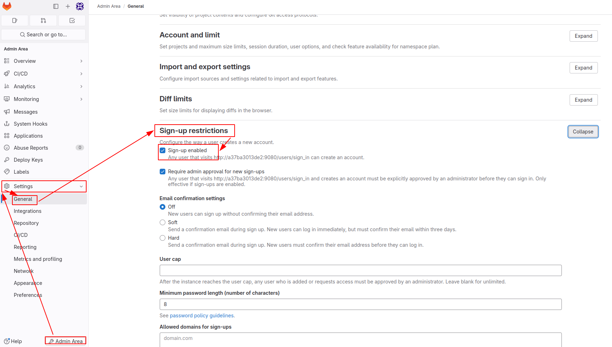
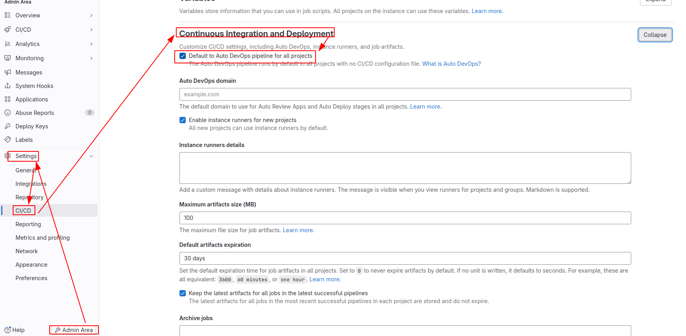

# 通过 Docker 快速部署公司内部 GitLab

# 网络环境

假设公司有一个内网环境（云上或者本地），CIDR 为 192.168.31.0/24，该网段内有一台静态 IP 的服务器 192.168.31.43，用于部署 GitLab，所有开发同学从这台服务器克隆项目，并往这台服务器 push 代码。

我们在这台服务器上通过 Docker 的方式来启动一个 GitLab 容器，我们将容器内部的服务端口映射到宿主机，这样，宿主机内部容器对开发同学来讲是透明的，开发同学只需知道仓库在这台机器上即可。

# 部署

## 安装 Docker 环境

首先在这台服务器上安装 Docker 环境，通过 Docker 可以快速拉取和运行已经构建好的开箱即用的 GitLab 镜像。

## 拉取 GitLab 镜像

```bash
$ docker pull gitlab/gitlab-ce:rc
```

基于的是如下版本，对于将来更新的镜像版本，下文的教程可能会出现不适用的情况



## 启动 GitLab 容器

为了保证容器内的状态数据不会丢失，需要将配置、日志和数据目录挂载到宿主机；并将容器内的服务端口绑定到宿主机端口，这些容器内的端口包括 HTTP 端口（80）、HTTPS 端口（443）和 SSH 端口（22），执行以下命令启动容器、绑定端口并挂载目录到宿主机（根据自己的需要修改命令中的容器名称、各宿主机端口和各宿主机路径，但后文中若涉及到宿主机的相关接口，均使用命令中的宿主机端口）。

```bash
$ docker run -d --name gitlab --restart always \
    -p 9443:443 -p 9080:80 -p 9022:22 \
    -v /path/to/conf:/etc/gitlab \
    -v /path/to/logs:/var/log/gitlab \
    -v /path/to/data:/var/opt/gitlab \
    gitlab/gitlab-ce:rc
```

!> 注意：`不要把容器的 22 端口映射到宿主机的 22`，宿主机的该端口已经开启了 sshd 进程的监听，用于客户端的 ssh 远程登录。

通过 docker ps 命令可以看到刚刚启动的容器处于 starting 状态，等待它的初始化过程，直到 status 变为 healthy。



若你现在可以通过浏览器访问该机器的 9080 端口（这里之所以使用假设，是因为若该机器和你的个人电脑不在同一个局域网下，而是在云端的集群上，若没有配置公网 IP 或网关代理，是无法直接通过浏览器访问的，不过没有关系，你可以先跳过这一步，下面的步骤只是为了解释现象），在 GitLab 后台界面设置 root (管理员) 密码，然后通过用户名 root 和刚刚设定的密码来进行管理员的登录。

之后创建一个项目，会发现项目的克隆地址中的 hostname 部分和仓库文件的链接中的域名部分都是容器的 hostname。



显然，开发同学通过这个地址进行项目克隆是找不到仓库的，点击仓库内的文件链接到的地址也是无法打开文件内容页的。我们应该把这些地址统一改成将来可访问的地址。

## 配置

GitLab 的配置文件为容器中的 /etc/gitlab/gitlab.rb 文件

```bash
# 我们前面docker启动命令中，已经将配置文件挂载到宿主机了
# 具体如何修改，看下文
vim /path/to/conf/gitlab.rb

# 修改完后，执行以下命令，配置生效
gitlab-ctl reconfigure
```

### 修改对外访问地址

该步骤是解决页面里地址展示上的错误，包括 HTTP 地址和 SSH 地址。

修改配置文件中这几项：

```bash
# external_url 为对外展示的 HTTP 地址，包括 HTTP 方式的克隆地址和仓库文件的跳转链接中的域名。
# 这个地址可以携带端口，可以使用 IP 也可以使用域名，无论你 GitLab 服务前端还有没有设置反向代理来做域名解析，这里只需要是你最终需要展示在 GitLab 页面里的 HTTP 链接即可。
# 因为我们这里 GitLab 是部署在公司本地局域网的，所以直接写这台机器的局域网 IP 和 端口号就可以了。
external_url 'http://192.168.31.43:9080'

# nginx 的监听端口号需要改成 80。
# 默认情况下 nginx 的监听端口号会从 external_url 中取，也就是 9080。
# 但在启动容器时，我们把宿主机 9080 端口导向了容器的 80 端口，所以容器内 nginx 服务端口应该为 80。
nginx['listen_port'] = 80

# 修改 SSH 方式克隆地址
# SSH 方式克隆地址中的域名部分会从 external_url 中取，我们这里需要再修改一下端口号。
gitlab_rails['gitlab_shell_ssh_port'] = 9022
```

### 修改时区

默认时区为 UTC，所以显示的用户活动时间会比中国时间早 8 个小时。

修改配置文件中：

```bash
gitlab_rails['time_zone'] = 'Asia/Shanghai'
```

### 新用户默认不可创建项目组

修改配置文件中：

```bash
gitlab_rails['gitlab_default_can_create_group'] = false
```

### 关闭公开注册

关闭后台登录界面的注册入口，禁止人员打开后台自行注册，只有管理员可以手动注册新用户。

管理员登录后台之后依次点击：

`Admin Area -> Settings -> Genenal -> Sign-up restrictions -> Sign-up enabled`

取消打勾并保存。



### 关闭 Auto DevOps

新建的项目默认会开启 Auto DevOps。提交代码时，如果项目仓库内找不到 CI 配置文件，则会运行 Auto DevOps 流水线。

管理员登录后台之后依次点击：

`Admin Area -> Settings -> CI/CD -> Continuous Integration and Deployment -> Default to Auto DevOps pipeline for all projects`

取消打勾并保存。



# 来源

- [通过 Docker 快速部署公司内部 GitLab](https://segmentfault.com/a/1190000021229534)

