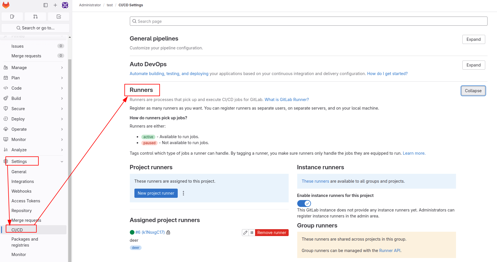
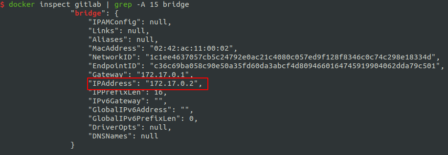

# 通过 GitLab Runner 实现 CI/CD 工作流

# 介绍

CI/CD 是持续集成、持续部署的意思，研发团队的开发流程以代码版本仓库（VCS）为中心，以不同的 branch 或 tag 进行代码提交，之后 VCS 会触发一系列的流水线作业，包括代码检查、单元测试、编译、打包镜像、发布镜像、触发测试环境或生产环境的部署等，这一切都是自动的。研发成员只需要提交代码到 VCS 就可以了，免去了复杂的人力成本，提高了生产效率。

上次我们讲了如何[《通过 Docker 快速部署公司内部 GitLab》](/2024/20240607-通过Docker快速部署公司内部GitLab)，这次来讲讲如何在 GitLab 的基础上进行 CI/CD。GitLab 官方提供了 GitLab Runner 组件来与 GitLab 进行集成，他们可以部署在同一集群内不同机器上（内网进行通信），当 GitLab 检测到代码提交事件，会自动触发 Runner 执行流水线作业。

# 部署 GitLab Runner

我们以上篇文章作为本篇的上下文，进行安装步骤和原理的讲解。

上篇文章中，我们说 GitLab 部署在了集群内 IP 为 192.168.31.43 的这台机器上，那么如果服务器资源充沛的话，最好将 Runner 部署在集群内另外一台机器上，本文以部署在同一机器上为例，若是与 GitLab 部署在不同机器，道理也是相同的，只要相互之间可以通信就行。

我们还是通过 Docker 容器的方式部署 Runner，因此部署 Runner 的这台机器需要安装有 Docker。

我们在部署 GitLab 机器的上部署 Runner，之前已经安装了 Docker，若是部署在不同机器，请自行安装。

Docker 安装后，执行以下命令，拉取 Runner 镜像并启动：

```bash
$ docker run -d --name gitlab-runner --restart always \
    -v /path/to/gitlab-runner/config:/etc/gitlab-runner \
    -v /var/run/docker.sock:/var/run/docker.sock \
    gitlab/gitlab-runner:latest
```

我们给运行 Runner 的这个容器起名为 gitlab-runner，并将 Runner 的配置目录挂载到了宿主机。

Runner 容器中的 `docker.sock 与宿主机共享`。Runner 在执行每个流水线作业时都会启动一个独立并且隔离的 Docker 容器并在容器中执行用户定义的脚本，通过共享 docker.sock 就可以让 Runner 通过宿主机的 Docker Engine 进行容器的拉取、启动等操作。因 Runner 本身就运行在容器中，通过这种方式可以`避免 Docker in Docker 的问题`。

这样，Runner 就部署好了，Docker 容器为我们的应用部署带来了极大的便利。下一步就是让部署好的 Runner 与 GitLab 集成在一起。

# 配置 Runner

对于 GitLab 来讲，Runner 有多种形式：
- 共享 Runner，GitLab 上的所有的项目均可以使用的 Runner
- 群组 Runner，一个群组内的项目均可以使用的 Runner
- 项目 Runner，只为单独一个 GitLab 项目服务

浏览器打开 GitLab，进入一个项目，项目维护者（maintainer 身份） 可以看到项目的设置选项，进入 设置 - CI/CD，展开 Runner 选项：




接下来我们去设置 Runner。

进入 Runner 容器

```bash
docker exec -it gitlab-runner bash
```

执行命令 gitlab-runner register 进行交互式配置，每一项具体说明看下文：


我们逐一讲解：

- 输入 GitLab 的 HTTP 服务地址，进行注册，这是 Runner 用来连接到 GitLab 服务器的地址。
  - 对于将 GitLab 和 Runner 部署在不同机器的情况来讲，这个 IP 应该是集群内可访问 GitLab 的地址，比如 http://192.168.31.43:9080/，Runner 容器的网关是 docker0 接口，网段为 172.17.0.0/24，可以向上访问到父级网段的 IP。
  - 对于部署在同一台机器上的情况来讲，通过集群 IP 访问本机上的服务就绕远路了，但 Runner 又不可以通过 localhost:9080 来访问，因为 localhost 是对于容器而言的，容器内 9080 端口没有服务。我们在 Docker 上启动容器时，若不指定 network，默认网关都是宿主机的 docker0 接口，都是在同一网段（bridge network）下，我们可以通过查看 GitLab 容器在 bridge network 下的 IP（命令：docker inspect gitlab）来获取到该网段的 GitLab 服务 IP。
  - 又或者，可以将 GitLab 容器和 Runner 容器加入到同一 network 下，可以直接通过 容器名+端口号 进行通信，Docker 内部会做域名解析。
- 输入项目 Token 与项目进行绑定，用于验证 Runner 的令牌。
- 输入这个 Runner 的描述，这是一个可选字段，用于描述 Runner。你可以填写一些有关这个 Runner 的信息。
- 输入这个 Runner 的维护信息字段，这个信息通常是为了方便其他开发人员管理特定的 GitLab Runner 实例。例如，你可以在这里记录该 Runner 运行在哪台机器上、有多少核心、多少内存以及使用的操作系统等。总之，任何你认为与这个特定 GitLab Runner 实例相关的信息都可以在这里分享给项目中的其他开发人员。当然，如果你觉得不需要填写，也可以将这个字段保持为空白。
- 输入这个 Runner 的标签，多个标签用英文逗号分隔。这个标签会在以后写 CI 配置文件时用到，用来指定一个 Job 让哪个 Runner 来执行。
- 选择执行器，我们这里选择 docker。也就是说对于每个 Job（你可能还不清楚什么是 Job，我们待会进行讲解，这里可以先理解成 Runner 执行流水线时的每个任务）Runner 都会分配一个独立并隔离的 Docker 容器环境进行 Job 的执行。当然，你也可以选择使用其他的执行器，比如 shell，同样的道理，每个 Job 都会分配一个独立的 shell 环境来执行。
- 输入 Docker 默认镜像。当 CI 配置文件中没有指定一个 Job 所使用的容器镜像时，就会使用这个默认的镜像作为执行环境。（Alpine Linux 是一个基于 musl libc 和 BusyBox 构建的 Linux 发行版。这个镜像仅有 5 MB 大小，并且拥有比其他基于 BusyBox 的镜像更完整的软件包仓库。因此，Alpine Linux 是一个出色的镜像基础，适用于工具和生产应用）

注册完再回到 GitLab 的项目设置页面，查看 Runner，会发现 此项目已激活的Runner 中有了一个刚刚注册的 Runner。

至此，就完成了 GitLab 与 Runner 的集成。以后，每次该项目检测到有代码提交时，都会触发 Runner 执行流水线任务。你可能会问，Runner 怎么才知道我们需要什么样的流水线任务？答案是不知道。我们需要在我们的项目根目录中添加一个 CI 配置文件 .gitlab-ci.yml 来定义流水线任务的每个阶段做什么事情，GitLab 根据这个规定来让 Runner 做事，至于这个配置文件怎么写，放在后面说。

但是需要注意的是，假如我们的项目中不存在 .gitlab-ci.yml，GitLab 会采用预定义的配置执行流水线，所以我们需要关闭它。


# GitLab CI 中的基本概念

- Runner，配合 GitLab 执行 CI 任务，是实际执行 CI 任务的进程，并将执行结果返回给 GitLab。一般一个项目分配一个 Runner，但也可以多个项目共享一个 Runner。
- Executor，执行器，有多种选择，如：docker、shell 等，决定 Runner 以什么环境执行作业，一个 Runner 对应一个 Executor。
- Pipline，流水线，流水线代表项目 CI/CD 的整个流程，分为多个阶段（在 .gitlab-ci.yml 中自己规定）。
- Stage，阶段，一个 Pipline 对应多个阶段。
- Job，CI/CD 中最小的执行单元，一个 Stage 对应多个 Jobs。

一个项目的流水线：


# 优化工作

部署并注册 Runner 后，还需要进行一些参数调整和优化工作。

下面是一个 Go 项目的 CI 配置，流水线分为 test 和 build 两个阶段， test_job 使用 golang 镜像作为执行环境，build_job 使用 dind 镜像作为执行环境来进行应用镜像的构建和发布。

我们以这个配置为例，来进行流水线构建优化工作的讲解。

```yaml
# 流水线分为测试阶段和构建阶段
stages:
  - test
  - build

# 测试作业
test_job:
  stage: test
  image: golang:1.14.2
  tags:
    - demo-project-runner
  services:
    # 执行测试时依赖 MySQL 服务
    - name: mysql:8.0.17
      # golang 容器中可与 mysql 容器通信的别名（内部会 DNS 解析）
      alias: mysql
      command: ['--character-set-server=utf8mb4', '--collation-server=utf8mb4_unicode_ci']
  # 指定作业级变量，会作为环境变量传入 golang 和 mysql 容器
  variables:
    MYSQL_HOST: mysql
    MYSQL_ROOT_PASSWORD: root
    MYSQL_DATABASE: test
  # 执行脚本前的工作，设置 goproxy 加快依赖下载速度
  before_script:
    - go env -w GO111MODULE=on
    - go env -w GOPROXY=https://goproxy.cn,direct
  # 执行代码检查和单元测试
  script:
    - go vet ./...
    - go test -v -race ./...

# 构建作业
build_job:
  stage: build
  image: docker:latest
  
  # services:
  #  - docker:dind
  # variables:
  #   DOCKER_DRIVER: overlay2
  #   DOCKER_TLS_CERTDIR: ''
  
  script:
    # 可将一些变量放在 GitLab 项目设置里，防止密码被包含在代码中
    - docker build -t goapp:latest .
    - docker login -u $DOCKER_REGISTRY_USERNAME -p $DOCKER_REGISTRY_PASSWORD $DOCKER_REGISTRY_ADDR
    - docker tag goapp:latest ${DOCKER_REGISTRY_ADDR}/xvrzhao/goapp:latest
    - docker push ${DOCKER_REGISTRY_ADDR}/xvrzhao/goapp:latest
  tags:
    - demo-project-runner
  # 指定 master 分支的提交才会触发该作业
  only:
    - master
```

## 使用 DinD（Docker in Docker） 注意事项

若要使用 DinD 镜像执行 Job，则需要 Runner 开启特权模式，否则会报错。进入挂载到宿主机的 Runner 配置目录，编辑 config.toml 文件，修改 `runners.docker` 栏中 privileged 的值为 true。

## 修改镜像拉取策略

Runner 默认情况下每执行一个 Job 都会重新拉取一次所需镜像，我们可把策略改为：镜像不存在时才拉取。

编辑 Runner 配置文件 config.toml，在 runners.docker 栏加入一行：

```
pull_policy = "if-not-present"
```

重启 Runner 容器，使之生效：

```bash
docker restart gitlab-runner
```

## 挂载 Job 容器的 docker.sock

当 Runner 在每次流水线执行到 build_job 时，都需要启动一个全新的 DinD 镜像，在全新的 DinD 容器内部进行构建操作（ docker build ），这就导致构建过程中所产生的中间镜像缓存不能被下次构建使用。

我们需要让 Runner 中的 docker.sock 挂载到每个创建的 Job 容器中。这样，在 DinD Job 容器中执行 docker 命令时，其实是在与外部的 Docker Engine 进行通信，也就是相当于是在使用 Runner 容器中的 Docker Engine，而 Runner 容器又挂载了宿主机的 docker.sock，故 DinD Job 容器中的 docker 命令是在间接地使用宿主机的 Docker Engine。这样，所有的中间镜像都产生在宿主机，就算不同的 DinD Job 容器也可以共享中间镜像缓存了。


配置方式同样是编辑 config.toml 文件。在 [runners.docker] 栏 volumns 数组中添加一项字符串元素 "/var/run/docker.sock:/var/run/docker.sock"，并重启 Runner 容器使之生效。

# 参考

- [通过 GitLab Runner 实现 CI/CD 工作流（上）](https://segmentfault.com/a/1190000022479297?utm_source=sf-backlinks)
- [Caching for docker-in-docker builds](https://gitlab.com/gitlab-org/gitlab-foss/-/issues/17861#note_12991518)
- [Using Docker-in-Docker for your CI or testing environment? Think twice.](https://jpetazzo.github.io/2015/09/03/do-not-use-docker-in-docker-for-ci/)
- [Gitlab-ci：Cannot connect to the Docker daemon at tcp://docker:2375/. Is the docker daemon running?](https://blog.csdn.net/textdemo123/article/details/97116499)
- [GitLab Runner Docs | GitLab](https://docs.gitlab.com/runner/)


