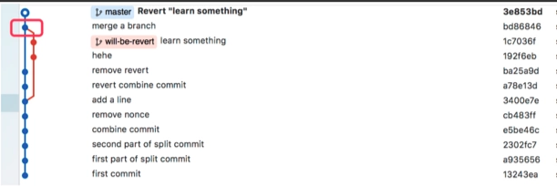

# Git的Revert说明

revert 可以取消指定的某次提交内容。

当讨论 revert 时，需要分两种情况，因为 commit 分为两种：
- 一种是常规的 commit，也就是使用 git commit 提交的 commit；
- 另一种是 merge commit，在使用 git merge 合并两个分支之后，你将会得到一个新的 merge commit。

merge commit 和普通 commit 的不同之处在于 merge commit 包含两个 parent commit，代表该 merge commit 是从哪两个 commit 合并过来的。



在上图所示的红框中有一个 merge commit，使用 git show 命令可以查看 commit 的详细信息

```bash
➜  git show bd86846
commit bd868465569400a6b9408050643e5949e8f2b8f5
Merge: ba25a9d 1c7036f
```

这代表该 merge commit 是从 ba25a9d 和 1c7036f 两个 commit 合并过来的。

而常规的 commit 则没有 Merge 行

```bash
➜  git show 3e853bd
commit 3e853bdcb2d8ce45be87d4f902c0ff6ad00f240a
```

## revert 常规 commit

使用 `git revert <commit id>` 即可，git 会生成一个新的 commit，将指定的 commit 内容从当前分支上撤除

## revert merge commit

revert merge commit 有一些不同，这时需要添加 `-m` 选项以代表这次 revert 的是一个 merge commit

但如果直接使用 git revert ，git 也不知道到底要撤除哪一条分支上的内容，这时`需要指定一个 parent number 标识出"主线"，主线的内容将会保留，而另一条分支的内容将被 revert`。

如上面的例子中，从 git show 命令的结果中可以看到，merge commit 的 parent 分别为 ba25a9d 和 1c7036f，其中 ba25a9d 代表 master 分支（从图中可以看出），1c7036f 代表 will-be-revert 分支。需要注意的是 `-m `选项接收的参数是一个数字，数字取值为 1 和 2，也就是 Merge 行里面列出来的第一个还是第二个。

我们要 revert will-be-revert 分支上的内容，即 保留主分支，应该设置主分支为主线，操作如下：

```bash
➜ git revert -m 1 bd86846
```

## revert 之后重新上线

假设狗蛋在自己分支 goudan/a-cool-feature 上开发了一个功能，并合并到了 master 上，之后 master 上又提交了一个修改 h，这时提交历史如下：

```
a -> b -> c -> f -- g -> h (master)
           \      /
            d -> e   (goudan/a-cool-feature)
```

突然，大家发现狗蛋的分支存在严重的 bug，需要 revert 掉，于是大家把 g 这个 merge commit revert 掉了，记为 G，如下：

```
a -> b -> c -> f -- g -> h -> G (master)
           \      /
            d -> e   (goudan/a-cool-feature)
```

然后狗蛋回到自己的分支进行 bugfix，修好之后想重新合并到 master，直觉上只需要再 merge 到 master 即可（或者使用 cherry-pick），像这样：

```
a -> b -> c -> f -- g -> h -> G -> i (master)
           \      /               /
            d -> e -> j -> k ----    (goudan/a-cool-feature)
```

i 是新的 merge commit。

但需要注意的是，这**不能**得到我们期望的结果。因为 d 和 e 两个提交曾经被丢弃过，如此合并到 master 的代码，并不会重新包含 d 和 e 两个提交的内容，相当于只有 goudan/a-cool-feature 上的新 commit 被合并了进来，而 goudan/a-cool-feature 分支之前的内容，依然是被 revert 掉了。

更具体分析如下
- (这里每个字母表示的是上一次提交和这一次提交之间的修改)
- 从三路合并来理解，现在 base 是 e，要合并的是 k 和 G，相当于 i = h + G + j + k。
- 但是 G 是什么内容？G 是逆向的 commit，也就是 g 的逆向。
- 那 g 是什么？也是一次三路合并，base 是 c，要合并的是 f 和 e，又因为 e 基于 d，所以可以简单理解为 g = f + d + e。
- 那 G 也就好理解，就是把原来增加的减去即可，也就是说 G = f + d + e - d - e，也就是前面说的主线的内容会保留，而另一条分支的内容将被 revert
- i = h + G + j + k = h + (f + d + e - d - e) + j + k = f + h + j + k
- 所以不会重新包含 d 和 e 两个提交的内容

所以，如果想恢复整个 goudan/a-cool-feature 所做的修改，应该先把 G revert 掉：

```
a -> b -> c -> f -- g -> h -> G -> G' -> i (master)
           \      /                     /
            d -> e -> j -> k ----------    (goudan/a-cool-feature)
```

# 参考

- [How can I get the parents of a merge commit in Git?](https://stackoverflow.com/questions/9059335/how-to-get-the-parents-of-a-merge-commit-in-git)
- [http://blog.psjay.com/posts/git-revert-merge-commit/](http://blog.psjay.com/posts/git-revert-merge-commit/)
- [Git 之 revert](https://www.cnblogs.com/bescheiden/articles/10563651.html)


