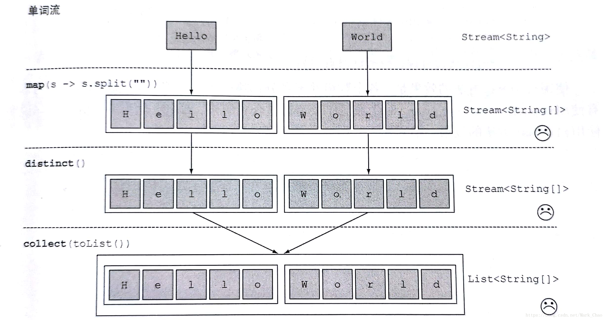
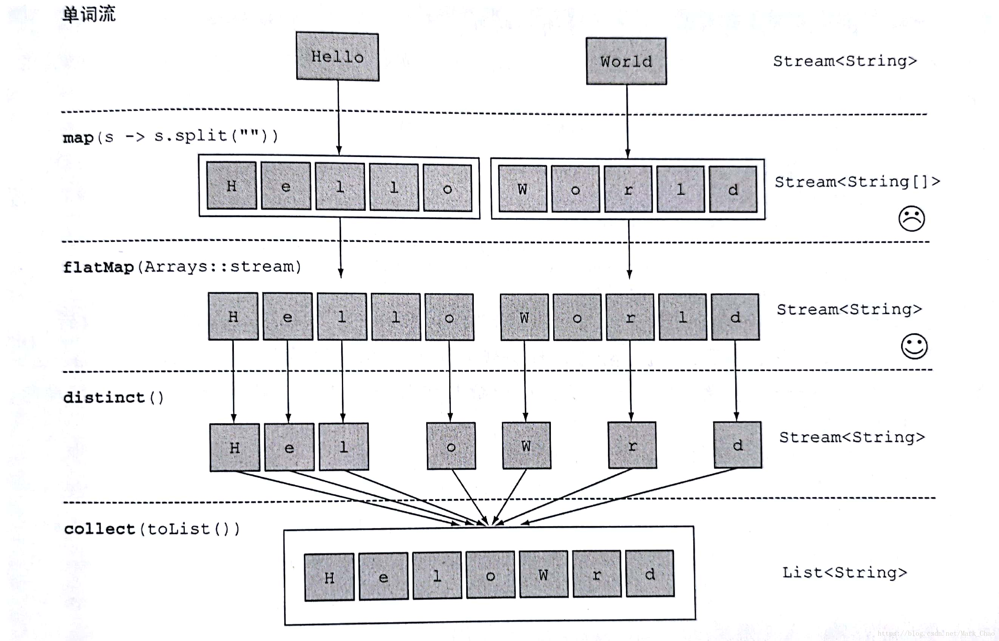

# java8 stream流操作的flatMap（流的扁平化）

flatMap的用法和含义住要通过一个案例来讲解，

案例：对给定单词列表 ["Hello","World"],你想返回列表["H","e","l","o","W","r","d"]

## 第一种方式

```java
String[] words = new String[]{"Hello","World"};
List<String[]> a = Arrays.stream(words)
        .map(word -> word.split(""))
        .distinct()
        .collect(toList());
a.forEach(System.out::print);
```

代码输出为：

```
// 返回一个包含两个String[]的list
[Ljava.lang.String;@12edcd21[Ljava.lang.String;@34c45dca 
```

这个实现方式是由问题的，传递给map方法的lambda为每个单词生成了一个`String[](String列表)`。因此，map返回的流实际上是`Stream<String[]>` 类型的。你真正想要的是用`Stream<String>`来表示一个字符串。

下方图是上方代码stream的运行流程




## 第二种方式：flatMap（对流扁平化处理）

```java
String[] words = new String[]{"Hello","World"};
List<String> a = Arrays.stream(words)
        .map(word -> word.split(""))
        .flatMap(Arrays::stream)
        .distinct()
        .collect(toList());
a.forEach(System.out::print);
```

结果输出：HeloWrd

使用flatMap方法的效果是，各个数组并不是分别映射一个流，而是映射成流的内容，所有使用map(Array::stream)时生成的单个流被合并起来，即扁平化为一个流。

下图是运用flatMap的stream运行流程，



# 来源

- [java8 stream流操作的flatMap（流的扁平化）](https://blog.csdn.net/Mark_Chao/article/details/80810030)


