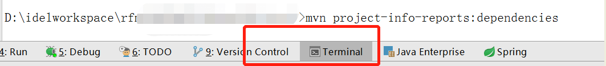
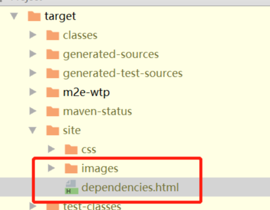
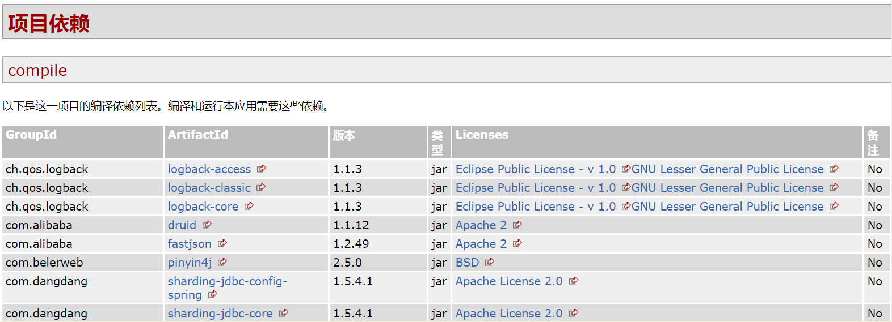

# Maven查看_依赖jar包_获取版版本号 _license

直接在命令行运行

```bash
mvn project-info-reports:dependencies
```



在生成的tar目录下 找到网址，直接打开



打开后可以看到如下内容



# 来源

- [maven 查看依赖jar包，或获取版版本号 、license](https://www.cnblogs.com/yancun8141/p/14333506.html)