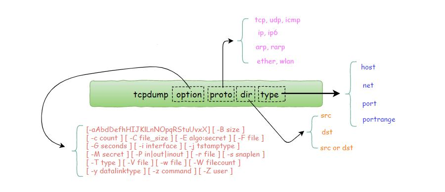

# tcpdump使用说明

## tcpdump的参数是如何组成的



## 理解 tcpdump 的输出

### 输出内容结构

tcpdump 输出的内容虽然多，却很规律。

这里以我随便抓取的一个 tcp 包为例来看一下

```bash
21:26:49.013621 IP 172.20.20.1.15605 > 172.20.20.2.5920: Flags [P.], seq 49:97, ack 106048, win 4723, length 48
```

- 第一列：时分秒毫秒 21:26:49.013621
- 第二列：网络协议 IP
- 第三列：发送方的ip地址+端口号，其中172.20.20.1是 ip，而15605 是端口号
- 第四列：箭头 >， 表示数据流向
- 第五列：接收方的ip地址+端口号，其中 172.20.20.2 是 ip，而5920 是端口号
- 第六列：冒号
- 第七列：数据包内容，包括Flags 标识符，seq 号，ack 号，win 窗口，数据长度 length，其中 `[P.]` 表示 PUSH 标志位为 1，更多标识符见下面
  - 使用 tcpdump 抓包后，会遇到的 TCP 报文 Flags，有以下几种：
  - [S] : SYN（开始连接）
  - [P] : PSH（推送数据）
  - [F] : FIN （结束连接）
  - [R] : RST（重置连接）
  - [.] : 没有 Flag （意思是除上面四种类型外的其他情况，有可能是 ACK 也有可能是 URG）

## 过滤

### 基于IP地址过滤：host

使用 host 就可以指定 host ip 进行过滤

```bash
$ tcpdump host 192.168.10.100

# 数据包的 ip 可以再细分为源ip和目标ip两种
# 根据源ip进行过滤
$ tcpdump -i eth2 src 192.168.10.100
 
# 根据目标ip进行过滤
$ tcpdump -i eth2 dst 192.168.10.200
```

### 基于网段进行过滤：net

若你的ip范围是一个网段，可以直接这样指定

```bash
$ tcpdump net 192.168.10.0/24

# 网段同样可以再细分为源网段和目标网段
# 根据源网段进行过滤
$ tcpdump src net 192.168
 
# 根据目标网段进行过滤
$ tcpdump dst net 192.168
```

### 基于端口进行过滤：port

使用 port 就可以指定特定端口进行过滤

```bash
$ tcpdump port 8088

# 端口同样可以再细分为源端口，目标端口
# 根据源端口进行过滤
$ tcpdump src port 8088
 
# 根据目标端口进行过滤
$ tcpdump dst port 8088
```

如果你想要同时指定两个端口你可以这样写

```bash
$ tcpdump port 80 or port 8088

# 但也可以简写成这样
$ tcpdump port 80 or 8088
```

如果你的想抓取的不再是一两个端口，而是一个范围，一个一个指定就非常麻烦了，此时你可以这样指定一个端口段。

```bash
$ tcpdump portrange 8000-8080
$ tcpdump src portrange 8000-8080
$ tcpdump dst portrange 8000-8080
```

对于一些常见协议的默认端口，我们还可以直接使用协议名，而不用具体的端口号

比如 http == 80，https == 443 等

```bash

$ tcpdump tcp port http
```

### 基于协议进行过滤：proto

常见的网络协议有：tcp, udp, icmp, http, ip,ipv6 等

若你只想查看 icmp 的包，可以直接这样写

```bash
$ tcpdump icmp
```

protocol 可选值：ip, ip6, arp, rarp, atalk, aarp, decnet, sca, lat, mopdl, moprc, iso, stp, ipx, or netbeui

### 基本IP协议的版本进行过滤

当你想查看 tcp 的包，你也许会这样子写

```bash
$ tcpdump tcp
```

这样子写也没问题，就是不够精准，为什么这么说呢？

ip 根据版本的不同，可以再细分为 IPv4 和 IPv6 两种，如果你只指定了 tcp，这两种其实都会包含在内。

那有什么办法，能够将 IPv4 和 IPv6 区分开来呢？

很简单，如果是 IPv4 的 tcp 包 ，就这样写（友情提示：数字 6 表示的是 tcp 在ip报文中的编号。）

```bash
$ tcpdump 'ip proto tcp'
 
# or
 
$ tcpdump ip proto 6
 
# or
 
$ tcpdump 'ip protochain tcp'
 
# or 
 
$ tcpdump ip protochain 6
```


